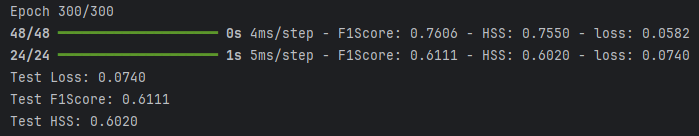

# Imbal cRT Binary Classification Tutorial (Autoencoder + cRT Fit)

This tutorial demonstrates how to train a neural network for a binary classification task while addressing class imbalance using the `cRT_fit` function with the **autoencoder feature** enabled.

### Files Needed

**Full Code:** [view source code](./imbal_tutorial_decoupled_fit_ae_classification_clear_sep.py)

**Train/Test Files**: [training data](../sep_model_training_classification.csv), [testing data](../sep_model_testing_classification.csv)

---

> **Before you begin:** Use the [Tutorial Setup](../imbal_tutorial_ae_setup_classification.md) guide as your starting point, then continue with this tutorial.

## 1. Model Compilation and Training

### Compilation

```python
model.compile(
    loss="binary_crossentropy",
    optimizer="adam",
    metrics=[
        tf.keras.metrics.F1Score(threshold=0.5, name="F1Score"),
        imbal.metrics.HeikdeSkillScore(threshold=0.5, name="HSS"),
    ],
    generate_decoder_branch=True,
)
```

### 🔍 Autoencoder Feature

This model enables an **autoencoder branch** during training:

* `generate_decoder_branch=True` adds a decoder that reconstructs inputs.
* This encourages the network to learn **better feature representations**, improving generalization.

### Training with `cRT_fit`

```python
max_epochs = 300
batch_size = 32

model.cRT_fit(
    x_train,
    y_train,
    batch_size=batch_size,
    epochs=max_epochs,
)
```

### Explanation

* **cRT_fit** performs training tailored for imbalanced datasets.
* The autoencoder branch provides an auxiliary learning signal.
* Training configuration mirrors standard workflows.

---

## 2. Results

### Model Evaluation

```python
results = model.evaluate(x_test, y_test)
loss, f1_score, hss = results

print(f"Test Loss: {loss:.4f}")
print(f"Test F1Score: {f1_score:.4f}")
print(f"Test HSS: {hss:.4f}")
```

### Example Output


---

## 3. Optional: Using Class Weights

Alternatively, you can manually specify class weights during training. Replace the `model.balanced_fit` call with:

```python
class_weights = {0: 0.9, 1: 0.1}

model.cRT_fit(
    x_train,
    y_train,
    class_weight=class_weights,
    batch_size=batch_size,
    epochs=max_epochs,
)
```

### Results



This optional approach gives you manual control over class importance, while `balanced_fit` automates the process.

--- 

