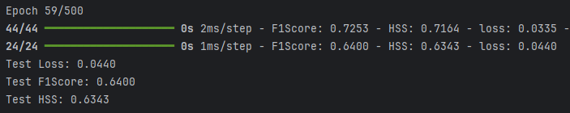

# Imbal Binary Classification Tutorial (With a Validation Set)

This tutorial demonstrates how to train a neural network for a classification task using the standard `fit` function with a validation set.

### Files Needed

**Full Code:** [view source code](./imbal_tutorial_regular_fit_val_classification_clear_sep.py)

**Train/Test Files**: [training data](../sep_model_training_classification.csv), [testing data](../sep_model_testing_classification.csv)

---

> **Before you begin:** Use the [Tutorial Setup](../imbal_tutorial_setup_classification.md) guide as your starting point, then continue with this tutorial.

## 1. Model Compilation and Training

### Compilation

```python
model.compile(
    loss="binary_crossentropy",
    optimizer="adam",
    metrics=[
        tf.keras.metrics.F1Score(threshold=0.5, name="F1Score"),
        imbal.metrics.HeikdeSkillScore(threshold=0.5, name="HSS"),
    ],
)
```

### Training with `fit`

```python
(x_train, y_train), (x_val, y_val) = imbal.classification.split(
    x_train,
    y_train,
    test_size=0.1,
    seed=seed,
)

PATIENCE = 30

history = model.fit(
    x_train,
    y_train,
    validation_data=(x_val, y_val.reshape(-1, 1)),
    batch_size=batch_size,
    epochs=max_epochs,
    callbacks=[
        keras.callbacks.EarlyStopping(
            monitor="val_loss",
            patience=PATIENCE,
            restore_best_weights=True,
        )
    ],
)
```

### Explanation

* **fit** is the standard training method and does not automatically handle class imbalance.
* A validation set is used to monitor model performance on data not used for training.
* Validation data helps reduce overfitting by enabling early stopping when validation loss stops improving.
* The best model weights are restored after training based on validation performance.
* Training configuration remains similar to other fitting approaches.

---

## 2. Results

### Model Evaluation

```python
results = model.evaluate(x_test, y_test)
loss, f1_score, hss = results

print(f"Test Loss: {loss:.4f}")
print(f"Test F1Score: {f1_score:.4f}")
print(f"Test HSS: {hss:.4f}")
```

### Example Output



---
