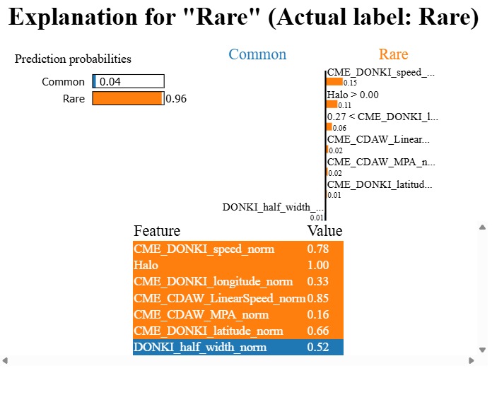
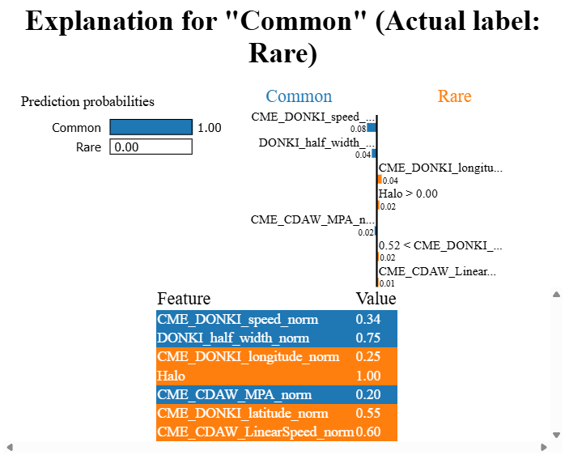

# LIME Explanation Tutorial (Classification)

**Full Code:** [view source code](imbal_tutorial_lime_explanation_classification.py)

**Train/Test Files**: [training data](./sep_model_training_classification.csv), [testing data](./sep_model_testing_classification.csv)

---

## 1. Core Code

> This core code is a sample from the `balanced_fit` with Autoencoder tutorial code found [here](./AE/imbal_tutorial_balanced_fit_ae_classification_clear_sep.md)

```python
import numpy as np
import pandas as pd
import tensorflow as tf
import keras
from tensorflow.keras import layers

import imbal

seed = 42
tf.keras.utils.set_random_seed(
    seed
)

target_column = "ln_peak_intensity"

max_epochs = 300
batch_size = 32

train_data = pd.read_csv("sep_model_training_classification.csv")
test_data  = pd.read_csv("sep_model_testing_classification.csv")

y_train = train_data[target_column].values.reshape(-1, 1).astype("float32")
y_test  = test_data[target_column].values.reshape(-1, 1).astype("float32")

x_train = train_data.drop(columns=[target_column]).values.astype(np.float32)
x_test  = test_data.drop(columns=[target_column]).values.astype(np.float32)

def build_model(input_shape: int) -> imbal.classification.Model:
    inputs = keras.Input(shape=(input_shape,), name="features")
    hidden1 = layers.Dense(18, activation="relu", name="hidden_layer1")(inputs)
    hidden2 = layers.Dense(12, activation="relu", name="hidden_layer2")(hidden1)
    hidden3 = layers.Dense(8, activation="relu", name="hidden_layer3")(hidden2)
    hidden4 = layers.Dense(6, activation="relu", name="hidden_layer4")(hidden3)
    flatten = layers.Flatten()(hidden4)
    outputs = layers.Dense(1, activation="sigmoid", name="output_layer")(flatten)
    built_model = imbal.classification.Model(inputs=inputs, outputs=outputs, name="sep_model")
    return built_model

model = build_model(x_train.shape[1])

model.compile(loss="binary_crossentropy",
              optimizer="adam",
              metrics=[tf.keras.metrics.F1Score(threshold=0.5, name="F1Score"),
                       imbal.metrics.HeikdeSkillScore(threshold=0.5, name="HSS")],
              generate_decoder_branch=True,
              )

class_weights = {0: 0.9, 1: 0.1}

model.balanced_fit(x_train,
          y_train,
          class_weight=class_weights,
          batch_size=batch_size,
          epochs=max_epochs,
          )
```

---

## 2. LIME Explanations

### A. Correct Prediction Example

```python
labels = train_data.drop(columns=[target_column]).columns.tolist()

target_sample_index = -1  # Get a rare sample, which is at the end of the data

imbal.classification.lime_explain_tabular_sample(
    x_test[target_sample_index],
    model,
    x_train,
    actual_label=int(y_test.reshape(-1)[target_sample_index]),
    class_names=['Common', 'Rare'],
    feature_names=labels
)
```

### Explanation

This example explains a sample where the model prediction matches the actual class.

* `labels` stores the feature names so the explanation is readable.
* `target_sample_index = -1` selects a rare-class sample from the test set.
* `lime_explain_tabular_sample(...)` generates a local explanation for that one prediction.

---

### B. Incorrect Prediction Example

```python
labels = train_data.drop(columns=[target_column]).columns.tolist()

target_sample_index = -9  # Example index for a misclassified sample

imbal.classification.lime_explain_tabular_sample(
    x_test[target_sample_index],
    model,
    x_train,
    actual_label=int(y_test.reshape(-1)[target_sample_index]),
    class_names=['Common', 'Rare'],
    feature_names=labels
)
```

### Explanation

This second example is structured the same way, but it focuses on a sample where the model prediction is incorrect.

* The code is identical except for the selected sample index.
* By choosing a misclassified test point, we can compare which local feature contributions aligned with the wrong class.
* This is useful for diagnosing borderline cases, conflicting signals, or places where the model learned the wrong local pattern.

---

## 3. Results

### Correct Prediction



### Incorrect Prediction



---

## 4. Understanding the LIME Output

The LIME visualization explains **why the model predicted the way it did**.

### Layout Guide (how to read the figure)

* **Top left** has the **prediction probabilities** for each class (Common vs Rare).
* **Top right** has the **contribution values** (feature weights) showing how each feature pushes the prediction toward Common (blue) or Rare (orange).
* **Bottom middle** has the **feature values** used for this specific sample.

Note: The **feature values** in this model are not the actual values (e.g. speed) but rather normalized values between 0 and 1 or -1 and 1.

---

## 5. Interpreting the Difference Between the Two Explanations

### Correct Prediction: Why the model predicted **Rare** successfully

In the first explanation, the model predicts **Rare** with very high confidence:

* **Common: 0.04**
* **Rare: 0.96**

The strongest feature contributions are concentrated on the **Rare** side, especially:

* `CME_DONKI_speed_norm`
* `Halo`
* `CME_CDAW_LinearSpeed_norm`

These features all push in the same direction.

That makes this prediction locally consistent: the most influential features reinforce each other, so the model has a clear signal for **Rare**.

---

### Incorrect Prediction: Why the model predicted **Common** even though the actual label is **Rare**

In the second explanation, the model predicts **Common** with essentially full confidence, even though the actual label is **Rare**.

The important difference is that the strongest local evidence is now weighted toward **Common**, not **Rare**. In particular:

* `CME_DONKI_speed_norm`
* `DONKI_half_width_norm`
* `CME_CDAW_MPA_norm`

push the prediction toward **Common**.

At the same time, there are still some features pushing toward **Rare**, such as:

* `CME_DONKI_longitude_norm`
* `Halo`
* `CME_DONKI_latitude_norm`
* `CME_CDAW_LinearSpeed_norm`

So this sample has a more mixed explanation than the correct one.

---

### Why the prediction might have been wrong

The likely reason for the error is that the **local model built by LIME is dominated by signals pointing toward Common**, even though the global model prediction boundary would ideally classify this as Rare.

A key detail is that the **largest feature weight (≈ 0.08) comes from `CME_DONKI_speed_norm`, and it points toward Common**. This is important because LIME is approximating the model *locally* around this instance. In that local neighborhood, increasing the speed feature would actually make the prediction *more* likely to be **Common**, which is counterintuitive given that higher speed is generally associated with Rare events.

This suggests the model may be seeing this sample as more similar to **Common** examples in the training distribution in its local neighborhood, even though its true label is **Rare**.

---
