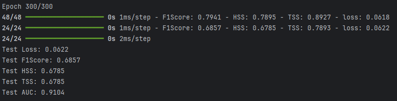
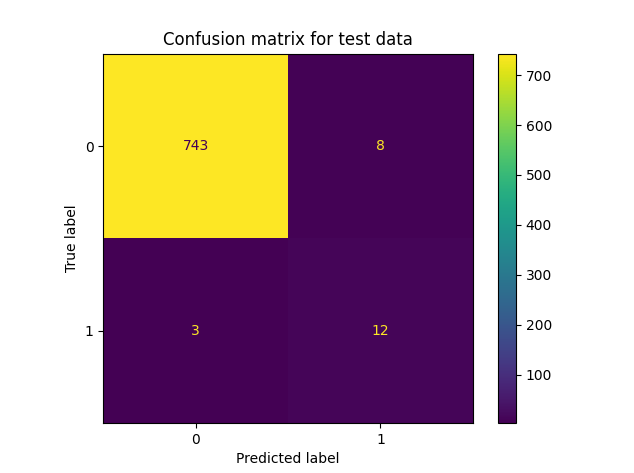

# Evaluation Metrics Tutorial (Classification)

**Full Code:** [view source code](./imbal_tutorial_metrics_classification.py)

**Train/Test Files**: [training data](./sep_model_training_classification.csv), [testing data](./sep_model_testing_classification.csv)

---

> This tutorial is based on the `balanced_fit` classification tutorial found [here](./Regular/imbal_tutorial_balanced_fit_classification_clear_sep.md)

## 1. Metrics Overview

Imbal supports various additional metrics alongside existing metrics in the `keras.metrics` library.

Additional metrics include:
1. True Skill Statistic
2. J Statistic
3. Youden's Index
4. Heikde Skill Score
5. Gilbert Skill Score
6. Critical Success Index
7. Bounded AUC

Metrics can be used in two main ways:
1. Tracking metric values at every epoch via the `metrics` parameter passed in at model compilation
2. Doing a single calculation of the metric using `model.predict(x_test)` and `metric.update_state(y_true, y_pred)`

This tutorial will explore both options.

Imbal also supports producing a confusion matrix for classification style problems.

---

## 2. Model Compilation Metrics

Lightweight metrics, such as F1Score, Heidke Skill Score (HSS), and True Skill Statistic (TSS), can be passed via the `metrics`
parameter in the model's `compile` call. These metrics can be tracked every epoch while adding minimal overhead to model training.

```python
model.compile(loss="binary_crossentropy",
              optimizer="adam",
              metrics=[tf.keras.metrics.F1Score(threshold=0.5, name="F1Score"),
                       imbal.metrics.HeikdeSkillScore(threshold=0.5, name="HSS"),
                       imbal.metrics.TrueSkillStatistic(threshold=0.5, name="TSS")],
              )
```

---

## 3. Single Calculation Metrics

More computationally expensive metrics, such as Bounded AUC, should be calculated once after the model has been trained, unless it is desired to track it at every epoch.

Choosing to calculate these kinds of metrics once can save training time due to less computation being needed per epoch.

```python
y_pred = model.predict(x_test)
auc_metric = imbal.metrics.BoundedAUC(num_thresholds=50)
auc_metric.update_state(y_test, y_pred)
```

---

## 4. Results

```python
results = model.evaluate(x_test, y_test)
loss, f1_score, hss, tss = results

print(f"Test Loss: {loss:.4f}")
print(f"Test F1Score: {f1_score:.4f}")
print(f"Test HSS: {hss:.4f}")
print(f"Test TSS: {hss:.4f}")
print(f"Test AUC: {auc_metric.result():.4f}")
```

### Example Output



---

## 5. Confusion Matrix

Imbal supports plotting a basic confusion matrix for classification style problems.

```python
imbal.classification.plot_confusion_matrix(y_test, y_pred)
```

### Results



---

## 6. AUC Curve

wip