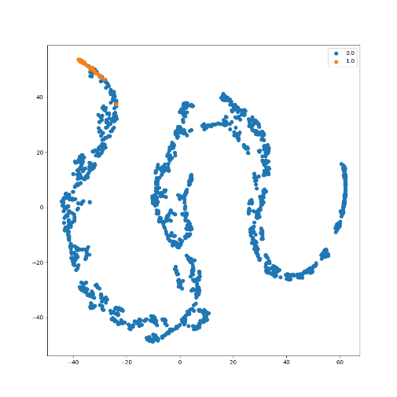
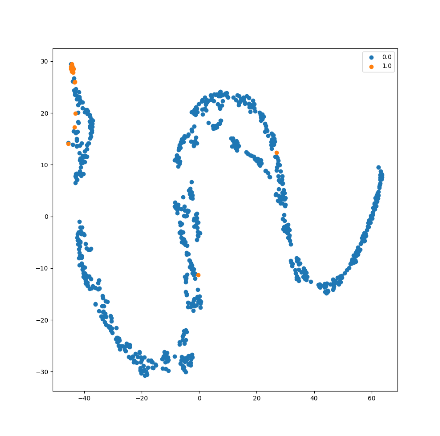

# t-SNE Visualization Tutorial (Classification)

**Full Code:** [view source code](./imbal_tutorial_tsne_visualization_classification.py)

**Train/Test Files**: [training data](./sep_model_training_classification.csv), [testing data](./sep_model_testing_classification.csv)


---

## 1. Core Code

> This core code is a sample from the `balanced_fit` with Autoencoder tutorial code found [here](./AE/imbal_tutorial_balanced_fit_ae_classification_clear_sep.md)

```python
import numpy as np
import pandas as pd
import tensorflow as tf
import keras
from tensorflow.keras import layers

import imbal

seed = 42
tf.keras.utils.set_random_seed(
    seed
)

target_column = "ln_peak_intensity"

max_epochs = 300
batch_size = 32

train_data = pd.read_csv("sep_model_training_classification.csv")
test_data  = pd.read_csv("sep_model_testing_classification.csv")

y_train = train_data[target_column].values.reshape(-1, 1).astype("float32")
y_test  = test_data[target_column].values.reshape(-1, 1).astype("float32")

x_train = train_data.drop(columns=[target_column]).values.astype(np.float32)
x_test  = test_data.drop(columns=[target_column]).values.astype(np.float32)

def build_model(input_shape: int) -> imbal.classification.Model:
    inputs = keras.Input(shape=(input_shape,), name="features")
    hidden1 = layers.Dense(18, activation="relu", name="hidden_layer1")(inputs)
    hidden2 = layers.Dense(12, activation="relu", name="hidden_layer2")(hidden1)
    hidden3 = layers.Dense(8, activation="relu", name="hidden_layer3")(hidden2)
    hidden4 = layers.Dense(6, activation="relu", name="hidden_layer4")(hidden3)
    flatten = layers.Flatten()(hidden4)
    outputs = layers.Dense(1, activation="sigmoid", name="output_layer")(flatten)
    built_model = imbal.classification.Model(inputs=inputs, outputs=outputs, name="sep_model")
    return built_model

model = build_model(x_train.shape[1])

model.compile(loss="binary_crossentropy",
              optimizer="adam",
              metrics=[tf.keras.metrics.F1Score(threshold=0.5, name="F1Score"),
                       imbal.metrics.HeikdeSkillScore(threshold=0.5, name="HSS")],
              generate_decoder_branch=True,
              )

class_weights = {0: 0.9, 1: 0.1}

model.balanced_fit(x_train,
          y_train,
          class_weight=class_weights,
          batch_size=batch_size,
          epochs=max_epochs,
          )
```

---

## 2. t-SNE Visualization

```python
imbal.classification.tsne_visualization(
    model,
    x_train,
    y_train.reshape(-1),
    perplexity=20,
)

imbal.classification.tsne_visualization(
    model,
    x_test,
    y_test.reshape(-1),
    perplexity=20,
)
```

### Explanation

* **tsne_visualization** projects high-dimensional model representations into 2D space.

* Internally, it extracts intermediate layer outputs (latent features) from the model.

* These latent representations capture how the model "sees" the data.

* **perplexity** controls how t-SNE balances local vs global structure.

  * Lower values emphasize local clusters; higher values capture broader structure.

* The visualization helps assess:

  * Rare/common separability
  * Feature learning quality
  * Hidden layer structure

---

## 3. Results

### Training Data



### Testing Data



The rare class, noted in orange, is visibly clustered at the tail end of the representation,
implying the model is learning a solid representation for both common and rare samples.

---