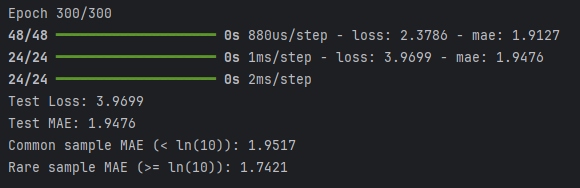
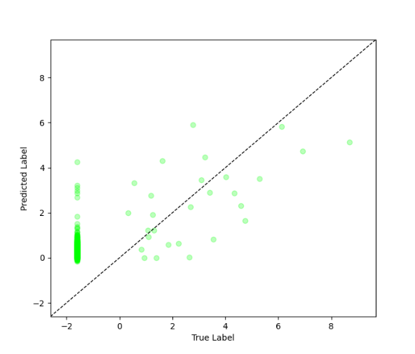
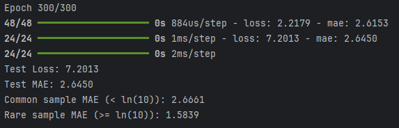
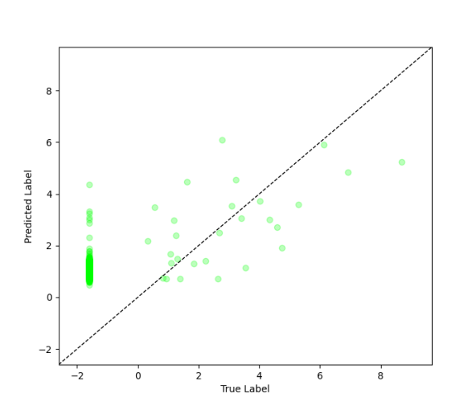

# Imbal Regression Tutorial (Autoencoder + Decoupled Fit)

This tutorial demonstrates how to train a regression model using Imbal with a decoupled training strategy via the `rRT_fit` function, combined with the autoencoder feature.

### Files Needed

**Full Code:** [view source code](./imbal_tutorial_decoupled_fit_ae_regression_clear_sep.py)

**Train/Test Files**: [training data](../sep_model_training_regression.csv), [testing data](../sep_model_testing_regression.csv)

---

> **Before you begin:** Use the [Tutorial Setup](../imbal_tutorial_ae_setup_regression.md) guide as your starting point, then continue with this tutorial.

## 1. Calculate Sample Densities

To address imbalance in continuous targets, we estimate label densities.

```python
labels_kde = y_train.reshape(-1).copy()
kde = imbal.regression.fit_kde(labels_kde)
densities = imbal.regression.get_sample_densities(labels_kde, kde)
```

### Explanation

* **KDE (Kernel Density Estimation)** models the distribution of target values.
* **Densities** measure how common each sample is.
* These densities are used during training to guide the decoupled fitting process.

---

## 2. Model Compilation and Training

### Compilation

```python
model.compile(
    loss="mean_squared_error",
    optimizer="adam",
    metrics=["mae"],
    generate_decoder_branch=True,
)
```

### Autoencoder Feature

This code enables the **autoencoder feature** during compilation:

* `generate_decoder_branch=True` adds a decoder branch that reconstructs the input.

### Training

```python
max_epochs = 300
batch_size = 32

model.rRT_fit(
    x_train,
    y_train,
    sample_density=densities,
    batch_size=batch_size,
    epochs=max_epochs,
)
```

### Explanation

* **Loss**: Mean Squared Error (MSE) for regression tasks.
* **Metric**: Mean Absolute Error (MAE) for interpretability.
* **rRT_fit** applies a decoupled training strategy leveraging density information.
* Combined with the autoencoder branch, training improves representation learning and robustness.

---

## 3. Results

### Model Evaluation

```python
results = model.evaluate(x_test, y_test)
loss, mae = results
predictions = model.predict(x_test)

print(f"Test Loss: {loss:.4f}")
print(f"Test MAE: {mae:.4f}")

threshold = np.log(10)

y_true = y_test.reshape(-1)
y_pred = predictions.reshape(-1)

common_mask = y_true < threshold
rare_mask = y_true >= threshold

common_mae = np.mean(np.abs(y_true[common_mask] - y_pred[common_mask]))
rare_mae = np.mean(np.abs(y_true[rare_mask] - y_pred[rare_mask]))

print(f"Common sample MAE (< ln(10)): {common_mae:.4f}")
print(f"Rare sample MAE (>= ln(10)): {rare_mae:.4f}")
```

### Example Output



---

## 4. Visualization

The model’s predictions are visualized by plotting true values against predicted values to assess performance and highlight rare vs. frequent samples.

```python
imbal.regression.plot_true_vs_predictions(y_test,
                                          predictions,
                                          )
```

### Example Output



---

## 5. Optional: Using Explicit Sample Weights

Alternatively, you can manually convert the sample densities into training weights and pass those weights to `balanced_fit`. This gives you more direct control over how strongly rare samples are emphasized during training.

Replace the training call with:

```python
from imbal.regression import reciprocal_importance

weights = reciprocal_importance(densities, alpha=1.2)

model.rRT_fit(
    x_train,
    y_train,
    sample_weight=weights,
    batch_size=batch_size,
    epochs=max_epochs,
)
```

### Explanation

* `reciprocal_importance` transforms the density values into sample weights.
* Lower-density (rarer) samples receive larger weights.
* The `alpha` parameter controls how aggressively rare samples are upweighted.
* This approach is useful when you want more manual control than passing `sample_density` directly.

### Results





This optional approach gives you manual control over the weighting strategy, while the default `sample_density` workflow keeps the training setup simpler.

--- 
