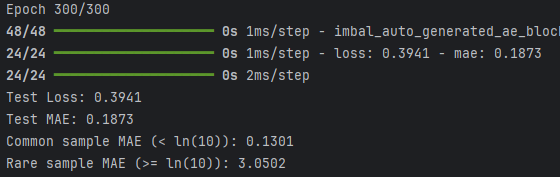
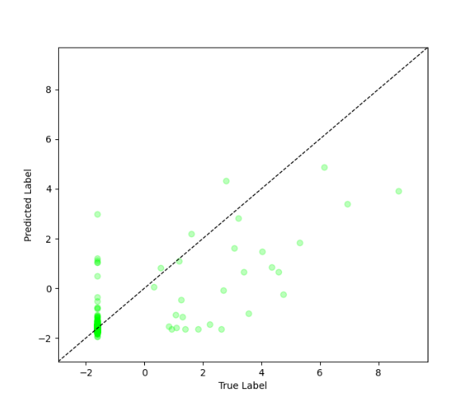

# Imbal Regression Tutorial (Autoencoder + Regular Fit)

This tutorial walks through a regression workflow using Imbal with the autoencoder feature enabled during standard training (`fit`).

### Files Needed

**Full Code:** [view source code](./imbal_tutorial_regular_fit_ae_regression_clear_sep.py)

**Train/Test Files**: [training data](../sep_model_training_regression.csv), [testing data](../sep_model_testing_regression.csv)

---

> **Before you begin:** Use the [Tutorial Setup](../imbal_tutorial_ae_setup_regression.md) guide as your starting point, then continue with this tutorial.

## 1. Model Compilation and Training

### Compilation

```python
model.compile(
    loss="mean_squared_error",
    optimizer="adam",
    metrics=["mae"],
    generate_decoder_branch=True,
)
```

### Autoencoder Feature

This code enables the **autoencoder feature** during compilation:

* `generate_decoder_branch=True` adds a decoder branch that reconstructs the input.
* This encourages the model to learn a more informative internal representation while optimizing the regression objective.

### Training

```python
max_epochs = 300
batch_size = 32

model.fit(
    x_train,
    y_train,
    batch_size=batch_size,
    epochs=max_epochs,
)
```

### Explanation

* **Loss**: Mean Squared Error (MSE), standard for regression.
* **Optimizer**: Adam for efficient optimization.
* **Metric**: Mean Absolute Error (MAE) for interpretability.
* Uses standard `fit()` while benefiting from the auxiliary reconstruction task.

---

## 2. Results

### Model Evaluation

```python
results = model.evaluate(x_test, y_test)
loss, mae = results
predictions = model.predict(x_test)

print(f"Test Loss: {loss:.4f}")
print(f"Test MAE: {mae:.4f}")

threshold = np.log(10)

y_true = y_test.reshape(-1)
y_pred = predictions.reshape(-1)

common_mask = y_true < threshold
rare_mask = y_true >= threshold

common_mae = np.mean(np.abs(y_true[common_mask] - y_pred[common_mask]))
rare_mae = np.mean(np.abs(y_true[rare_mask] - y_pred[rare_mask]))

print(f"Common sample MAE (< ln(10)): {common_mae:.4f}")
print(f"Rare sample MAE (>= ln(10)): {rare_mae:.4f}")
```

### Example Output



---

## 3. Visualization

The model’s predictions are visualized by plotting true values against predicted values to assess performance and highlight rare vs. frequent samples.

```python
imbal.regression.plot_true_vs_predictions(y_test,
                                          predictions,
                                          )
```

### Example Output



---
