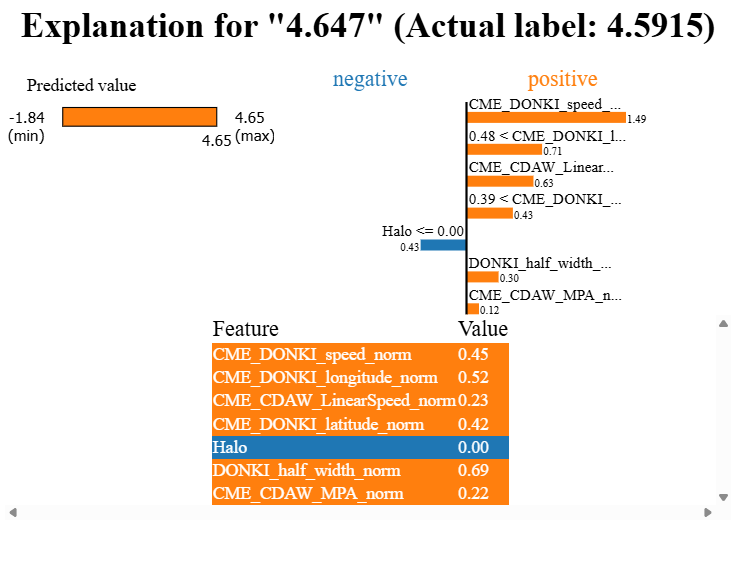
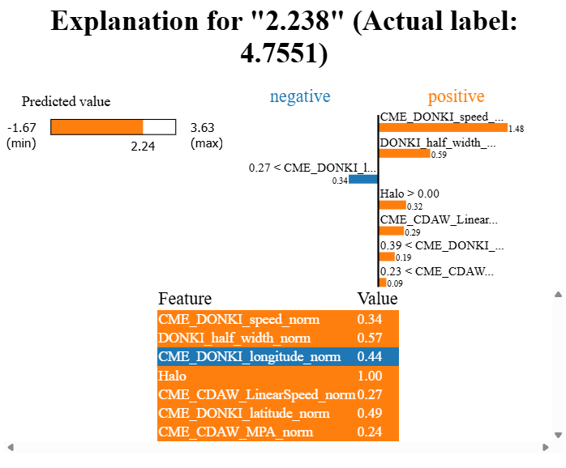

# LIME Explanation Tutorial (Regression)

**Full Code:** [view source code](imbal_tutorial_lime_explanation_regression.py)

**Train/Test Files**: [training data](./sep_model_training_regression.csv), [testing data](./sep_model_testing_regression.csv)

---

> This core code is a sample from the `balanced_fit` tutorial code found [here](./Regular/imbal_tutorial_balanced_fit_regression_clear_sep.md)

## 1. Core Code

```python
import numpy as np
import pandas as pd
import tensorflow as tf
import keras
from tensorflow.keras import layers

import imbal

seed = 42
tf.keras.utils.set_random_seed(seed)

target_column = "ln_peak_intensity"

max_epochs = 300
batch_size = 32

train_data = pd.read_csv("sep_model_training_regression.csv")
test_data = pd.read_csv("sep_model_testing_regression.csv")

y_train = train_data[target_column].values.reshape(-1, 1).astype("float32")
y_test = test_data[target_column].values.reshape(-1, 1).astype("float32")

x_train = train_data.drop(columns=[target_column]).values.astype(np.float32)
x_test = test_data.drop(columns=[target_column]).values.astype(np.float32)

def build_model(input_shape: int) -> imbal.regression.Model:
    inputs = keras.Input(shape=(input_shape,), name="features")
    hidden1 = layers.Dense(18, activation="relu")(inputs)
    hidden2 = layers.Dense(12, activation="relu")(hidden1)
    hidden3 = layers.Dense(8, activation="relu")(hidden2)
    hidden4 = layers.Dense(6, activation="relu")(hidden3)
    outputs = layers.Dense(1)(hidden4)

    return imbal.regression.Model(inputs=inputs, outputs=outputs, name="sep_model")

model = build_model(x_train.shape[1])

labels_kde = y_train.reshape(-1).copy()
kde = imbal.regression.fit_kde(labels_kde)
densities = imbal.regression.get_sample_densities(labels_kde, kde)

model.compile(
    loss="mean_squared_error",
    optimizer="adam",
    metrics=["mae"],
)

from imbal.regression import reciprocal_importance
weights = reciprocal_importance(densities, alpha=0.8)

model.balanced_fit(
    x_train,
    y_train,
    sample_weight=weights,
    batch_size=batch_size,
    epochs=max_epochs,
)
```

---

## 2. LIME Explanations

### A. Small Error Prediction Example

```python
labels = train_data.drop(columns=[target_column]).columns.tolist()

target_sample_index = -6

imbal.regression.lime_explain_tabular_sample(
    x_test[target_sample_index],
    model,
    x_train,
    actual_label=np.round(float(y_test.reshape(-1)[target_sample_index]), 4),
    feature_names=labels,
)
```

### Explanation

This example explains a **close regression prediction**.

* `labels` stores the feature names for readability.
* `target_sample_index = -6` selects a sample near the end of the dataset.
* `lime_explain_tabular_sample(...)` generates a local explanation for that prediction.

Instead of class probabilities, we interpret **how features push the prediction higher or lower**.

---

### B. Large Error Prediction Example

```python
target_sample_index = -5

imbal.regression.lime_explain_tabular_sample(
    x_test[target_sample_index],
    model,
    x_train,
    actual_label=np.round(float(y_test.reshape(-1)[target_sample_index]), 4),
    feature_names=labels,
)
```

### Explanation

This example shows a **far regression prediction** that is not within a reasonable margin.

---

## 3. Results

### Small Error Prediction



### Large Error Prediction



---

## 4. Understanding the LIME Output

The LIME visualization explains **why the model predicted the value that it did**.

### Layout Guide (how to read the figure)

* **Top left** shows the **predicted value** (continuous output).
* **Top right** shows the **feature contribution values** (weights).

  * **Orange (positive)** → pushes the prediction **higher**
  * **Blue (negative)** → pushes the prediction **lower**
* **Bottom middle** shows the **feature values** for this specific sample.

Note: The **feature values** in this model are not the raw physical values but normalized values (typically between 0 and 1).

---

## 5. Interpreting the Difference Between the Two Explanations

---

### A. Why the first prediction is much closer to the true value

In the small error example, the top 3 features are consistent and reinforce each other.

* Both **speed-related features appear in the top 3**:

  * `CME_DONKI_speed_norm`
  * `CME_CDAW_LinearSpeed_norm`

* These features contribute in the same direction and are supported by another feature (such as width or longitude).

Because the model is relying on multiple speed-related signals at the same time, the overall pattern is stable. The strongest contributors are also among the most physically meaningful features, and they are not being contradicted by other inputs.

This leads to a prediction that stays close to the true value.

---

### B. Why the large error prediction is far from the true value

In the large error example, the composition of the top features changes.

* Only **one speed-related feature appears in the top 3**
* The second speed-related feature is pushed down to around **5th place**

Instead, the top contributors include features such as:

* `DONKI_half_width_norm`
* `Halo`

This shift matters because the model is no longer relying primarily on both speed signals at the same time. While one speed feature still contributes, it is not reinforced by the other.

At the same time, features like `Halo` become more influential, introducing a different type of signal that does not align as directly with the main drivers of the prediction.

As a result, the top features are less consistent with each other, and the model combines a set of signals that do not point as clearly in one direction. This leads to a prediction that is further from the true value.

---
