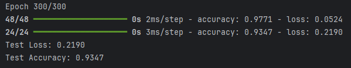

# Imbal Balanced Binary Classification Tutorial

This tutorial demonstrates how to train a neural network for a classification task while addressing data imbalance using sample weighting and the `balanced_fit` function.

**Full Code:** [view script](./imbal_tutorial_balanced_fit_classification_clear_sep.py)

---

## 1. Import Packages

We begin by importing the required libraries for data processing and model development.

```python
import numpy as np
import pandas as pd
import tensorflow as tf
import keras
from tensorflow.keras import layers

import imbal
```

### Explanation

* **NumPy**: Efficient numerical computations.
* **Pandas**: Data loading and manipulation.
* **TensorFlow / Keras**: Neural network framework.
* **layers**: Used to build neural network layers.
* **imbal**: Custom library for handling imbalanced classification.

Set a random seed for reproducibility:

```python
seed = 42
tf.keras.utils.set_random_seed(seed)
```

---

## 2. Load Data

Load training and testing datasets from CSV files.

```python
target_column = "ln_peak_intensity"

train_data = pd.read_csv("sep_model_training_classification.csv")
test_data  = pd.read_csv("sep_model_testing_classification.csv")
```

### Prepare Features and Labels

```python
y_train = train_data[target_column].values.reshape(-1, 1).astype("float32")
y_test  = test_data[target_column].values.reshape(-1, 1).astype("float32")

x_train = train_data.drop(columns=[target_column]).values.astype(np.float32)
x_test  = test_data.drop(columns=[target_column]).values.astype(np.float32)
```

### Explanation

* Labels are reshaped to **(n, 1)** to match model expectations.
* Features and labels are converted to `float32` for TensorFlow compatibility.

---

## 3. Calculate Sample Weights

To address class imbalance, we compute sample weights based on the training labels.

```python
sample_weights = imbal.classification.generate_sample_weights(y_train)
```

### Explanation

* Sample weights assign higher importance to underrepresented classes.
* This helps the model avoid bias toward the majority class.
* The weights are later passed into training to influence loss calculation.

---

## 4. Build the Model

We define a neural network architecture using dense layers.

```python
def build_model(input_shape: int) -> imbal.classification.Model:
    inputs = keras.Input(shape=(input_shape,), name="features")
    hidden1 = layers.Dense(18, activation="relu", name="hidden_layer1")(inputs)
    hidden2 = layers.Dense(12, activation="relu", name="hidden_layer2")(hidden1)
    hidden3 = layers.Dense(8, activation="relu", name="hidden_layer3")(hidden2)
    hidden4 = layers.Dense(6, activation="relu", name="hidden_layer4")(hidden3)
    outputs = layers.Dense(1, activation="sigmoid", name="output_layer")(hidden4)

    built_model = imbal.classification.Model(
        inputs=inputs,
        outputs=outputs,
        name="sep_model"
    )
    return built_model

model = build_model(x_train.shape[1])
```

### Explanation

* Input layer matches the number of features.
* Hidden layers progressively reduce dimensionality.
* ReLU activations introduce non-linearity.
* Sigmoid output produces probabilities for binary classification.

---

## 5. Model Compilation and Training

### Compilation

```python
model.compile(
    loss="binary_crossentropy",
    optimizer="adam",
    metrics=["accuracy"],
)
```

### Training with Sample Weights

```python
max_epochs = 300
batch_size = 32

model.balanced_fit(
    x_train,
    y_train,
    sample_weight=sample_weights,
    batch_size=batch_size,
    epochs=max_epochs,
)
```

### Explanation

* **balanced_fit** uses sample weights to adjust learning.
* This improves performance on imbalanced datasets.
* Training configuration remains similar to standard fitting.

---

## 6. Results

### Model Evaluation

```python
results = model.evaluate(x_test, y_test)
loss, accuracy = results

print(f"Test Loss: {loss:.4f}")
print(f"Test Accuracy: {accuracy:.4f}")
```

### Example Output


