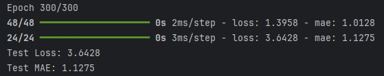

# Imbal Balanced Regression Tutorial

This tutorial demonstrates how to train a neural network for a regression task while addressing data imbalance using density-based sample weighting.

**Full Code:** [view script](./imbal_tutorial_balanced_fit_regression_clear_sep.py)

---

## 1. Import Packages

We begin by importing the required libraries for numerical computation, data handling, and model building.

```python
import numpy as np
import pandas as pd
import tensorflow as tf
import keras
from tensorflow.keras import layers

import imbal
```

### Explanation

* **NumPy**: Efficient numerical operations.
* **Pandas**: Loading and manipulating tabular data.
* **TensorFlow / Keras**: Deep learning framework.
* **layers**: Building blocks for neural networks.
* **imbal**: Custom library for handling imbalance in regression tasks.

Set a random seed for reproducibility:

```python
seed = 42
tf.keras.utils.set_random_seed(seed)
```

---

## 2. Load Data

Load training and testing datasets from CSV files.

```python
target_column = "ln_peak_intensity"

train_data = pd.read_csv("sep_model_training_regression.csv")
test_data  = pd.read_csv("sep_model_testing_regression.csv")
```

### Prepare Features and Labels

```python
y_train = train_data[target_column].values.reshape(-1, 1).astype("float32")
y_test  = test_data[target_column].values.reshape(-1, 1).astype("float32")

x_train = train_data.drop(columns=[target_column]).values.astype(np.float32)
x_test  = test_data.drop(columns=[target_column]).values.astype(np.float32)
```

### Explanation

* Labels are reshaped to **(n, 1)** for compatibility with the model.
* Features and labels are converted to `float32`.

---

## 3. Calculate Sample Densities / Weights

To address imbalance in continuous targets, we estimate label densities and generate sample weights.

```python
labels_kde = y_train.reshape(-1).copy()
kde = imbal.regression.fit_kde(labels_kde)
densities = imbal.regression.get_sample_densities(labels_kde, kde)
sample_weights = imbal.regression.generate_sample_weights(densities).reshape(-1)
```

### Explanation

* **KDE (Kernel Density Estimation)** models the distribution of target values.
* **Densities** measure how common each sample is.
* **Sample weights** give higher importance to rare (low-density) samples.
* This helps the model learn better across the full range of values.

---

## 4. Build the Model

We define a neural network suitable for regression.

```python
def build_model(input_shape: int) -> imbal.regression.Model:
    inputs = keras.Input(shape=(input_shape,), name="features")
    hidden1 = layers.Dense(18, activation="relu", name="hidden_layer1")(inputs)
    hidden2 = layers.Dense(12, activation="relu", name="hidden_layer2")(hidden1)
    hidden3 = layers.Dense(8, activation="relu", name="hidden_layer3")(hidden2)
    hidden4 = layers.Dense(6, activation="relu", name="hidden_layer4")(hidden3)
    outputs = layers.Dense(1, name="output_layer")(hidden4)

    built_model = imbal.regression.Model(
        inputs=inputs,
        outputs=outputs,
        name="sep_model"
    )
    return built_model

model = build_model(x_train.shape[1])
```

### Explanation

* Input layer matches the number of features.
* Hidden layers progressively reduce size.
* ReLU activations introduce non-linearity.
* Output layer has **no activation** (linear output), appropriate for regression.

---

## 5. Model Compilation and Training

### Compilation

```python
model.compile(
    loss="mean_squared_error",
    optimizer="adam",
    metrics=["mae"],
)
```

### Training

```python
max_epochs = 300
batch_size = 32

model.balanced_fit(
    x_train,
    y_train,
    sample_weight=sample_weights,
    batch_size=batch_size,
    epochs=max_epochs,
)
```

### Explanation

* **Loss**: Mean Squared Error (MSE) for regression tasks.
* **Metric**: Mean Absolute Error (MAE) for interpretability.
* **balanced_fit** helps the model learn more effectively from imbalanced target distributions.

---

## 6. Results

### Model Evaluation

```python
results = model.evaluate(x_test, y_test)
loss, mae = results

print(f"Test Loss: {loss:.4f}")
print(f"Test MAE: {mae:.4f}")
```

### Example Output

```
Test Loss: 0.1234
Test MAE: 0.0567
```

---

### 📷 Add Your Output Image Here

You can include a screenshot of your model output below.


