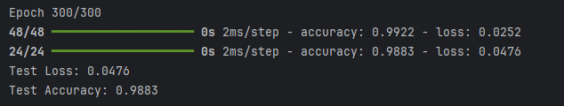

# Imbal Binary Classification Tutorial

This tutorial walks through a complete machine learning workflow using TensorFlow/Keras for a binary classification task.

**Full Code:** [view script](./imbal_tutorial_regular_fit_classification_clear_sep.py)

---

## 1. Import Packages

We begin by importing the required libraries for data handling, numerical operations, and model building.

```python
import numpy as np
import pandas as pd
import tensorflow as tf
import keras
from tensorflow.keras import layers

import imbal
```

### Explanation

* **NumPy**: Handles numerical arrays efficiently.
* **Pandas**: Used for loading and manipulating tabular data.
* **TensorFlow / Keras**: Framework for building and training neural networks.
* **layers**: Provides building blocks for neural network architecture.
* **imbal**: Custom library used to define a classification model.

We also set a random seed for reproducibility:

```python
seed = 42
tf.keras.utils.set_random_seed(seed)
```

---

## 2. Load Data

We load training and testing datasets from CSV files.

```python
target_column = "ln_peak_intensity"

train_data = pd.read_csv("sep_model_training_classification.csv")
test_data  = pd.read_csv("sep_model_testing_classification.csv")
```

### Splitting Features and Labels

```python
y_train = train_data[target_column].values.astype("float32")
y_test  = test_data[target_column].values.astype("float32")

x_train = train_data.drop(columns=[target_column]).values.astype(np.float32)
x_test  = test_data.drop(columns=[target_column]).values.astype(np.float32)
```

### Explanation

* **Target column** (`ln_peak_intensity`) is what the model predicts.
* **Features (`x_*`)**: All other columns.
* **Labels (`y_*`)**: The target column values.
* Data is converted to `float32` for compatibility with TensorFlow.

---

## 3. Build the Model

We define a neural network using multiple dense (fully connected) layers.

```python
def build_model(input_shape: int) -> imbal.classification.Model:
    inputs = keras.Input(shape=(input_shape,), name="features")
    hidden1 = layers.Dense(18, activation="relu", name="hidden_layer1")(inputs)
    hidden2 = layers.Dense(12, activation="relu", name="hidden_layer2")(hidden1)
    hidden3 = layers.Dense(8, activation="relu", name="hidden_layer3")(hidden2)
    hidden4 = layers.Dense(6, activation="relu", name="hidden_layer4")(hidden3)
    outputs = layers.Dense(1, activation="sigmoid", name="output_layer")(hidden4)
    
    built_model = imbal.classification.Model(
        inputs=inputs,
        outputs=outputs,
        name="sep_model"
    )
    return built_model

model = build_model(x_train.shape[1])
```

### Explanation

* **Input layer**: Matches the number of features.
* **Hidden layers**: Four layers with decreasing neuron sizes (18 → 6).
* **ReLU activation**: Introduces non-linearity.
* **Output layer**: Single neuron with **sigmoid activation** for binary classification.

---

## 4. Model Compilation and Training

### Compilation

```python
model.compile(
    loss="binary_crossentropy",
    optimizer="adam",
    metrics=["accuracy"],
)
```

### Explanation

* **Loss**: Binary crossentropy is ideal for binary classification.
* **Optimizer**: Adam is efficient and widely used.
* **Metric**: Accuracy tracks model performance.

### Training

```python
max_epochs = 300
batch_size = 32

model.fit(
    x_train,
    y_train,
    batch_size=batch_size,
    epochs=max_epochs,
)
```

### Explanation

* **Epochs**: Number of times the model sees the entire dataset.
* **Batch size**: Number of samples processed before updating weights.

---

## 5. Results

### Model Evaluation

```python
results = model.evaluate(x_test, y_test)
loss, accuracy = results

print(f"Test Loss: {loss:.4f}")
print(f"Test Accuracy: {accuracy:.4f}")
```

### Example Output


