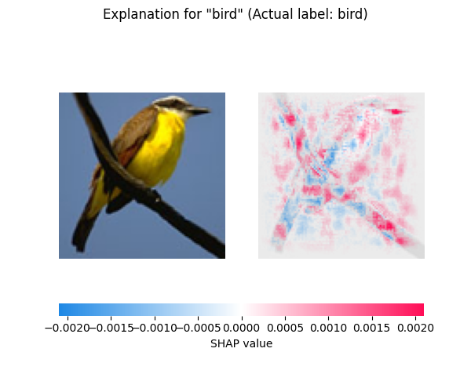
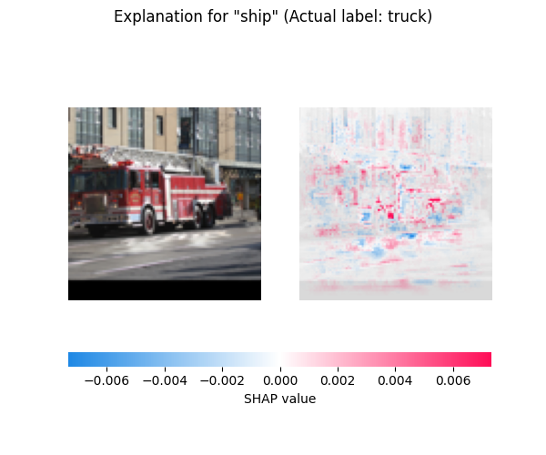
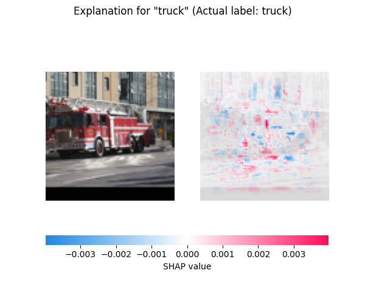

# shap_explain_image_sample

```{eval-rst}
.. autoclass:: imbal.classification.shap_explain_image_sample
```

Example:

```python
>>> # Assume a TensorFlow model is already saved to 'model'
>>>
>>> class_labels = ['airplane', 'bird', 'car', 'cat', 'deer',
>>>                 'dog', 'horse', 'monkey', 'ship', 'truck']
>>> 
>>> x = x_test[0]
>>> y = y_test[0]
>>> 
>>> imbal.classification.shap_explain_image_sample(
>>>     x,
>>>     model,
>>>     x_train,
>>>     class_names=class_labels,
>>>     actual_label=y,
>>>     save_figure=True,
>>> )
```

## Plot Examples

Below is an example of the resulting Matplotlib pyplot plot for a 
correctly predicted class.

```python
>>> imbal.classification.shap_explain_image_sample(
>>>     x_test[i],
>>>     model,
>>>     x_train,
>>>     class_names=labels,
>>>     actual_label=y_test[i]
>>> )
```



An example of the resulting Matplotlib pyplot plot for in
incorrectly predicted class.

```python
>>> imbal.classification.shap_explain_image_sample(
>>>     x_test[i],
>>>     model,
>>>     x_train,
>>>     class_names=labels,
>>>     actual_label=y_test[i]
>>> )
```



An example of the resulting Matplotlib pyplot plot for the same
sample shown above, but providing and explanation for the correct class.
From these explanations, we gain insight into the fact that while the
model seems to correctly positively correlate some parts of the truck with
the truck class, it found a negative correlation with the windows of the
building in the background, which the model positively associated with the
ship class.

```python
>>> imbal.classification.shap_explain_image_sample(
>>>     x_test[i],
>>>     model,
>>>     x_train,
>>>     class_names=labels,
>>>     label_to_explain=y_test[i],
>>>     actual_label=y_test[i]
>>> )
```

