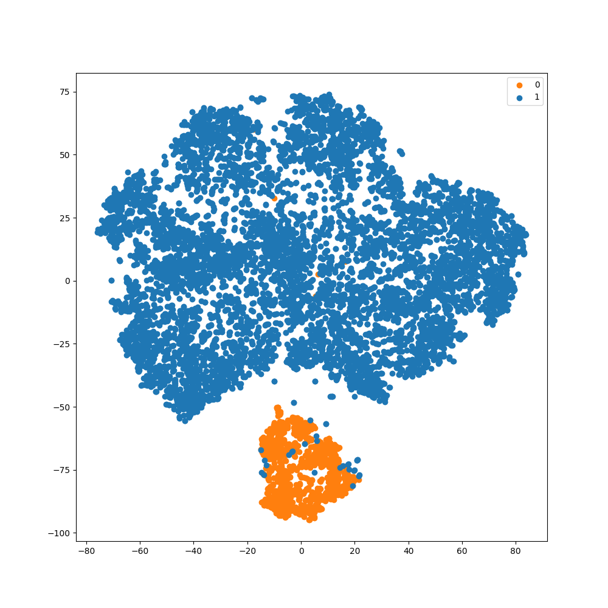
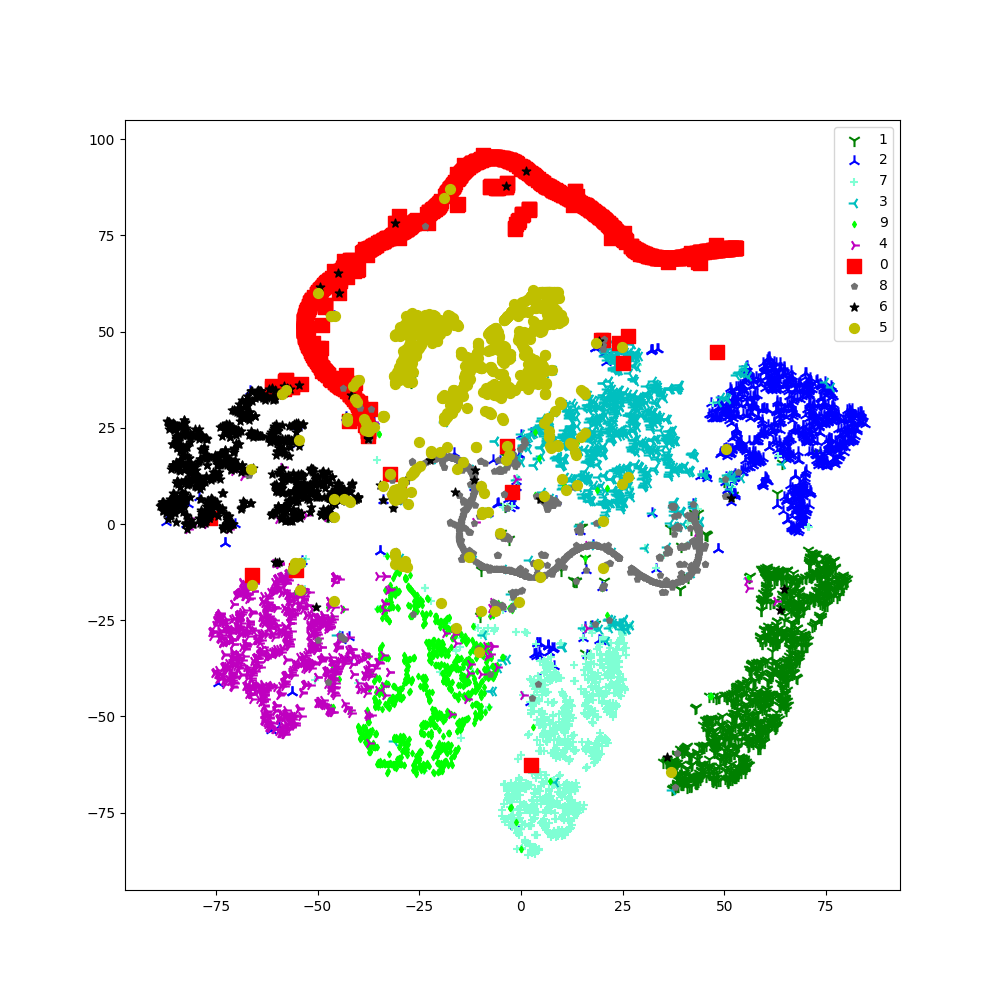
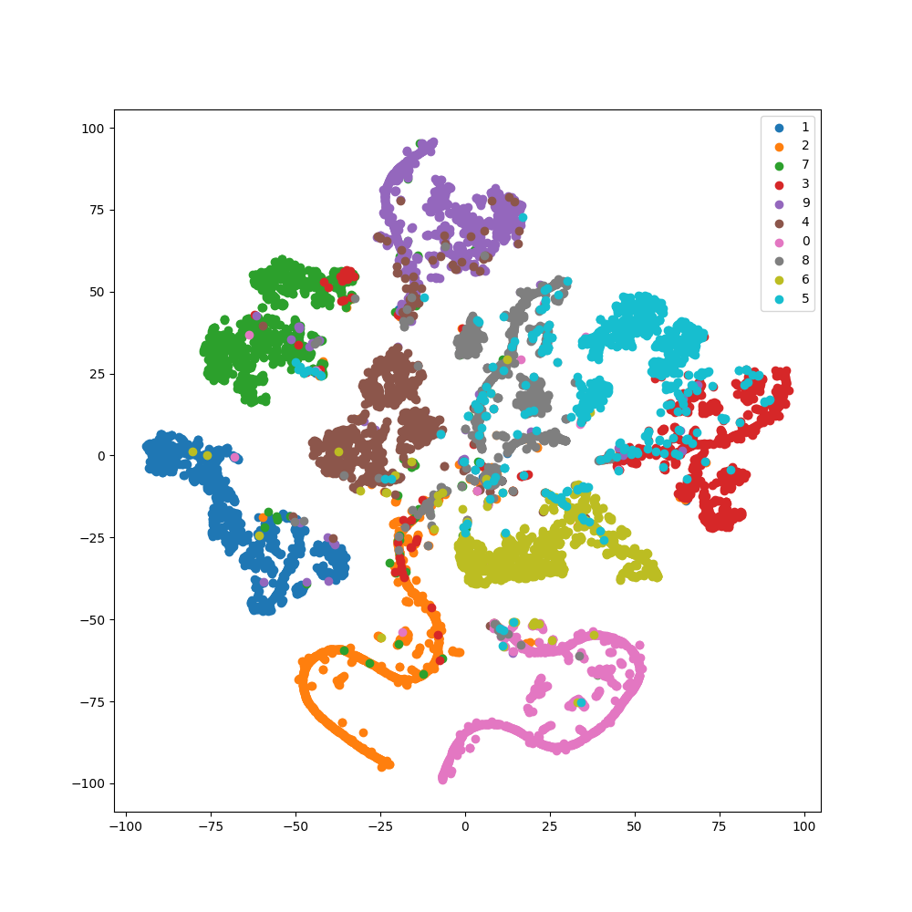
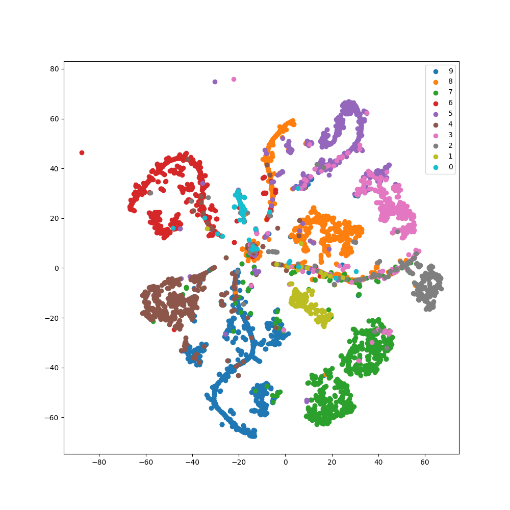

# tsne_visualization

```{eval-rst}
.. autoclass:: imbal.classification.tsne_visualization
```

## Example of Rare Class Last Plotting Benefits

By plotting rare classes last, we can ensure that instances of rare classes are
always plotted above instances of more common classes, leading to a clearer
visual of the TSNE plot.

<div style="display: flex; width: 100%;">


</div>

As you can see in the visualization above, in the case where the labels
are plotted in order (left), the few orange points that have been plotted
in the blue region are almost entirely lost. On the other hand, using
our "rare plotted last" method (right), all the orange points plotted
within the blue region are clearly visible.

## Example of Setting Marker Shape, Size, and Color

Below is an example of a TSNE plot of the representation space of a model trained on MNIST data.
The following parameters have been passed to the TSNE visualization:

```python
>>> imbal.classification.tsne_visualization(
>>>     model,
>>>     x_test,
>>>     y_test,
>>>     s=[100, 90, 80, 70, 60, 50, 40, 30, 20, 10],
>>>     marker=['s','1','2','3','4','o','*','+','p','d'],
>>>     c=['r', 'g', 'b', 'c', 'm', 'y', 'k', 'aquamarine', '#707070', '#00FF00']
>>> )
```




## Example of Representation Issues with Imbalanced Data

<div style="display: flex; width: 100%;">


</div>

As shown visually above, when classes are relatively balanced (left), there is a clearer separation
between classes. However, when working with imbalanced data (right) and failing to address the imbalance in
any manner, it is far more likely to see overlaps in the representation of each class (especially near
the middle of the plot in this example).
