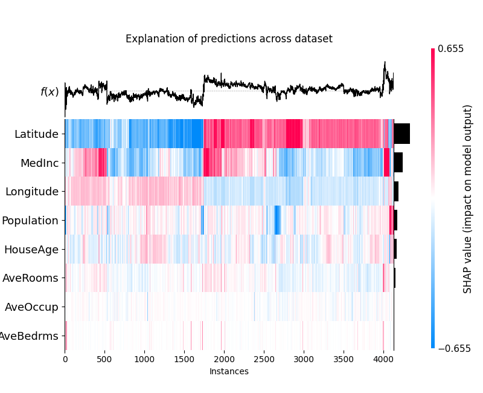
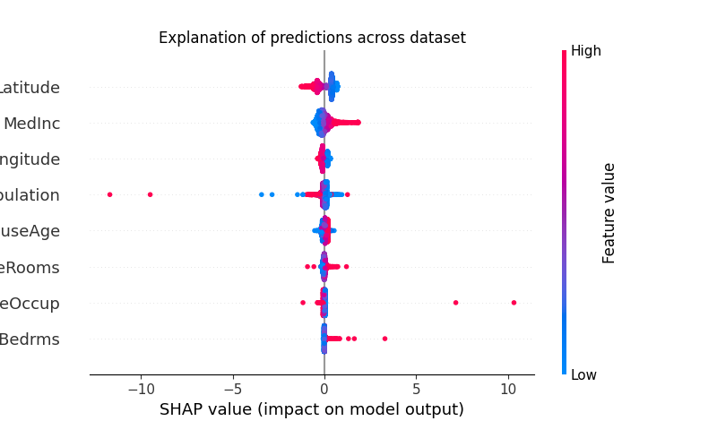
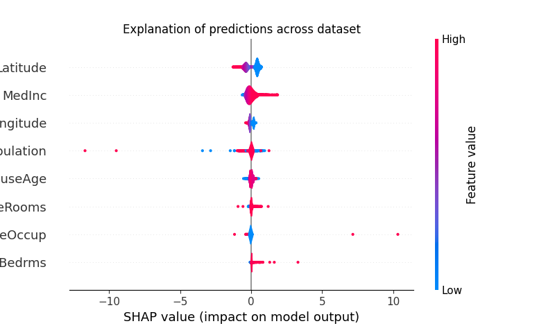

# shap_explain_tabular_dataset

```{eval-rst}
.. autoclass:: imbal.regression.shap_explain_tabular_dataset
```

Example:

```python
>>> # Assume a TensorFlow model is already saved to 'model'
>>>
>>> from sklearn.datasets import load_wine
>>> 
>>> x, y = load_wine(return_X_y=True)
>>> labels = load_wine().feature_names
>>>
>>> imbal.regression.shap_explain_tabular_dataset(
>>>     x[0],
>>>     model,
>>>     x_train,
>>>     feature_names=labels,
>>>     plot_typle='heatmap'
>>> )
```

## Plot Examples

Below is an example of a heatmap plot explaining a model's predictions
for the third class of the `scikit-learn`
[California housing dataset](https://scikit-learn.org/stable/modules/generated/sklearn.datasets.fetch_california_housing.html).

```python
>>> imbal.classification.shap_explain_tabular_dataset(
>>>     x,
>>>     model,
>>>     x_train,
>>>     feature_names=labels,
>>>     plot_type='heatmap'
>>> )
```



Below is an example of a beeswarm plot explaining predictions
for the third class of the same dataset.

```python
>>> imbal.classification.shap_explain_tabular_dataset(
>>>     x,
>>>     model,
>>>     x_train,
>>>     feature_names=labels,
>>>     plot_type='beeswarm'
>>> )
```



Below is an example of a violin plot explaining predictions
for the third class of the same dataset.

```python
>>> imbal.classification.shap_explain_tabular_dataset(
>>>     x,
>>>     model,
>>>     x_train,
>>>     feature_names=labels,
>>>     plot_type='violin'
>>> )
```

