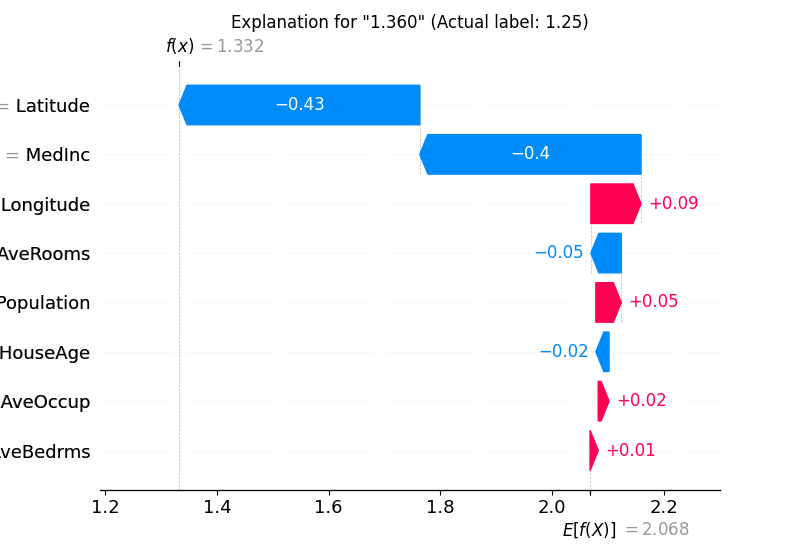
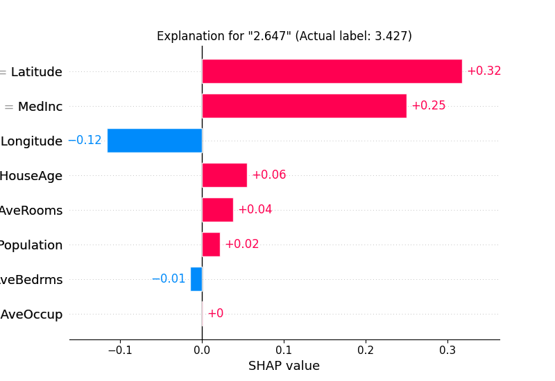

# shap_explain_tabular_sample

```{eval-rst}
.. autoclass:: imbal.regression.shap_explain_tabular_sample
```

Example:

```python
>>> # Assume a TensorFlow model is already saved to 'model'
>>>
>>> from sklearn.datasets import fetch_california_housing
>>> 
>>> x, y = fetch_california_housing(return_X_y=True)
>>> labels = fetch_california_housing().feature_names
>>>
>>> imbal.regression.shap_explain_tabular_sample(
>>>     x[0],
>>>     model,
>>>     x_train,
>>>     label_to_explain=y[0],
>>>     actual_label=y[0],
>>>     feature_names=labels,
>>>     plot_typle='waterfall'
>>> )
```

## Plot Examples

Below is an example of the waterfall plot for a correctly predicted sample (within some reasonable tolerance) 
in the `scikit-learn`
[California housing dataset](https://scikit-learn.org/stable/modules/generated/sklearn.datasets.fetch_california_housing.html).

```python
>>> imbal.regression.shap_explain_tabular_sample(
>>>     x,
>>>     model,
>>>     x_train,
>>>     actual_label=y,
>>>     feature_names=labels,
>>>     plot_typle='waterfall'
>>> )
```



Below is an example of the bar plot for an incorrectly predicted sample.

```python
>>> imbal.regression.shap_explain_tabular_sample(
>>>     x,
>>>     model,
>>>     x_train,
>>>     actual_label=y,
>>>     feature_names=labels,
>>>     plot_typle='bar'
>>> )
```



Unlike LIME, SHAP does not currently support explanations for a chosen
(user specified) regression value, only values predicted by the provided model.