# Comparison of Autoencoder: Regular vs. Balanced vs. cRT Fit on Image Classification

### Regular Fit with Autoencoder (representation layer = -2)

```python
    # Assume data has already been loaded into x_train, y_train, x_test, and y_test

    inputs = keras.Input(shape=(28,28,1))
    x = layers.Conv2D(8, (3, 3), strides=(2, 2), activation='relu', padding='same')(inputs)
    x = layers.Conv2D(16, (3, 3), strides=(2, 2), activation='relu', padding='same')(x)
    x = layers.Flatten()(x)
    x = layers.Dense(16, activation='relu')(x)
    x = layers.Flatten()(x)
    output = layers.Dense(10, activation='softmax')(x)

    model = imbal.classification.Model(inputs=inputs, outputs=output)

    model.compile(
        loss="sparse_categorical_crossentropy",
        optimizer=keras.optimizers.Adam(learning_rate=1e-4),
        metrics=["accuracy"],
        generate_decoder_branch=True,
        representation_layer_index=-2
    )
    
    model.override_second_stage_fit_parameters(
        epochs=10000,
        callbacks=[
            keras.callbacks.EarlyStopping(patience=20, restore_best_weights=True)
        ]
    )
    
    model.fit(
        x_train,
        y_train,
        stratify_batches=True,
        validation_split=0.2,
        batch_size=512,
        epochs=10000,
        callbacks=[
            keras.callbacks.EarlyStopping(patience=20, restore_best_weights=True)
        ]
    )
```

<div style="display: flex; max-width: 100%;">
<div style="display:flex; flex-direction:column; flex:1; align-items:center; max-width:33%;">
<p>Confusion Matrix</p>

</div>
<div style="display:flex; flex-direction:column; flex:1; align-items:center; max-width:33%;">
<p>TSNE Visualization</p>
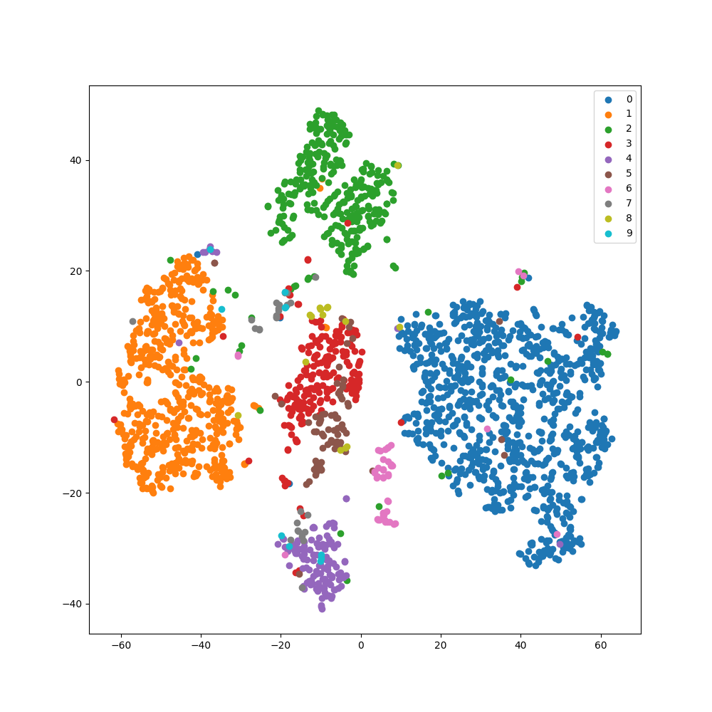
</div>
<div style="display:flex; flex-direction:column; flex:1; align-items:center; max-width:33%;">
<p>ROC Curve</p>
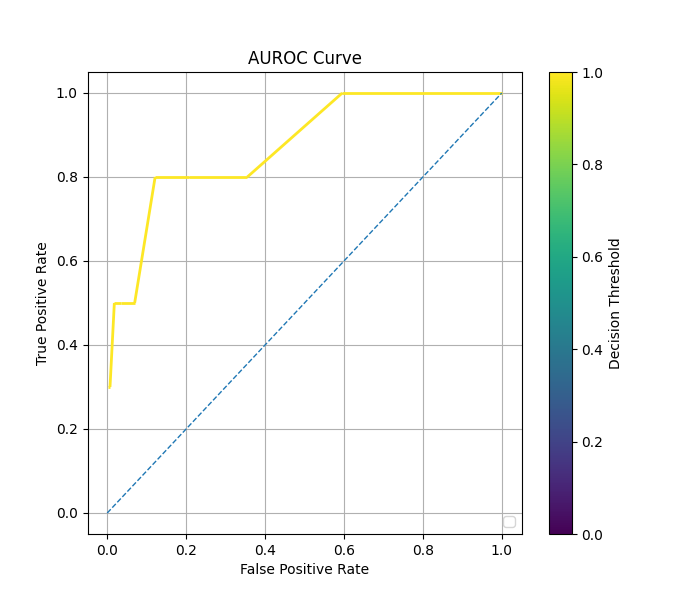
</div>  
</div>

### Balanced Fit with Autoencoder (representation layer = -2)

```python
    # Assume the data loading, model construction and compilation as shown in regular fit above.
    
    model.balanced_fit(
        x_train,
        y_train,
        stratify_batches=True,
        validation_split=0.2,
        batch_size=512,
        epochs=10000,
        callbacks=[
            keras.callbacks.EarlyStopping(patience=20, restore_best_weights=True)
        ]
    )
```

<div style="display: flex; max-width: 100%;">
<div style="display:flex; flex-direction:column; flex:1; align-items:center; max-width:33%;">
<p>Confusion Matrix</p>

</div>
<div style="display:flex; flex-direction:column; flex:1; align-items:center; max-width:33%;">
<p>TSNE Visualization</p>
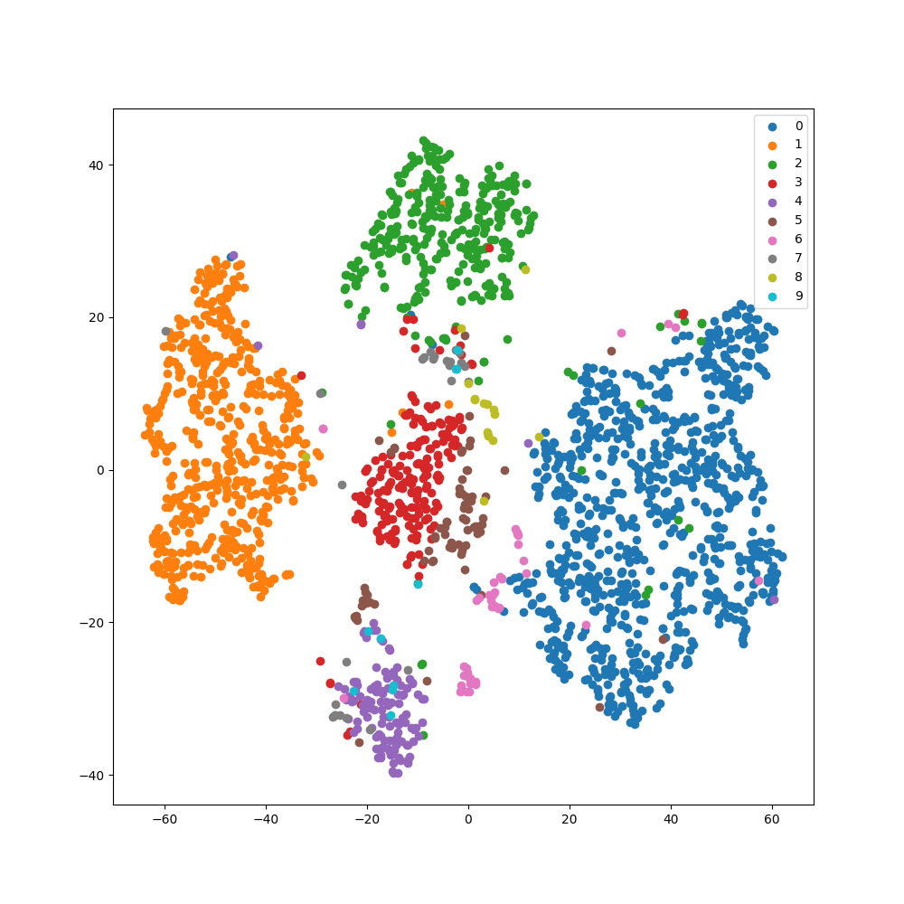
</div>
<div style="display:flex; flex-direction:column; flex:1; align-items:center; max-width:33%;">
<p>ROC Curve</p>
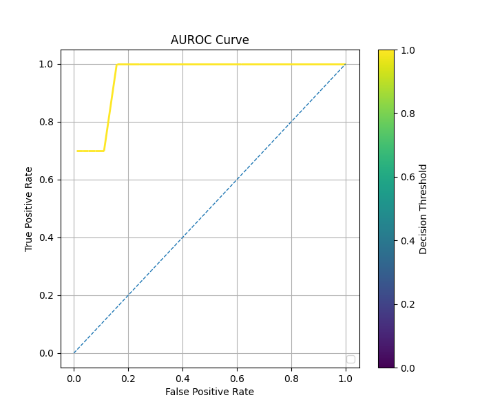
</div>  
</div>


### cRT Fit with Autoencoder  (representation layer = -2)

```python
    # Assume the data loading, model construction and compilation as shown in regular fit above.
    
    model.override_second_stage_fit_parameters(
        epochs=10000,
        callbacks=[
            keras.callbacks.EarlyStopping(patience=20, restore_best_weights=True)
        ]
    )

    model.cRT_fit(
        x_train,
        y_train,
        stratify_batches=True,
        validation_split=0.2,
        batch_size=512,
        epochs=10000,
        callbacks=[
            keras.callbacks.EarlyStopping(patience=20, restore_best_weights=True)
        ]
    )
```

<div style="display: flex; max-width: 100%;">
<div style="display:flex; flex-direction:column; flex:1; align-items:center; max-width:33%;">
<p>Confusion Matrix</p>
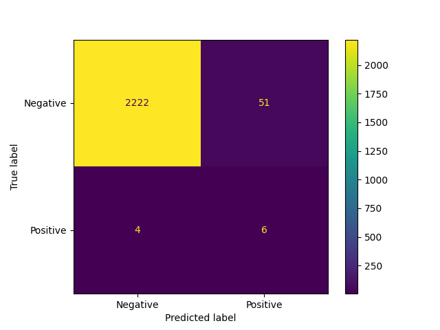
</div>
<div style="display:flex; flex-direction:column; flex:1; align-items:center; max-width:33%;">
<p>TSNE Visualization</p>
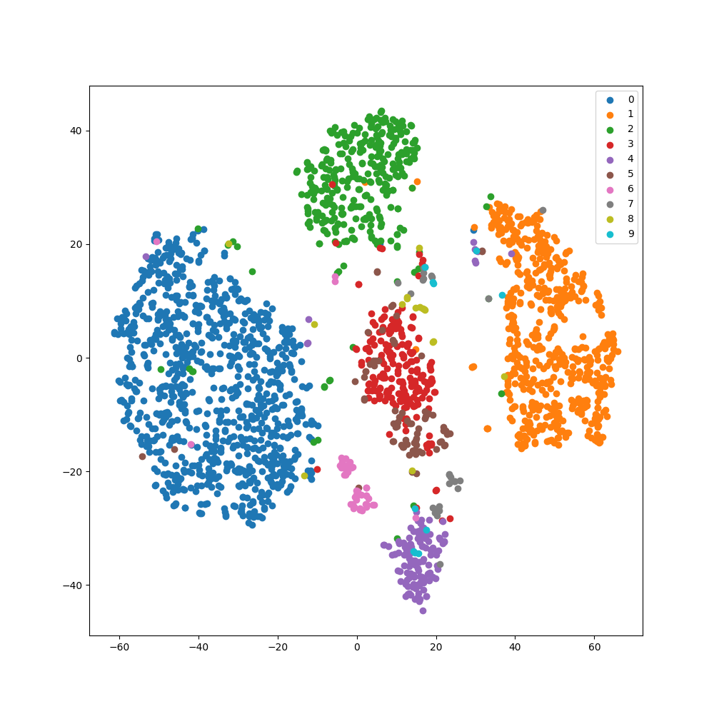
</div>
<div style="display:flex; flex-direction:column; flex:1; align-items:center; max-width:33%;">
<p>ROC Curve</p>
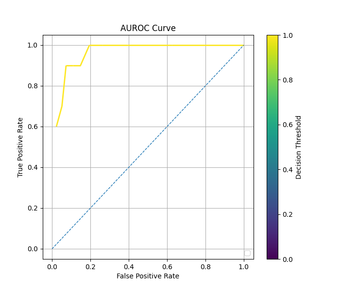
</div>  
</div>

### Regular Fit with Autoencoder (representation layer = -3)

```python
    # Assume the data loading and model construction as shown in regular fit above.
    
    model.compile(
        loss="sparse_categorical_crossentropy",
        optimizer=keras.optimizers.Adam(learning_rate=1e-4),
        metrics=["accuracy"],
        generate_decoder_branch=True,
        representation_layer_index=-3
    )
    
    model.fit(
        x_train,
        y_train,
        stratify_batches=True,
        validation_split=0.2,
        batch_size=512,
        epochs=10000,
        callbacks=[
            keras.callbacks.EarlyStopping(patience=20, restore_best_weights=True)
        ]
    )
```

<div style="display: flex; max-width: 100%;">
<div style="display:flex; flex-direction:column; flex:1; align-items:center; max-width:33%;">
<p>Confusion Matrix</p>

</div>
<div style="display:flex; flex-direction:column; flex:1; align-items:center; max-width:33%;">
<p>TSNE Visualization</p>
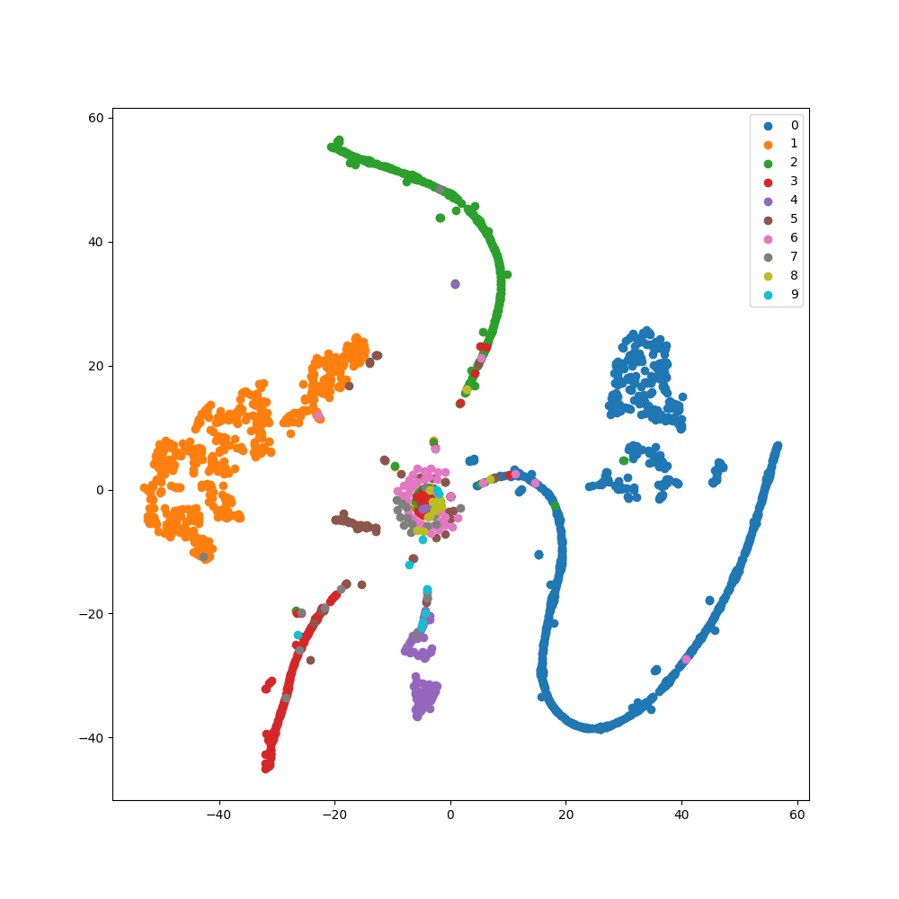
</div>
<div style="display:flex; flex-direction:column; flex:1; align-items:center; max-width:33%;">
<p>ROC Curve</p>
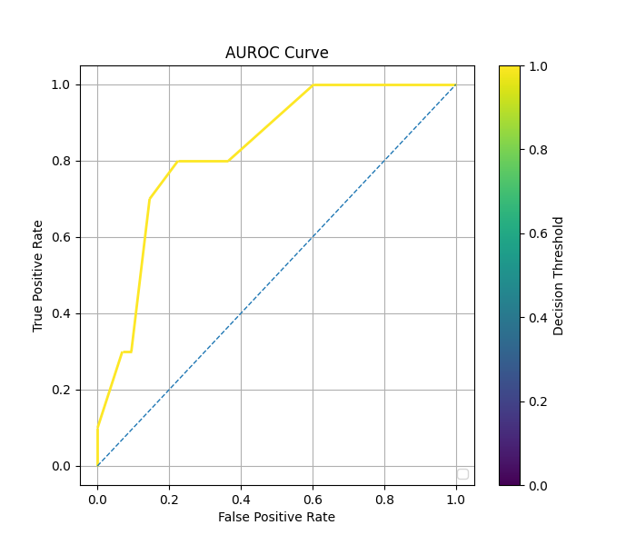
</div>  
</div>

### Balanced Fit with Autoencoder (representation layer = -3)

```python
    # Assume the data loading, model construction and compilation as shown in regular fit above.
    
    model.balanced_fit(
        x_train,
        y_train,
        stratify_batches=True,
        validation_split=0.2,
        batch_size=512,
        epochs=10000,
        callbacks=[
            keras.callbacks.EarlyStopping(patience=20, restore_best_weights=True)
        ]
    )
```

<div style="display: flex; max-width: 100%;">
<div style="display:flex; flex-direction:column; flex:1; align-items:center; max-width:33%;">
<p>Confusion Matrix</p>

</div>
<div style="display:flex; flex-direction:column; flex:1; align-items:center; max-width:33%;">
<p>TSNE Visualization</p>
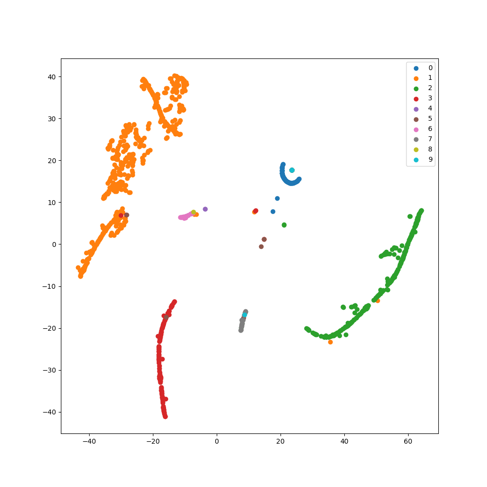
</div>
<div style="display:flex; flex-direction:column; flex:1; align-items:center; max-width:33%;">
<p>ROC Curve</p>

</div>  
</div>

### cRT Fit with Autoencoder (representation layer = -3)

```python
    # Assume the data loading, model construction and compilation as shown in regular fit above.
    
    model.override_second_stage_fit_parameters(
        epochs=10000,
        callbacks=[
            keras.callbacks.EarlyStopping(patience=20, restore_best_weights=True)
        ]
    )
    
    model.cRT_fit(
        x_train,
        y_train,
        stratify_batches=True,
        validation_split=0.2,
        batch_size=512,
        epochs=10000,
        callbacks=[
            keras.callbacks.EarlyStopping(patience=20, restore_best_weights=True)
        ]
    )
```

<div style="display: flex; max-width: 100%;">
<div style="display:flex; flex-direction:column; flex:1; align-items:center; max-width:33%;">
<p>Confusion Matrix</p>
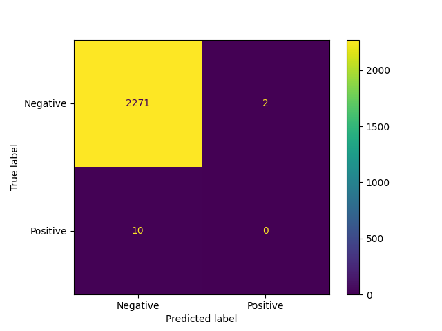
</div>
<div style="display:flex; flex-direction:column; flex:1; align-items:center; max-width:33%;">
<p>TSNE Visualization</p>
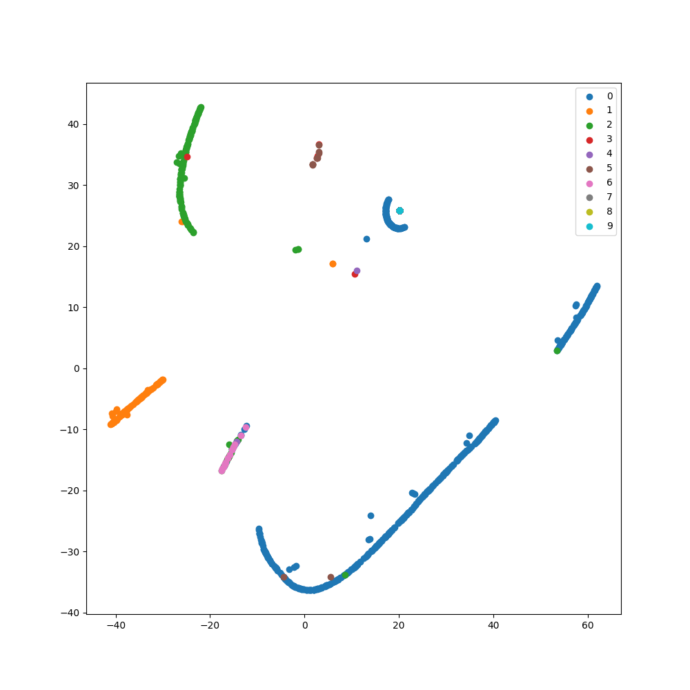
</div>
<div style="display:flex; flex-direction:column; flex:1; align-items:center; max-width:33%;">
<p>ROC Curve</p>
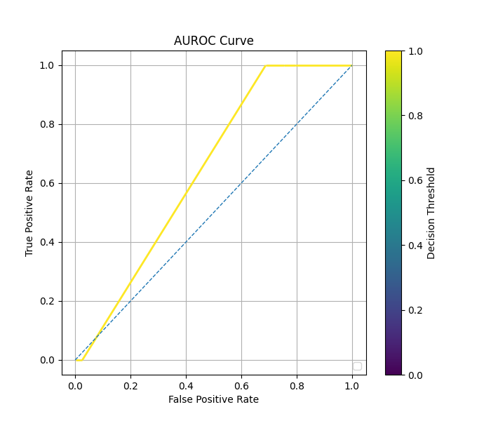
</div>  
</div>

### Comparison of Performance

For the table below, frequent samples refer to samples whose label
$y \neq 9$, and rare samples refer to samples whose label $y = 9$.

| Method   | Autoencoder? | Representation Layer Index | Epochs     | Time (s)  | Rare Class F1 Score (threshold=0.5) | AUC     |
|----------|--------------|----------------------------|------------|-----------|-------------------------------------|---------|
| Regular  | No           | N/A                        | $212$      | $45.86$   | $0.0$                               | $0.929$ |
| Regular  | Yes          | $-2$                       | $2948$     | $1124.91$ | $0.3749$                            | $0.874$ |
| Regular  | Yes          | $-3$                       | $1782$     | $1500.41$ | $0.0$                               | $0.829$ |
| Balanced | No           | N/A                        | $228$      | $50.17$   | $0.240$                             | $0.953$ |
| Balanced | Yes          | $-2$                       | $1671$     | $697.92$  | $0.341$                             | $0.956$ |
| Balanced | Yes          | $-3$                       | $911$      | $555.05$  | $0.0$                               | $0.724$ |
| cRT      | No           | $-2$                       | $311/54$   | $80.53$   | $0.270$                             | $0.946$ |
| cRT      | No           | $-3$                       | $268/89$   | $78.88$   | $0.421$                             | $0.959$ |
| cRT      | Yes          | $-2$                       | $695/355$  | $373.81$  | $0.179$                             | $0.960$ |
| cRT      | Yes          | $-3$                       | $1665/97$  | $1113.20$ | $0.0$                               | $0.643$ |

See also: [Comparison of Fit Methods](comparison_of_fit_methods_image.md)