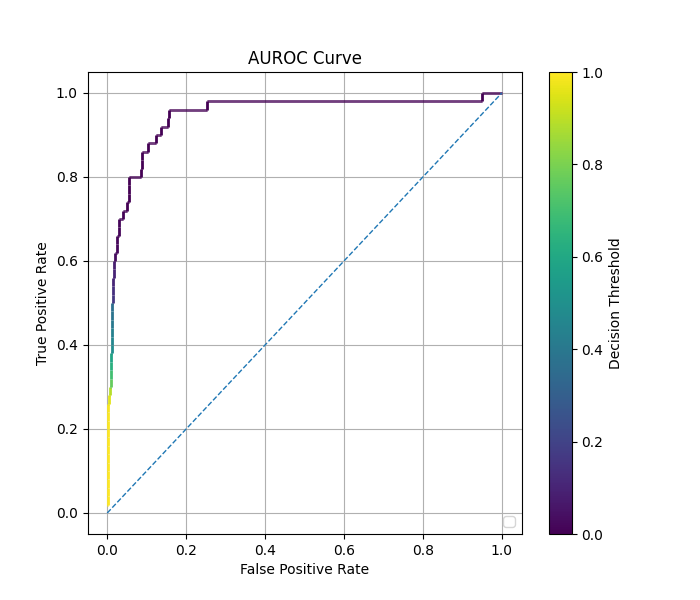
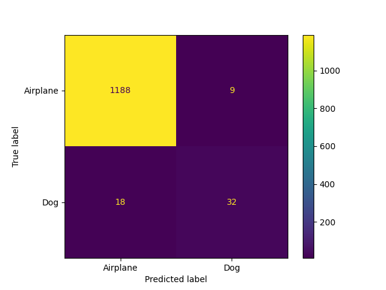
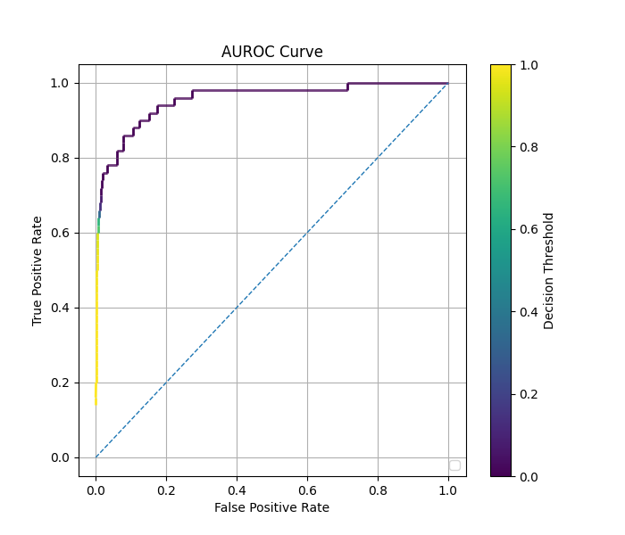
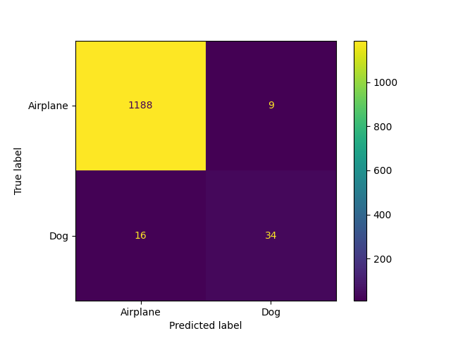
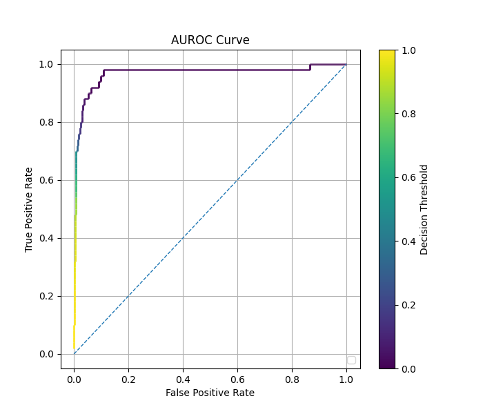

# Comparison of Autoencoder: Regular vs. Balanced vs. cRT Fit on Image Classification

### Regular Fit with Autoencoder (1:24 Imbalance)

### Balanced Fit with Autoencoder (1:24 Imbalance)

### cRT Fit with Autoencoder (1:24 Imbalance)

### Comparison of Methods

| Method   | Autoencoder? | Epochs    | Time (s) | Rare Class F1 Score (threshold=0.5) | AUC     |
|----------|--------------|-----------|----------|-------------------------------------|---------|
| Regular  | No           | $30$      | $9.95$   | $0.0$                               | $0.844$ |
| Regular  | Yes          | $600$     | $75.5$   | $0.463$                             | $0.945$ |
| Balanced | No           | $30$      | $13.24$  | $0.092$                             | $0.855$ |
| Balanced | Yes          | $600$     | $164.2$  | $0.667$                             | $0.957$ |
| cRT      | No           | $30/15$   | $14.05$  | $0.079$                             | $0.836$ |
| cRT      | Yes          | $600/300$ | $161.1$  | $0.713$                             | $0.969$ |

See also: [Comparison of Fit Methods](comparison_of_fit_methods_image.md)