# Comparison of Autoencoder: Regular vs. Balanced vs. cRT Fit on Tabular Data Classification

### Regular Fit with Autoencoder (representation layer = -2)

```python
    # Assume data has already been loaded into x_train, y_train, x_test, and y_test
    input_shape = x_train.shape[1:]

    inputs = keras.Input(shape=input_shape)
    x = layers.Dense(18, activation='relu')(inputs)
    x = layers.Dense(9, activation='relu')(x)
    x = layers.Flatten()(x)
    x = layers.Dense(6, activation='relu')(x)
    x = layers.Flatten()(x)
    output = layers.Dense(1, activation='sigmoid')(x)

    model = imbal.classification.Model(inputs=inputs, outputs=output)

    model.compile(
        loss="binary_crossentropy",
        optimizer=keras.optimizers.Adam(learning_rate=4e-4),
        metrics=["accuracy"],
        generate_decoder_branch=True,
        representation_layer_index=-2
    )
    
    model.fit(
        x_train,
        y_train,
        stratify_batches=True,
        validation_split=0.2,
        batch_size=512,
        epochs=10000,
        callbacks=[
            keras.callbacks.EarlyStopping(patience=20, restore_best_weights=True)
        ]
    )
```

<div style="display: flex; max-width: 100%;">
<div style="display:flex; flex-direction:column; flex:1; align-items:center; max-width:33%;">
<p>Confusion Matrix</p>
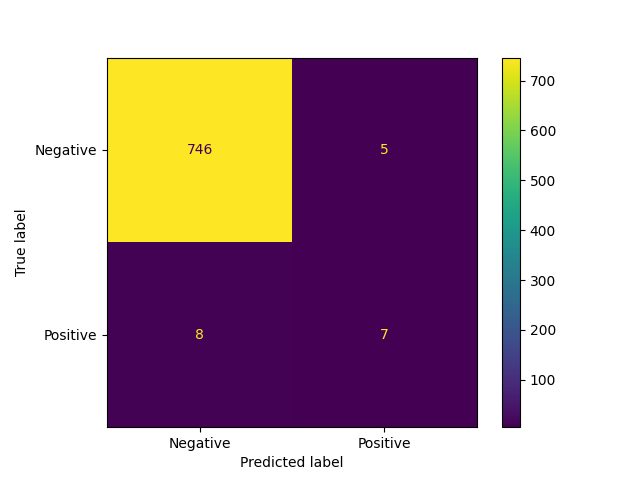
</div>
<div style="display:flex; flex-direction:column; flex:1; align-items:center; max-width:33%;">
<p>TSNE Visualization</p>
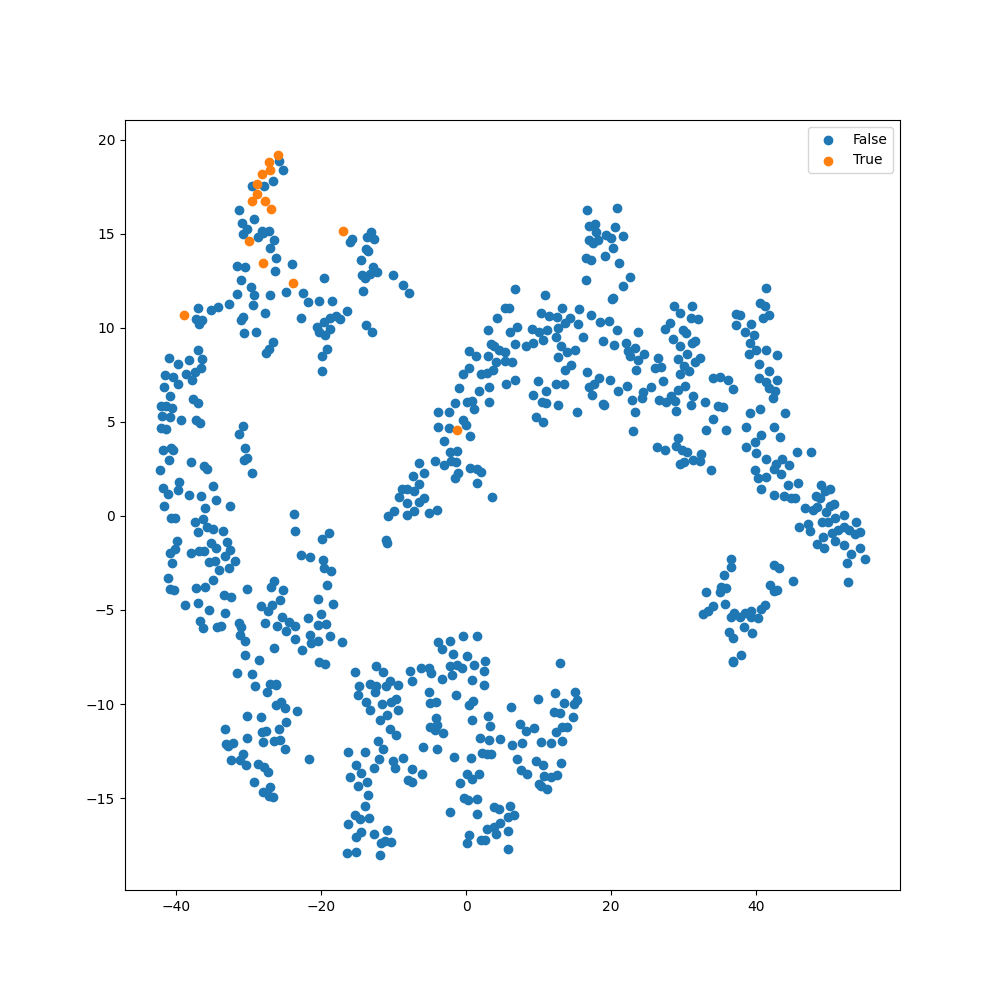
</div>
<div style="display:flex; flex-direction:column; flex:1; align-items:center; max-width:33%;">
<p>ROC Curve</p>
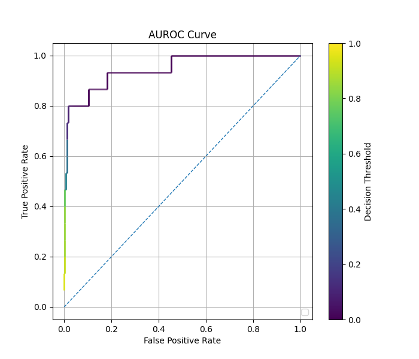
</div>  
</div>

### Balanced Fit with Autoencoder (representation layer = -2)

```python
    # Assume the data loading, model construction and compilation as shown in regular fit above.
    
    model.balanced_fit(
        x_train,
        y_train,
        stratify_batches=True,
        validation_split=0.2,
        batch_size=512,
        epochs=10000,
        callbacks=[
            keras.callbacks.EarlyStopping(patience=20, restore_best_weights=True)
        ]
    )
```

<div style="display: flex; max-width: 100%;">
<div style="display:flex; flex-direction:column; flex:1; align-items:center; max-width:33%;">
<p>Confusion Matrix</p>
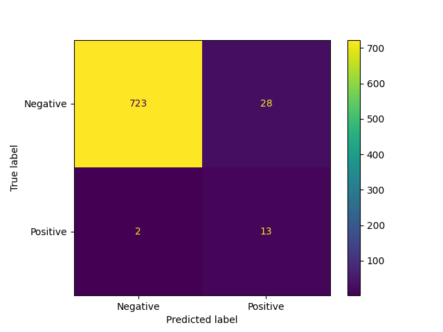
</div>
<div style="display:flex; flex-direction:column; flex:1; align-items:center; max-width:33%;">
<p>TSNE Visualization</p>
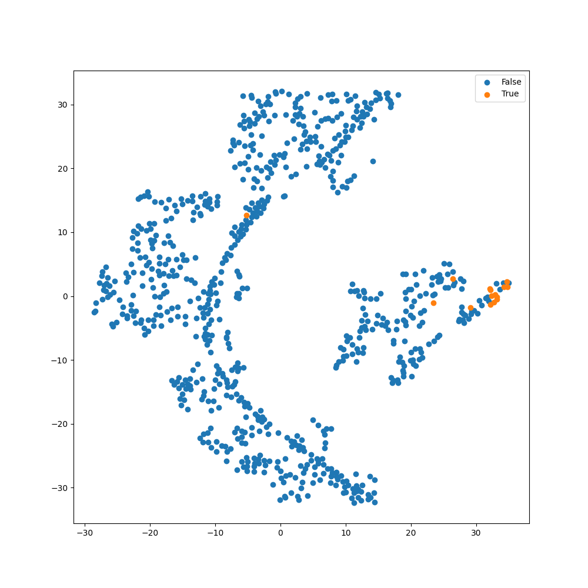
</div>
<div style="display:flex; flex-direction:column; flex:1; align-items:center; max-width:33%;">
<p>ROC Curve</p>
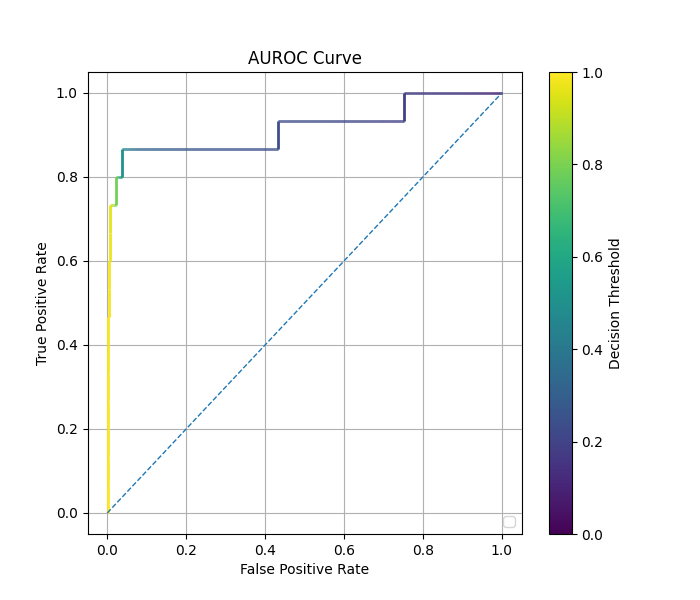
</div>  
</div>


### cRT Fit with Autoencoder  (representation layer = -2)

```python
    # Assume the data loading, model construction and compilation as shown in regular fit above.
    
    model.override_second_stage_fit_parameters(
        epochs=10000,
        callbacks=[
            keras.callbacks.EarlyStopping(patience=20, restore_best_weights=True)
        ]
    )

    model.cRT_fit(
        x_train,
        y_train,
        stratify_batches=True,
        validation_split=0.2,
        batch_size=512,
        epochs=10000,
        callbacks=[
            keras.callbacks.EarlyStopping(patience=20, restore_best_weights=True)
        ]
    )
```

<div style="display: flex; max-width: 100%;">
<div style="display:flex; flex-direction:column; flex:1; align-items:center; max-width:33%;">
<p>Confusion Matrix</p>

</div>
<div style="display:flex; flex-direction:column; flex:1; align-items:center; max-width:33%;">
<p>TSNE Visualization</p>
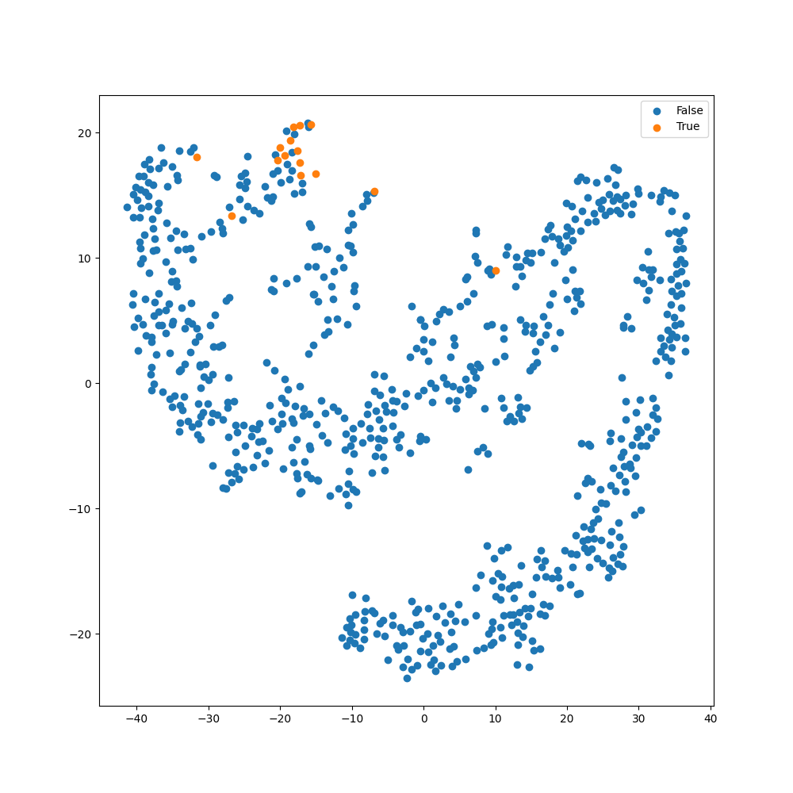
</div>
<div style="display:flex; flex-direction:column; flex:1; align-items:center; max-width:33%;">
<p>ROC Curve</p>
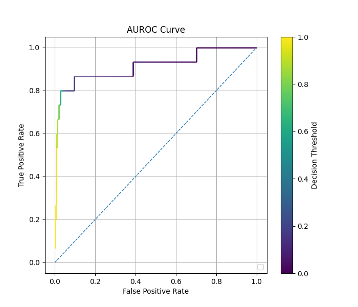
</div>  
</div>

### Regular Fit with Autoencoder (representation layer = -3)

```python
    # Assume the data loading and model construction as shown in regular fit above.
    
    model.compile(
        loss="binary_crossentropy",
        optimizer=keras.optimizers.Adam(learning_rate=4e-4),
        metrics=["accuracy"],
        generate_decoder_branch=True,
        representation_layer_index=-3
    )
    
    model.fit(
        x_train,
        y_train,
        stratify_batches=True,
        validation_split=0.2,
        batch_size=512,
        epochs=10000,
        callbacks=[
            keras.callbacks.EarlyStopping(patience=20, restore_best_weights=True)
        ]
    )
```

<div style="display: flex; max-width: 100%;">
<div style="display:flex; flex-direction:column; flex:1; align-items:center; max-width:33%;">
<p>Confusion Matrix</p>

</div>
<div style="display:flex; flex-direction:column; flex:1; align-items:center; max-width:33%;">
<p>TSNE Visualization</p>
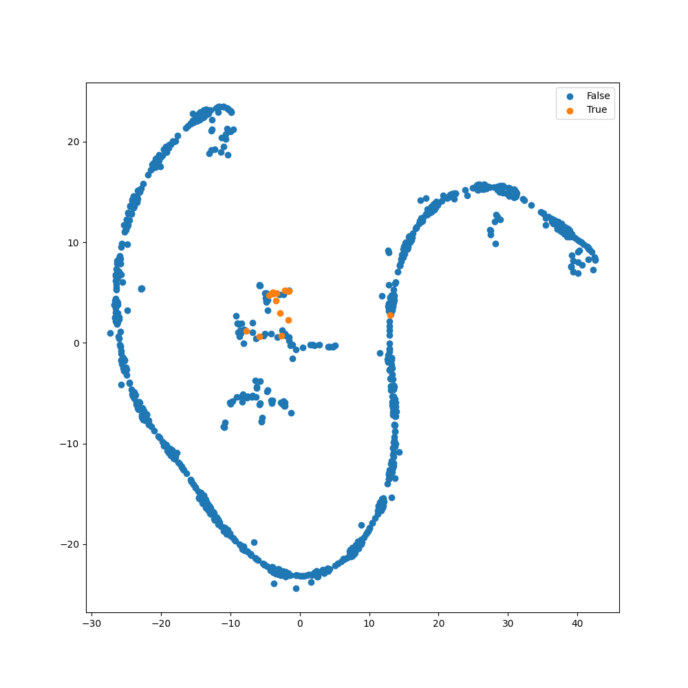
</div>
<div style="display:flex; flex-direction:column; flex:1; align-items:center; max-width:33%;">
<p>ROC Curve</p>
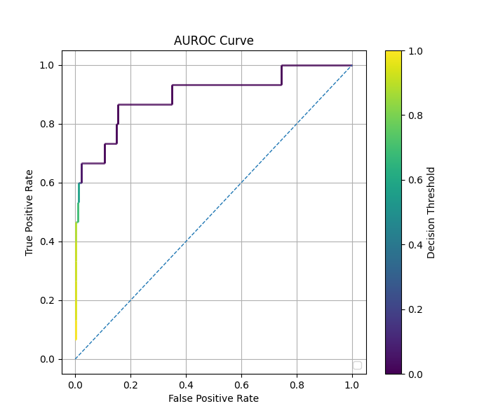
</div>  
</div>

### Balanced Fit with Autoencoder (representation layer = -3)

```python
    # Assume the data loading, model construction and compilation as shown in regular fit above.
    

    model.balanced_fit(
        x_train,
        y_train,
        stratify_batches=True,
        validation_split=0.2,
        batch_size=512,
        epochs=10000,
        callbacks=[
            keras.callbacks.EarlyStopping(patience=20, restore_best_weights=True)
        ]
    )
```

<div style="display: flex; max-width: 100%;">
<div style="display:flex; flex-direction:column; flex:1; align-items:center; max-width:33%;">
<p>Confusion Matrix</p>
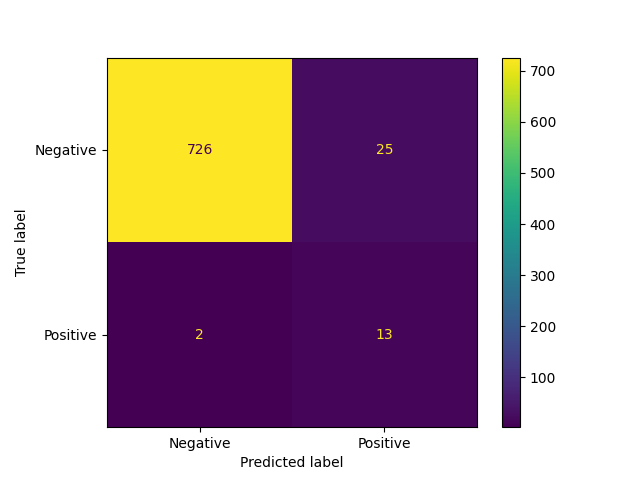
</div>
<div style="display:flex; flex-direction:column; flex:1; align-items:center; max-width:33%;">
<p>TSNE Visualization</p>
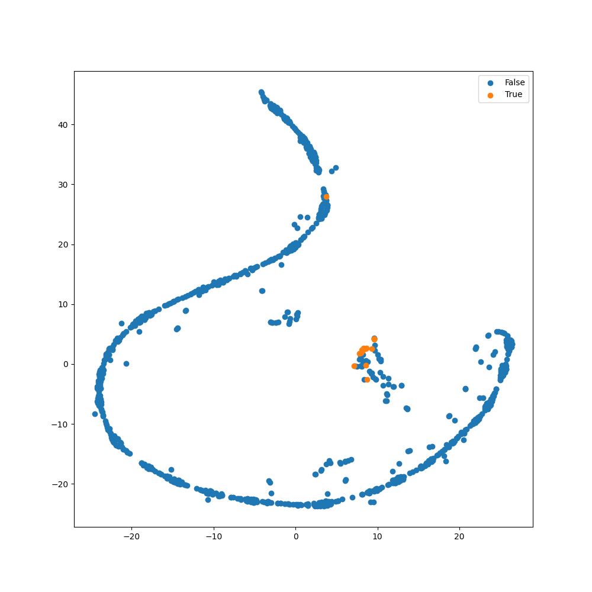
</div>
<div style="display:flex; flex-direction:column; flex:1; align-items:center; max-width:33%;">
<p>ROC Curve</p>
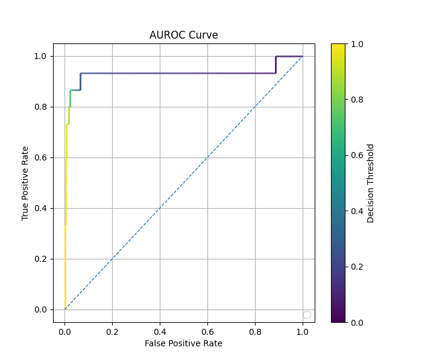
</div>  
</div>

### cRT Fit with Autoencoder (representation layer = -3)

```python
    # Assume the data loading, model construction and compilation as shown in regular fit above.
    
    model.override_second_stage_fit_parameters(
        epochs=10000,
        callbacks=[
            keras.callbacks.EarlyStopping(patience=20, restore_best_weights=True)
        ]
    )
    
    model.cRT_fit(
        x_train,
        y_train,
        stratify_batches=True,
        validation_split=0.2,
        batch_size=512,
        epochs=10000,
        callbacks=[
            keras.callbacks.EarlyStopping(patience=20, restore_best_weights=True)
        ]
    )
```

<div style="display: flex; max-width: 100%;">
<div style="display:flex; flex-direction:column; flex:1; align-items:center; max-width:33%;">
<p>Confusion Matrix</p>

</div>
<div style="display:flex; flex-direction:column; flex:1; align-items:center; max-width:33%;">
<p>TSNE Visualization</p>
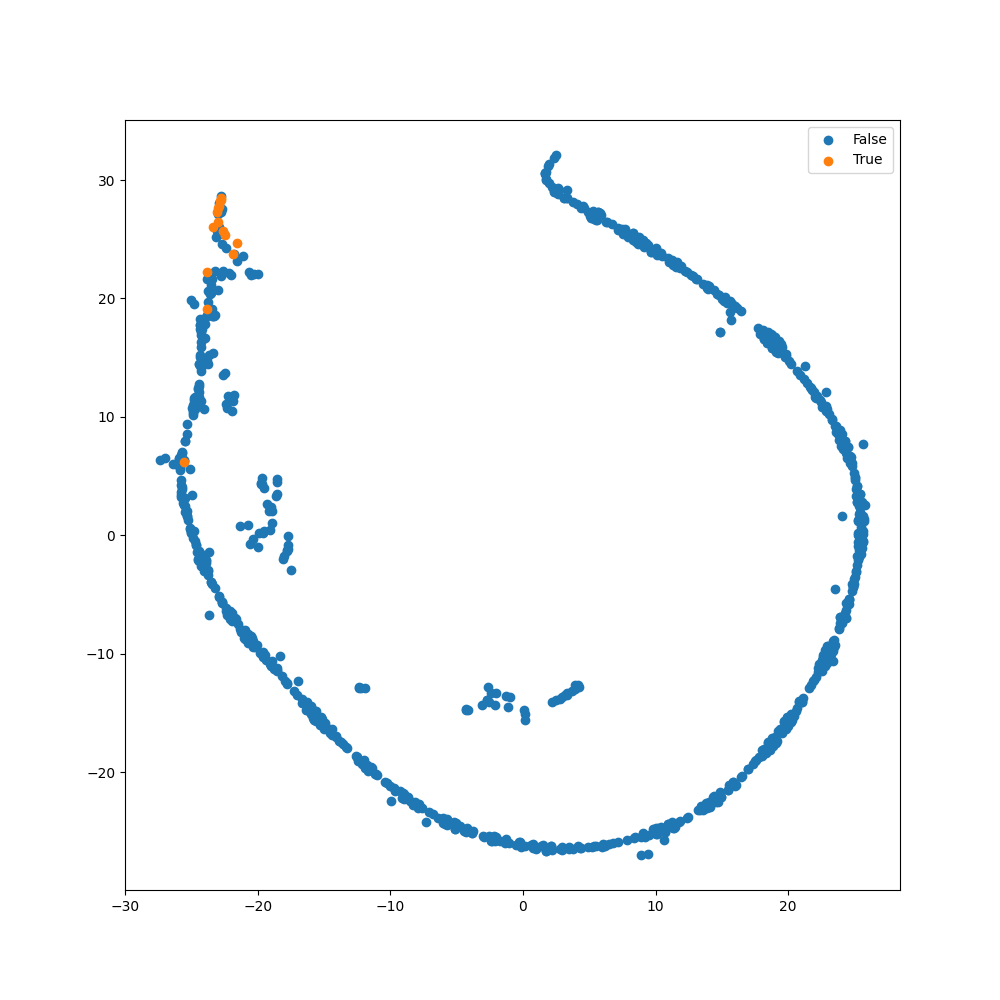
</div>
<div style="display:flex; flex-direction:column; flex:1; align-items:center; max-width:33%;">
<p>ROC Curve</p>
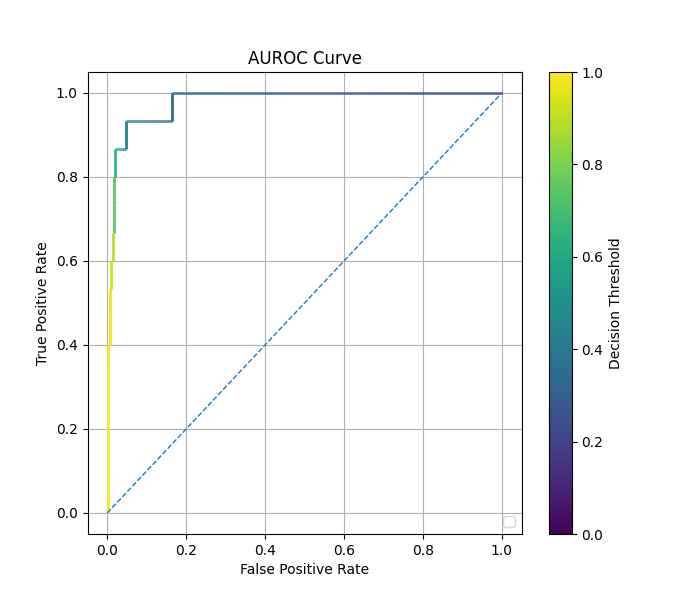
</div>  
</div>

### Comparison of Methods

| Method   | Autoencoder? | Representation Layer Index | Epochs     | Time (s) | Rare Class F1 Score (threshold=0.5) | AUC     |
|----------|--------------|----------------------------|------------|----------|-------------------------------------|---------|
| Regular  | No           | N/A                        | $388$      | $26.10$  | $0.222$                             | $0.959$ |
| Regular  | Yes          | $-2$                       | $1145$     | $90.42$  | $0.519$                             | $0.946$ |
| Regular  | Yes          | $-3$                       | $912$      | $62.22$  | $0.500$                             | $0.896$ |
| Balanced | No           | N/A                        | $135$      | $8.92$   | $0.189$                             | $0.931$ |
| Balanced | Yes          | $-2$                       | $334$      | $23.93$  | $0.464$                             | $0.914$ |
| Balanced | Yes          | $-3$                       | $401$      | $27.98$  | $0.491$                             | $0.931$ |
| cRT      | No           | $-2$                       | $373/53$   | $26.20$  | $0.429$                             | $0.975$ |
| cRT      | No           | $-3$                       | $317/35$   | $21.80$  | $0.081$                             | $0.947$ |
| cRT      | Yes          | $-2$                       | $1342/306$ | $114.49$ | $0.480$                             | $0.914$ |
| cRT      | Yes          | $-3$                       | $1195/140$ | $91.19$  | $0.473$                             | $0.979$ |

See also: [Comparison of Fit Methods](comparison_of_fit_methods_tabular.md)