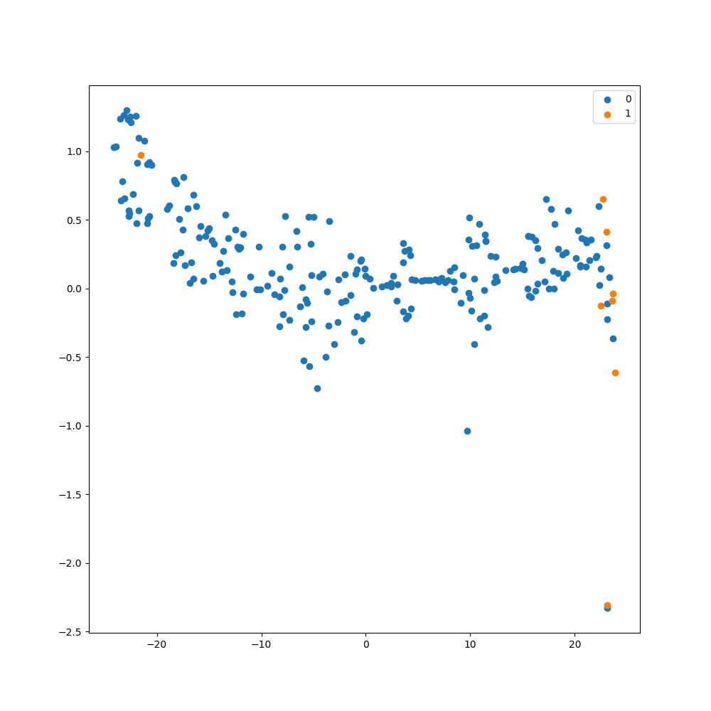
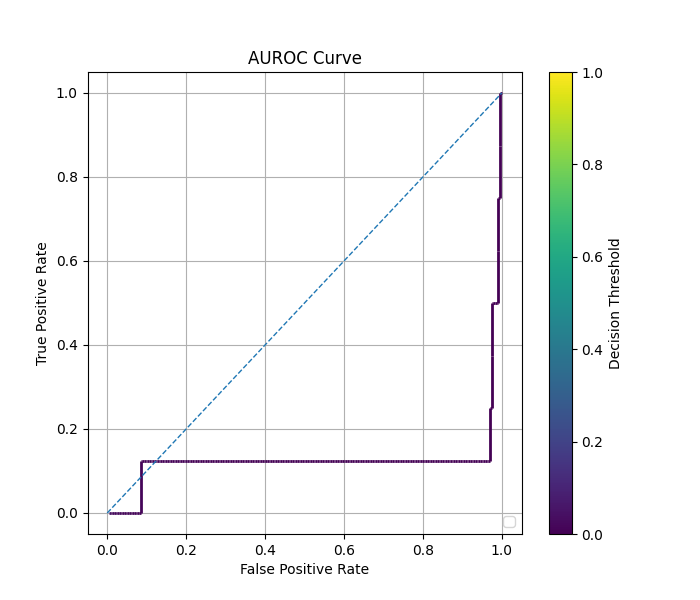
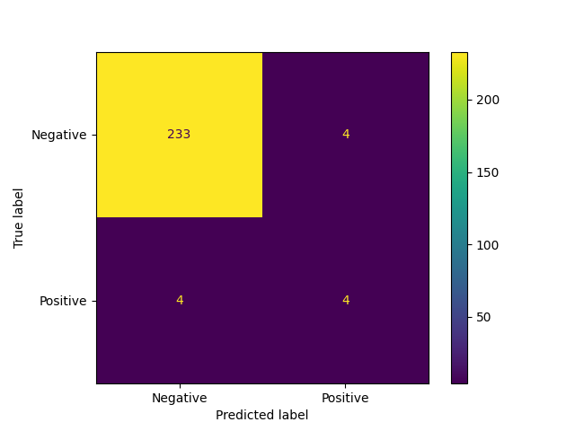
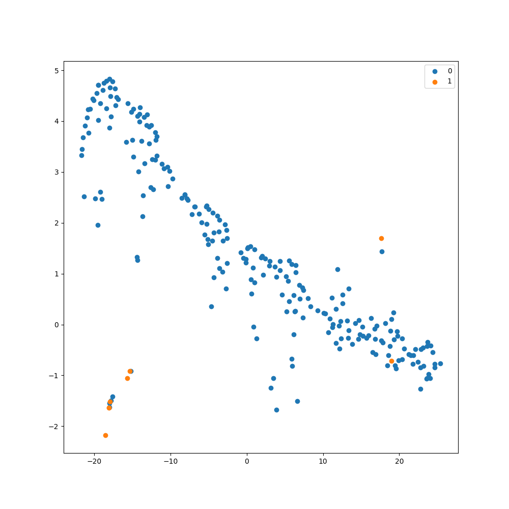
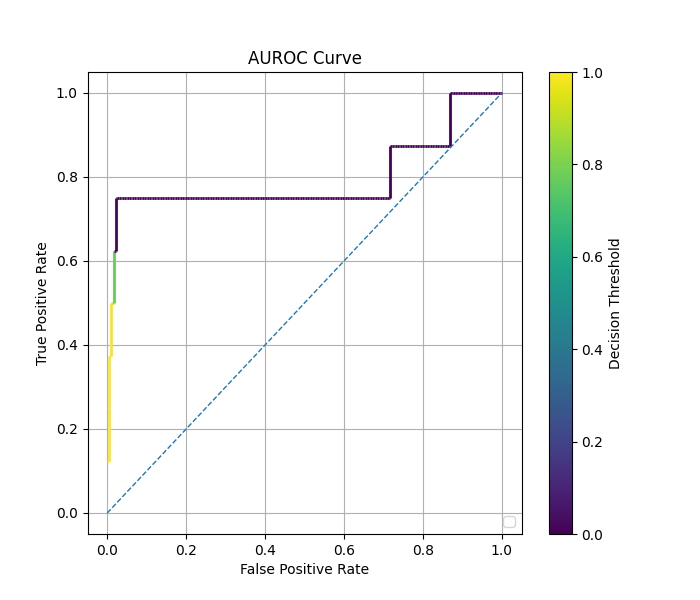
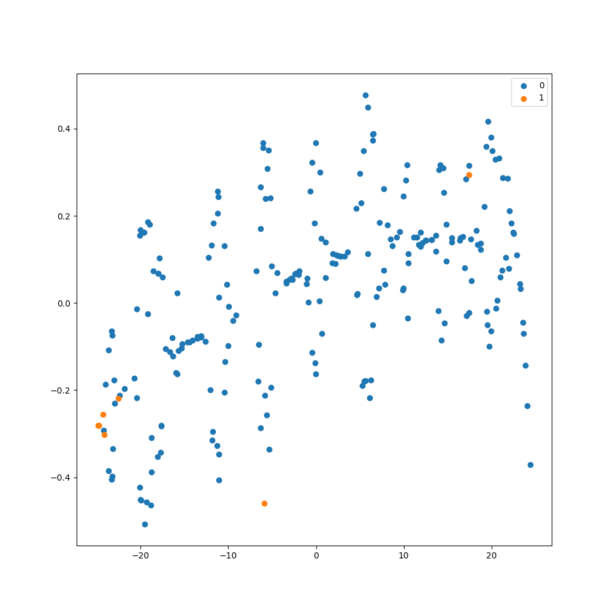
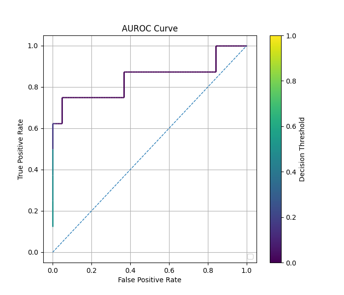

# Comparison of Autoencoder: Regular vs. Balanced vs. cRT Fit on Tabular Data

### Regular Fit with Autoencoder

Confusion Matrix

TSNE Visualization

ROC Curve

  

### Balanced Fit with Autoencoder

Confusion Matrix

TSNE Visualization

ROC Curve

  

### cRT Fit with Autoencoder

Confusion Matrix

TSNE Visualization

ROC Curve

  

### Comparison of Methods

| Method   | Autoencoder? | Time (s) | Rare Class F1 Score (threshold=0.5) | AUC     |
|----------|--------------|----------|-------------------------------------|---------|
| Regular  | No           | $38.36$  | $0.0$                               | $0.883$ |
| Regular  | Yes          | $49.71$  | $0.0$                               | $0.094$ |
| Balanced | No           | $41.34$  | $0.500$                             | $0.537$ |
| Balanced | Yes          | $51.31$  | $0.625$                             | $0.832$ |
| cRT      | No           | $57.93$  | $0.625$                             | $0.858$ |
| cRT      | Yes          | $72.42$  | $0.0$                               | $0.866$ |

See also: [Comparison of Fit Methods](comparison_of_fit_methods_tabular.md)