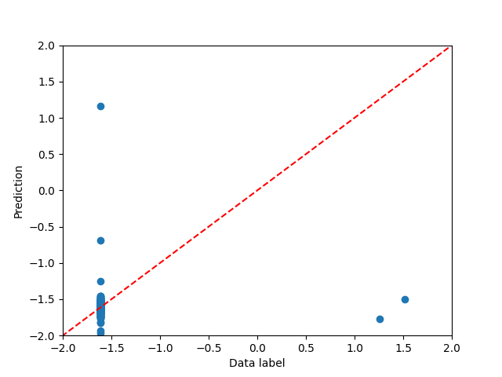
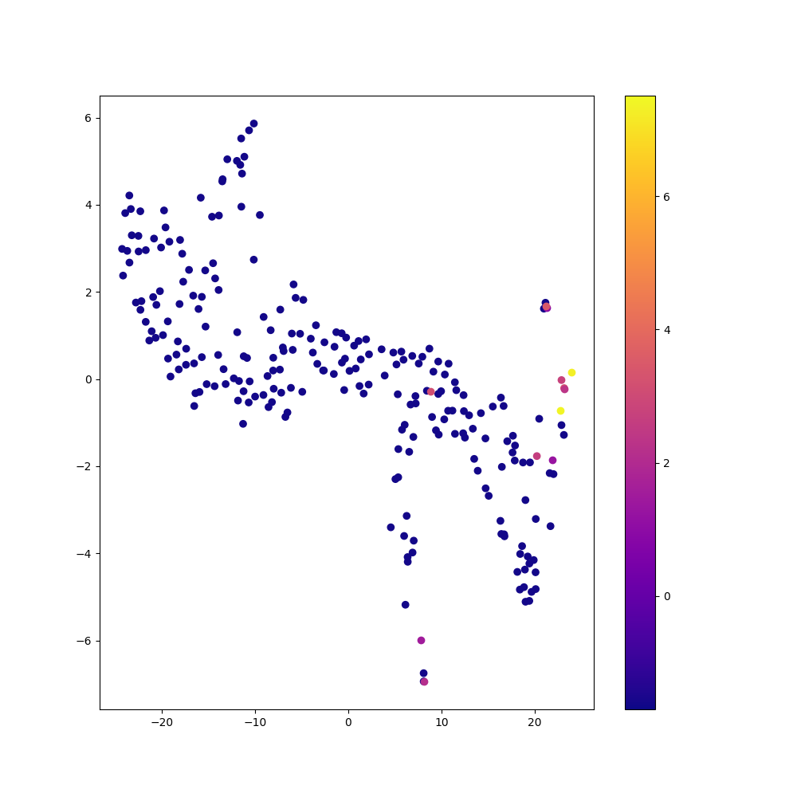
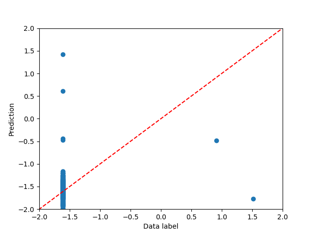
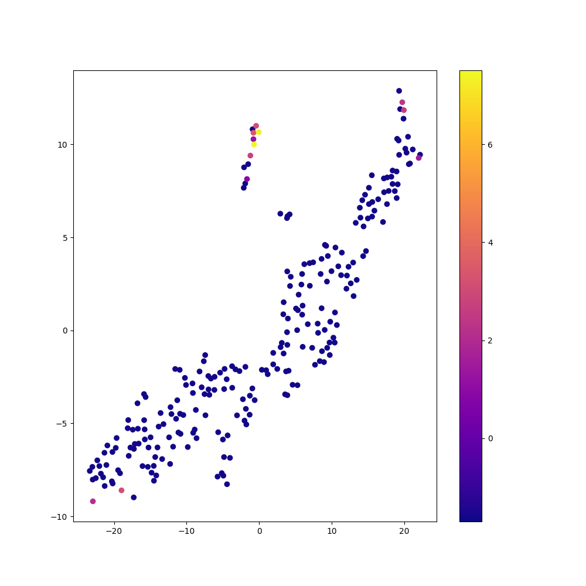
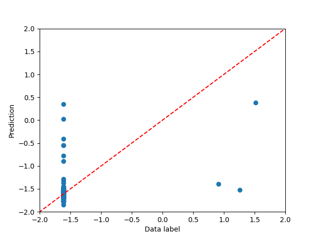
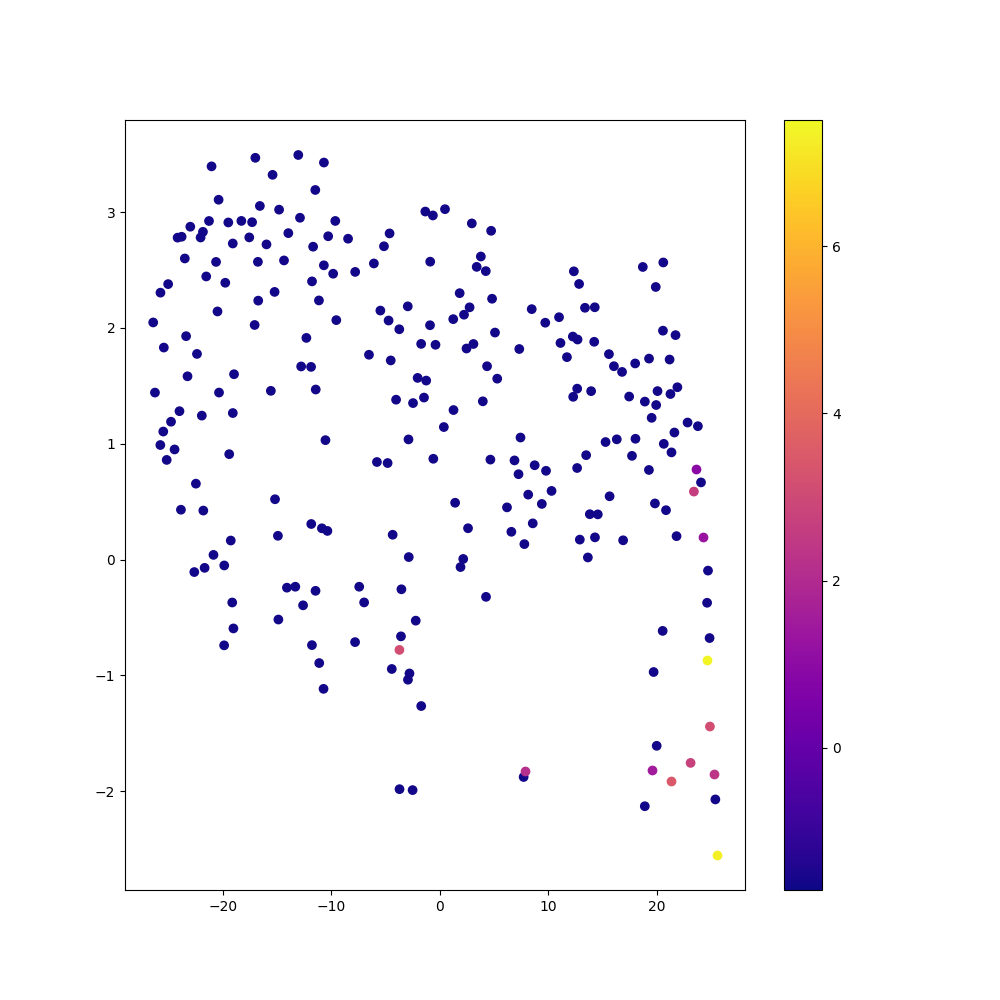

# Comparison of Autoencoder: Regular vs. Balanced vs. Decoupled Fit

### Regular Fit with Autoencoder

### Balanced Fit with Autoencoder

### Decoupled Fit with Autoencoder

### Comparison of Methods

| Method    | Autoencoder? | Time (s) | Frequent Sample MSE | Rare Sample MSE |
|-----------|--------------|----------|---------------------|-----------------|
| Regular   | No           | $???$    | $7.5761$            | $0.6142$        |
| Regular   | Yes          | $???$    | $3.5838$            | $1.0461$        |
| Balanced  | No           | $???$    | $6.2100$            | $1.0090$        |
| Balanced  | Yes          | $???$    | $1.9362$            | $1.0344$        |
| Decoupled | No           | $???$    | $1.4113$            | $0.9988$        |
| Decoupled | Yes          | $???$    | $5.2932$            | $0.7171$        |

See also: [Comparison of Fit Methods](comparison_of_fit_methods_tabular.md)