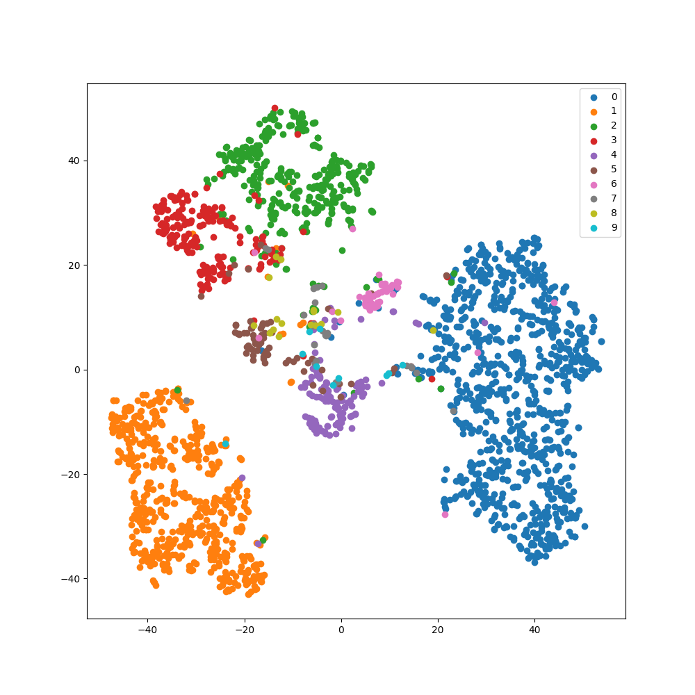
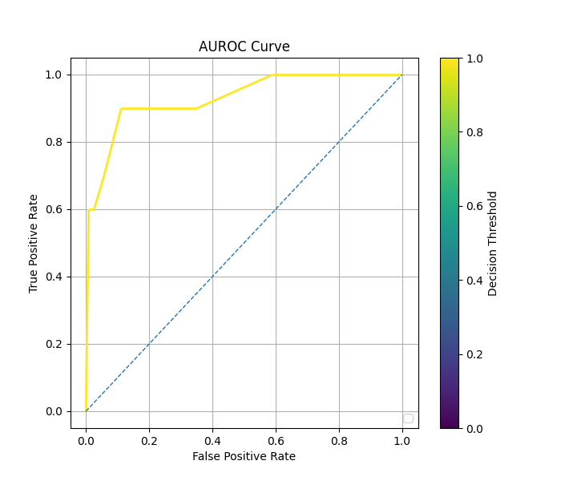
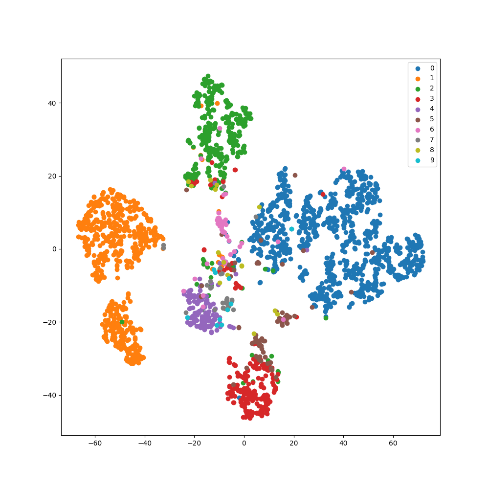
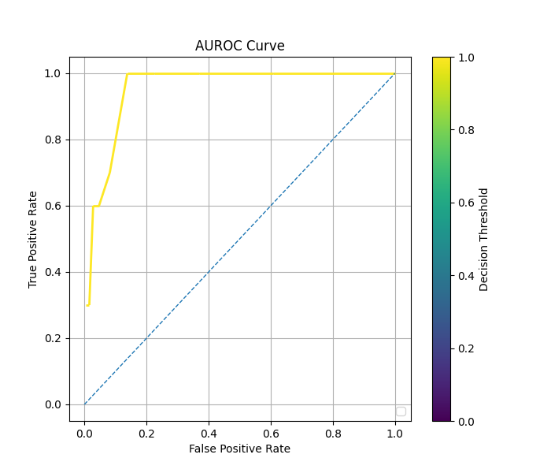
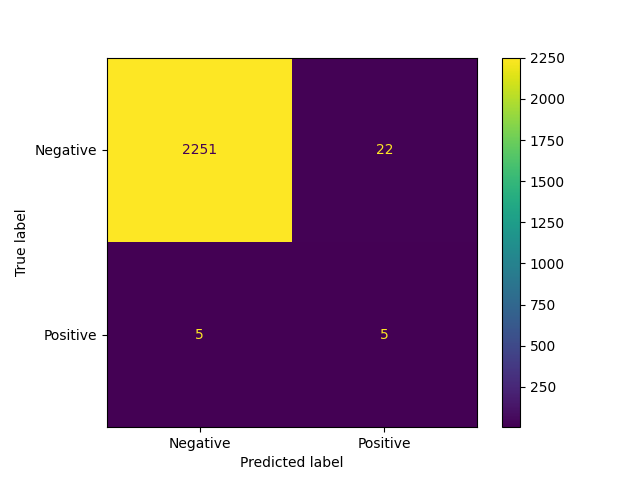
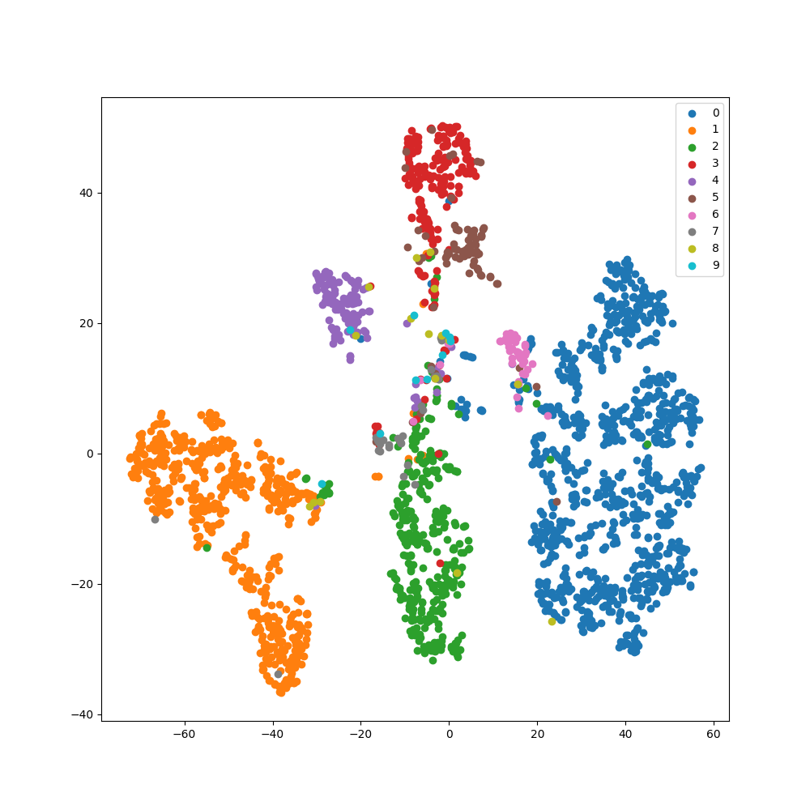
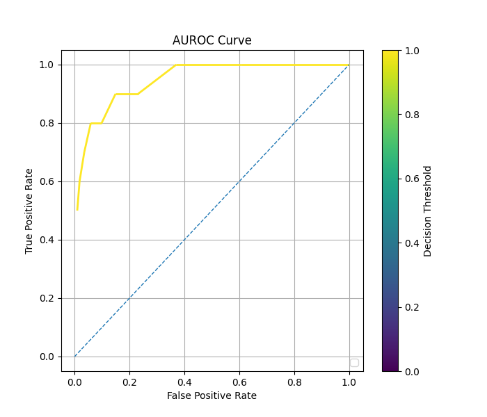
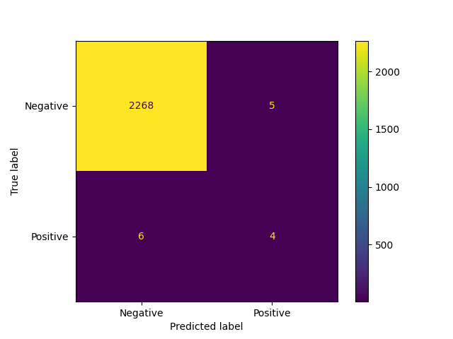
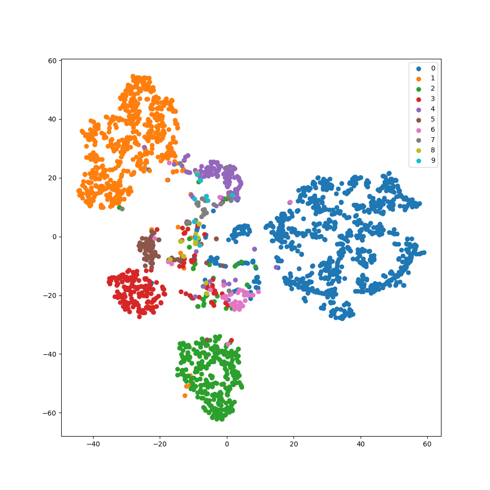
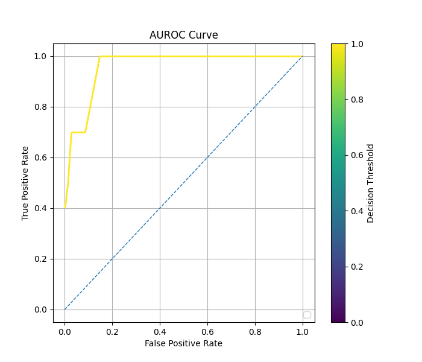

# Comparison of Methods: Regular vs. Balanced vs. cRT Fit on Image Classification

Below is a comparison of [decoupled fit](cRT_fit.md) and [balanced fit](balanced_fit.md)
to a standard, unbalanced fit, and a weight-balanced
fit of a subset of the [MNIST dataset](https://keras.io/api/datasets/mnist/), with
data redistributed to match the following distribution:
- Class 0: 4532 samples
- Class 1: 2747 samples
- Class 2: 1665 samples
- Class 3: 1009 samples
- Class 4: 611 samples
- Class 5: 371 samples
- Class 6: 225 samples
- Class 7: 136 samples
- Class 8: 82 samples
- Class 9: 50 samples

Each comparison below has three plots, showing a confusion matrix, TSNE
visualization of the latent space of the trained model for the example, and
a plot of the ROC curve for that model's predictions on test data. At the
end of each scenario is a comparison of the AUC and F1 score for the
rare class in the data imbalance. F1 scores are calculated using a
threshold of $0.5$.

### Regular Fit

```python
    inputs = keras.Input(shape=(28,28,1))
    x = layers.Conv2D(8, (3, 3), strides=(2, 2), activation='relu', padding='same')(inputs)
    x = layers.Conv2D(16, (3, 3), strides=(2, 2), activation='relu', padding='same')(x)
    x = layers.Flatten()(x)
    x = layers.Dense(16, activation='relu')(x)
    x = layers.Flatten()(x)
    output = layers.Dense(10, activation='softmax')(x)

    model = imbal.classification.Model(inputs=inputs, outputs=output)

    model.compile(
        loss="sparse_categorical_crossentropy",
        optimizer=keras.optimizers.Adam(learning_rate=1e-4),
        metrics=["accuracy"]
    )
    
    model.fit(
        x_train,
        y_train,
        stratify_batches=True,
        validation_split=0.2,
        batch_size=512,
        epochs=10000,
        callbacks=[
            keras.callbacks.EarlyStopping(patience=20, restore_best_weights=True)
        ]
    )
```

<div style="display: flex; max-width: 100%;">
<div style="display:flex; flex-direction:column; flex:1; align-items:center; max-width:33%;">
<p>Confusion Matrix</p>

</div>
<div style="display:flex; flex-direction:column; flex:1; align-items:center; max-width:33%;">
<p>TSNE Visualization</p>

</div>
<div style="display:flex; flex-direction:column; flex:1; align-items:center; max-width:33%;">
<p>ROC Curve</p>

</div>  
</div>

### Balanced Fit

```python
    # Assume the data loading, model construction and compilation as shown in regular fit above.
    model.balanced_fit(
        x_train,
        y_train,
        stratify_batches=True,
        validation_split=0.2,
        batch_size=512,
        epochs=10000,
        callbacks=[
            keras.callbacks.EarlyStopping(patience=20, restore_best_weights=True)
        ]
    )
```

<div style="display: flex; max-width: 100%;">
<div style="display:flex; flex-direction:column; flex:1; align-items:center; max-width:33%;">
<p>Confusion Matrix</p>

</div>
<div style="display:flex; flex-direction:column; flex:1; align-items:center; max-width:33%;">
<p>TSNE Visualization</p>

</div>
<div style="display:flex; flex-direction:column; flex:1; align-items:center; max-width:33%;">
<p>ROC Curve</p>

</div>  
</div>

### cRT Fit / Decoupled Fit (representation layer = -2)

```python
    # Assume the data loading and model construction as shown in regular fit above
    model.compile(
        loss="sparse_categorical_crossentropy",
        optimizer=keras.optimizers.Adam(learning_rate=1e-4),
        metrics=["accuracy"],
        representation_layer_index=-2
    )
    
    model.override_second_stage_fit_parameters(
        epochs=10000,
        callbacks=[
            keras.callbacks.EarlyStopping(patience=20, restore_best_weights=True)
        ]
    )
    
    model.cRT_fit(
        x_train,
        y_train,
        stratify_batches=True,
        validation_split=0.2,
        batch_size=512,
        epochs=10000,
        callbacks=[
            keras.callbacks.EarlyStopping(patience=20, restore_best_weights=True)
        ]
    )
```
    
<div style="display: flex; max-width: 100%;">
<div style="display:flex; flex-direction:column; flex:1; align-items:center; max-width:33%;">
<p>Confusion Matrix</p>

</div>
<div style="display:flex; flex-direction:column; flex:1; align-items:center; max-width:33%;">
<p>TSNE Visualization</p>

</div>
<div style="display:flex; flex-direction:column; flex:1; align-items:center; max-width:33%;">
<p>ROC Curve</p>

</div>  
</div>

### cRT Fit / Decoupled Fit (representation layer = -3)

```python
    # Assume the data loading and model construction as shown in regular fit above
    model.compile(
        loss="sparse_categorical_crossentropy",
        optimizer=keras.optimizers.Adam(learning_rate=1e-4),
        metrics=["accuracy"],
        representation_layer_index=-3
    )
    
    model.override_second_stage_fit_parameters(
        epochs=10000,
        callbacks=[
            keras.callbacks.EarlyStopping(patience=20, restore_best_weights=True)
        ]
    )
    
    model.cRT_fit(
        x_train,
        y_train,
        stratify_batches=True,
        validation_split=0.2,
        batch_size=512,
        epochs=10000,
        callbacks=[
            keras.callbacks.EarlyStopping(patience=20, restore_best_weights=True)
        ]
    )
```
    
<div style="display: flex; max-width: 100%;">
<div style="display:flex; flex-direction:column; flex:1; align-items:center; max-width:33%;">
<p>Confusion Matrix</p>

</div>
<div style="display:flex; flex-direction:column; flex:1; align-items:center; max-width:33%;">
<p>TSNE Visualization</p>

</div>
<div style="display:flex; flex-direction:column; flex:1; align-items:center; max-width:33%;">
<p>ROC Curve</p>

</div>  
</div>

### Comparison of Performance

For the table below, frequent samples refer to samples whose label
$y \neq 9$, and rare samples refer to samples whose label $y = 9$.

| Method                            | Epochs   | Time (s) | Rare Class F1 Score | Rare Class AUC |
|-----------------------------------|----------|----------|---------------------|----------------|
| Regular                           | $212$    | $45.86$  | $0.0$               | $0.929$*       |
| Balanced                          | $228$    | $50.17$  | $0.240$             | $0.953$*       |
| cRT (representation layer = $-2$) | $311/54$ | $80.53$  | $0.270$             | $0.946$*       |
| cRT (representation layer = $-3$) | $268/89$ | $78.88$  | $0.421$             | $0.959$        |

*Some examples have a high AUC, but low F1 score. This is because F1 score
is calculated with a decision threshold of 0.5, while some models can achieve
a near perfect separation of the two classes by using a lower decision
threshold. In these cases, almost all classes are predicted to be of the frequent class,
resulting in an F1 score of nearly 0 for the rare class, while maintaining that a
lower decision threshold exists such that a near perfect separation of classes is achieved,
allowing for a AUROC close to 1.

See also: [Comparison of Autoencoder Methods](comparison_of_ae_methods_image.md)