# Comparison of Methods: Regular vs. Balanced vs. Decoupled Fit on Image Data

Below is a comparison of [decoupled fit](cRT_fit.md) and [balanced fit](balanced_fit.md)
to a standard, unbalanced fit, and a weight-balanced
fit of a subset of the [CIFAR10 dataset](https://www.cs.toronto.edu/~kriz/cifar.html), picking on the dogs and airplane classes,
in two different data imbalance scenarios.

Each comparison below has three plots, showing a confusion matrix, TSNE
visualization of the latent space of the trained model for the example, and
a plot of the ROC curve for that model's predictions on test data. At the
end of each scenario is a comparison of the AUC and F1 score for the
rare class in the data imbalance. F1 scores are calculated using a
threshold of $0.5$.

## 1:24 Data Imbalance

### Regular Fit

```python
    model.compile(
        loss="categorical_crossentropy",
        optimizer=keras.optimizers.Adam(learning_rate=2e-5),
        metrics=["accuracy", 'F1Score', auc]
    )
    model.fit(
        x_train,
        y_train,
        batch_size=batch_size,
        epochs=epochs
    )
```
#### Regular Fit Results

<div style="display: flex; max-width: 100%;">
<div style="display:flex; flex-direction:column; flex:1; align-items:center; max-width:33%;">
<p>Confusion Matrix</p>
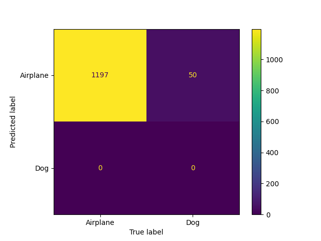
</div>
<div style="display:flex; flex-direction:column; flex:1; align-items:center; max-width:33%;">
<p>TSNE Visualization</p>
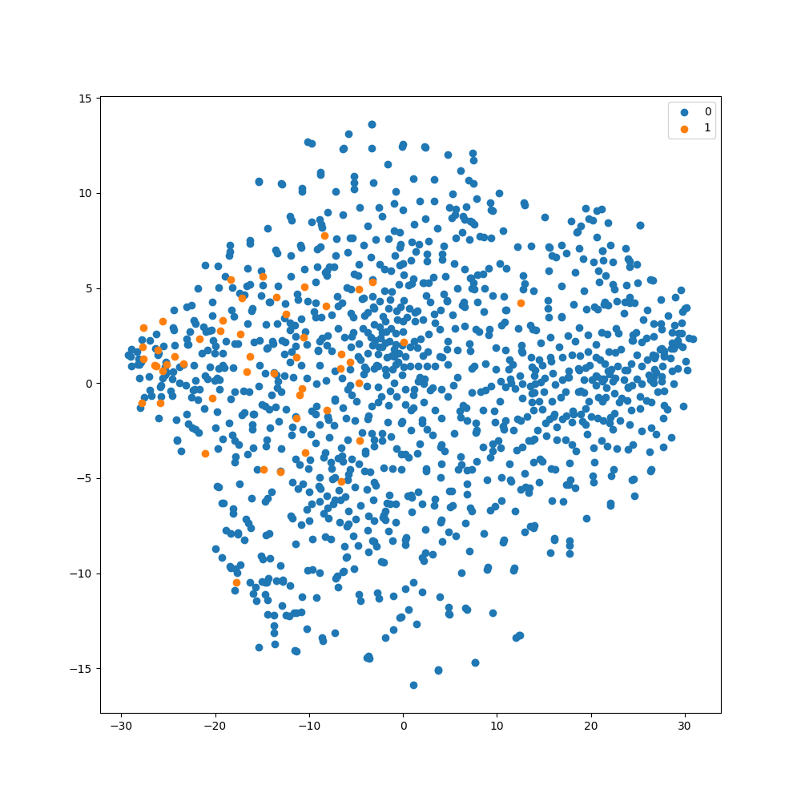
</div>
<div style="display:flex; flex-direction:column; flex:1; align-items:center; max-width:33%;">
<p>ROC Curve</p>
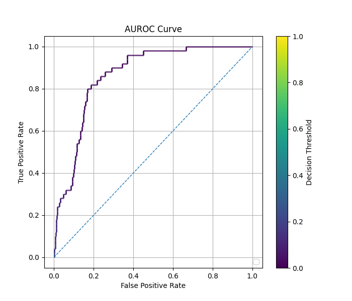
</div>  
</div>

### Balanced Fit

```python
    parameters = imbal.classification.wrap_model_compile_parameters(
        loss="categorical_crossentropy",
        optimizer=keras.optimizers.Adam(learning_rate=2e-5),
        metrics=["accuracy", 'F1Score', auc]
    )

    imbal.classification.balanced_fit(
        model,
        x_train,
        y_train,
        compile_parameters=parameters,
        epochs=epochs,
        batch_size=batch_size
    )
```

#### Balanced Fit Results

<div style="display: flex; max-width: 100%;">
<div style="display:flex; flex-direction:column; flex:1; align-items:center; max-width:33%;">
<p>Confusion Matrix</p>
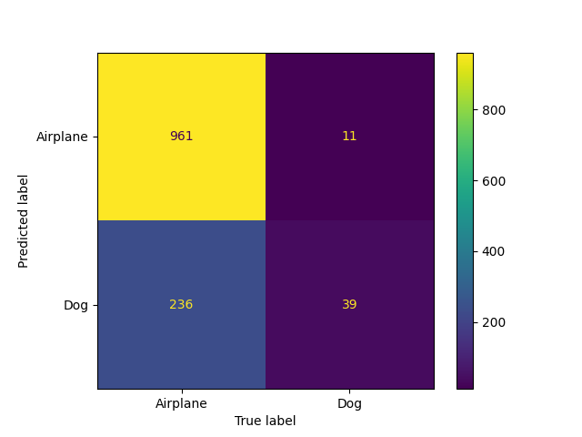
</div>
<div style="display:flex; flex-direction:column; flex:1; align-items:center; max-width:33%;">
<p>TSNE Visualization</p>
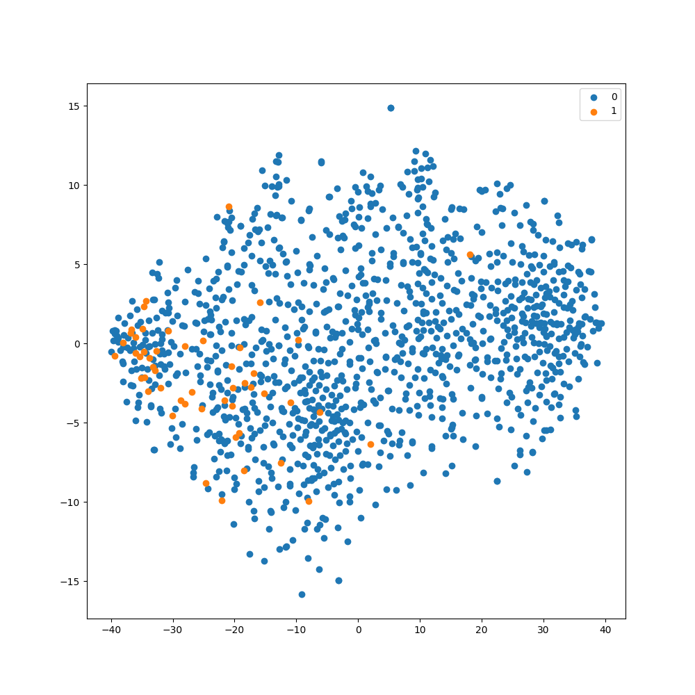
</div>
<div style="display:flex; flex-direction:column; flex:1; align-items:center; max-width:33%;">
<p>ROC Curve</p>
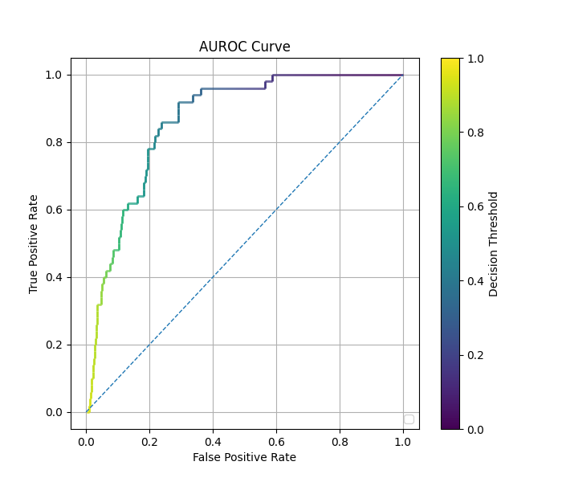
</div>  
</div>

### Decoupled Fit

```python
    parameters = imbal.classification.wrap_model_compile_parameters(
        loss="categorical_crossentropy",
        optimizer=keras.optimizers.Adam(learning_rate=2e-5),
        metrics=["accuracy", 'F1Score', auc]
    )

    imbal.classification.decoupled_fit(
        model,
        x_train,
        y_train,
        compile_parameters=parameters,
        epochs=epochs,
        batch_size=batch_size
    )
```

#### Decoupled Fit Results
    
<div style="display: flex; max-width: 100%;">
<div style="display:flex; flex-direction:column; flex:1; align-items:center; max-width:33%;">
<p>Confusion Matrix</p>

</div>
<div style="display:flex; flex-direction:column; flex:1; align-items:center; max-width:33%;">
<p>TSNE Visualization</p>
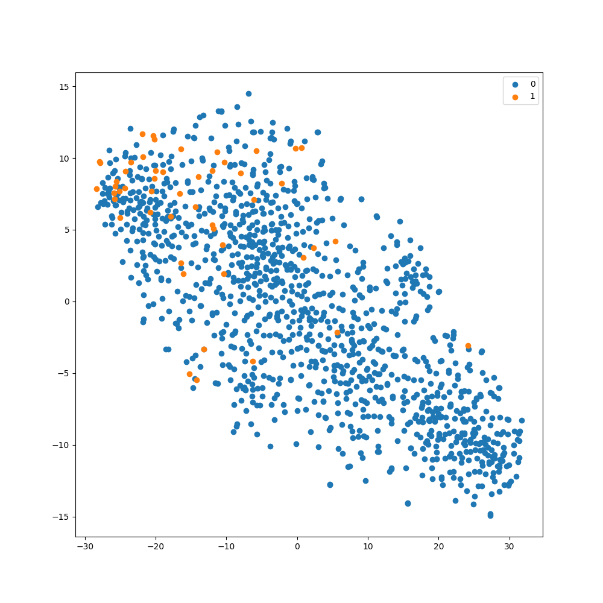
</div>
<div style="display:flex; flex-direction:column; flex:1; align-items:center; max-width:33%;">
<p>ROC Curve</p>
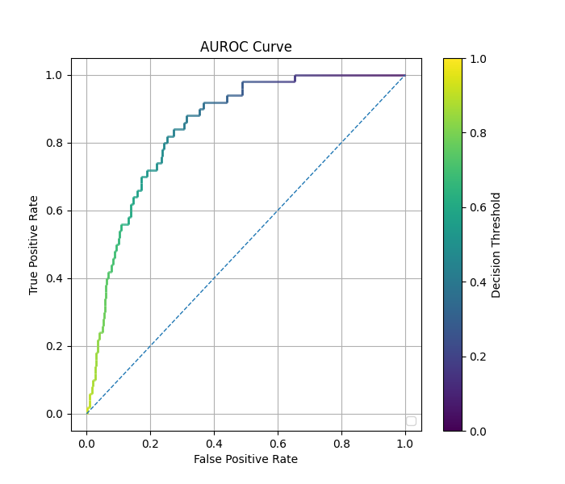
</div>  
</div>

### Comparison of Performance

| Method    | Time (s) | Rare Class F1 Score (threshold=0.5) | AUC      |
|-----------|----------|-------------------------------------|----------|
| Regular   | $9.95$   | $0.0$                               | $0.865$* |
| Balanced  | $13.24$  | $0.240$                             | $0.864$  |
| Decoupled | $14.05$  | $0.211$                             | $0.848$  |

*Some examples have a high AUC, but low F1 score. This is because F1 score
is calculated with a decision threshold of 0.5, while some models can achieve
a near perfect separation of the two classes by using a lower decision
threshold. In these cases, almost all classes are predicted to be of the frequent class,
resulting in an F1 score of nearly 0 for the rare class, while maintaining that a
lower decision threshold exists such that a near perfect separation of classes is achieved,
allowing for a AUROC close to 1.

## 1:120 Data Imbalance

### Regular Fit

```python
    model.compile(
        loss="categorical_crossentropy",
        optimizer=keras.optimizers.Adam(learning_rate=2e-5),
        metrics=["accuracy", 'F1Score', auc]
    )
    model.fit(
        x_train,
        y_train,
        batch_size=batch_size,
        epochs=epochs
    )
```
#### Regular Fit Results

<div style="display: flex; max-width: 100%;">
<div style="display:flex; flex-direction:column; flex:1; align-items:center; max-width:33%;">
<p>Confusion Matrix</p>
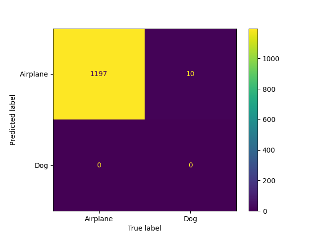
</div>
<div style="display:flex; flex-direction:column; flex:1; align-items:center; max-width:33%;">
<p>TSNE Visualization</p>
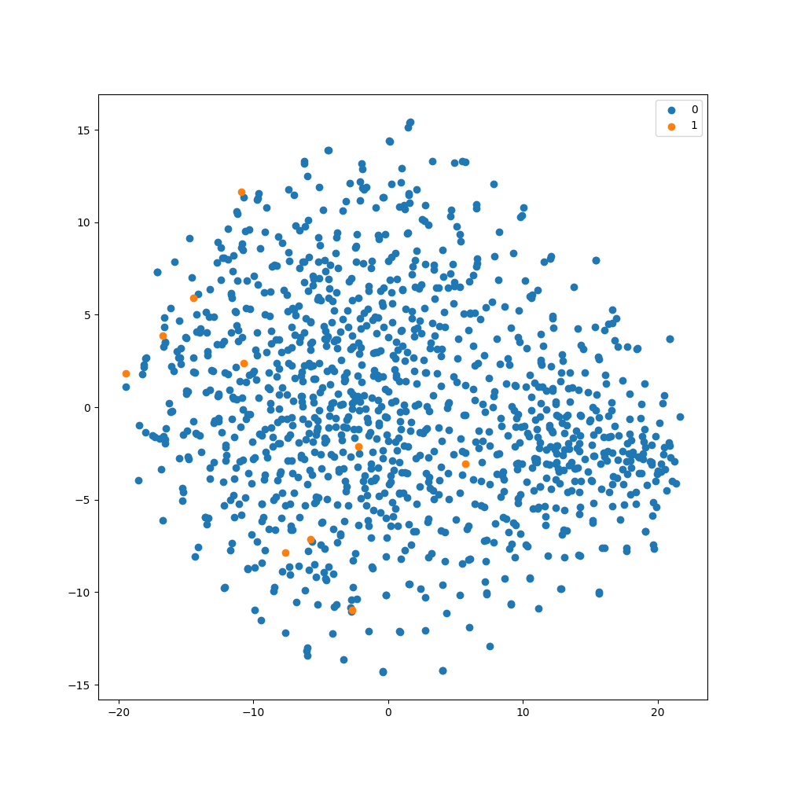
</div>
<div style="display:flex; flex-direction:column; flex:1; align-items:center; max-width:33%;">
<p>ROC Curve</p>
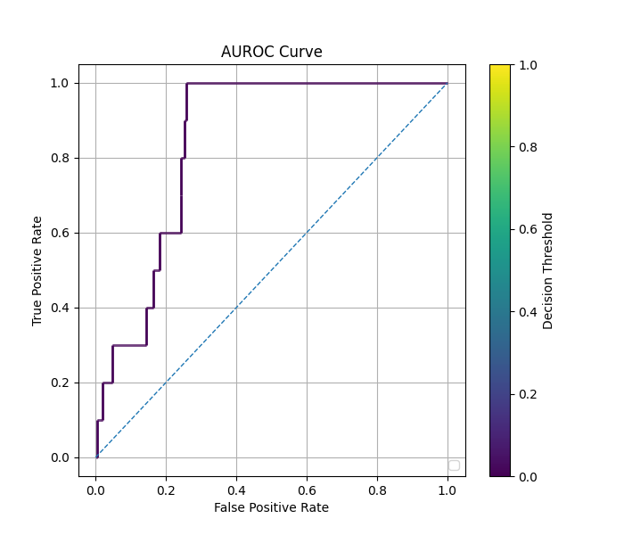
</div>  
</div>

### Balanced Fit

```python
    parameters = imbal.classification.wrap_model_compile_parameters(
        loss="categorical_crossentropy",
        optimizer=keras.optimizers.Adam(learning_rate=2e-5),
        metrics=["accuracy", 'F1Score', auc]
    )

    imbal.classification.balanced_fit(
        model,
        x_train,
        y_train,high
        compile_parameters=parameters,
        epochs=epochs,
        batch_size=batch_size
    )
```

#### Balanced Fit Results

<div style="display: flex; max-width: 100%;">
<div style="display:flex; flex-direction:column; flex:1; align-items:center; max-width:33%;">
<p>Confusion Matrix</p>
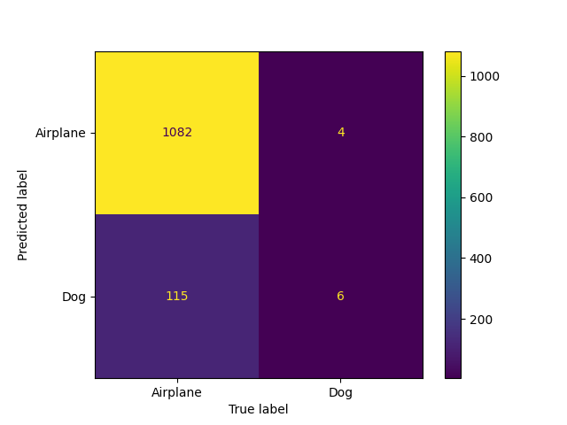
</div>
<div style="display:flex; flex-direction:column; flex:1; align-items:center; max-width:33%;">
<p>TSNE Visualization</p>
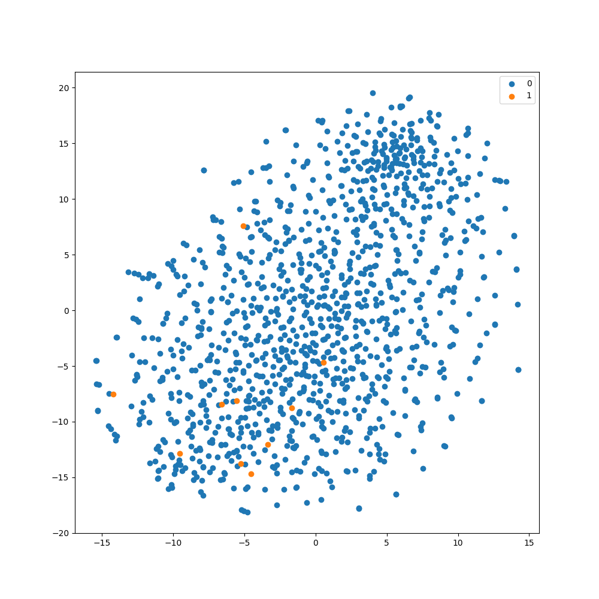
</div>
<div style="display:flex; flex-direction:column; flex:1; align-items:center; max-width:33%;">
<p>ROC Curve</p>
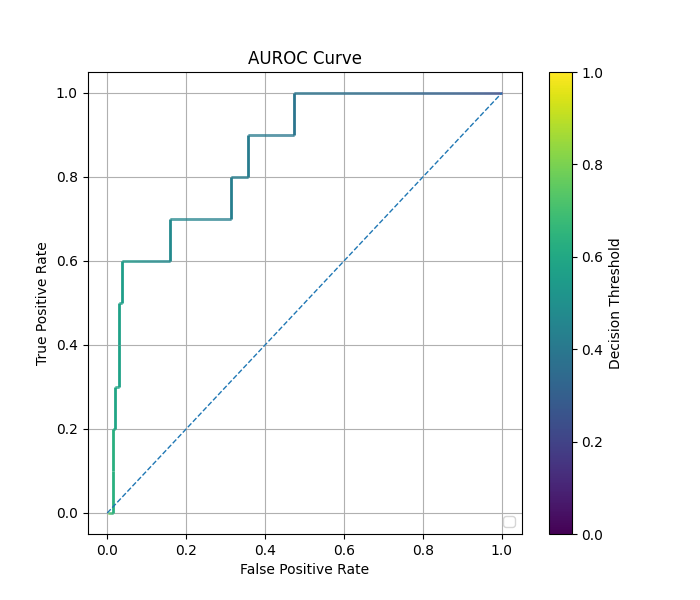
</div>  
</div>

### Decoupled Fit

```python
    parameters = imbal.classification.wrap_model_compile_parameters(
        loss="categorical_crossentropy",
        optimizer=keras.optimizers.Adam(learning_rate=2e-5),
        metrics=["accuracy", 'F1Score', auc]
    )

    imbal.classification.decoupled_fit(
        model,
        x_train,
        y_train,
        compile_parameters=parameters,
        epochs=epochs,
        batch_size=batch_size
    )
```

#### Decoupled Fit Results
    
<div style="display: flex; max-width: 100%;">
<div style="display:flex; flex-direction:column; flex:1; align-items:center; max-width:33%;">
<p>Confusion Matrix</p>
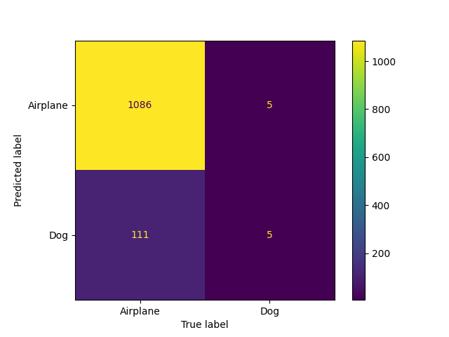
</div>
<div style="display:flex; flex-direction:column; flex:1; align-items:center; max-width:33%;">
<p>TSNE Visualization</p>
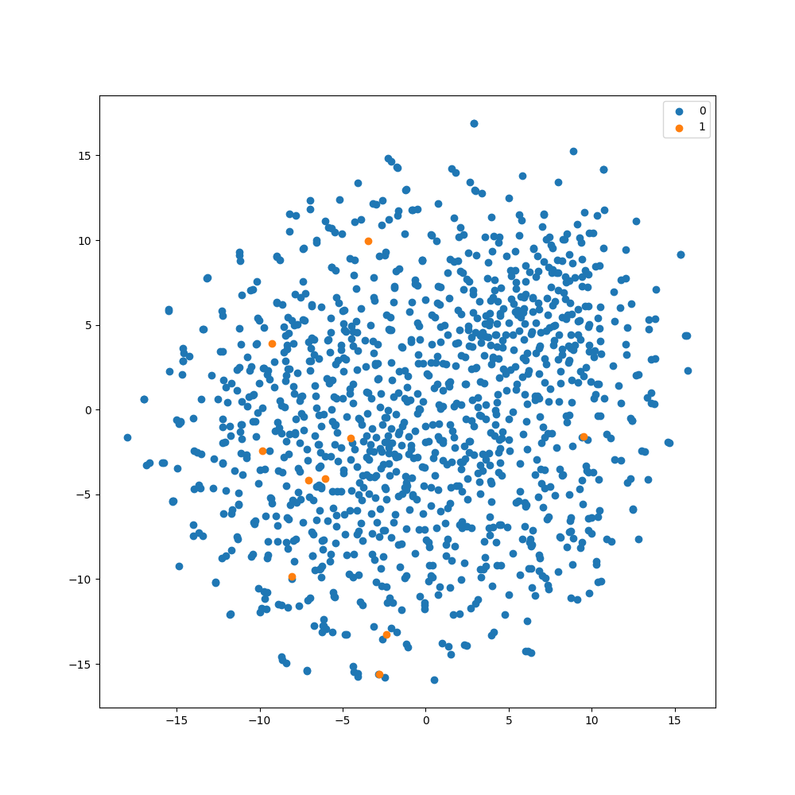
</div>
<div style="display:flex; flex-direction:column; flex:1; align-items:center; max-width:33%;">
<p>ROC Curve</p>
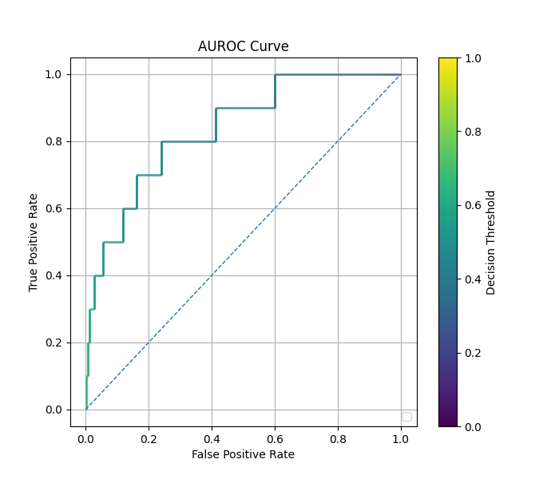
</div>  
</div>

### Comparison of Performance

| Method    | Time (s) | Rare Class F1 Score (threshold=0.5) | AUC      |
|-----------|----------|-------------------------------------|----------|
| Regular   | $9.95$   | $0.0$                               | $0.844$* |
| Balanced  | $13.24$  | $0.092$                             | $0.855$  |
| Decoupled | $14.05$  | $0.079$                             | $0.836$  |

*Some examples have a high AUC, but low F1 score. This is because F1 score
is calculated with a decision threshold of 0.5, while some models can achieve
a near perfect separation of the two classes by using a lower decision
threshold. In these cases, almost all classes are predicted to be of the frequent class,
resulting in an F1 score of nearly 0 for the rare class, while maintaining that a
lower decision threshold exists such that a near perfect separation of classes is achieved,
allowing for a AUROC close to 1.

See also: [Comparison of Autoencoder Methods](comparison_of_ae_methods_image.md)