# Comparison of Methods: Regular vs. Balanced vs. cRT Fit on Tabular Data Classification

Below is a comparison of the [classification.Model object's](model.md) `balanced_fit`
and `decoupled_fit` functions, and a standard fit where instances are equally weighted,
on the dataset shown below, which contains 1,531 training samples and 766 test samples.

### Training Data Distribution

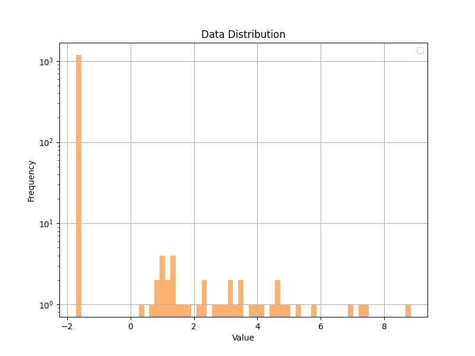

### Regular Fit

```python
    # Assume data has already been loaded into x_train, y_train, x_test, and y_test
    input_shape = x_train.shape[1:]

    inputs = keras.Input(shape=input_shape)
    x = layers.Dense(18, activation='relu')(inputs)
    x = layers.Dense(9, activation='relu')(x)
    x = layers.Flatten()(x)
    x = layers.Dense(6, activation='relu')(x)
    x = layers.Flatten()(x)
    output = layers.Dense(1, activation='sigmoid')(x)

    model = imbal.classification.Model(inputs=inputs, outputs=output)

    model.compile(
        loss="binary_crossentropy",
        optimizer=keras.optimizers.Adam(learning_rate=4e-4),
        metrics=["accuracy"]
    )
    
    model.fit(
        x_train,
        y_train,
        stratify_batches=True,
        validation_split=0.2,
        batch_size=512,
        epochs=10000,
        callbacks=[
            keras.callbacks.EarlyStopping(patience=20, restore_best_weights=True)
        ]
    )
```
    
<div style="display: flex; max-width: 100%;">
<div style="display:flex; flex-direction:column; flex:1; align-items:center; max-width:33%;">
<p>Confusion Matrix</p>
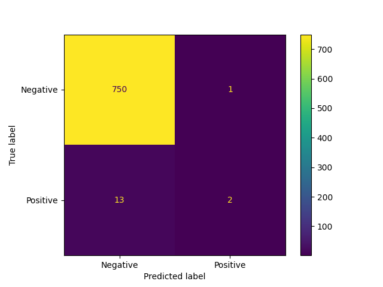
</div>
<div style="display:flex; flex-direction:column; flex:1; align-items:center; max-width:33%;">
<p>TSNE Visualization</p>
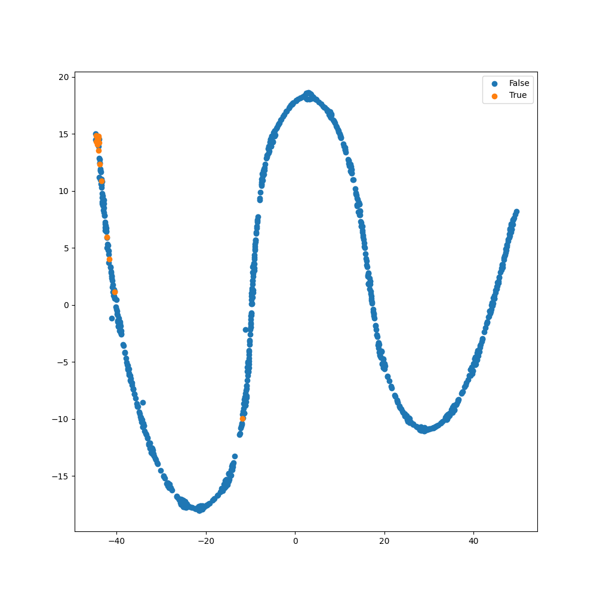
</div>
<div style="display:flex; flex-direction:column; flex:1; align-items:center; max-width:33%;">
<p>ROC Curve</p>
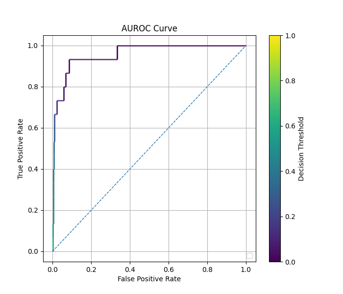
</div>  
</div>

### Balanced Fit

```python
    # Assume the data loading, model construction and compilation as shown in regular fit above.
    model.balanced_fit(
        x_train,
        y_train,
        stratify_batches=True,
        validation_split=0.2,
        batch_size=512,
        epochs=10000,
        callbacks=[
            keras.callbacks.EarlyStopping(patience=20, restore_best_weights=True)
        ]
    )
```

<div style="display: flex; max-width: 100%;">
<div style="display:flex; flex-direction:column; flex:1; align-items:center; max-width:33%;">
<p>Confusion Matrix</p>
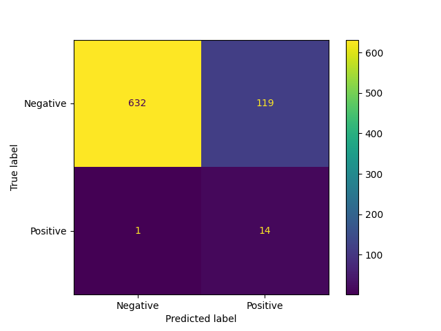
</div>
<div style="display:flex; flex-direction:column; flex:1; align-items:center; max-width:33%;">
<p>TSNE Visualization</p>
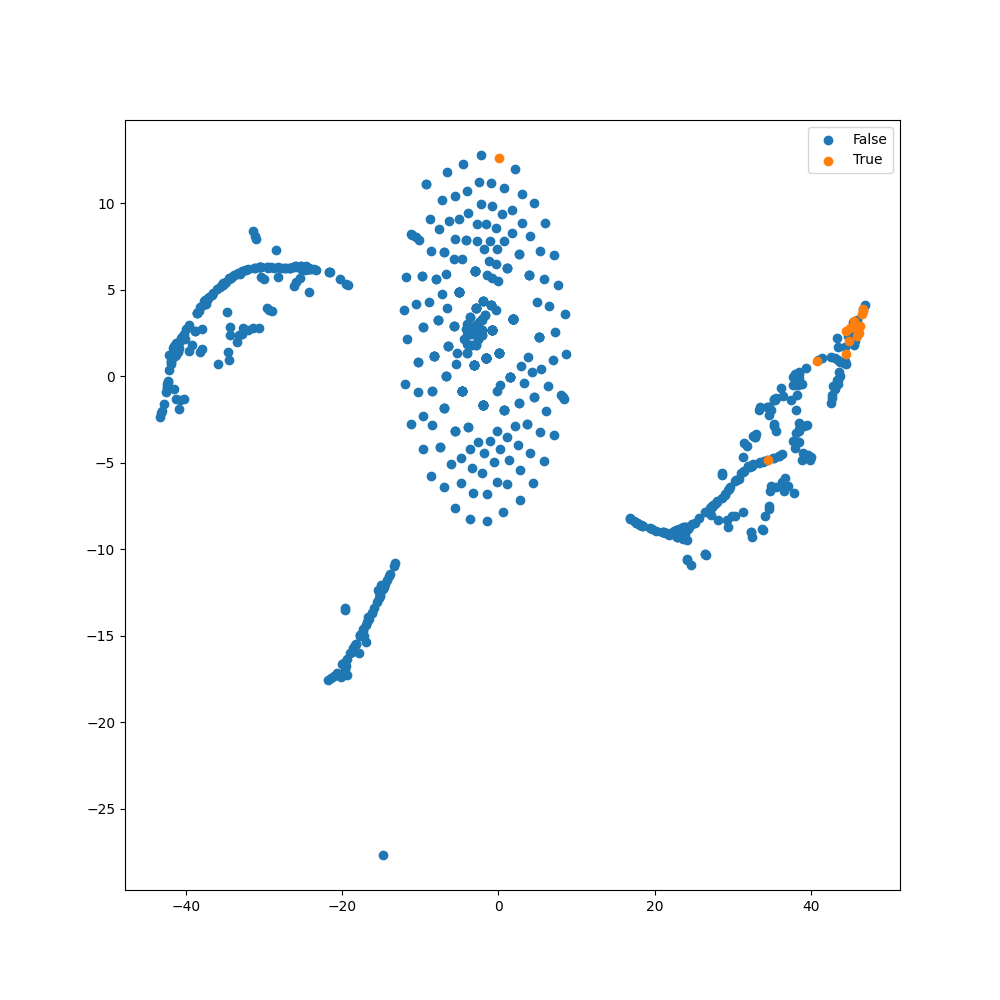
</div>
<div style="display:flex; flex-direction:column; flex:1; align-items:center; max-width:33%;">
<p>ROC Curve</p>

</div>  
</div>

### cRT Fit / Decoupled Fit (representation layer = -2)

```python
    # Assume the data loading and model construction as shown in regular fit above
    model.compile(
        loss="binary_crossentropy",
        optimizer=keras.optimizers.Adam(learning_rate=4e-4),
        metrics=["accuracy"],
        representation_layer_index=-2
    )
    
    model.override_second_stage_fit_parameters(
        epochs=10000,
        callbacks=[
            keras.callbacks.EarlyStopping(patience=20, restore_best_weights=True)
        ]
    )
    
    model.cRT_fit(
        x_train,
        y_train,
        stratify_batches=True,
        validation_split=0.2,
        batch_size=512,
        epochs=10000,
        callbacks=[
            keras.callbacks.EarlyStopping(patience=20, restore_best_weights=True)
        ]
    )
```

<div style="display: flex; max-width: 100%;">
<div style="display:flex; flex-direction:column; flex:1; align-items:center; max-width:33%;">
<p>Confusion Matrix</p>
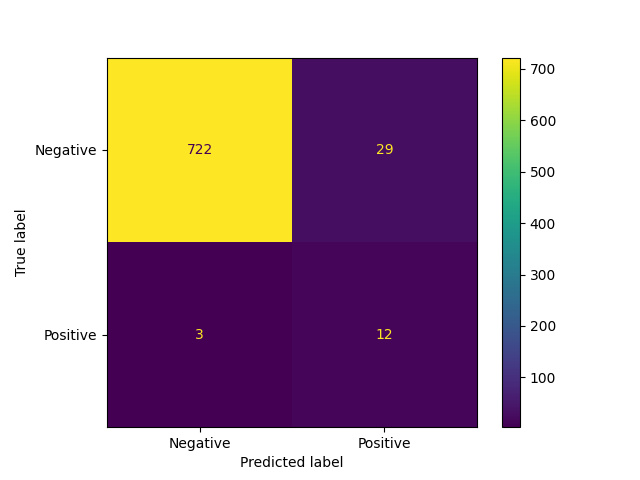
</div>
<div style="display:flex; flex-direction:column; flex:1; align-items:center; max-width:33%;">
<p>TSNE Visualization</p>
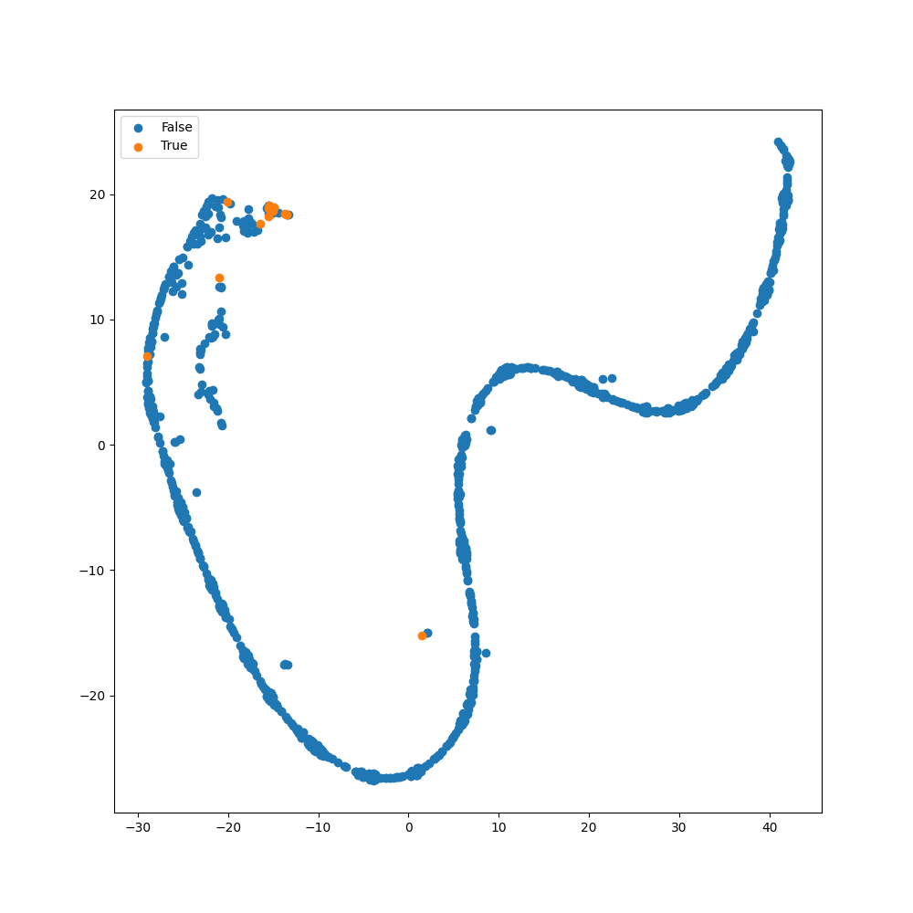
</div>
<div style="display:flex; flex-direction:column; flex:1; align-items:center; max-width:33%;">
<p>ROC Curve</p>
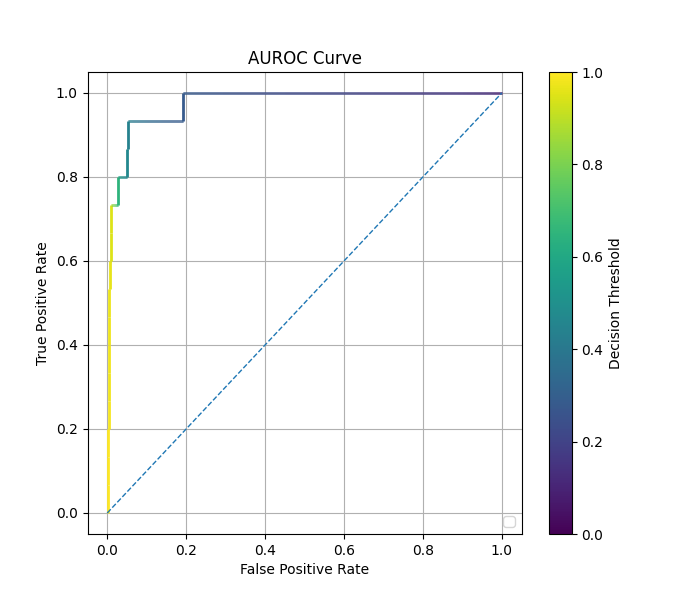
</div>  
</div>

### cRT Fit / Decoupled Fit (representation layer = -3)

```python
    # Assume the data loading and model construction as shown in regular fit above
    model.compile(
        loss="binary_crossentropy",
        optimizer=keras.optimizers.Adam(learning_rate=4e-4),
        metrics=["accuracy"],
        representation_layer_index=-3
    )
    
    model.override_second_stage_fit_parameters(
        epochs=10000,
        callbacks=[
            keras.callbacks.EarlyStopping(patience=20, restore_best_weights=True)
        ]
    )
    
    model.cRT_fit(
        x_train,
        y_train,
        stratify_batches=True,
        validation_split=0.2,
        batch_size=512,
        epochs=10000,
        callbacks=[
            keras.callbacks.EarlyStopping(patience=20, restore_best_weights=True)
        ]
    )
```

<div style="display: flex; max-width: 100%;">
<div style="display:flex; flex-direction:column; flex:1; align-items:center; max-width:33%;">
<p>Confusion Matrix</p>
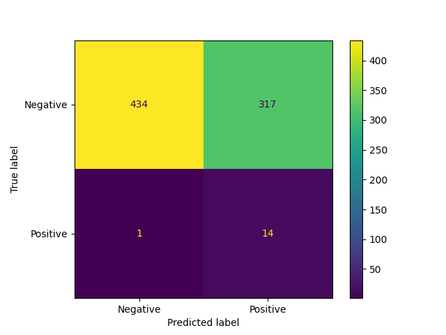
</div>
<div style="display:flex; flex-direction:column; flex:1; align-items:center; max-width:33%;">
<p>TSNE Visualization</p>
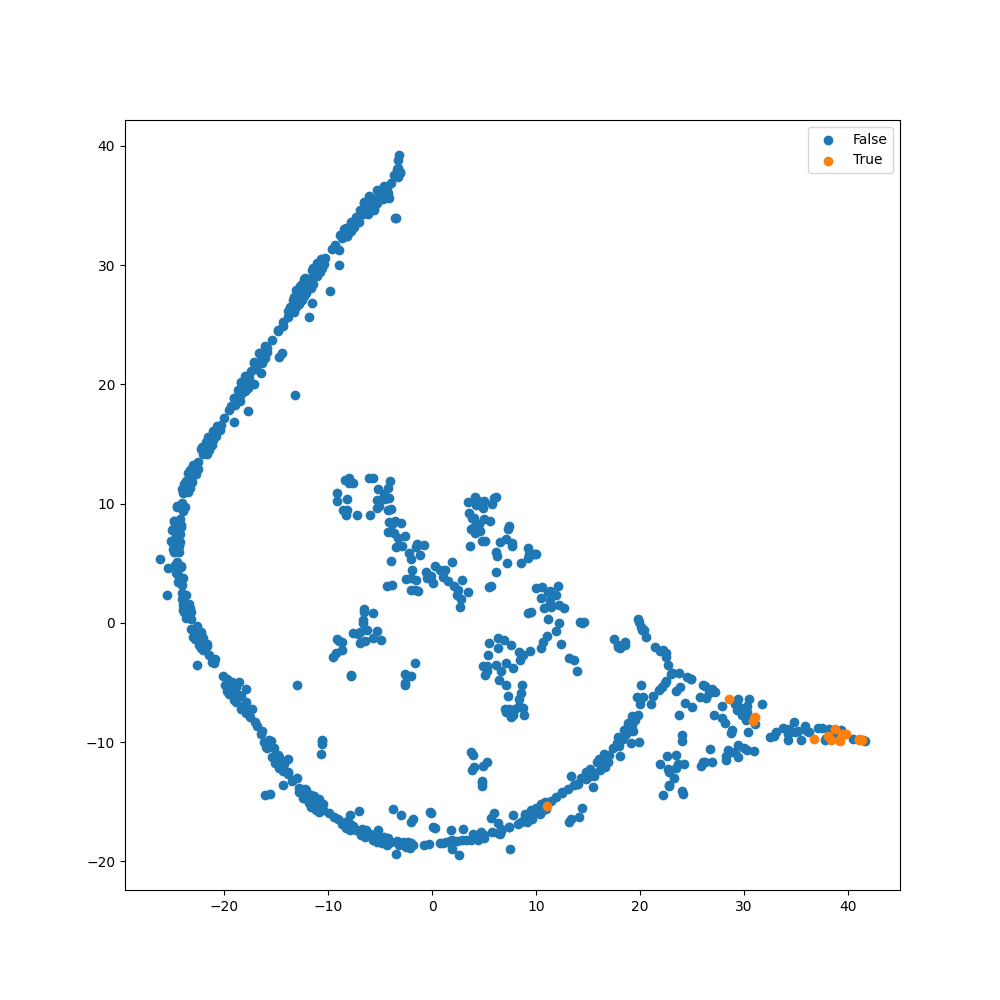
</div>
<div style="display:flex; flex-direction:column; flex:1; align-items:center; max-width:33%;">
<p>ROC Curve</p>
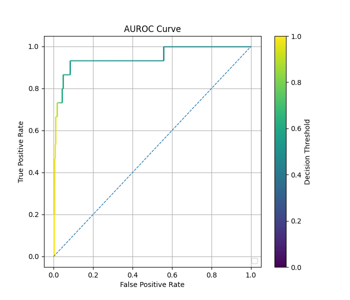
</div>  
</div>

### Comparison of Performance

For the table below, frequent samples refer to samples whose label
$y < ln(10)$, and rare samples refer to samples whose label $y > ln(10)$.

| Method                            | Epochs   | Time (s) | Rare Class F1 Score (threshold=0.5) | Rare Class AUC |
|-----------------------------------|----------|----------|-------------------------------------|----------------|
| Regular                           | $388$    | $26.10$  | $0.222$                             | $0.959$*       |
| Balanced                          | $135$    | $8.92$   | $0.189$                             | $0.931$*       |
| cRT (representation layer = $-2$) | $373/53$ | $26.20$  | $0.429$                             | $0.975$        |
| cRT (representation layer = $-3$) | $317/35$ | $26.20$  | $0.081$                             | $0.947$*       |


*Some examples have a high AUC, but low F1 score. This is because F1 score
is calculated with a decision threshold of 0.5, while some models can achieve
a near perfect separation of the two classes by using different decision
threshold. In these cases, almost all classes are predicted to be of the frequent class,
resulting in an F1 score of nearly 0 for the rare class, while maintaining that another 
decision threshold exists such that a near perfect separation of classes is achieved,
allowing for a AUROC close to 1.

See also: [Comparison of Autoencoder Methods](comparison_of_ae_methods_tabular.md)