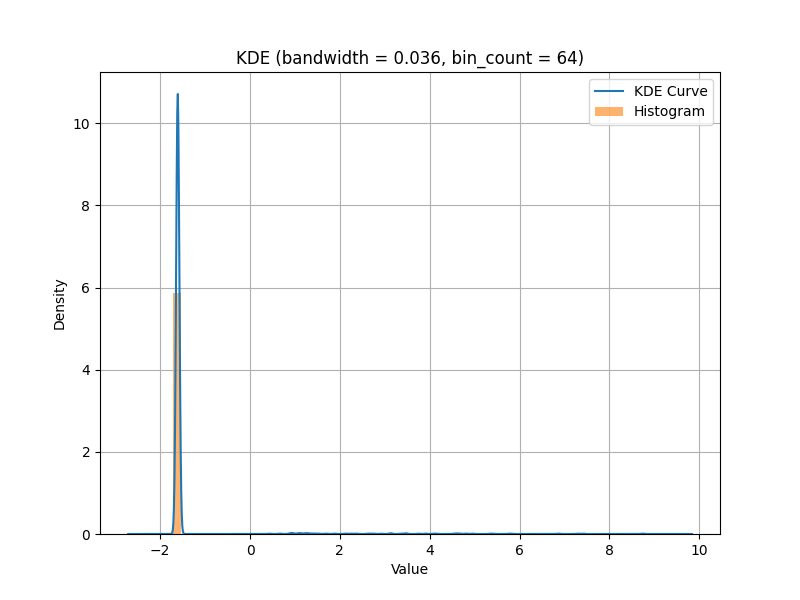
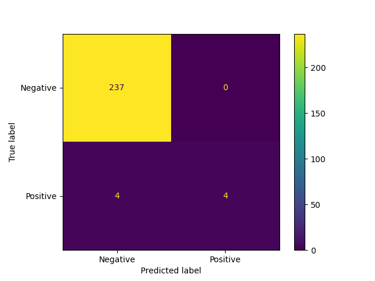
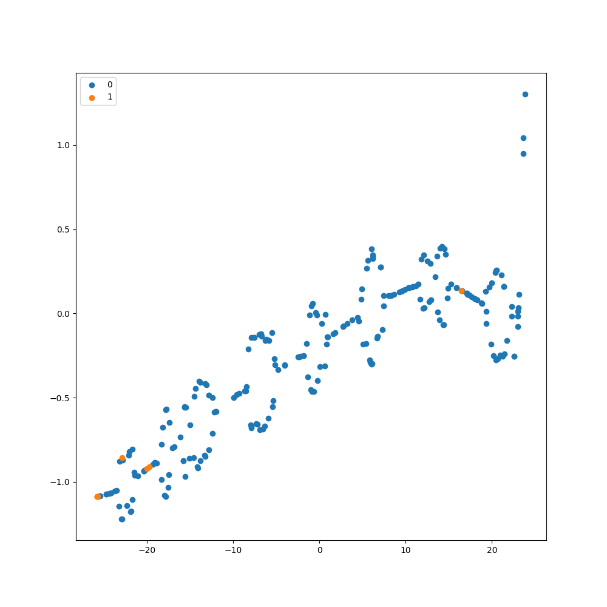
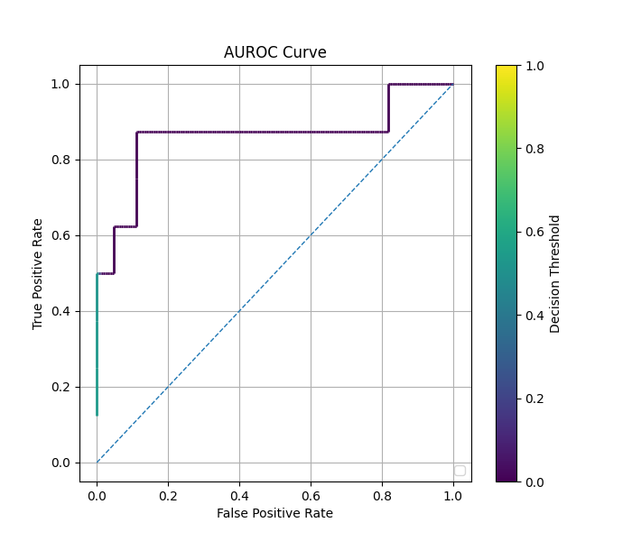
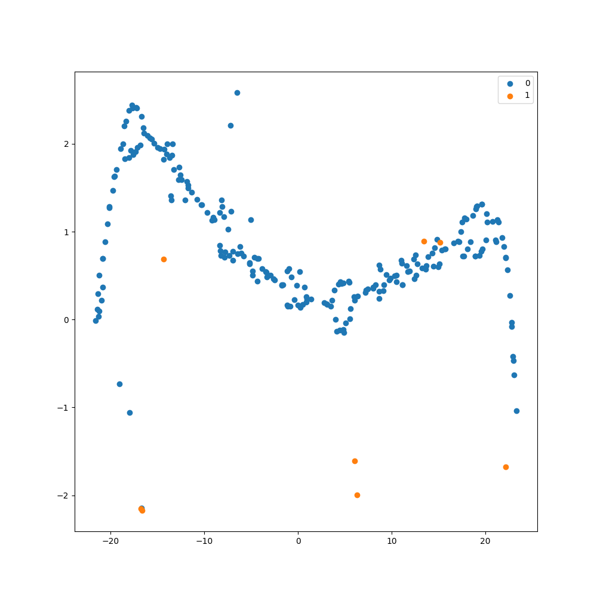
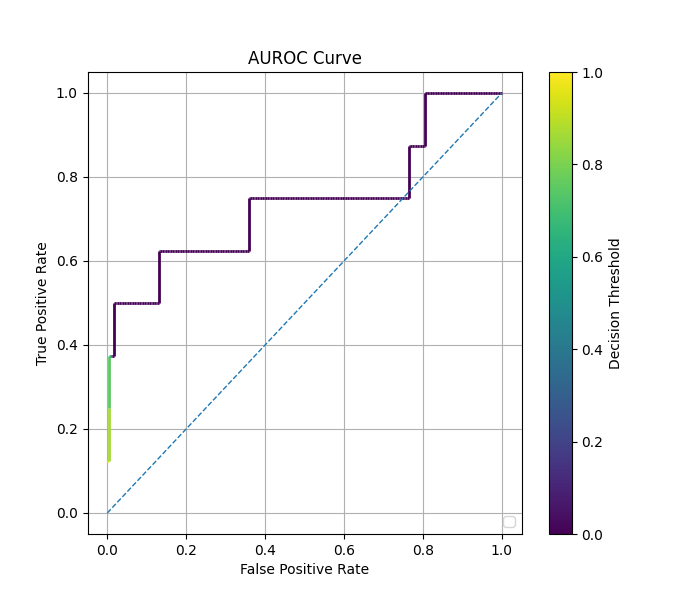
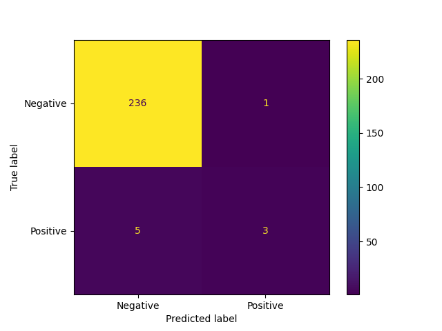
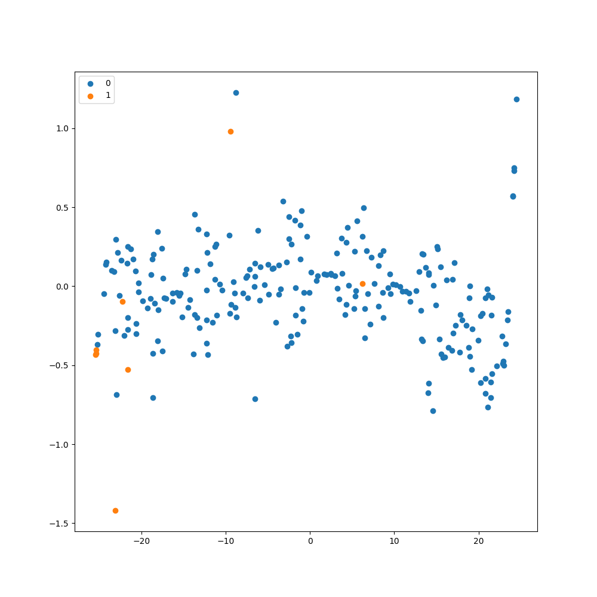
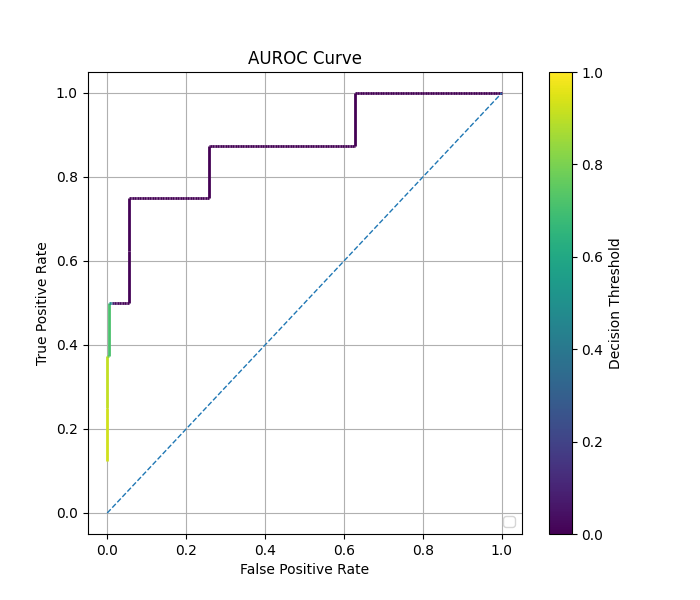

# Comparison of Methods: Regular vs. Balanced vs. cRT Fit on Tabular Data

Below is a comparison of [decoupled fit](cRT_fit.md) and [balanced fit](balanced_fit.md)
to a standard, unbalanced fit, and a weight-balanced
fit of the dataset shown below, which contains 1,531 data points.

### Data Distribution



### Regular Fit

```python
    model.compile(
        loss="binary_crossentropy",
        optimizer=keras.optimizers.Adam(learning_rate=2e-5),
        metrics=["accuracy"]
    )
    model.fit(
        x_train,
        y_train,
        batch_size=batch_size,
        epochs=epochs
    )
```
    
<div style="display: flex; max-width: 100%;">
<div style="display:flex; flex-direction:column; flex:1; align-items:center; max-width:33%;">
<p>Confusion Matrix</p>

</div>
<div style="display:flex; flex-direction:column; flex:1; align-items:center; max-width:33%;">
<p>TSNE Visualization</p>

</div>
<div style="display:flex; flex-direction:column; flex:1; align-items:center; max-width:33%;">
<p>ROC Curve</p>

</div>  
</div>

### Balanced Fit

```python
    compile_parameters = imbal.classification.wrap_model_compile_parameters(
        loss="binary_crossentropy",
        optimizer=keras.optimizers.Adam(learning_rate=2e-5),
        metrics=["accuracy"]
    )

    kde_fit_parameters = imbal.regression.wrap_kde_fit_parameters(
        bin_count=BIN_COUNT
    )
    
    imbal.classification.balanced_fit(
        model,
        x_train,
        y_train,
        compile_parameters=parameters,
        epochs=epochs,
        batch_size=batch_size
    )
```

<div style="display: flex; max-width: 100%;">
<div style="display:flex; flex-direction:column; flex:1; align-items:center; max-width:33%;">
<p>Confusion Matrix</p>

</div>
<div style="display:flex; flex-direction:column; flex:1; align-items:center; max-width:33%;">
<p>TSNE Visualization</p>

</div>
<div style="display:flex; flex-direction:column; flex:1; align-items:center; max-width:33%;">
<p>ROC Curve</p>

</div>  
</div>

### cRT Fit

```python
    compile_parameters = imbal.classification.wrap_model_compile_parameters(
        loss="binary_crossentropy",
        optimizer=keras.optimizers.Adam(learning_rate=2e-5),
        metrics=["accuracy"]
    )

    kde_fit_parameters = imbal.regression.wrap_kde_fit_parameters(
        bin_count=BIN_COUNT
    )
    
    imbal.regression.cRT_fit(
        model,
        x_train,
        y_train,
        compile_parameters=compile_parameters,
        kde_fit_parameters=kde_fit_parameters,
        epochs=epochs,
        batch_size=batch_size,
        representation_layer_index=-3
    )
```

<div style="display: flex; max-width: 100%;">
<div style="display:flex; flex-direction:column; flex:1; align-items:center; max-width:33%;">
<p>Confusion Matrix</p>

</div>
<div style="display:flex; flex-direction:column; flex:1; align-items:center; max-width:33%;">
<p>TSNE Visualization</p>

</div>
<div style="display:flex; flex-direction:column; flex:1; align-items:center; max-width:33%;">
<p>ROC Curve</p>

</div>  
</div>

### Comparison of Performance

For the table below, common samples refer to samples whose label
falls in the range $[-1, 1]$, and rare samples are those whose label
falls outside of this range.

| Method   | Time (s) | Rare Class F1 Score (threshold=0.5) | AUC      |
|----------|----------|-------------------------------------|----------|
| Regular  | $38.36$  | $0.0$                               | $0.883$* |
| Balanced | $41.34$  | $0.500$                             | $0.537$  |
| cRT      | $57.93$  | $0.625$                             | $0.858$  |

*Some examples have a high AUC, but low F1 score. This is because F1 score
is calculated with a decision threshold of 0.5, while some models can achieve
a near perfect separation of the two classes by using a lower decision
threshold. In these cases, almost all classes are predicted to be of the frequent class,
resulting in an F1 score of nearly 0 for the rare class, while maintaining that a
lower decision threshold exists such that a near perfect separation of classes is achieved,
allowing for a AUROC close to 1.

See also: [Comparison of Autoencoder Methods](comparison_of_ae_methods_tabular.md)