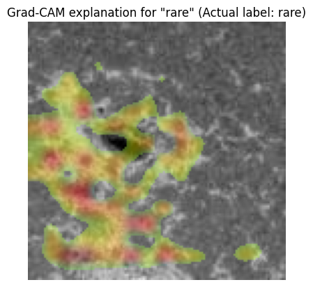

# gradcam_explain_image_sample

```{eval-rst}
.. autoclass:: imbal.classification.gradcam_explain_image_sample
```

Example:

```python
>>> # Assume a TensorFlow model is already saved to 'model'
>>>
>>> class_labels = ['airplane', 'bird', 'car', 'cat', 'deer',
>>>                 'dog', 'horse', 'monkey', 'ship', 'truck']
>>>
>>> x = x_test[0]
>>> y = y_test[0]
>>>
>>> fig = imbal.classification.gradcam_explain_image_sample(
>>>     x,
>>>     model,
>>>     actual_label=y,
>>>     label_to_explain=y,
>>>     class_names=class_labels,
>>>     show=True
>>> )
```

## Plot Examples

Below is an example of the resulting Matplotlib pyplot plot for a correctly predicted class.

```python
>>> imbal.classification.gradcam_explain_image_sample(
>>>     x,
>>>     model,
>>>     actual_label=y
>>> )
```


An example of the resulting Matplotlib pyplot plot for an incorrectly predicted class.

```python
>>> imbal.classification.gradcam_explain_image_sample(
>>>     x,
>>>     model,
>>>     actual_label=y
>>> )
```

