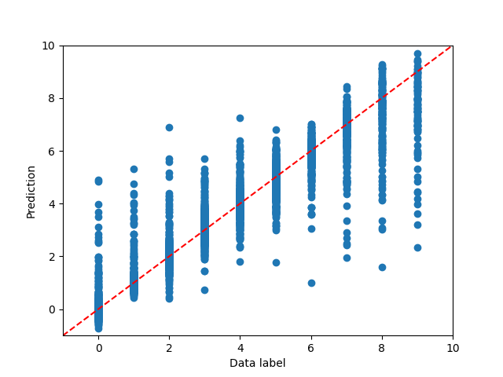
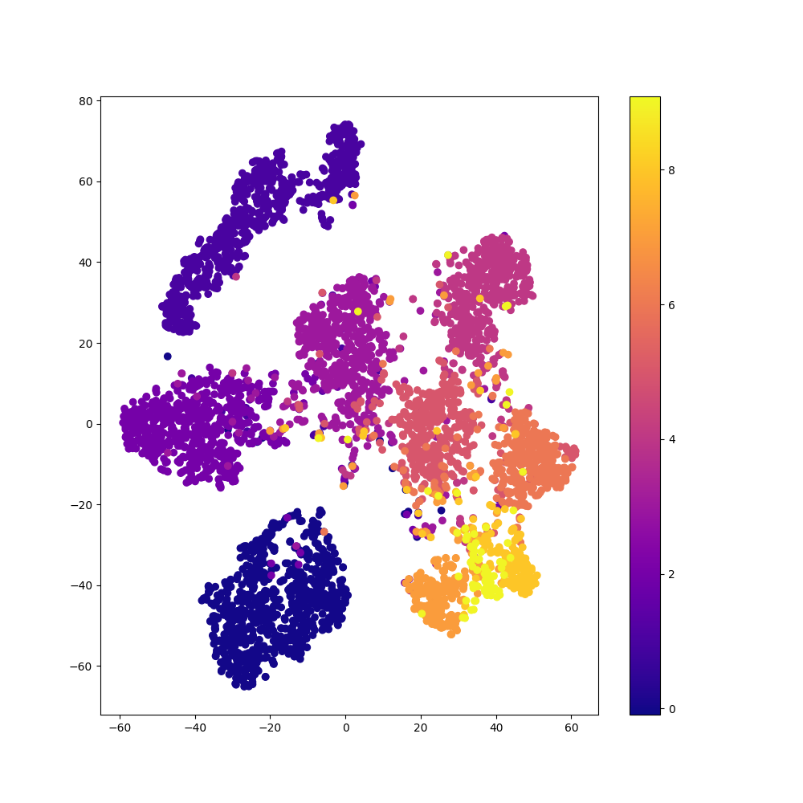
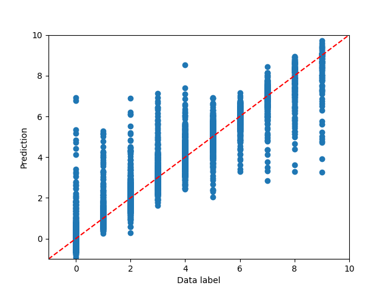
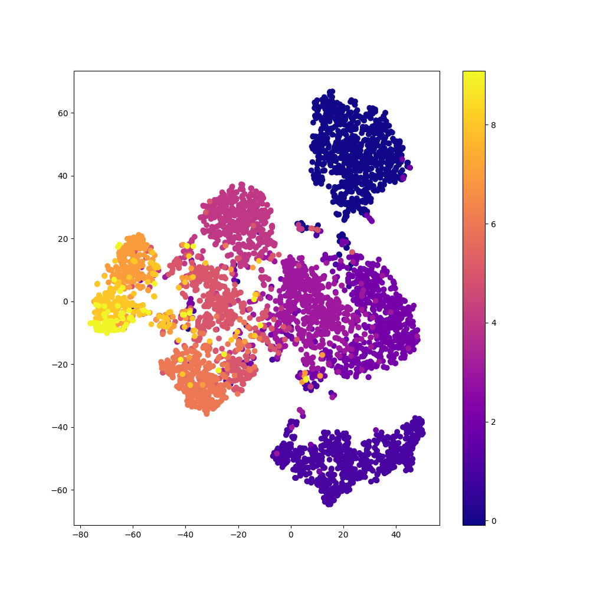
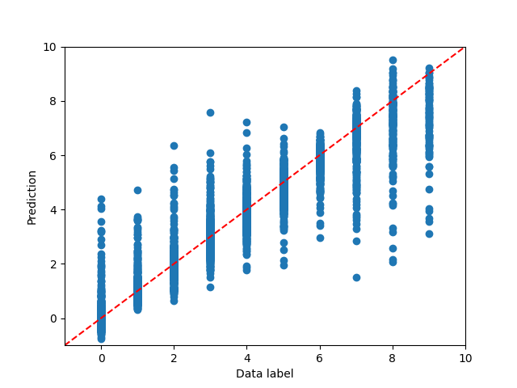
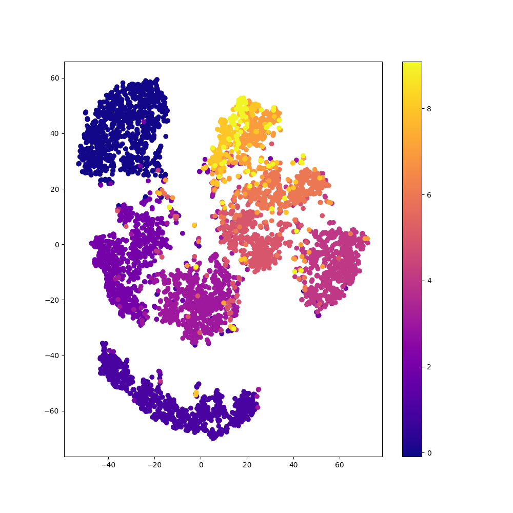

# Comparison of Autoencoder: Regular vs. Balanced vs. Decoupled Fit on Image Data

### Regular Fit with Autoencoder

### Balanced Fit with Autoencoder

### Decoupled Fit with Autoencoder

### Comparison of Methods

| Method    | Autoencoder? | Time (s) | Frequent Sample MSE  (Class 0) | Rare Sample MSE  (Class 9) |
|-----------|--------------|----------|--------------------------------|----------------------------|
| Regular   | No           | $85.31$  | $0.4929$                       | $9.3896$                   |
| Regular   | Yes          | $220.24$ | $0.2454$                       | $4.7639$                   |
| Balanced  | No           | $80.95$  | $1.8764$                       | $2.3904$                   |
| Balanced  | Yes          | $235.87$ | $0.6042$                       | $2.6974$                   |
| Decoupled | No           | $111.84$ | $1.6591$                       | $3.6400$                   |
| Decoupled | Yes          | $268.00$ | $0.2423$                       | $4.8219$                   |

See also: [Comparison of Fit Methods](comparison_of_fit_methods_image.md)