# Comparison of Autoencoder: Regular vs. Balanced vs. rRT Fit on Image Data

### Regular Fit with Autoencoder (representation layer = -2)

```python
    # Assume data has already been loaded into x_train, y_train, x_test, and y_test
    input_shape = x_train.shape[1:]

    inputs = keras.Input(shape=(112, 88, 3))
    x = layers.Conv2D(16, (3, 3), activation='relu', padding='same', strides=(2, 2))(inputs)
    x = layers.Conv2D(32, (3, 3), activation='relu', padding='same', strides=(2, 2))(x)
    x = layers.Conv2D(32, (3, 3), activation='relu', padding='same', strides=(2, 2))(x)
    x = layers.Flatten()(x)
    x = layers.Dense(32, activation='relu')(x)
    x = layers.Flatten()(x)
    output = layers.Dense(1, activation='linear')(x)

    model = imbal.regression.Model(inputs=inputs, outputs=output)

    model.compile(
        loss="mse",
        optimizer=keras.optimizers.Adam(learning_rate=4e-4),
        metrics=["mse"],
        generate_decoder_branch=True,
        representation_layer_index=-2
    )
    
    model.fit(
        x_train,
        y_train,
        stratify_batches=True,
        validation_split=0.2,
        batch_size=512,
        epochs=10000,
        callbacks=[
            keras.callbacks.EarlyStopping(patience=20, restore_best_weights=True)
        ]
    )
```

<div style="display: flex; max-width: 100%;">
<div style="display:flex; flex-direction:column; flex:1; align-items:center; max-width:50%;">
<p>Prediction Plot</p>
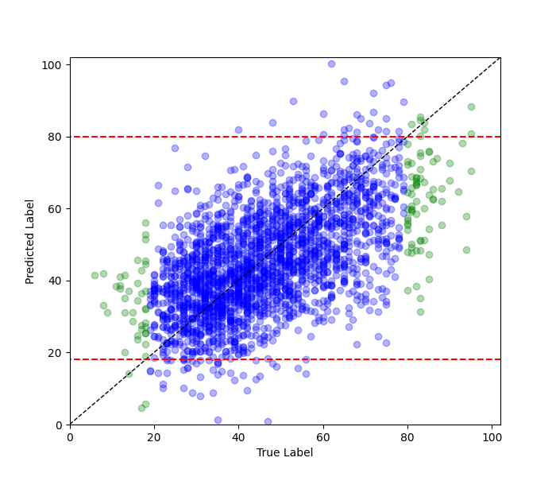
</div>
<div style="display:flex; flex-direction:column; flex:1; align-items:center; max-width:50%;">
<p>TSNE Visualization</p>
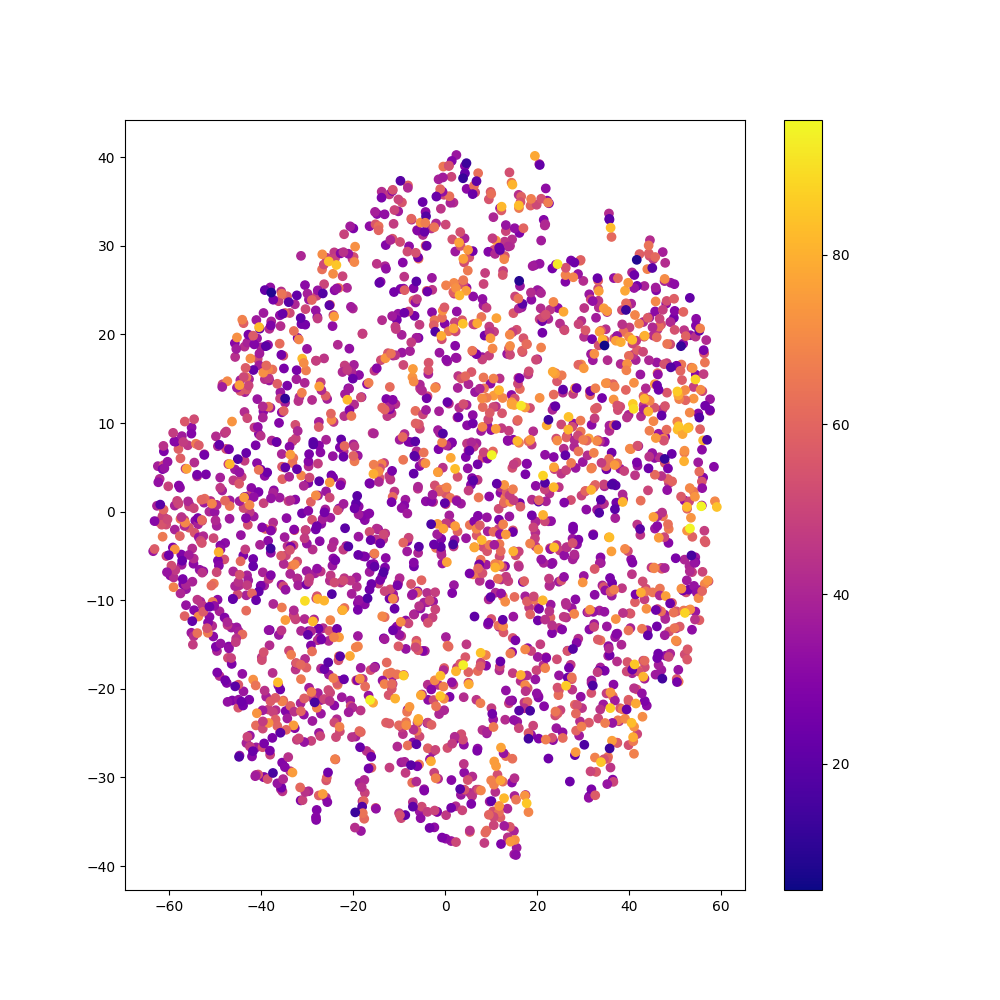
</div>
</div>

### Balanced Fit with Autoencoder (representation layer = -2)

```python
    # Assume the data loading, model construction and compilation as shown in regular fit above.

    kde_bandwidth = imbal.regression.fit_kde(
        y_train,
        bin_count=64
    )
    densities = imbal.regression.get_sample_densities(
        y_train,
        kde_bandwidth
    )

    model.balanced_fit(
        x_train,
        y_train,
        stratify_batches=True,
        validation_split=0.2,
        batch_size=512,
        epochs=10000,
        callbacks=[
            keras.callbacks.EarlyStopping(patience=20, restore_best_weights=True)
        ]
    )
```

<div style="display: flex; max-width: 100%;">
<div style="display:flex; flex-direction:column; flex:1; align-items:center; max-width:50%;">
<p>Prediction Plot</p>
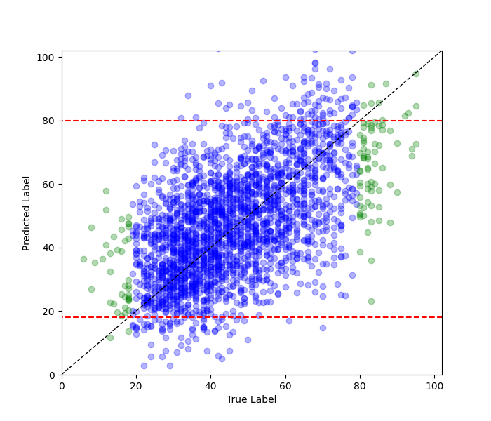
</div>
<div style="display:flex; flex-direction:column; flex:1; align-items:center; max-width:50%;">
<p>TSNE Visualization</p>
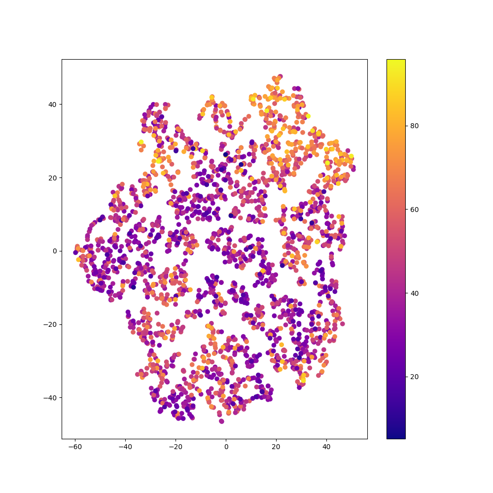
</div>
</div>


### rRT Fit with Autoencoder (representation layer = -2)

```python
    # Assume the data loading, model construction and compilation as shown in regular fit above.

    kde_bandwidth = imbal.regression.fit_kde(
            y_train,
            bin_count=64
        )
    densities = imbal.regression.get_sample_densities(
        y_train,
        kde_bandwidth
    )
    
    model.override_second_stage_fit_parameters(
        epochs=10000,
        callbacks=[
            keras.callbacks.EarlyStopping(patience=20, restore_best_weights=True)
        ]
    )
    
    model.rRT_fit(
        x_train,
        y_train,
        stratify_batches=True,
        validation_split=0.2,
        batch_size=512,
        epochs=10000,
        callbacks=[
            keras.callbacks.EarlyStopping(patience=20, restore_best_weights=True)
        ]
    )
```

<div style="display: flex; max-width: 100%;">
<div style="display:flex; flex-direction:column; flex:1; align-items:center; max-width:50%;">
<p>Prediction Plot</p>
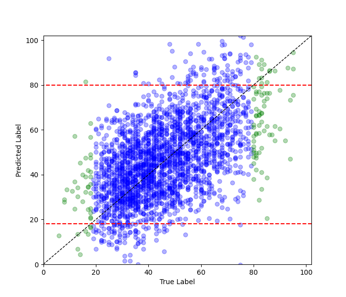
</div>
<div style="display:flex; flex-direction:column; flex:1; align-items:center; max-width:50%;">
<p>TSNE Visualization</p>
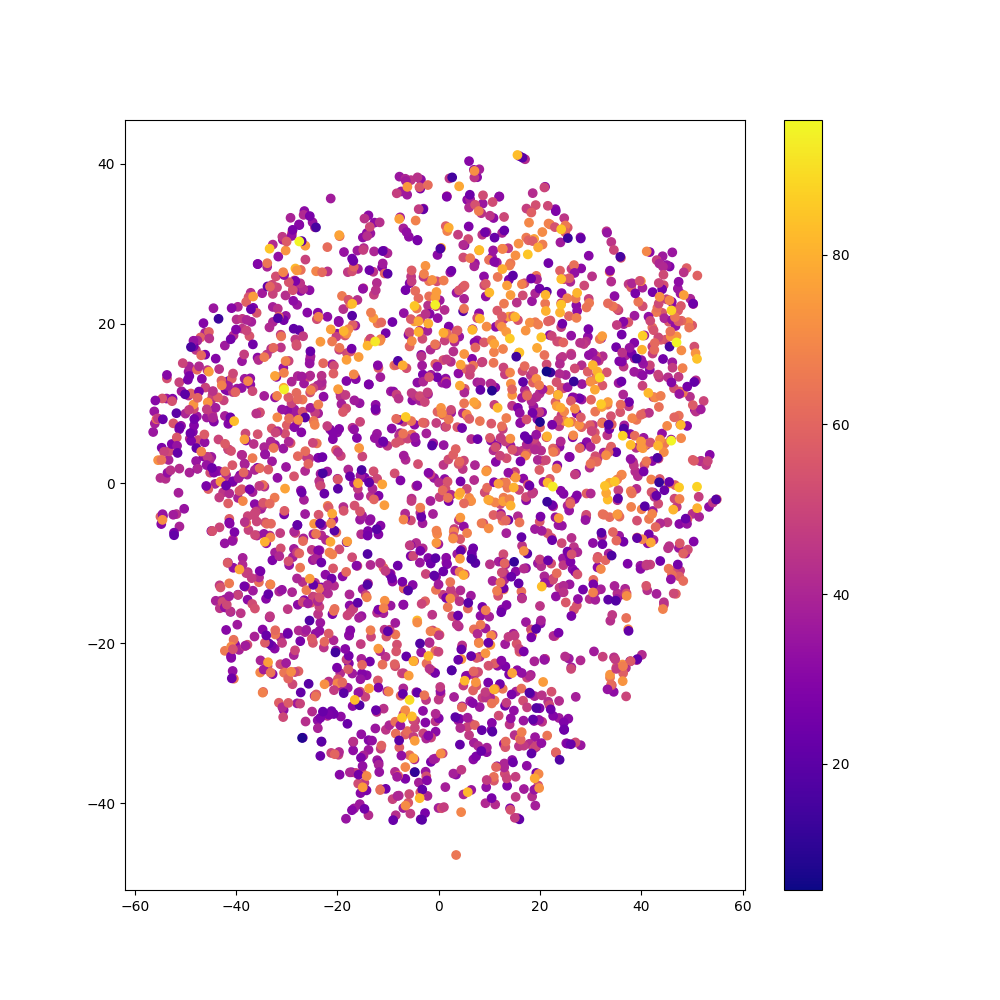
</div>
</div>

### Regular Fit with Autoencoder (representation layer = -3)

```python
    # Assume the data loading and model construction as shown in regular fit above.
    
    model.compile(
        loss="binary_crossentropy",
        optimizer=keras.optimizers.Adam(learning_rate=4e-4),
        metrics=["accuracy"],
        generate_decoder_branch=True,
        representation_layer_index=-3
    )
    
    model.fit(
        x_train,
        y_train,
        stratify_batches=True,
        validation_split=0.2,
        batch_size=512,
        epochs=10000,
        callbacks=[
            keras.callbacks.EarlyStopping(patience=20, restore_best_weights=True)
        ]
    )
```

<div style="display: flex; max-width: 100%;">
<div style="display:flex; flex-direction:column; flex:1; align-items:center; max-width:50%;">
<p>Prediction Plot</p>
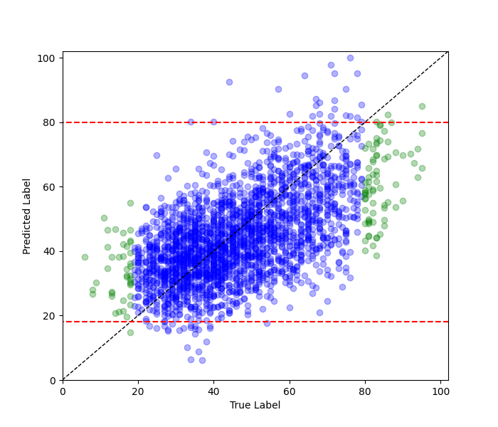
</div>
<div style="display:flex; flex-direction:column; flex:1; align-items:center; max-width:50%;">
<p>TSNE Visualization</p>
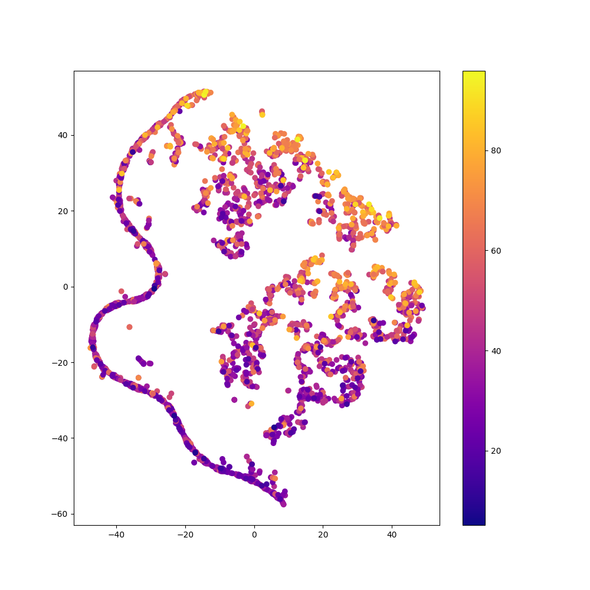
</div>
</div>

### Balanced Fit with Autoencoder (representation layer = -3)

```python
    # Assume the data loading, model construction and compilation as shown in regular fit above.

    kde_bandwidth = imbal.regression.fit_kde(
        y_train,
        bin_count=64
    )
    densities = imbal.regression.get_sample_densities(
        y_train,
        kde_bandwidth
    )
    
    model.balanced_fit(
        x_train,
        y_train,
        stratify_batches=True,
        validation_split=0.2,
        batch_size=512,
        epochs=10000,
        callbacks=[
            keras.callbacks.EarlyStopping(patience=20, restore_best_weights=True)
        ]
    )
```

<div style="display: flex; max-width: 100%;">
<div style="display:flex; flex-direction:column; flex:1; align-items:center; max-width:50%;">
<p>Prediction Plot</p>
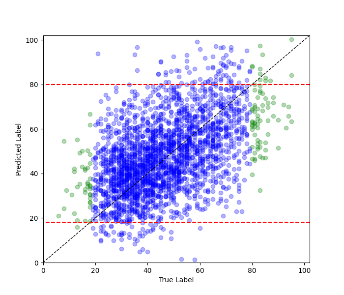
</div>
<div style="display:flex; flex-direction:column; flex:1; align-items:center; max-width:50%;">
<p>TSNE Visualization</p>
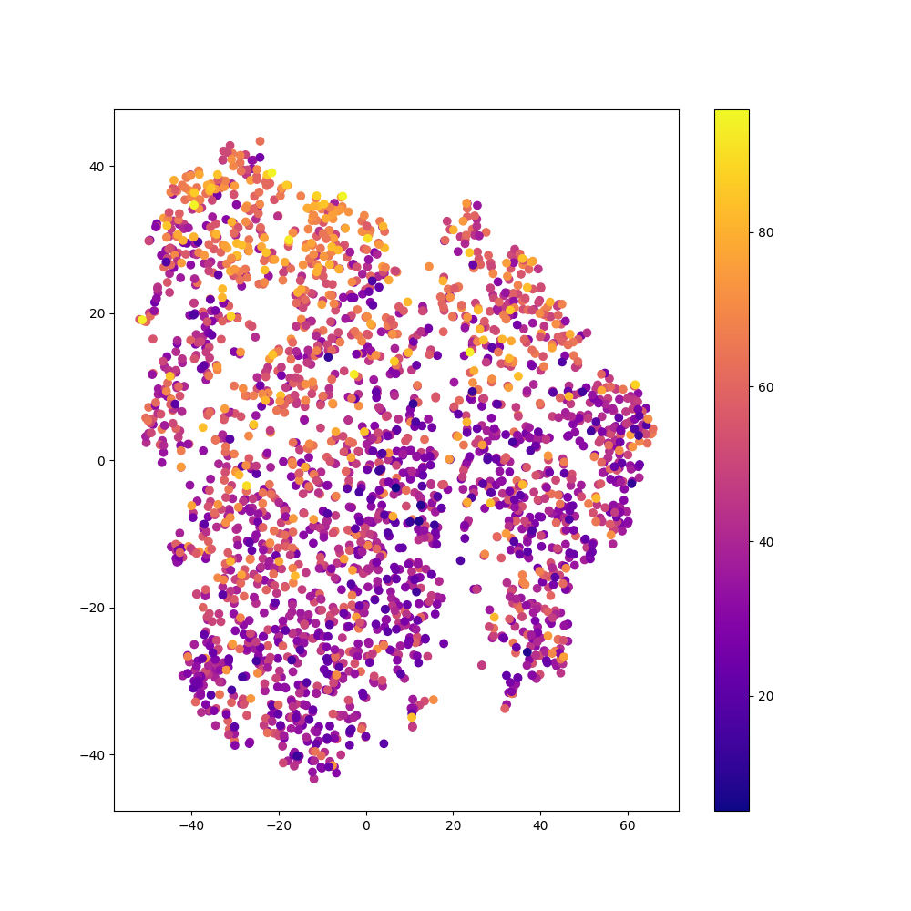
</div>
</div>

### rRT Fit with Autoencoder (representation layer = -3)

```python
    # Assume the data loading, model construction and compilation as shown in regular fit above.

    kde_bandwidth = imbal.regression.fit_kde(
        y_train,
        bin_count=64
    )
    densities = imbal.regression.get_sample_densities(
        y_train,
        kde_bandwidth
    )
    
    model.override_second_stage_fit_parameters(
        epochs=10000,
        callbacks=[
            keras.callbacks.EarlyStopping(patience=20, restore_best_weights=True)
        ]
    )
    
    model.rRT_fit(
        x_train,
        y_train,
        stratify_batches=True,
        validation_split=0.2,
        batch_size=512,
        epochs=10000,
        callbacks=[
            keras.callbacks.EarlyStopping(patience=20, restore_best_weights=True)
        ]
    )
```

<div style="display: flex; max-width: 100%;">
<div style="display:flex; flex-direction:column; flex:1; align-items:center; max-width:50%;">
<p>Prediction Plot</p>
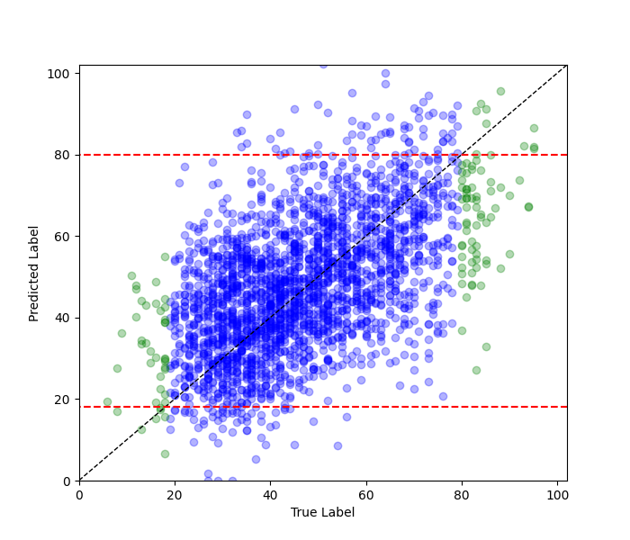
</div>
<div style="display:flex; flex-direction:column; flex:1; align-items:center; max-width:50%;">
<p>TSNE Visualization</p>
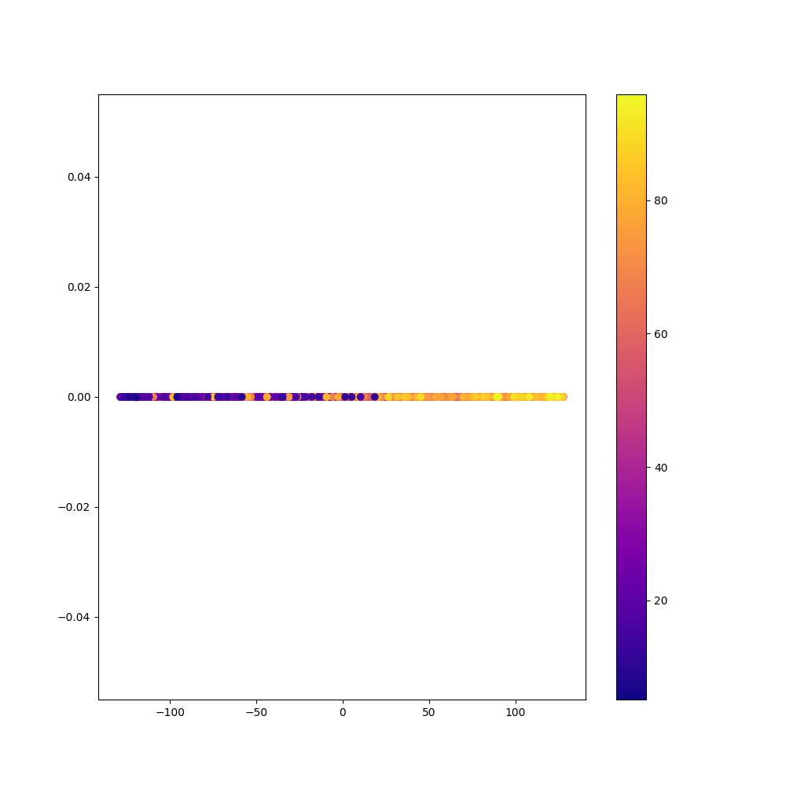
</div>
</div>

### Comparison of Methods

| Method   | Autoencoder? | Representation Layer Index | Epochs    | Time (s) | Frequent MSE | Rare MSE  |
|----------|--------------|----------------------------|-----------|----------|--------------|-----------|
| Regular  | No           | N/A                        | $38$      | $20.12$  | $177.829$    | $545.133$ |
| Regular  | Yes          | $-2$                       | $98$      | $82.33$  | $186.083$    | $539.115$ |
| Regular  | Yes          | $-3$                       | $96$      | $75.74$  | $181.808$    | $558.963$ |
| Balanced | No           | N/A                        | $43$      | $23.08$  | $245.702$    | $501.761$ |
| Balanced | Yes          | $-2$                       | $187$     | $135.20$ | $245.036$    | $470.394$ |
| Balanced | Yes          | $-3$                       | $228$     | $160.28$ | $275.189$    | $528.512$ |
| rRT      | No           | $-2$                       | $46/41$   | $38.40$  | $228.069$    | $504.613$ |
| rRT      | No           | $-3$                       | $39/31$   | $32.91$  | $269.776$    | $442.196$ |
| rRT      | Yes          | $-2$                       | $120/187$ | $156.80$ | $269.322$    | $573.452$ |
| rRT      | Yes          | $-3$                       | $199/208$ | $211.02$ | $237.771$    | $468.410$ |

See also: [Comparison of Fit Methods](comparison_of_fit_methods_image.md)