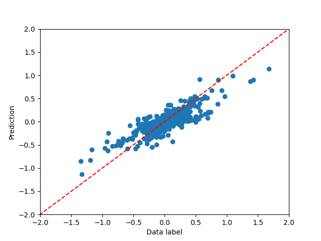
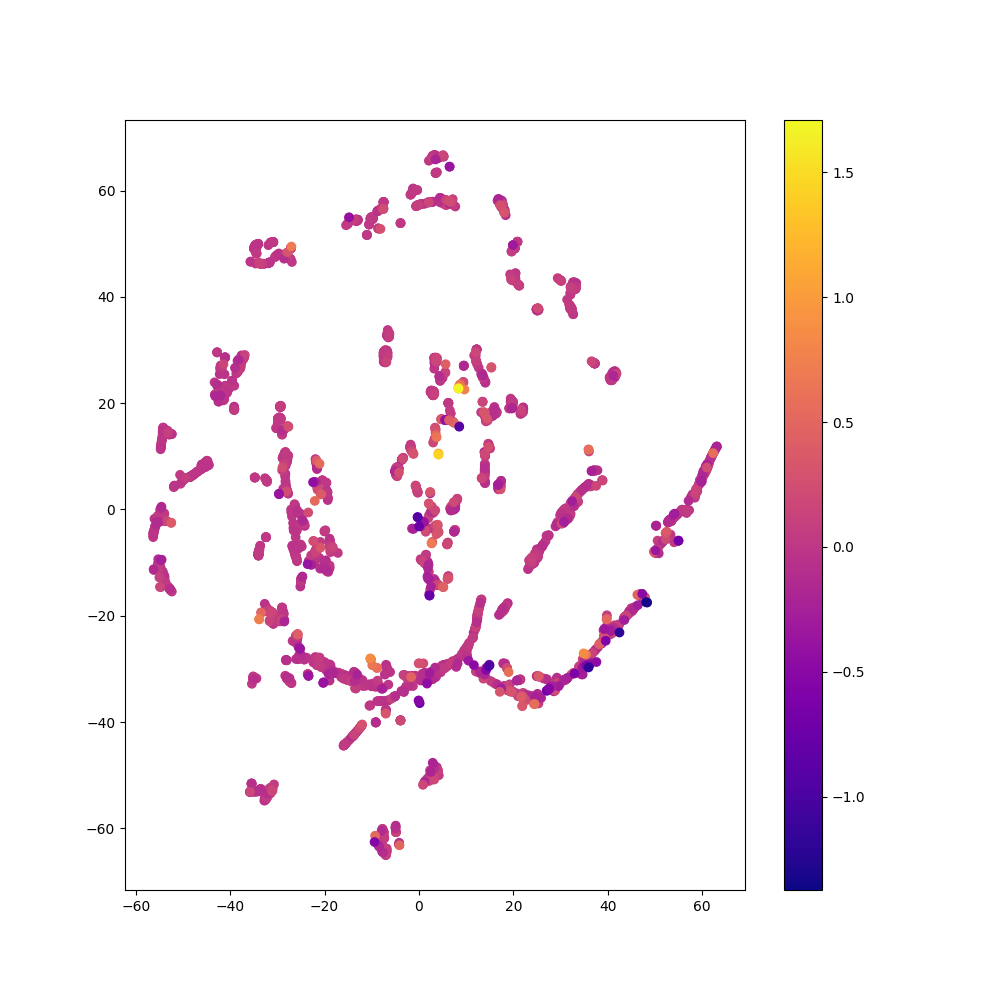
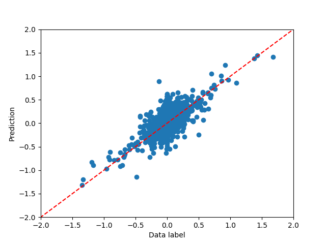
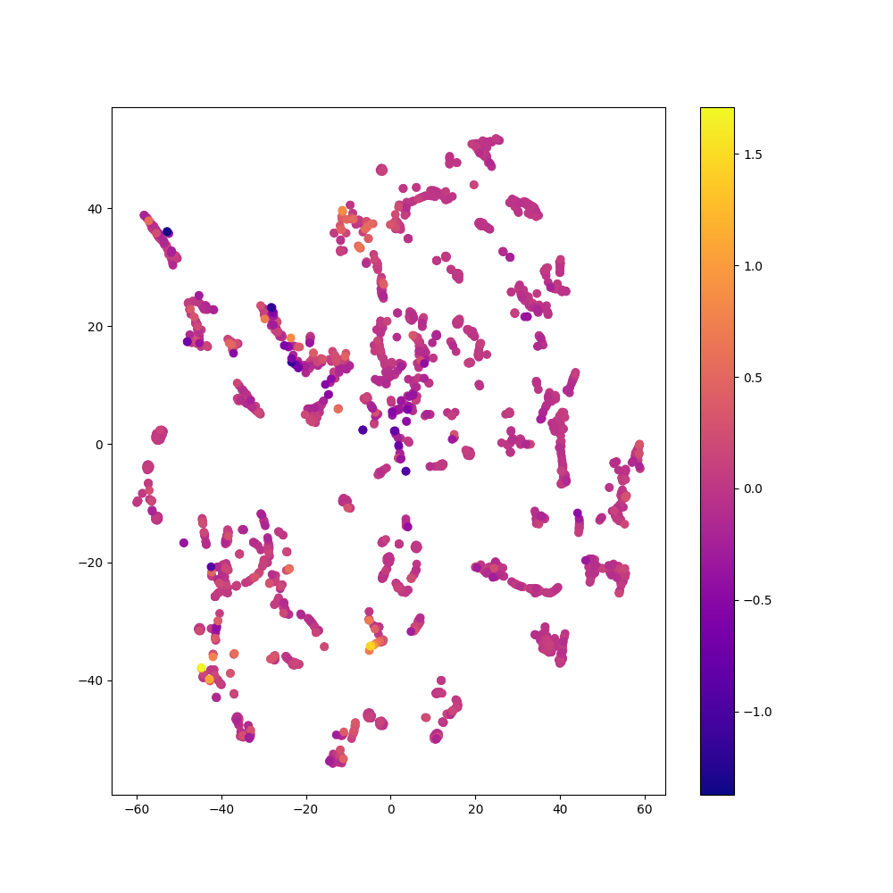
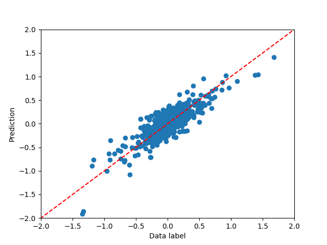
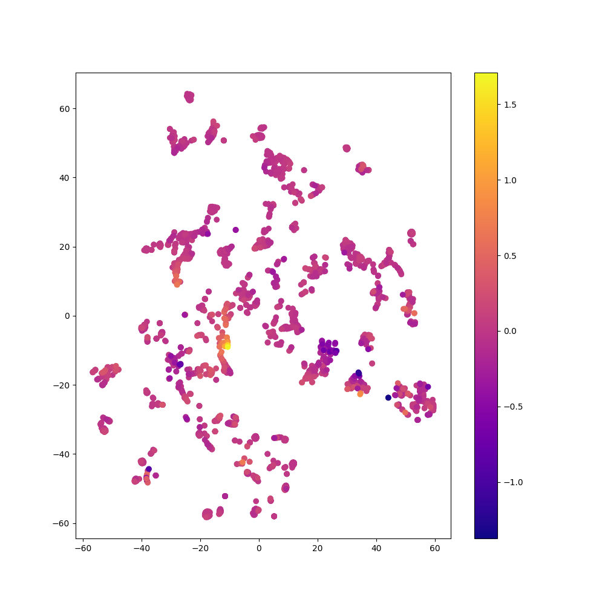

# Comparison of Autoencoder: Regular vs. Balanced vs. rRT Fit on Tabular Data

### Regular Fit with Autoencoder

### Balanced Fit with Autoencoder

### rRT Fit with Autoencoder

### Comparison of Methods

| Method   | Autoencoder? | Time (s) | Frequent Sample MSE | Rare Sample MSE |
|----------|--------------|----------|---------------------|-----------------|
| Regular  | No           | $69.2$   | $0.0052$            | $0.1797$        |
| Regular  | Yes          | $92.2$   | $0.0081$            | $0.1968$        |
| Balanced | No           | $100.1$  | $0.0170$            | $0.0581$        |
| Balanced | Yes          | $143.6$  | $0.0212$            | $0.0456$        |
| rRT      | No           | $117.2$  | $0.0077$            | $0.0789$        |
| rRT      | Yes          | $120.0$  | $0.0124$            | $0.1537$        |

See also: [Comparison of Fit Methods](comparison_of_fit_methods_tabular.md)