# Comparison of Autoencoder: Regular vs. Balanced vs. cRT Fit on Tabular Data Regression

### Regular Fit with Autoencoder (representation layer = -2)

```python
    # Assume data has already been loaded into x_train, y_train, x_test, and y_test
    input_shape = x_train.shape[1:]

    inputs = keras.Input(shape=input_shape)
    x = layers.Dense(18, activation='relu')(inputs)
    x = layers.Dense(9, activation='relu')(x)
    x = layers.Flatten()(x)
    x = layers.Dense(6, activation='relu')(x)
    x = layers.Flatten()(x)
    output = layers.Dense(1, activation='linear')(x)

    model = imbal.regression.Model(inputs=inputs, outputs=output)

    model.compile(
        loss="mse",
        optimizer=keras.optimizers.Adam(learning_rate=4e-4),
        metrics=["mse"],
        generate_decoder_branch=True,
        representation_layer_index=-2
    )
    
    model.fit(
        x_train,
        y_train,
        stratify_batches=True,
        validation_split=0.2,
        batch_size=512,
        epochs=10000,
        callbacks=[
            keras.callbacks.EarlyStopping(patience=20, restore_best_weights=True)
        ]
    )
```

<div style="display: flex; max-width: 100%;">
<div style="display:flex; flex-direction:column; flex:1; align-items:center; max-width:50%;">
<p>Prediction Plot</p>
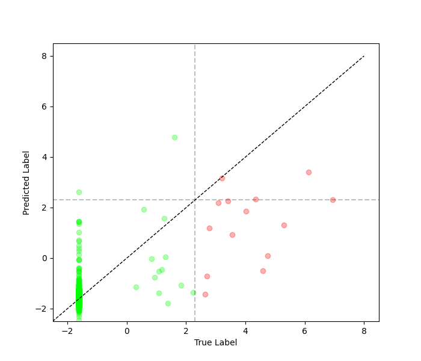
</div>
<div style="display:flex; flex-direction:column; flex:1; align-items:center; max-width:50%;">
<p>TSNE Visualization</p>
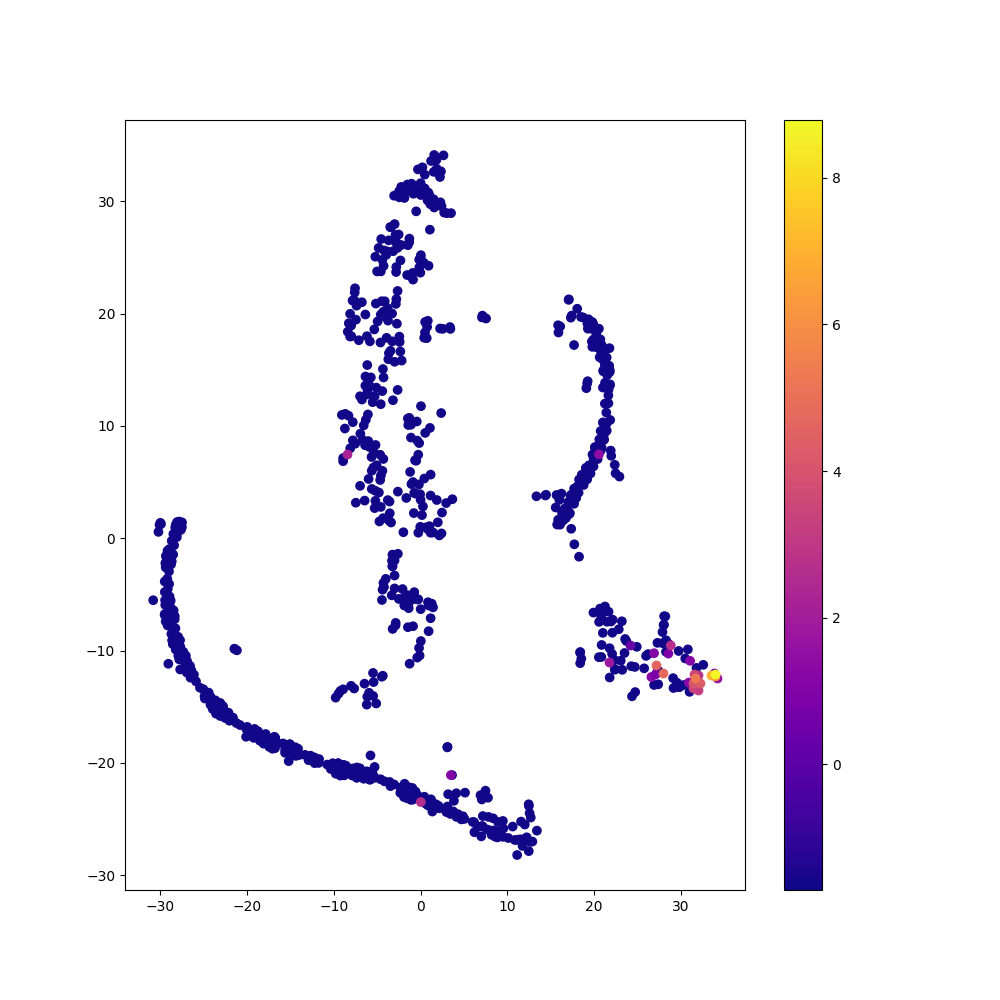
</div>
</div>

### Balanced Fit with Autoencoder (representation layer = -2)

```python
    # Assume the data loading, model construction and compilation as shown in regular fit above.

    kde_bandwidth = imbal.regression.fit_kde(
        y_train,
        bin_count=64
    )
    densities = imbal.regression.get_sample_densities(
        y_train,
        kde_bandwidth
    )

    model.balanced_fit(
        x_train,
        y_train,
        stratify_batches=True,
        validation_split=0.2,
        batch_size=512,
        epochs=10000,
        callbacks=[
            keras.callbacks.EarlyStopping(patience=20, restore_best_weights=True)
        ]
    )
```

<div style="display: flex; max-width: 100%;">
<div style="display:flex; flex-direction:column; flex:1; align-items:center; max-width:50%;">
<p>Prediction Plot</p>

</div>
<div style="display:flex; flex-direction:column; flex:1; align-items:center; max-width:50%;">
<p>TSNE Visualization</p>
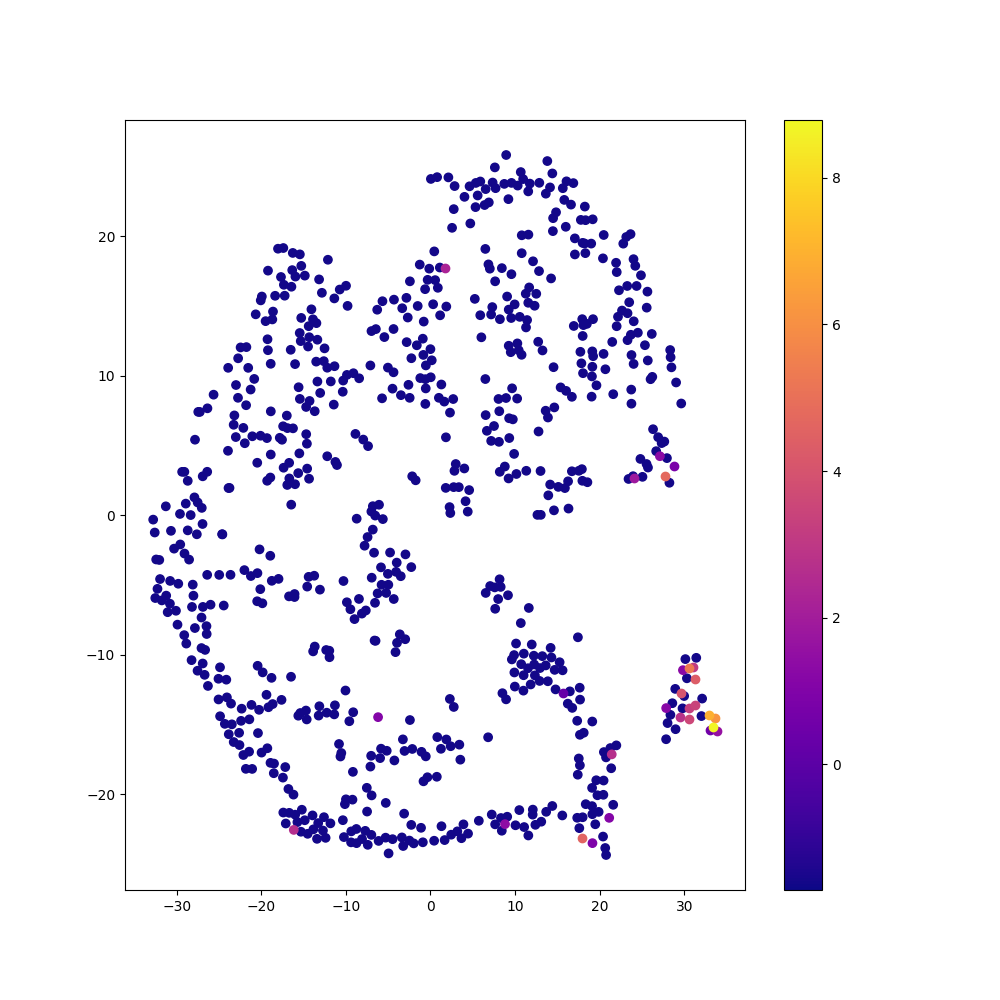
</div>
</div>


### rRT Fit with Autoencoder (representation layer = -2)

```python
    # Assume the data loading, model construction and compilation as shown in regular fit above.

    kde_bandwidth = imbal.regression.fit_kde(
            y_train,
            bin_count=64
        )
    densities = imbal.regression.get_sample_densities(
        y_train,
        kde_bandwidth
    )
    
    model.override_second_stage_fit_parameters(
        epochs=10000,
        callbacks=[
            keras.callbacks.EarlyStopping(patience=20, restore_best_weights=True)
        ]
    )
    
    model.rRT_fit(
        x_train,
        y_train,
        stratify_batches=True,
        validation_split=0.2,
        batch_size=512,
        epochs=10000,
        callbacks=[
            keras.callbacks.EarlyStopping(patience=20, restore_best_weights=True)
        ]
    )
```

<div style="display: flex; max-width: 100%;">
<div style="display:flex; flex-direction:column; flex:1; align-items:center; max-width:50%;">
<p>Prediction Plot</p>
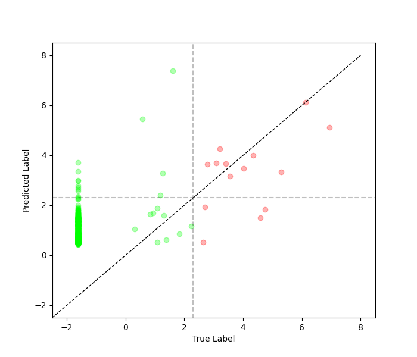
</div>
<div style="display:flex; flex-direction:column; flex:1; align-items:center; max-width:50%;">
<p>TSNE Visualization</p>
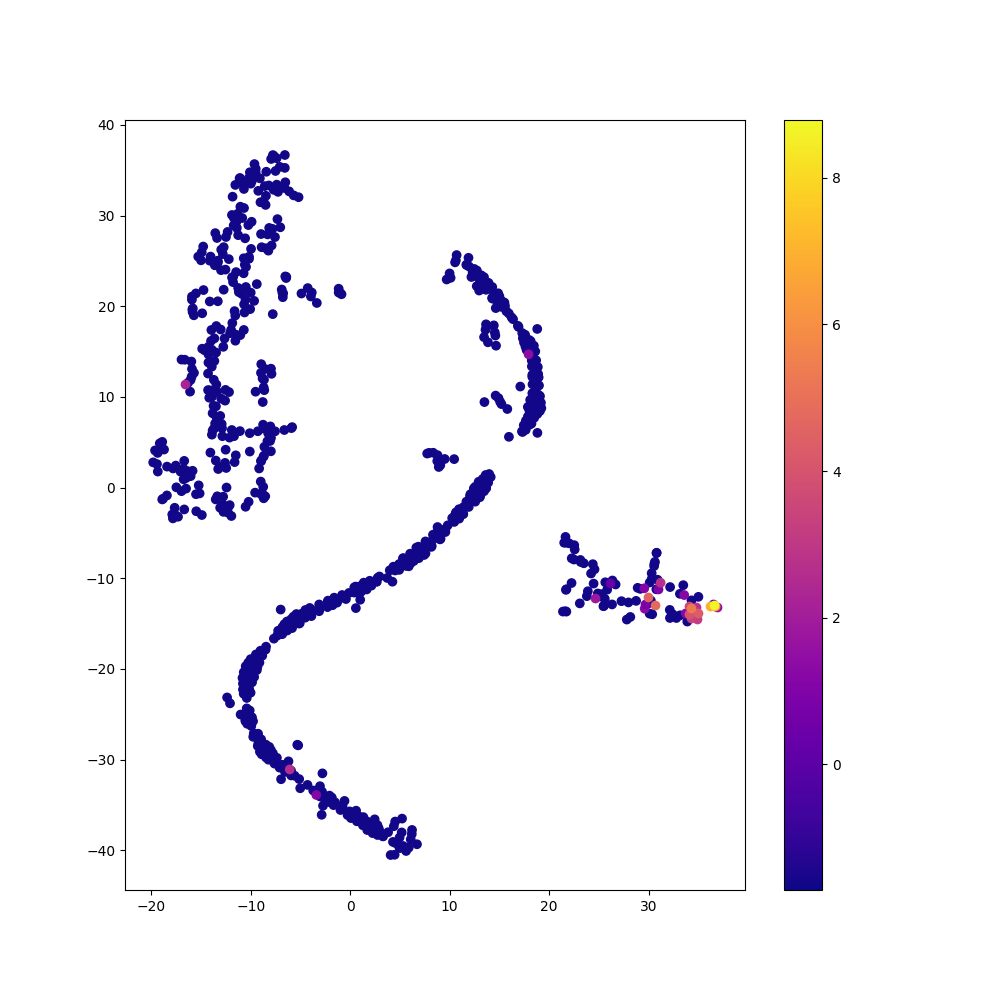
</div>
</div>

### Regular Fit with Autoencoder (representation layer = -3)

```python
    # Assume the data loading and model construction as shown in regular fit above.
    
    model.compile(
        loss="binary_crossentropy",
        optimizer=keras.optimizers.Adam(learning_rate=4e-4),
        metrics=["accuracy"],
        generate_decoder_branch=True,
        representation_layer_index=-3
    )
    
    model.fit(
        x_train,
        y_train,
        stratify_batches=True,
        validation_split=0.2,
        batch_size=512,
        epochs=10000,
        callbacks=[
            keras.callbacks.EarlyStopping(patience=20, restore_best_weights=True)
        ]
    )
```

<div style="display: flex; max-width: 100%;">
<div style="display:flex; flex-direction:column; flex:1; align-items:center; max-width:50%;">
<p>Prediction Plot</p>
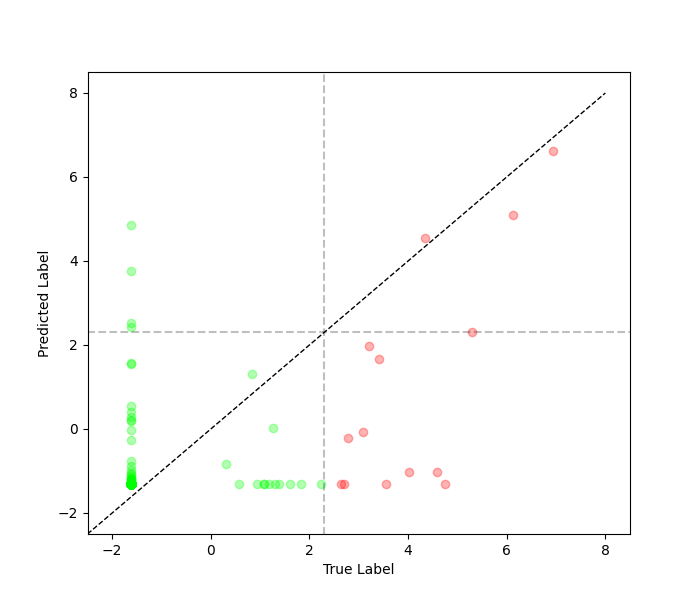
</div>
<div style="display:flex; flex-direction:column; flex:1; align-items:center; max-width:50%;">
<p>TSNE Visualization</p>
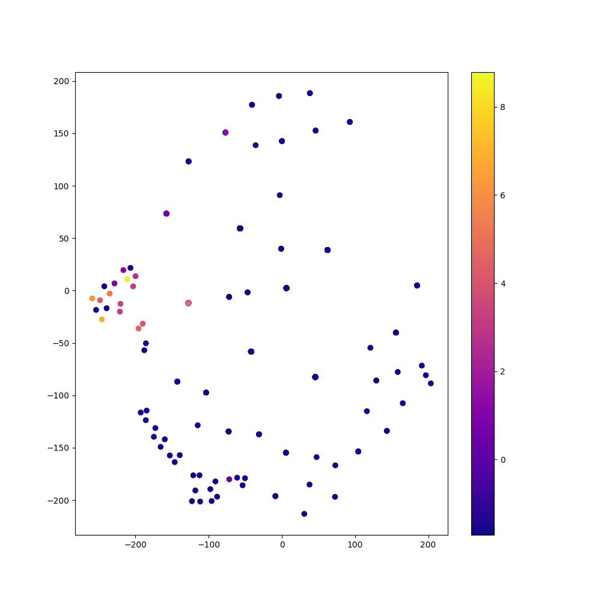
</div>
</div>

### Balanced Fit with Autoencoder (representation layer = -3)

```python
    # Assume the data loading, model construction and compilation as shown in regular fit above.

    kde_bandwidth = imbal.regression.fit_kde(
        y_train,
        bin_count=64
    )
    densities = imbal.regression.get_sample_densities(
        y_train,
        kde_bandwidth
    )
    
    model.balanced_fit(
        x_train,
        y_train,
        stratify_batches=True,
        validation_split=0.2,
        batch_size=512,
        epochs=10000,
        callbacks=[
            keras.callbacks.EarlyStopping(patience=20, restore_best_weights=True)
        ]
    )
```

<div style="display: flex; max-width: 100%;">
<div style="display:flex; flex-direction:column; flex:1; align-items:center; max-width:50%;">
<p>Prediction Plot</p>
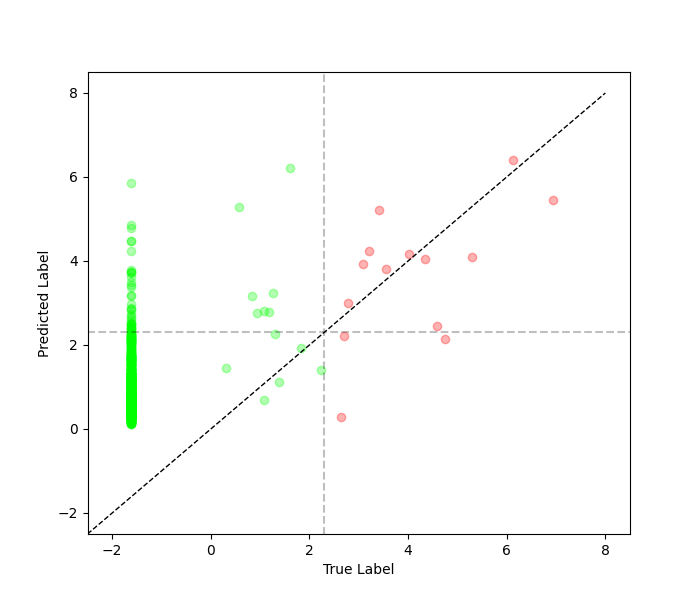
</div>
<div style="display:flex; flex-direction:column; flex:1; align-items:center; max-width:50%;">
<p>TSNE Visualization</p>
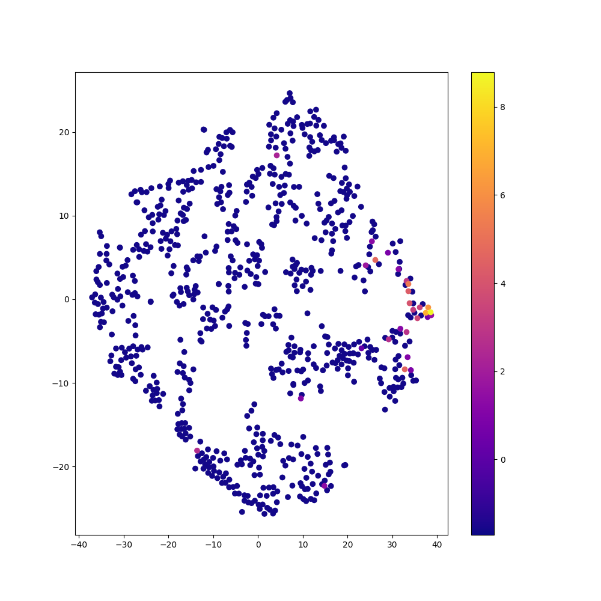
</div>
</div>

### rRT Fit with Autoencoder (representation layer = -3)

```python
    # Assume the data loading, model construction and compilation as shown in regular fit above.

    kde_bandwidth = imbal.regression.fit_kde(
        y_train,
        bin_count=64
    )
    densities = imbal.regression.get_sample_densities(
        y_train,
        kde_bandwidth
    )
    
    model.override_second_stage_fit_parameters(
        epochs=10000,
        callbacks=[
            keras.callbacks.EarlyStopping(patience=20, restore_best_weights=True)
        ]
    )
    
    model.rRT_fit(
        x_train,
        y_train,
        stratify_batches=True,
        validation_split=0.2,
        batch_size=512,
        epochs=10000,
        callbacks=[
            keras.callbacks.EarlyStopping(patience=20, restore_best_weights=True)
        ]
    )
```

<div style="display: flex; max-width: 100%;">
<div style="display:flex; flex-direction:column; flex:1; align-items:center; max-width:50%;">
<p>Prediction Plot</p>
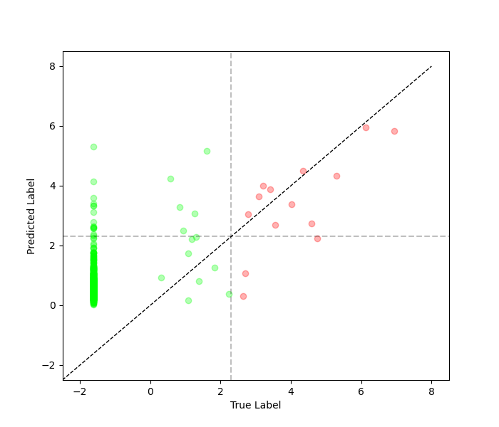
</div>
<div style="display:flex; flex-direction:column; flex:1; align-items:center; max-width:50%;">
<p>TSNE Visualization</p>
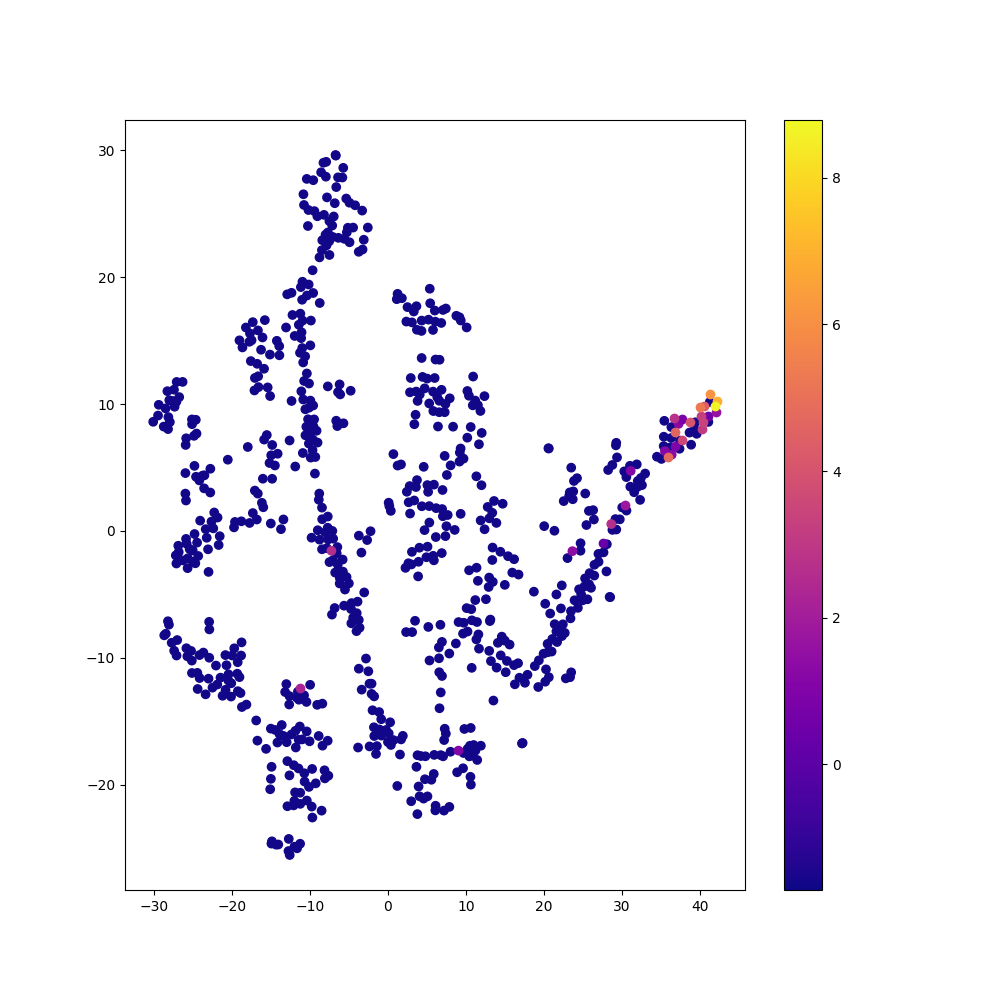
</div>
</div>

### Comparison of Methods

For the table below, frequent samples refer to samples whose label
$y < ln(10)$, and rare samples refer to samples whose label $y > ln(10)$.
$MSE_{freq}$ is the mean square error of the frequent samples, $MSE_{rare}$
is the mean square error of the rare samples, and $MSE_{av}=\frac{MSE_{freq}+MSE_{rare}}{2}$.

| Method   | Autoencoder? | Representation Layer Index | Epochs     | Time (s) | $MSE_{freq}$ | $MSE_{rare}$ | $MSE_{av}$ |
|----------|--------------|----------------------------|------------|----------|--------------|--------------|------------|
| Regular  | No           | N/A                        | $1124$     | $71.13$  | $0.469$      | $14.441$     | $7.455$    |
| Regular  | Yes          | $-2$                       | $391$      | $28.66$  | $0.271$      | $12.239$     | $6.255$    |
| Regular  | Yes          | $-3$                       | $1478$     | $120.95$ | $0.382$      | $17.176$     | $8.779$    |
| Balanced | No           | N/A                        | $95$       | $7.27$   | $8.001$      | $2.164$      | $5.083$    |
| Balanced | Yes          | $-2$                       | $121$      | $9.51$   | $7.823$      | $2.278$      | $5.051$    |
| Balanced | Yes          | $-3$                       | $163$      | $12.71$  | $7.592$      | $2.191$      | $4.892$    |
| rRT      | No           | $-2$                       | $1523/24$  | $102.64$ | $2.754$      | $5.574$      | $4.164$    |
| rRT      | No           | $-3$                       | $1162/32$  | $74.67$  | $4.533$      | $3.208$      | $3.871$    |
| rRT      | Yes          | $-2$                       | $379/337$  | $48.67$  | $6.461$      | $2.191$      | $4.891$    |
| rRT      | Yes          | $-3$                       | $1625/98$  | $127.37$ | $5.540$      | $2.222$      | $3.881$    |

See also: [Comparison of Fit Methods](comparison_of_fit_methods_tabular.md)