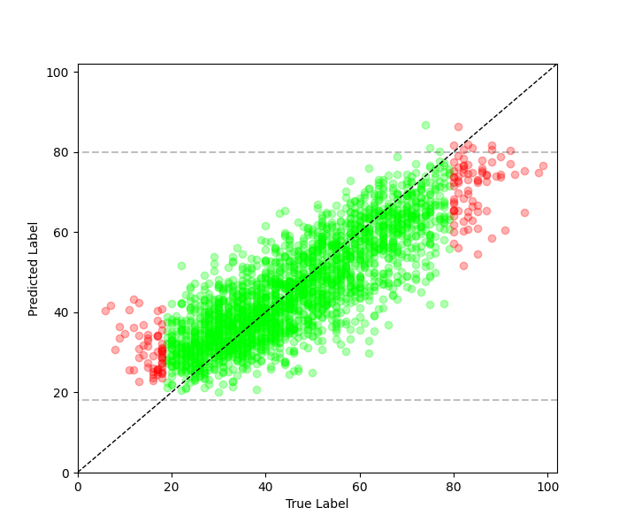
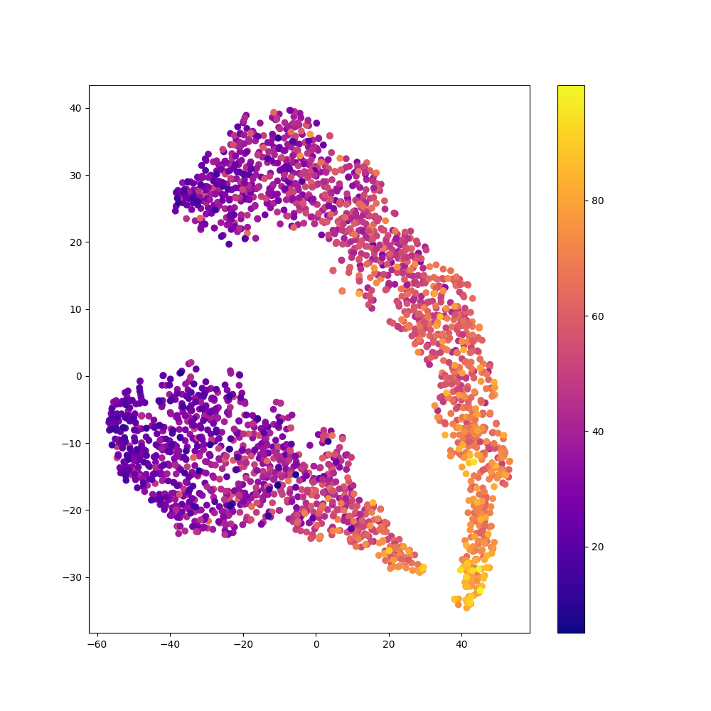
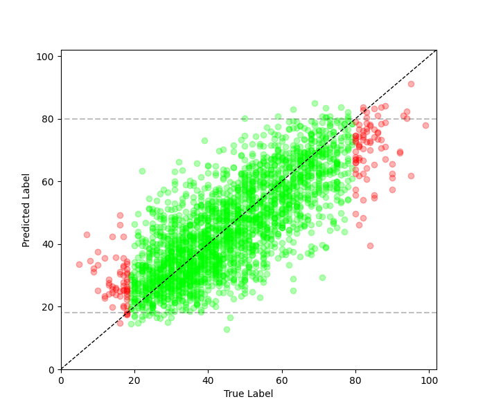
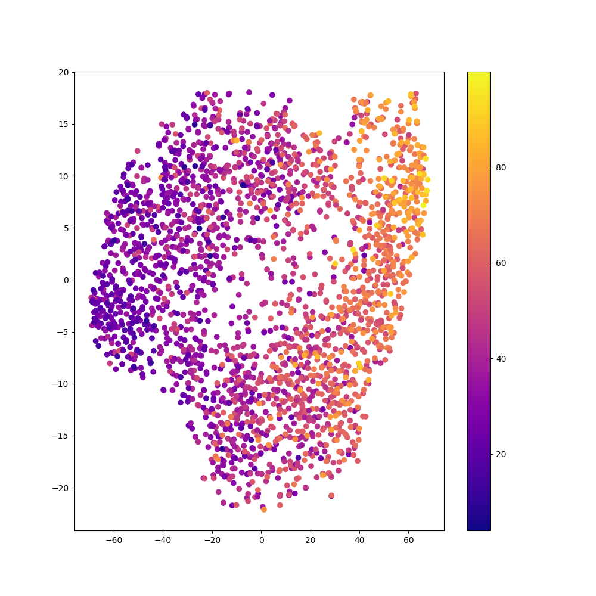
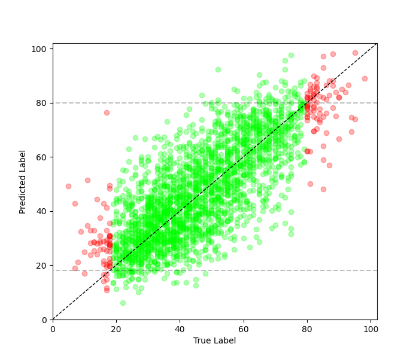
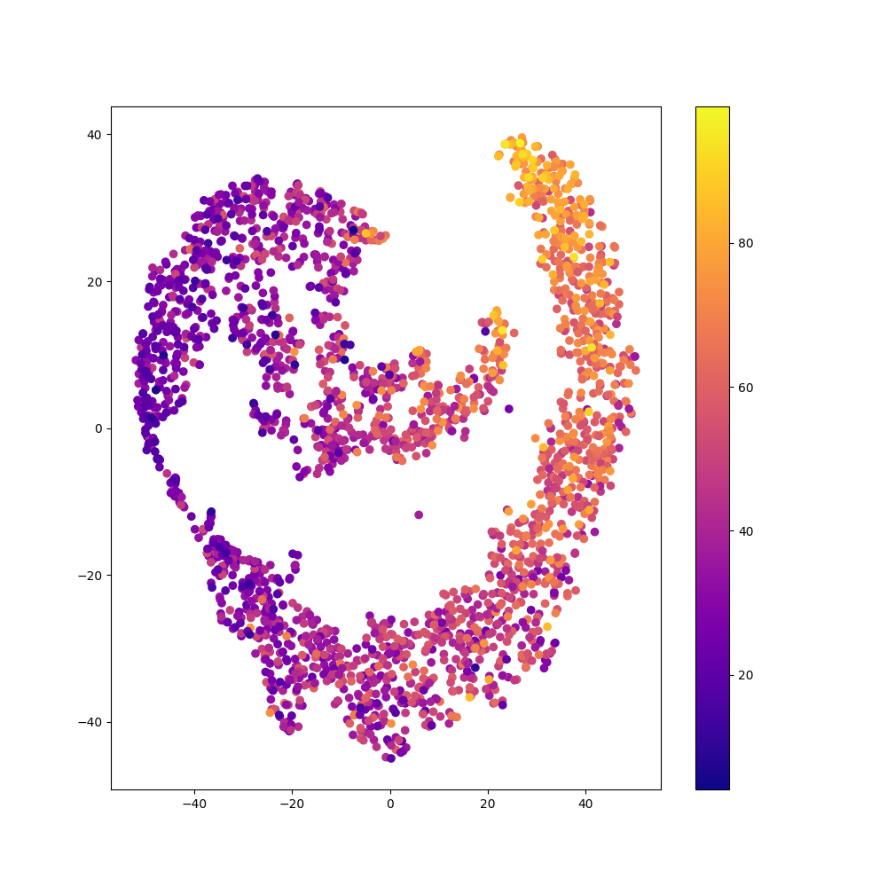
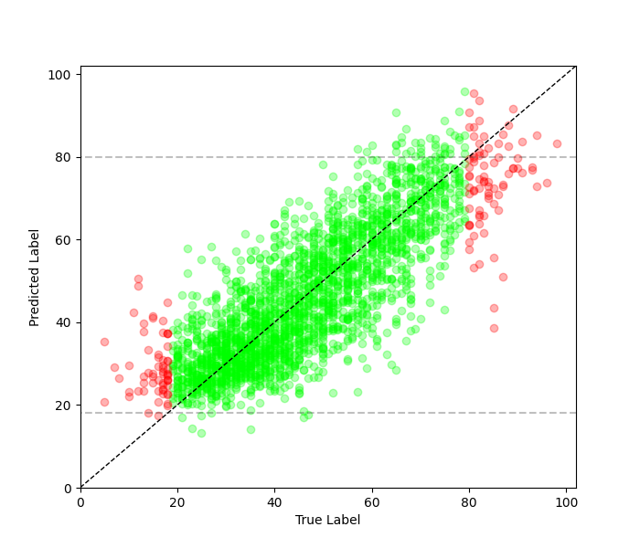
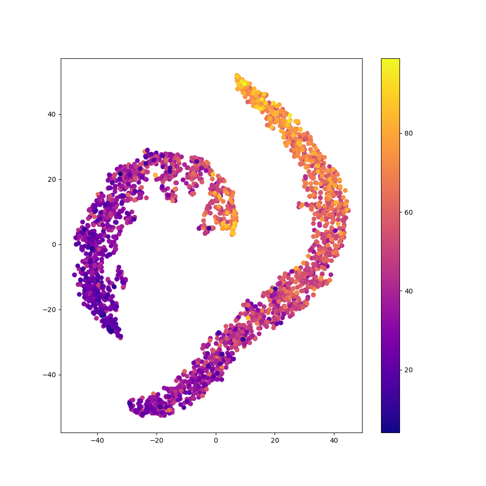

# Comparison of Methods: Regular vs. Balanced vs. rRT Fit on Image Regression

Below is a comparison of the [regression.Model object's](model.md) `balanced_fit`
and `decoupled_fit` functions, and a standard fit where instances are equally weighted,
on the [AgeDB dataset](https://ibug.doc.ic.ac.uk/resources/agedb/).

### Regular Fit

```python
    # Assume data has already been loaded into x_train, y_train, x_test, and y_test

    resnet = keras.applications.ResNet50(
        include_top=False,
        weights="imagenet",
        input_tensor=None,
        input_shape=(112, 88, 3),
        pooling='avg',
        name="resnet50",
    )
    resnet.trainable = True
    
    x = layers.Flatten()(resnet.output)
    x = layers.Dense(128, activation='relu')(x)
    x = layers.Flatten()(x)
    output = layers.Dense(1, activation='sigmoid')(x)

    model = imbal.regression.Model(inputs=resnet.input, outputs=output)

    model.compile(
        loss="mse",
        optimizer=keras.optimizers.Adam(learning_rate=4e-4),
        metrics=["mse"]
    )
    
    model.fit(
        x_train,
        y_train,
        stratify_batches=True,
        validation_split=0.2,
        batch_size=512,
        epochs=10000,
        callbacks=[
            keras.callbacks.EarlyStopping(patience=20, restore_best_weights=True)
        ]
    )
```

<div style="display: flex; max-width: 100%;">
<div style="display:flex; flex-direction:column; flex:1; align-items:center; max-width:50%;">
<p>Prediction Plot</p>

</div>
<div style="display:flex; flex-direction:column; flex:1; align-items:center; max-width:50%;">
<p>TSNE Visualization</p>

</div>
</div>

### Balanced Fit

```python
    # Assume the data loading, model construction and compilation as shown in regular fit above.

    kde_bandwidth = imbal.regression.fit_kde(
        y_train,
        bin_count=64
    )
    densities = imbal.regression.get_sample_densities(
        y_train,
        kde_bandwidth
    )

    model.balanced_fit(
        x_train,
        y_train,
        stratify_batches=True,
        sample_density=densities,
        validation_split=0.2,
        batch_size=512,
        epochs=10000,
        callbacks=[
            keras.callbacks.EarlyStopping(patience=20, restore_best_weights=True)
        ]
    )
```

<div style="display: flex; max-width: 100%;">
<div style="display:flex; flex-direction:column; flex:1; align-items:center; max-width:50%;">
<p>Prediction Plot</p>

</div>
<div style="display:flex; flex-direction:column; flex:1; align-items:center; max-width:50%;">
<p>TSNE Visualization</p>

</div>
</div>

### rRT Fit / Decoupled Fit (representation layer = -2)

```python
    # Assume the data loading and model construction as shown in regular fit above
    model.compile(
        loss="mse",
        optimizer=keras.optimizers.Adam(learning_rate=4e-4),
        metrics=["mse"],
        representation_layer_index=-2
    )
    
    kde_bandwidth = imbal.regression.fit_kde(
        y_train,
        bin_count=64
    )
    densities = imbal.regression.get_sample_densities(
        y_train,
        kde_bandwidth
    )
    
    model.override_second_stage_fit_parameters(
        epochs=10000,
        callbacks=[
            keras.callbacks.EarlyStopping(patience=20, restore_best_weights=True)
        ]
    )

    model.rRT_fit(
        x_train,
        y_train,
        stratify_batches=True,
        sample_density=densities,
        validation_split=0.2,
        batch_size=512,
        epochs=10000,
        callbacks=[
            keras.callbacks.EarlyStopping(patience=20, restore_best_weights=True)
        ]
    )
```

<div style="display: flex; max-width: 100%;">
<div style="display:flex; flex-direction:column; flex:1; align-items:center; max-width:50%;">
<p>Prediction Plot</p>

</div>
<div style="display:flex; flex-direction:column; flex:1; align-items:center; max-width:50%;">
<p>TSNE Visualization</p>

</div>
</div>

### rRT Fit / Decoupled Fit (representation layer = -3)

```python
    # Assume the data loading and model construction as shown in regular fit above
    model.compile(
        loss="mse",
        optimizer=keras.optimizers.Adam(learning_rate=4e-4),
        metrics=["mse"],
        representation_layer_index=-3
    )
    
    kde_bandwidth = imbal.regression.fit_kde(
        y_train,
        bin_count=64
    )
    densities = imbal.regression.get_sample_densities(
        y_train,
        kde_bandwidth
    )
    
    model.override_second_stage_fit_parameters(
        epochs=10000,
        callbacks=[
            keras.callbacks.EarlyStopping(patience=20, restore_best_weights=True)
        ]
    )

    model.rRT_fit(
        x_train,
        y_train,
        stratify_batches=True,
        sample_density=densities,
        validation_split=0.2,
        batch_size=512,
        epochs=10000,
        callbacks=[
            keras.callbacks.EarlyStopping(patience=20, restore_best_weights=True)
        ]
    )
```

<div style="display: flex; max-width: 100%;">
<div style="display:flex; flex-direction:column; flex:1; align-items:center; max-width:50%;">
<p>Prediction Plot</p>

</div>
<div style="display:flex; flex-direction:column; flex:1; align-items:center; max-width:50%;">
<p>TSNE Visualization</p>

</div>
</div>

### Comparison of Performance

For the table below, frequent samples refer to samples whose label
$18 < y < 80$, and rare samples refer to samples whose label $y \le 18$ or $y \ge 80$.
$MSE_{freq}$ is the mean square error of the frequent samples, $MSE_{rare}$
is the mean square error of the rare samples, and $MSE_{av}=\frac{MSE_{freq}+MSE_{rare}}{2}$.

| Method                            | Epochs    | Time (s)  | $MSE_{freq}$ | $MSE_{rare}$ | $MSE_{av}$ |
|-----------------------------------|-----------|-----------|--------------|--------------|------------|
| Regular                           | $815$     | $4549.04$ | $75.907$     | $285.797$    | $180.85$   |
| Balanced                          | $203$     | $1186.85$ | $113.209$    | $265.098$    | $189.15$   |
| rRT (representation layer = $-2$) | $83/45$   | $703.14$  | $143.920$    | $215.134$    | $179.52$   |
| rRT (representation layer = $-3$) | $1717/43$ | $8943.71$ | $92.885$     | $245.061$    | $168.97$   |