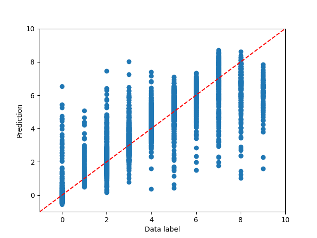
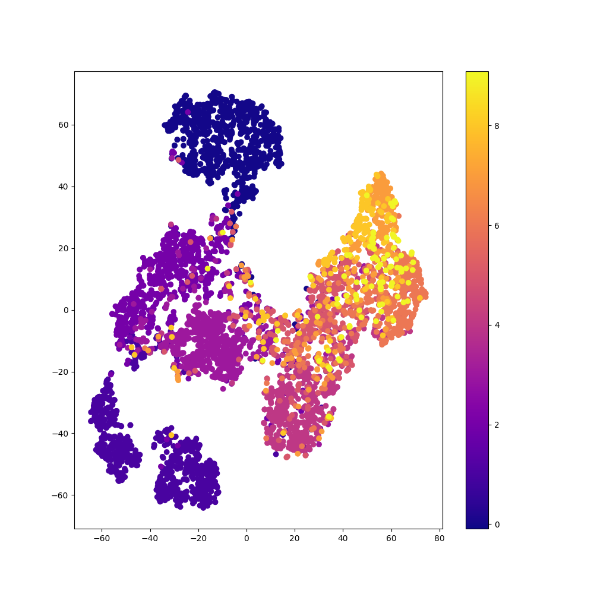
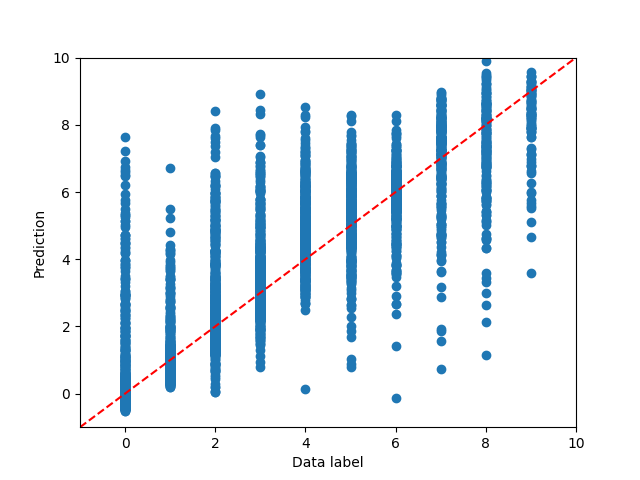
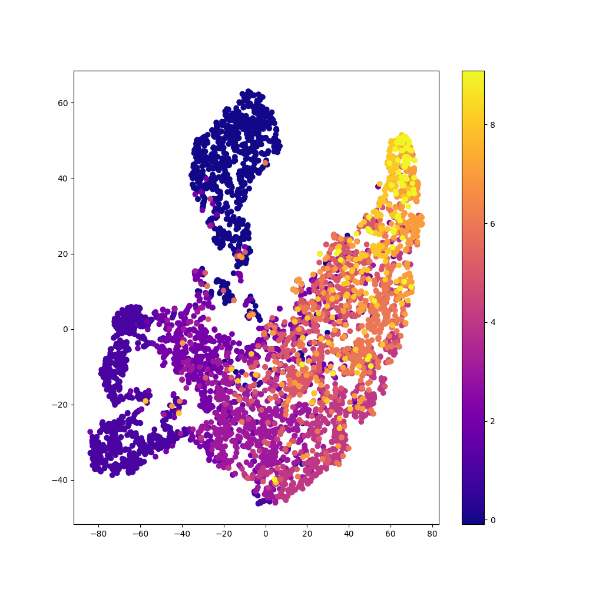
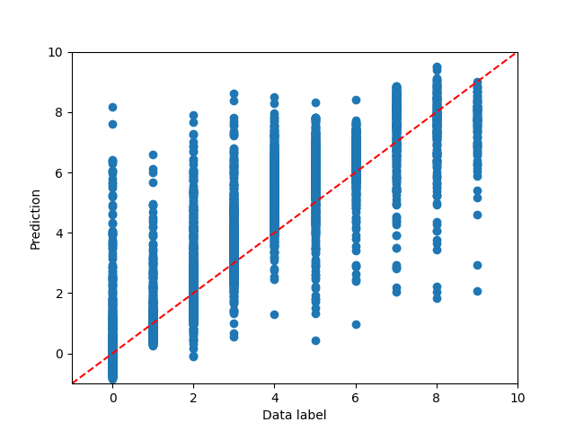
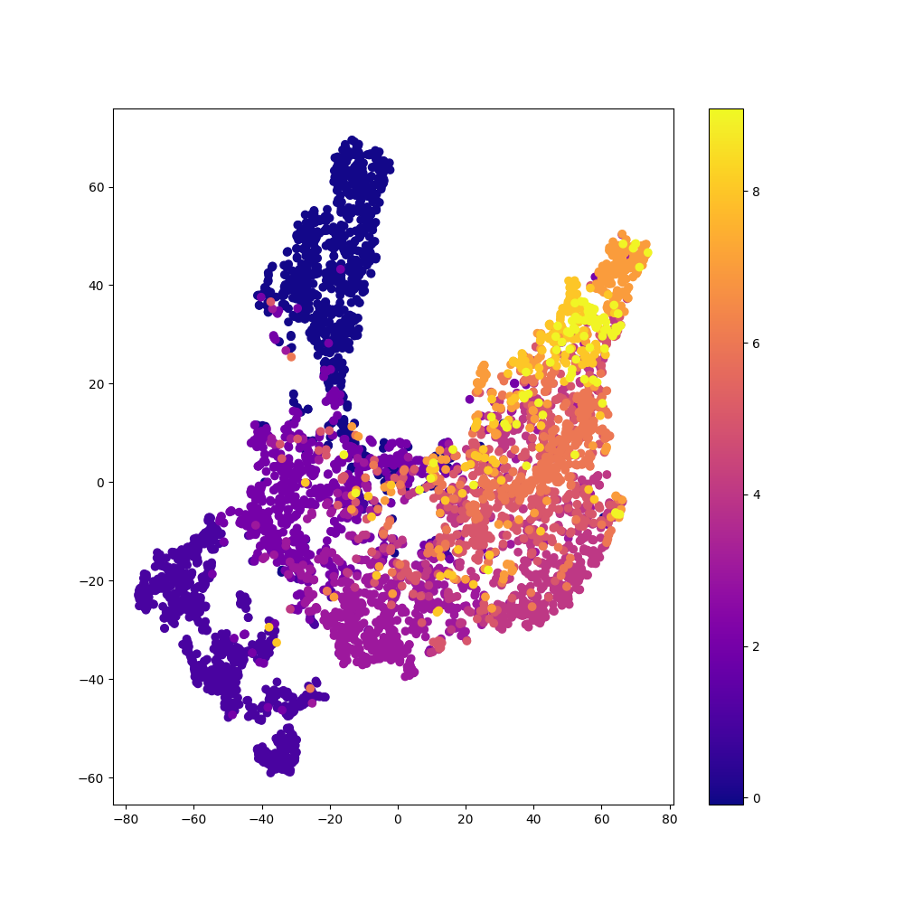

# Comparison of Methods: Regular vs. Balanced vs. Decoupled Fit on Image Data

Below is a comparison of [decoupled fit](rRT_fit.md) and [balanced fit](balanced_fit.md)
to a standard, unbalanced fit of the MNIST data set, altered so that
the proportion of samples of classes $0, 1, 2,..., 8, 9$ are at a
proportion of $10:9:8: ... :2:1$.

### Regular Fit

```python
    model.compile(
        loss="mse",
        optimizer=keras.optimizers.Adam(learning_rate=2e-5),
        metrics=["mse"]
    )
    model.fit(
        x_train,
        y_train,
        batch_size=batch_size,
        epochs=epochs
    )
```
    
<div style="display: flex; max-width: 100%; width:650px">


</div>

### Balanced Fit

```python
    compile_parameters = imbal.classification.wrap_model_compile_parameters(
        loss="mse",
        optimizer=keras.optimizers.Adam(learning_rate=2e-5),
        metrics=["mse"]
    )

    kde_fit_parameters = imbal.regression.wrap_kde_fit_parameters(
        bin_count=BIN_COUNT
    )
    
    imbal.classification.balanced_fit(
        model,
        x_train,
        y_train,
        compile_parameters=parameters,
        epochs=epochs,
        batch_size=batch_size
    )
```

<div style="display: flex; max-width: 100%; width:650px">


</div>

### Decoupled Fit

```python
    compile_parameters = imbal.classification.wrap_model_compile_parameters(
        loss="mse",
        optimizer=keras.optimizers.Adam(learning_rate=2e-5),
        metrics=["mse"]
    )

    kde_fit_parameters = imbal.regression.wrap_kde_fit_parameters(
        bin_count=BIN_COUNT
    )
    
    imbal.regression.decoupled_fit(
        model,
        x_train,
        y_train,
        compile_parameters=compile_parameters,
        kde_fit_parameters=kde_fit_parameters,
        epochs=epochs,
        batch_size=batch_size,
        representation_layer_index=-3
    )
```

<div style="display: flex; max-width: 100%; width:650px">


</div>

### Comparison of Performance

For the table below, common samples refer to samples whose label
falls in the range $[-1, 1]$, and rare samples are those whose label
falls outside of this range.

| Method    | Time (s) | Frequent Sample MSE (Class 0) | Rare Sample MSE (Class 9) |
|-----------|----------|-------------------------------|---------------------------| 
| Regular   | $85.31$  | $0.4929$                      | $9.3896$                  |
| Balanced  | $80.95$  | $1.8764$                      | $2.3904$                  |
| Decoupled | $111.84$ | $1.6591$                      | $3.6400$                  |

See also: [Comparison of Autoencoder Methods](comparison_of_ae_methods_image.md)