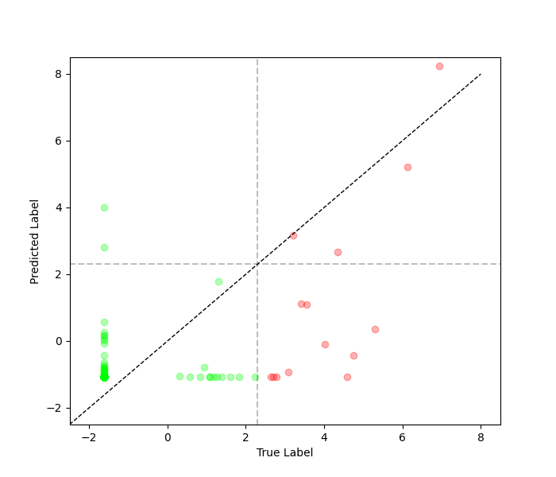
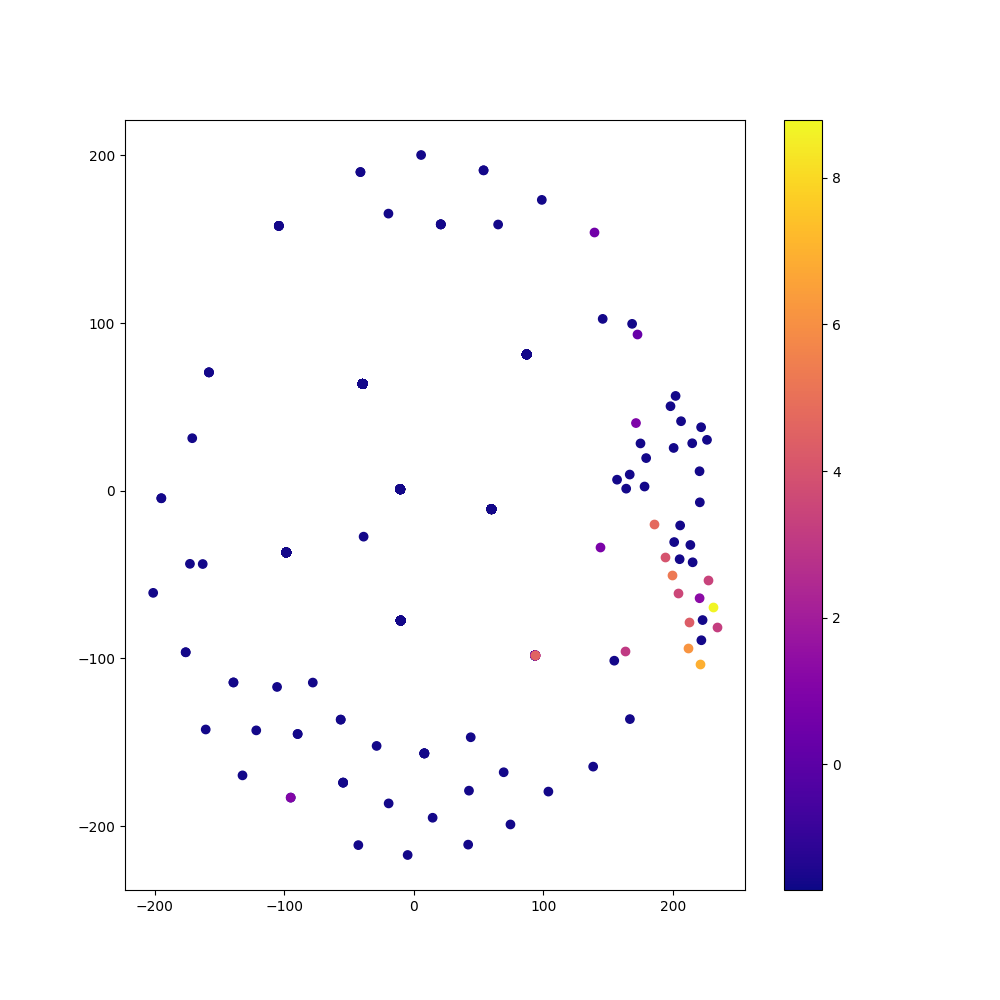
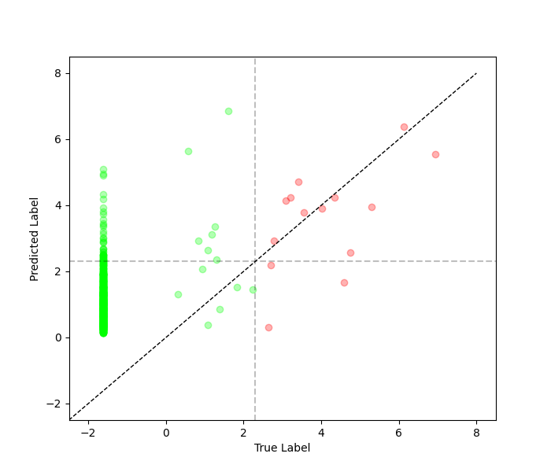
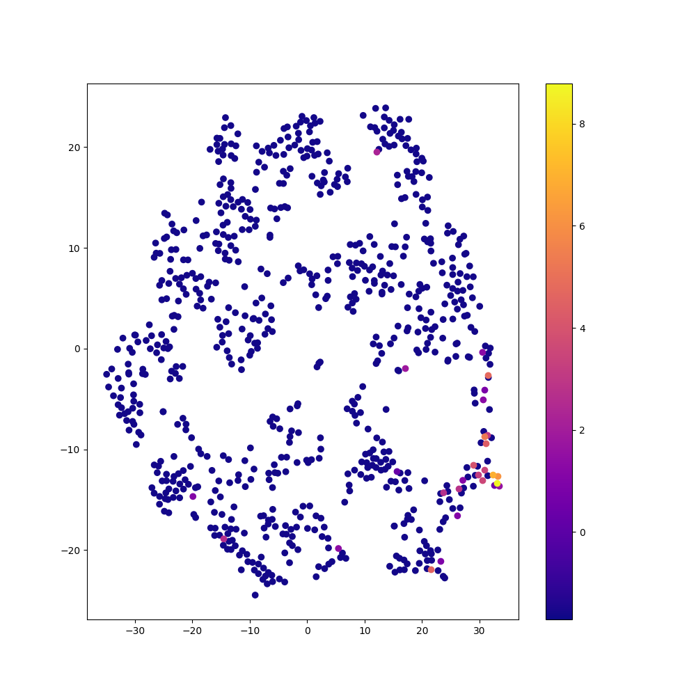
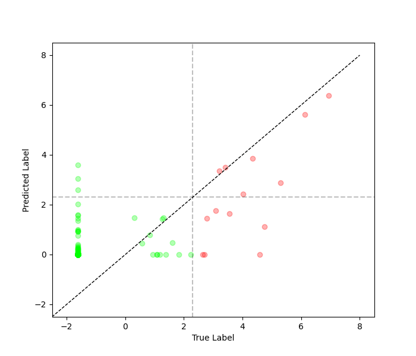
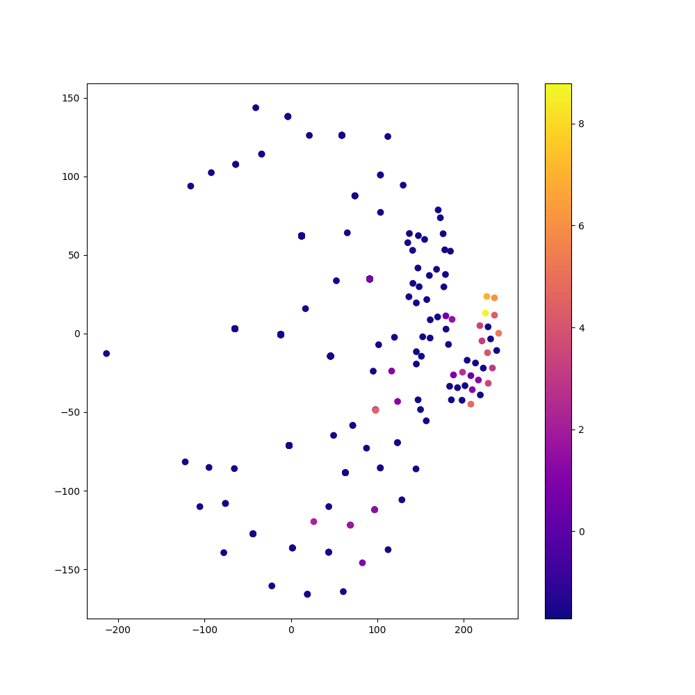
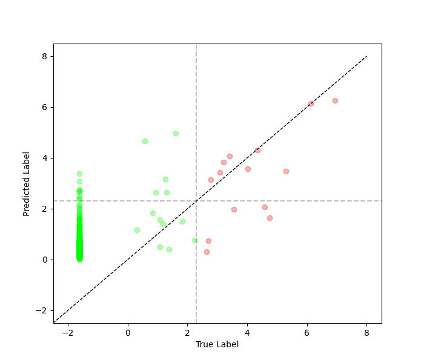
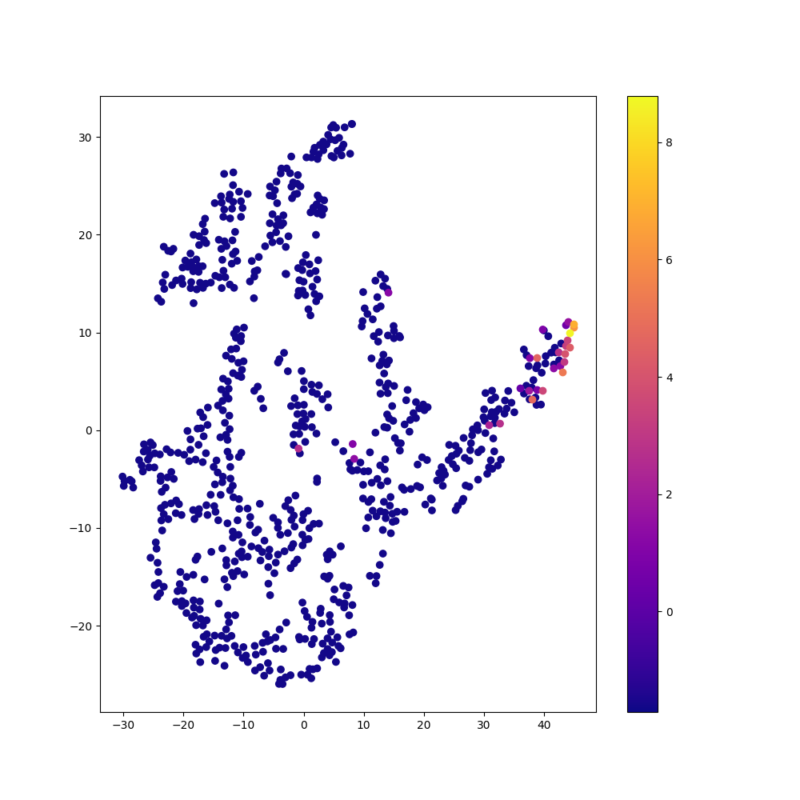

# Comparison of Methods: Regular vs. Balanced vs. rRT Fit on Tabular Data Regression

Below is a comparison of the [regression.Model object's](model.md) `balanced_fit`
and `decoupled_fit` functions, and a standard fit where instances are equally weighted,
on the dataset shown below, which contains 1,531 training samples and 766 test samples.

### Training Data Distribution


### Regular Fit

```python
    # Assume data has already been loaded into x_train, y_train, x_test, and y_test
    input_shape = x_train.shape[1:]

    inputs = keras.Input(shape=input_shape)
    x = layers.Dense(18, activation='relu')(inputs)
    x = layers.Dense(9, activation='relu')(x)
    x = layers.Flatten()(x)
    x = layers.Dense(6, activation='relu')(x)
    x = layers.Flatten()(x)
    output = layers.Dense(1, activation='linear')(x)

    model = imbal.regression.Model(inputs=inputs, outputs=output)

    model.compile(
        loss="mse",
        optimizer=keras.optimizers.Adam(learning_rate=4e-4),
        metrics=["mse"]
    )
    
    model.fit(
        x_train,
        y_train,
        stratify_batches=True,
        validation_split=0.2,
        batch_size=512,
        epochs=10000,
        callbacks=[
            keras.callbacks.EarlyStopping(patience=20, restore_best_weights=True)
        ]
    )
```

<div style="display: flex; max-width: 100%;">
<div style="display:flex; flex-direction:column; flex:1; align-items:center; max-width:50%;">
<p>Prediction Plot</p>

</div>
<div style="display:flex; flex-direction:column; flex:1; align-items:center; max-width:50%;">
<p>TSNE Visualization</p>

</div>
</div>

### Balanced Fit

```python
    # Assume the data loading, model construction and compilation as shown in regular fit above.

    kde_bandwidth = imbal.regression.fit_kde(
        y_train,
        bin_count=64
    )
    densities = imbal.regression.get_sample_densities(
        y_train,
        kde_bandwidth
    )

    model.balanced_fit(
        x_train,
        y_train,
        stratify_batches=True,
        sample_density=densities,
        validation_split=0.2,
        batch_size=512,
        epochs=10000,
        callbacks=[
            keras.callbacks.EarlyStopping(patience=20, restore_best_weights=True)
        ]
    )
```

<div style="display: flex; max-width: 100%;">
<div style="display:flex; flex-direction:column; flex:1; align-items:center; max-width:50%;">
<p>Prediction Plot</p>

</div>
<div style="display:flex; flex-direction:column; flex:1; align-items:center; max-width:50%;">
<p>TSNE Visualization</p>

</div>
</div>

### rRT Fit / Decoupled Fit (representation layer = -2)

```python
    # Assume the data loading and model construction as shown in regular fit above
    model.compile(
        loss="mse",
        optimizer=keras.optimizers.Adam(learning_rate=4e-4),
        metrics=["mse"],
        representation_layer_index=-2
    )
    
    kde_bandwidth = imbal.regression.fit_kde(
        y_train,
        bin_count=64
    )
    densities = imbal.regression.get_sample_densities(
        y_train,
        kde_bandwidth
    )
    
    model.override_second_stage_fit_parameters(
        epochs=10000,
        callbacks=[
            keras.callbacks.EarlyStopping(patience=20, restore_best_weights=True)
        ]
    )

    model.rRT_fit(
        x_train,
        y_train,
        stratify_batches=True,
        sample_density=densities,
        validation_split=0.2,
        batch_size=512,
        epochs=10000,
        callbacks=[
            keras.callbacks.EarlyStopping(patience=20, restore_best_weights=True)
        ]
    )
```

<div style="display: flex; max-width: 100%;">
<div style="display:flex; flex-direction:column; flex:1; align-items:center; max-width:50%;">
<p>Prediction Plot</p>

</div>
<div style="display:flex; flex-direction:column; flex:1; align-items:center; max-width:50%;">
<p>TSNE Visualization</p>

</div>
</div>

### rRT Fit / Decoupled Fit (representation layer = -3)

```python
    # Assume the data loading and model construction as shown in regular fit above
    model.compile(
        loss="mse",
        optimizer=keras.optimizers.Adam(learning_rate=4e-4),
        metrics=["mse"],
        representation_layer_index=-3
    )
    
    kde_bandwidth = imbal.regression.fit_kde(
        y_train,
        bin_count=64
    )
    densities = imbal.regression.get_sample_densities(
        y_train,
        kde_bandwidth
    )
    
    model.override_second_stage_fit_parameters(
        epochs=10000,
        callbacks=[
            keras.callbacks.EarlyStopping(patience=20, restore_best_weights=True)
        ]
    )

    model.rRT_fit(
        x_train,
        y_train,
        stratify_batches=True,
        sample_density=densities,
        validation_split=0.2,
        batch_size=512,
        epochs=10000,
        callbacks=[
            keras.callbacks.EarlyStopping(patience=20, restore_best_weights=True)
        ]
    )
```

<div style="display: flex; max-width: 100%;">
<div style="display:flex; flex-direction:column; flex:1; align-items:center; max-width:50%;">
<p>Prediction Plot</p>

</div>
<div style="display:flex; flex-direction:column; flex:1; align-items:center; max-width:50%;">
<p>TSNE Visualization</p>

</div>
</div>

### Comparison of Performance

For the table below, frequent samples refer to samples whose label
$y < ln(10)$, and rare samples refer to samples whose label $y > ln(10)$.
$MSE_{freq}$ is the mean square error of the frequent samples, $MSE_{rare}$
is the mean square error of the rare samples, and $MSE_{av}=\frac{MSE_{freq}+MSE_{rare}}{2}$.

| Method                            | Epochs    | Time (s) | $MSE_{freq}$ | $MSE_{rare}$ | $MSE_{av}$ |
|-----------------------------------|-----------|----------|--------------|--------------|------------|
| Regular                           | $1124$    | $71.13$  | $0.4685$     | $14.441$     | $7.455$    |
| Balanced                          | $95$      | $7.27$   | $8.001$      | $2.165$      | $5.083$    |
| rRT (representation layer = $-2$) | $1523/24$ | $102.64$ | $2.754$      | $5.574$      | $4.164$    |
| rRT (representation layer = $-3$) | $1162/32$ | $74.67$  | $4.533$      | $3.208$      | $3.871$    |

See also: [Comparison of Autoencoder Methods](comparison_of_ae_methods_tabular.md)