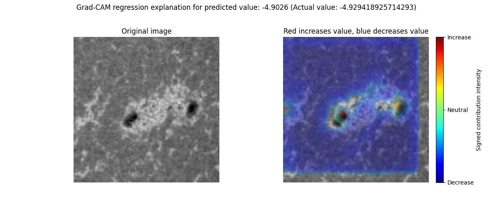
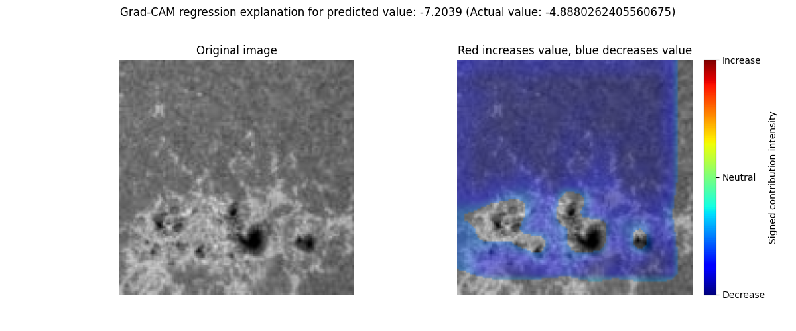

# gradcam_explain_image_sample

```{eval-rst}
.. autoclass:: imbal.regression.gradcam_explain_image_sample
```

Example:

```python
>>> # Assume a TensorFlow regression model is already trained
>>>
>>> x = x_test[0]
>>> y = y_test[0]
>>>
>>> fig = imbal.regression.gradcam_explain_image_sample(
>>>     x,
>>>     model,
>>>     actual_value=y
>>> )
```

## Plot Examples

### Example 1: Low Error Prediction

Below is an example of the resulting Matplotlib pyplot plot for a regression prediction where the predicted value is close to the actual value.

```python
>>> imbal.regression.gradcam_explain_image_sample(
>>>     x_accurate,
>>>     model,
>>>     actual_value=y_accurate
>>> )
```



The left panel shows the original image.

The right panel shows the Grad-CAM explanation. Regions highlighted in red contribute toward increasing the predicted regression value, while regions highlighted in blue contribute toward decreasing the predicted regression value. Color intensity corresponds to the magnitude of each region's contribution.

The figure title displays both the predicted value and the actual target value. The colorbar indicates whether image regions are contributing positively or negatively to the prediction.

### Example 2: Large Prediction Error

Below is an example of the resulting Matplotlib pyplot plot for a regression prediction where the predicted value differs substantially from the actual value.

```python
>>> imbal.regression.gradcam_explain_image_sample(
>>>     x_error,
>>>     model,
>>>     actual_value=y_error
>>> )
```



This example demonstrates how Grad-CAM can be used to investigate the regions of an image that most strongly influenced a prediction, even when the prediction error is relatively large.

As with the previous example, red regions indicate image areas that increase the predicted value, while blue regions indicate image areas that decrease the predicted value. The intensity of the color reflects the relative contribution magnitude.
