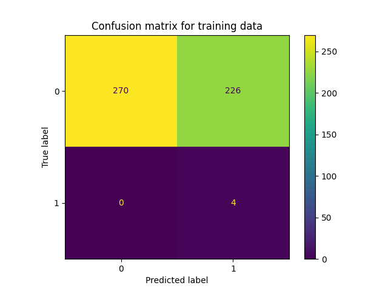
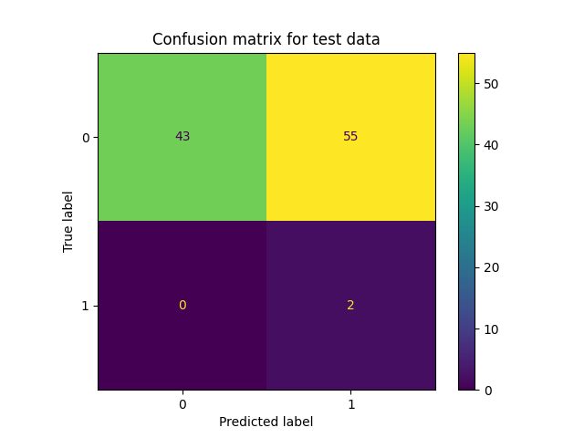

# Balanced Classification on SDOBenchmark

## Necessary Files

- All the source code in this tutorial can be found at `imbal/tutorials/SDO/sdo_classification_balanced_fit.py`
- The training data for this tutorial can be found at `imbal/tutorials/data/SDOBenchmark/training`
- The test data for this tutorial can be found at `imbal/tutorials/data/SDOBenchmark/test`

## 1. Import Packages

The following lines of code are used simply to import the packages
that are required for the entirety of this tutorial. It should
not generate any output, besides some potential warning messages
from TensorFlow.

```python
"""
Import packages
"""
import keras.metrics
import imbal
import os
import numpy as np
import matplotlib.pyplot as plt
from sklearn.metrics import confusion_matrix, ConfusionMatrixDisplay
from PIL import Image
from keras import layers, optimizers
```

## 2. Load Data

```python
"""
Load data
"""
SDO_DATA_PATH = '../data/SDOBenchmark' # Ensure data is located at this path

def load_sdo_data(data_path):
    # Load labels (log peak flux)
    with open(os.path.join(data_path, 'log_peak_flux.txt'), 'r') as file:
        contents = file.read().strip()
        loaded_data_fluxes = np.array([float(x) for x in contents.split('\n')])

    # Load images (10 images per sample, 256x256 per image)
    loaded_images = np.zeros((len(loaded_data_fluxes), 256, 256, 10), dtype=np.float32)
    for i in range(len(loaded_data_fluxes)):
        print(f'Loading SDO samples [{i+1}/{len(loaded_data_fluxes)}]', end='\r')
        image_list = [Image.open(os.path.join(data_path, f'sdo_subset_sample_{i}_image_{x}.jpg')).convert('L') for x in range(10)]
        stacked_images = np.stack(image_list, axis=-1) # Images stacked along channels
        loaded_images[i] = stacked_images / 255.0 # Normalize black and white pixel values from 0 to 1

    print(f'\n{len(loaded_data_fluxes)} data samples loaded successfully')
    return loaded_images, loaded_data_fluxes

# Load train and test data via function defined above
x_train, y_train = load_sdo_data(os.path.join(SDO_DATA_PATH, 'training'))
x_test, y_test = load_sdo_data(os.path.join(SDO_DATA_PATH, 'test'))
y_train = (y_train > -4).astype(np.int32)
y_test = (y_test > -4).astype(np.int32)

print(
    f'Loaded data with the following shapes:\n'
    f'\tx_train: {x_train.shape}\n'
    f'\ty_train: {y_train.shape}\n'
    f'\tx_test: {x_test.shape}\n'
    f'\ty_test {y_test.shape}'
)
```

The above code should generate an output similar to the following.
The output below is the result of loading the first 50 samples from
the training and test sets.

```
Loading SDO samples [500/500]
500 data samples loaded successfully
Loading SDO samples [100/100]
100 data samples loaded successfully
Loaded data with the following shapes:
	x_train: (500, 256, 256, 10)
	y_train: (500,)
	x_test: (100, 256, 256, 10)
	y_test (100,)
```

## 3. Build the Model

The following code builds a model using Keras layers. Note this is the first
time in this tutorial that the `imbal` package is being used, as where you
might normally instance a `keras.Model` object, we instead instance a
`imbal.classification.Model` object.

```python
"""
Build model
"""
def build_simple_cnn():
    input_layer = layers.Input((256, 256, 10))
    x = layers.Conv2D(32, 3, activation='relu')(input_layer)
    x = layers.MaxPooling2D()(x)

    x = layers.Conv2D(64, 3, activation='relu')(x)
    x = layers.MaxPooling2D()(x)

    x = layers.Conv2D(128, 3, activation='relu')(x)
    x = layers.MaxPooling2D()(x)

    x = layers.GlobalAveragePooling2D()(x)
    x = layers.Dense(128, activation='relu')(x)
    x = layers.Dropout(0.5)(x)
    output_layer = layers.Dense(1, activation='sigmoid')(x)

    model = imbal.classification.Model(inputs=input_layer, outputs=output_layer)
    model.summary()
    return model

model = build_simple_cnn()
```

The above code should produce the following output:

```
Model: "model"
┏━━━━━━━━━━━━━━━━━━━━━━━━━━━━━━━━━┳━━━━━━━━━━━━━━━━━━━━━━━━┳━━━━━━━━━━━━━━━┓
┃ Layer (type)                    ┃ Output Shape           ┃       Param # ┃
┡━━━━━━━━━━━━━━━━━━━━━━━━━━━━━━━━━╇━━━━━━━━━━━━━━━━━━━━━━━━╇━━━━━━━━━━━━━━━┩
│ input_layer (InputLayer)        │ (None, 256, 256, 10)   │             0 │
├─────────────────────────────────┼────────────────────────┼───────────────┤
│ conv2d (Conv2D)                 │ (None, 254, 254, 32)   │         2,912 │
├─────────────────────────────────┼────────────────────────┼───────────────┤
│ max_pooling2d (MaxPooling2D)    │ (None, 127, 127, 32)   │             0 │
├─────────────────────────────────┼────────────────────────┼───────────────┤
│ conv2d_1 (Conv2D)               │ (None, 125, 125, 64)   │        18,496 │
├─────────────────────────────────┼────────────────────────┼───────────────┤
│ max_pooling2d_1 (MaxPooling2D)  │ (None, 62, 62, 64)     │             0 │
├─────────────────────────────────┼────────────────────────┼───────────────┤
│ conv2d_2 (Conv2D)               │ (None, 60, 60, 128)    │        73,856 │
├─────────────────────────────────┼────────────────────────┼───────────────┤
│ max_pooling2d_2 (MaxPooling2D)  │ (None, 30, 30, 128)    │             0 │
├─────────────────────────────────┼────────────────────────┼───────────────┤
│ global_average_pooling2d        │ (None, 128)            │             0 │
│ (GlobalAveragePooling2D)        │                        │               │
├─────────────────────────────────┼────────────────────────┼───────────────┤
│ dense (Dense)                   │ (None, 128)            │        16,512 │
├─────────────────────────────────┼────────────────────────┼───────────────┤
│ dropout (Dropout)               │ (None, 128)            │             0 │
├─────────────────────────────────┼────────────────────────┼───────────────┤
│ dense_1 (Dense)                 │ (None, 1)              │           129 │
└─────────────────────────────────┴────────────────────────┴───────────────┘
 Total params: 111,905 (437.13 KB)
 Trainable params: 111,905 (437.13 KB)
 Non-trainable params: 0 (0.00 B)
```

## 4. Model Compilation and Training

The code below compiles the model is a manner identical to the `keras.Model`
object, then performs a model fit on the training data. We call `Model.balanced_fit`
instead of the standard `Model.fit`, which will perform a class-balanced fit on the
training data, where each data class is equally weighted.

Notably, the
`imbal.classification.Model` object can take an extra parameter in its `Model.balanced_fit`
function, called `stratify_batches`. This parameter ensures that rarer
samples are present in each batch during training.

```python
"""
Compile and train model
"""
LEARNING_RATE = 5e-5
EPOCHS = 20
BATCH_SIZE = 64

model.compile(
    optimizer=optimizers.Adam(learning_rate=LEARNING_RATE),
    loss='binary_crossentropy',
    metrics=['accuracy', keras.metrics.F1Score(threshold=0.5)],
)

model.balanced_fit(
    x_train,
    y_train.reshape(-1, 1),
    epochs=EPOCHS,
    batch_size=BATCH_SIZE,
    stratify_batches=True # Ensure all batches have a similar data distribution
)

model.evaluate(x_test, y_test.reshape(-1, 1))
```

The above code should produce the standard TensorFlow output for model
training and evaluation.

## 6. Accuracy and Results Visualization

The following code outputs the overall accuracy, as well as the
accuracy for the frequent and rare data in both the training and
test sets, along with plotting confusion matrices for the
training and test set.

```python
"""
Data and results visualization
"""
KDE_BIN_COUNT=32

train_rare_mask = y_train == 1
test_rare_mask = y_test == 1
train_frequent_mask = ~train_rare_mask
test_frequent_mask = ~test_rare_mask
print('Number of frequent training samples:', np.sum(train_frequent_mask))
print('Number of rare training samples:', np.sum(train_rare_mask))
print('Number of frequent test samples:', np.sum(test_frequent_mask))
print('Number of rare test samples:', np.sum(test_rare_mask))

# Predict on training data
train_predictions = []
for i in range(0, len(x_train), BATCH_SIZE):
    batch = x_train[i:i+BATCH_SIZE]
    train_predictions.append(model.predict(batch))
train_predictions = np.concatenate(train_predictions, axis=0)
train_predictions = train_predictions.reshape(-1)

# Predict on test data
test_predictions = []
for i in range(0, len(x_test), BATCH_SIZE):
    batch = x_test[i:i+BATCH_SIZE]
    test_predictions.append(model.predict(batch))
test_predictions = np.concatenate(test_predictions, axis=0)
test_predictions = test_predictions.reshape(-1)

train_predictions_rare = train_predictions[train_rare_mask] # Mask rare training data
train_labels_rare = y_train[train_rare_mask] # Mask predictions on rare training data
test_predictions_rare = test_predictions[test_rare_mask] # Mask rare test data
test_labels_rare = y_test[test_rare_mask] # Mask predictions on rare test data
train_predictions_frequent = train_predictions[train_frequent_mask] # Mask frequent training data
train_labels_frequent = y_train[train_frequent_mask] # Mask predictions on frequent training data
test_predictions_frequent = test_predictions[test_frequent_mask] # Mask frequent test data
test_labels_frequent = y_test[test_frequent_mask] # Mask predictions on frequent test data

# Calculate metrics
overall_train_acc = np.mean((np.round(train_predictions) == y_train).astype(np.int32))
frequent_train_acc = np.mean((np.round(train_predictions_frequent) == train_labels_frequent).astype(np.int32))
rare_train_acc = np.mean((np.round(train_predictions_rare) == train_labels_rare).astype(np.int32))
overall_test_acc = np.mean((np.round(test_predictions) == y_test).astype(np.int32))
frequent_test_acc = np.mean((np.round(test_predictions_frequent) == test_labels_frequent).astype(np.int32))
rare_test_acc = np.mean((np.round(test_predictions_rare) == test_labels_rare).astype(np.int32))

print(
    f'Overall train accuracy: {overall_train_acc*100:.1f}%\n'
    f'Frequent train accuracy: {frequent_train_acc*100:.1f}%\n'
    f'Rare train accuracy: {rare_train_acc*100:.1f}%\n'
    f'Overall test accuracy: {overall_test_acc*100:.1f}%\n'
    f'Frequent test accuracy: {frequent_test_acc*100:.1f}%\n'
    f'Rare test accuracy: {rare_test_acc*100:.1f}%'
)

cm = confusion_matrix(y_train, np.round(train_predictions))
disp = ConfusionMatrixDisplay(confusion_matrix=cm)
disp.plot()
plt.title('Confusion matrix for training data')
plt.savefig('sample-sdo-regular-fit-confusion-matrix-training.png')
plt.show()

cm = confusion_matrix(y_test, np.round(test_predictions))
disp = ConfusionMatrixDisplay(confusion_matrix=cm)
disp.plot()
plt.title('Confusion matrix for test data')
plt.savefig('sample-sdo-regular-fit-confusion-matrix-test.png')
plt.show()
```

Below are examples of what the generated output and plots should look 
like for the above code.

```
Number of frequent training samples: 496
Number of rare training samples: 4
Number of frequent test samples: 98
Number of rare test samples: 2

Overall train accuracy: 54.8%
Frequent train accuracy: 54.4%
Rare train accuracy: 100.0%
Overall test accuracy: 45.0%
Frequent test accuracy: 43.9%
Rare test accuracy: 100.0%
```

<div style="display: flex; gap: 8px; max-width: 100%;">


</div>
