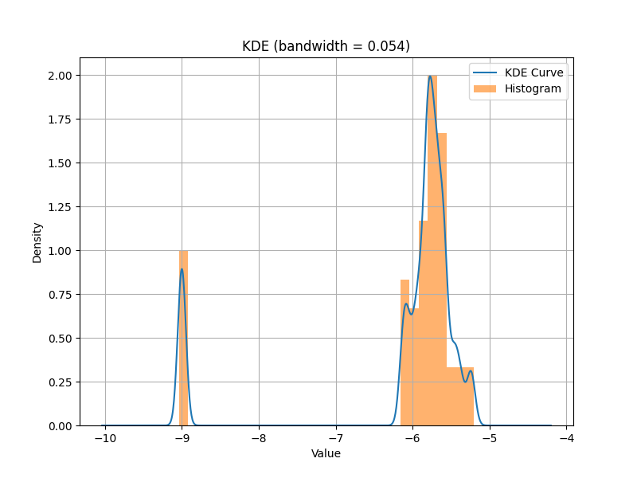
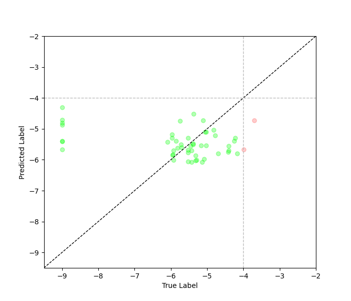

# Balanced Regression on Imbalanced Image Data

The purpose of this tutorial is to outline the necessary steps
to perform a balanced regression model training and evaluation
with image data using `imbal`.  In this example, all data samples
used in training are weighted inversely proportional to their
sample density, using KDE to approximate the density curve of the
training data.

All the code shown in this
tutorial, along with the dataset used, can be found in the
`tutorials/SDO` folder in the `imbal` repository.

## Import Packages

The following lines of code are used simply to import the packages
that are required for the entirety of this tutorial. It should
not generate any output, besides some potential warning messages
from TensorFlow.

```python
"""
Import packages
"""
import imbal
import os, glob, math
from datetime import datetime, timedelta
import pandas as pd
import numpy as np
import matplotlib.pyplot as plt
from PIL import Image
from keras import layers, optimizers
```

## Load Data

The data used in this tutorial is a subset of the
[SDOBenchmark dataset](https://i4ds.github.io/SDOBenchmark/).
The following code loads the SDO image data for only those samples
that have all ten images available from the timestamp ten minutes
before the prediction time. The constants at the top of the following
code block can be used to set the path from which the data is loaded
from, as well as the maximum number of samples to load from the
training or test sets, or `None` to load all available samples.

```python
"""
Load data
"""
SDO_DATA_PATH = '../data/SDOBenchmark'
TRAINING_DATA_MAX_SIZE = None
TESTING_DATA_MAX_SIZE = None

def load_sdo_data(data_path, max_samples=None):
    df = pd.read_csv(os.path.join(data_path, 'meta_data.csv'))
    good_file_paths = []
    good_file_fluxes = []
    for i in range(len(df)):
        timestamp_id = df['id'][i]
        log_peak_flux = math.log10(float(df['peak_flux'][i]))
        print(f'Finding data from "{data_path}" [{i+1}/{len(df["id"])}]', end='\r')
        timestamp_portions = str(timestamp_id).split('_')
        folder_path = str(os.path.join(data_path, timestamp_portions[0]))
        sub_folder_path = str(os.path.join(folder_path, '_'.join(timestamp_portions[1:])))
        if not os.path.exists(sub_folder_path):
            continue

        folder_timestamp = datetime.strptime("_".join(timestamp_portions[-4:-1]), '%H_%M_%S')
        minus_ten_minutes = folder_timestamp - timedelta(minutes=10)
        images = glob.glob(os.path.join(sub_folder_path, '*.jpg'))

        def within_five_seconds(image_name, timestamp):
            image_time_string = image_name.split('T')[1][:6]
            image_timestamp = datetime.strptime(image_time_string, '%H%M%S')
            return abs((timestamp - image_timestamp).total_seconds()) < 5

        minus_ten_images = [x for x in images if within_five_seconds(x, minus_ten_minutes)]
        if len(minus_ten_images) == 10:
            good_file_paths.append(minus_ten_images)
            good_file_fluxes.append(log_peak_flux)

        if max_samples is not None and len(good_file_paths) == max_samples:
            print('\nFound maximum number of samples. Stopping early.',end='\r')
            break


    loaded_images = np.zeros((len(good_file_paths), 256, 256, 10))
    loaded_data_fluxes = np.array(good_file_fluxes)

    print()
    for index, image_paths in enumerate(good_file_paths):
        print(f'Loading SDO samples [{index+1}/{len(good_file_paths)}]', end='\r')
        image_list = [Image.open(x).convert('L') for x in image_paths]
        stacked_images = np.stack(image_list, axis=-1)
        loaded_images[index] = stacked_images / 255.0

    print(f'\n{len(good_file_paths)} data samples loaded successfully')
    return loaded_images, loaded_data_fluxes

x_train, y_train = load_sdo_data(os.path.join(SDO_DATA_PATH, 'training'), max_samples=TRAINING_DATA_MAX_SIZE)
x_test, y_test = load_sdo_data(os.path.join(SDO_DATA_PATH, 'test'), max_samples=TESTING_DATA_MAX_SIZE)

print(
    f'Loaded data with the following shapes:\n'
    f'\tx_train: {x_train.shape}\n'
    f'\ty_train: {y_train.shape}\n'
    f'\tx_test: {x_test.shape}\n'
    f'\ty_test {y_test.shape}'
)
```

The above code should generate an output similar to the following.
The output below is the result of loading the first 50 samples from
the training and test sets.

```
Finding data from "../data/SDOBenchmark/training" [64/8336]
Found maximum number of samples. Stopping early.
Loading SDO samples [50/50]
50 data samples loaded successfully
Finding data from "../data/SDOBenchmark/test" [66/886]
Found maximum number of samples. Stopping early.
Loading SDO samples [50/50]
50 data samples loaded successfully
Loaded data with the following shapes:
	x_train: (50, 256, 256, 10)
	y_train: (50,)
	x_test: (50, 256, 256, 10)
	y_test (50,)
```

## Calculate Sample Densities

The following code creates a KDE curve fitted to the labels of the training set, then
uses the KDE to generate per-sample density values. When passed to `imbal.balanced_fit`,
the reciprocal of these densities is used to weight the training samples, putting a larger
emphasis on those samples appear infrequently in the training set.

```python
"""
Calculate data density distribution, and extract sample densities
"""
KDE_BIN_COUNT=32

data_kde_bandwidth = imbal.regression.fit_kde(y_train, bin_count=KDE_BIN_COUNT)
sample_densities = imbal.regression.get_sample_densities(y_train, data_kde_bandwidth)
```

## Build the Model

The following code builds a model using Keras layers. Note this is the first
time in this tutorial that the `imbal` package is being used, as where you
might normally instance a `keras.Model` object, we instead instance a
`imbal.regression.Model` object.

```python
"""
Build model
"""
def build_simple_cnn():
    input_layer = layers.Input((256, 256, 10))
    x = layers.Conv2D(32, 3, activation='relu')(input_layer)
    x = layers.MaxPooling2D()(x)

    x = layers.Conv2D(64, 3, activation='relu')(x)
    x = layers.MaxPooling2D()(x)

    x = layers.Conv2D(128, 3, activation='relu')(x)
    x = layers.MaxPooling2D()(x)

    x = layers.GlobalAveragePooling2D()(x)
    x = layers.Dense(128, activation='relu')(x)
    x = layers.Dropout(0.5)(x)
    output_layer = layers.Dense(1)(x)

    model = imbal.regression.Model(inputs=input_layer, outputs=output_layer)
    model.summary()
    return model

model = build_simple_cnn()
```

The above code should produce the following output:

```
Model: "model"
┏━━━━━━━━━━━━━━━━━━━━━━━━━━━━━━━━━┳━━━━━━━━━━━━━━━━━━━━━━━━┳━━━━━━━━━━━━━━━┓
┃ Layer (type)                    ┃ Output Shape           ┃       Param # ┃
┡━━━━━━━━━━━━━━━━━━━━━━━━━━━━━━━━━╇━━━━━━━━━━━━━━━━━━━━━━━━╇━━━━━━━━━━━━━━━┩
│ input_layer (InputLayer)        │ (None, 256, 256, 10)   │             0 │
├─────────────────────────────────┼────────────────────────┼───────────────┤
│ conv2d (Conv2D)                 │ (None, 254, 254, 32)   │         2,912 │
├─────────────────────────────────┼────────────────────────┼───────────────┤
│ max_pooling2d (MaxPooling2D)    │ (None, 127, 127, 32)   │             0 │
├─────────────────────────────────┼────────────────────────┼───────────────┤
│ conv2d_1 (Conv2D)               │ (None, 125, 125, 64)   │        18,496 │
├─────────────────────────────────┼────────────────────────┼───────────────┤
│ max_pooling2d_1 (MaxPooling2D)  │ (None, 62, 62, 64)     │             0 │
├─────────────────────────────────┼────────────────────────┼───────────────┤
│ conv2d_2 (Conv2D)               │ (None, 60, 60, 128)    │        73,856 │
├─────────────────────────────────┼────────────────────────┼───────────────┤
│ max_pooling2d_2 (MaxPooling2D)  │ (None, 30, 30, 128)    │             0 │
├─────────────────────────────────┼────────────────────────┼───────────────┤
│ global_average_pooling2d        │ (None, 128)            │             0 │
│ (GlobalAveragePooling2D)        │                        │               │
├─────────────────────────────────┼────────────────────────┼───────────────┤
│ dense (Dense)                   │ (None, 128)            │        16,512 │
├─────────────────────────────────┼────────────────────────┼───────────────┤
│ dropout (Dropout)               │ (None, 128)            │             0 │
├─────────────────────────────────┼────────────────────────┼───────────────┤
│ dense_1 (Dense)                 │ (None, 1)              │           129 │
└─────────────────────────────────┴────────────────────────┴───────────────┘
 Total params: 111,905 (437.13 KB)
 Trainable params: 111,905 (437.13 KB)
 Non-trainable params: 0 (0.00 B)
```

## Model Compilation and Training

The code below compiles the model is a manner identical to the `keras.Model`
object, then performs a model fit on the training data. We call `Model.balanced_fit`
and pass the previously calculated sample densities, which are then used to weight
the data samples in a manner that is inversely proportional to their densities.

Notably, the
`imbal.regression.Model` object can take an extra parameter in its `Model.balanced_fit`
function, called `stratify_batches`. This parameter ensures that rarer
samples are present in each batch during training.

```python
"""
Compile and train model
"""
LEARNING_RATE = 5e-5
EPOCHS = 50
BATCH_SIZE = 32

model.compile(
    optimizer=optimizers.Adam(learning_rate=LEARNING_RATE),
    loss='mse',
    metrics=['mae']
)

model.balanced_fit(
    x_train,
    y_train,
    sample_density=sample_densities,
    epochs=EPOCHS,
    batch_size=BATCH_SIZE,
    stratify_batches=True
)

model.evaluate(x_test, y_test)
```

The above code should produce the standard TensorFlow output for model
training and evaluation.

## Data and Results Visualization

The following code plots a fitted KDE distribution for the training
data over a histogram of the training data, along with a plot
comparing the true and predicted values for individual test samples.

```python
"""
Data and results visualization
"""

train_rare_mask = y_train > -4
test_rare_mask = y_test > -4
print('Number of rare training samples:', np.sum(train_rare_mask.astype(np.int32)))
print('Number of rare testing samples:', np.sum(test_rare_mask.astype(np.int32)))

train_predictions = model.predict(x_train).reshape(-1)
test_predictions = model.predict(x_test).reshape(-1)

train_predictions_rare = train_predictions[train_rare_mask]
train_labels_rare = y_train[train_rare_mask]
test_predictions_rare = test_predictions[test_rare_mask]
test_labels_rare = y_test[test_rare_mask]

overall_train_mae = np.mean(np.abs(train_predictions - y_train))
rare_train_mae = np.mean(np.abs(train_predictions_rare - train_labels_rare))

overall_test_mae = np.mean(np.abs(test_predictions - y_test))
rare_test_mae = np.mean(np.abs(test_predictions_rare - test_labels_rare))

print(
    f'Overall train MAE: {overall_train_mae:.3f}\n'
    f'Rare train MAE: {rare_train_mae:.3f}\n'
    f'Overall test MAE: {overall_test_mae:.3f}\n'
    f'Rare test MAE: {rare_test_mae:.3f}'
)


imbal.regression.plot_kde_1d(
    y_train,
    data_kde_bandwidth,
    bin_count=KDE_BIN_COUNT,
    show_bin_count=False,
    save_figure='sample-sdo-balanced-fit-data-distribution.png'
)

def plot_true_vs_predictions(
    labels,
    predictions,
    rare_threshold=-4,
    low_bound=-9.5,
    high_bound=-2,
    save_figure=None
):
    labels = labels.reshape(-1)
    predictions = predictions.reshape(-1)

    rare_mask = labels > rare_threshold
    frequent_mask = ~rare_mask

    frequent_labels = labels[frequent_mask]
    frequent_predictions = predictions[frequent_mask]
    rare_labels = labels[rare_mask]
    rare_predictions = predictions[rare_mask]

    plt.figure(figsize=(7, 6))
    plt.plot([low_bound, high_bound], [low_bound, high_bound], linestyle="--", linewidth=1, color='black', label="Perfect Prediction")
    light_gray = '#BBBBBB'
    plt.plot([rare_threshold, rare_threshold], [low_bound, high_bound], linestyle="--", linewidth=1, color=light_gray)
    plt.plot([low_bound, high_bound], [rare_threshold, rare_threshold], linestyle="--", linewidth=1, color=light_gray)
    plt.scatter(frequent_labels, frequent_predictions, color="#00FF00", alpha=0.3)
    plt.scatter(rare_labels, rare_predictions, color="#FF0000", alpha=0.2)
    plt.xlabel("True Label")
    plt.ylabel("Predicted Label")
    plt.xlim(low_bound, high_bound)
    plt.ylim(low_bound, high_bound)
    if save_figure is not None:
        plt.savefig(save_figure)
    plt.show()

plot_true_vs_predictions(
    y_test,
    test_predictions,
    save_figure='sample-sdo-balanced-fit-label-vs-prediction-plot.png'
)
```

Below are examples of what the generated output and plots should look 
like for the above code.

```
Number of rare training samples: 0
Number of rare testing samples: 2
2/2 ━━━━━━━━━━━━━━━━━━━━ 0s 107ms/step
2/2 ━━━━━━━━━━━━━━━━━━━━ 0s 76ms/step
Overall train MAE: 0.881
Rare train MAE: nan
Overall test MAE: 1.059
Rare test MAE: 1.355
```

<div style="display: flex; gap: 8px; max-width: 100%;">


</div>
