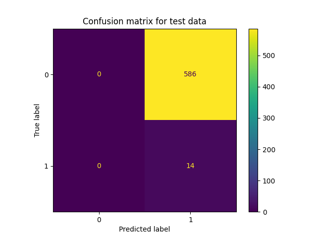
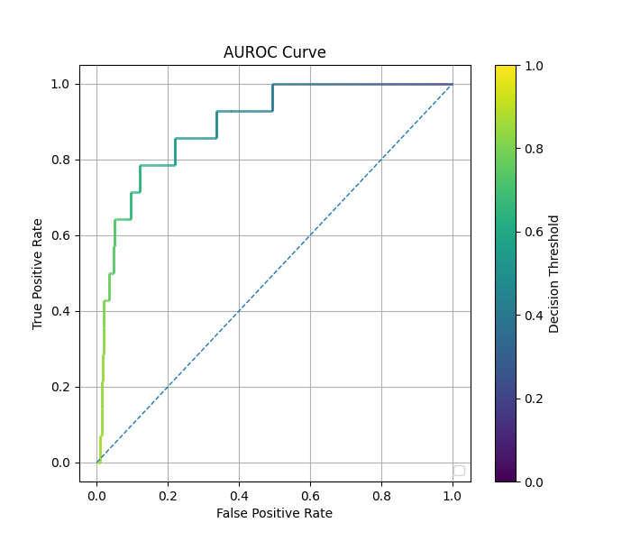
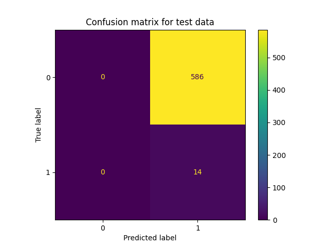
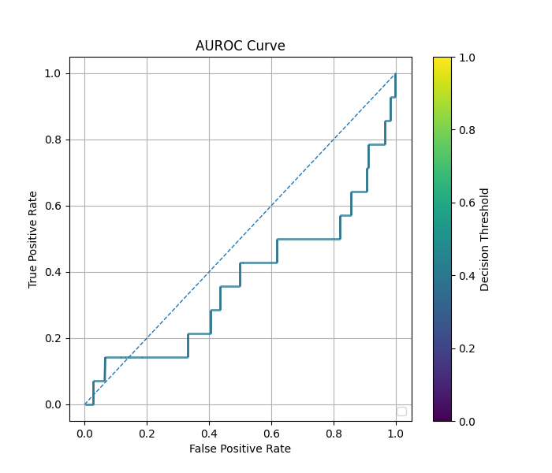
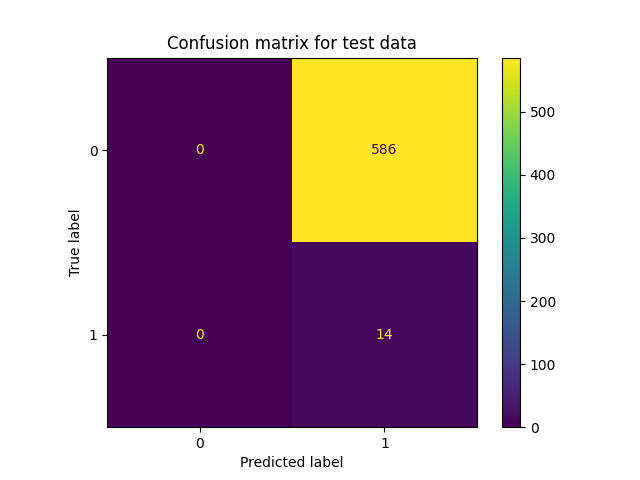
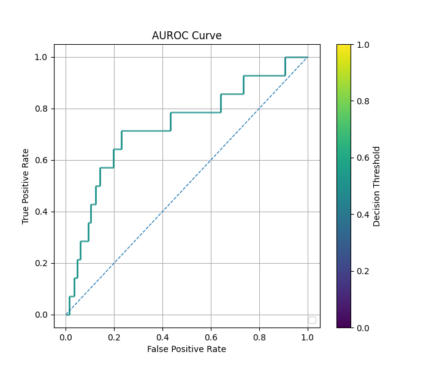

# cRT Classification on SDOBenchmark with Validation Data

## Necessary Files

- All the source code in this tutorial can be found at `imbal/tutorials/SDO/classification/sdo_crt_fit_val.py`
- The training data for this tutorial can be found at `imbal/tutorials/data/SDOBenchmark/training`
- The test data for this tutorial can be found at `imbal/tutorials/data/SDOBenchmark/test`

## 1. SDO Classification Setup

Before training a model on the SDOBenchmark dataset, the data must first be loaded, and
a model be initialized. The steps for doing so can be found [here](setup.md).

## 2. Create Validation Split

The code below splits the training data into a training subset and validation set, with
$80\%$ of the original training data ending up in the new training subset, and $20\%$ of the
original training data ending up in the validation set. Notably, `imbal.classification.split`
performs a stratified split, aiming to maintain a similar class distribution between both
the training and validation set.

```python
"""
Create validation split
"""

(x_train, y_train), (x_val, y_val) =  imbal.regression.split(x_train, y_train, test_size=0.2)
```

## 3. Model Compilation and Training

The code below compiles the model is a manner identical to the `keras.Model`
object, then performs a model fit on the training data. We call `Model.cRT_fit`
instead of the standard `Model.fit`, which will perform a class-balanced fit on the
training data, where each data class is equally weighted. Alternatively, a list
of class weights can optionally be provided, in which case a fit
will be performed on each class weight candidate, and the fit with the
best loss will be restored. We monitor when
the validation loss begins to diverge to determine when to end training,
restoring the state of the model right before the divergence began.

Notably, the
`imbal.classification.Model` object can take an extra parameter in its fit
function, called `stratify_batches`. This parameter ensures that rarer
samples are present in each batch during training.

```python
"""
Compile and train model
"""
LEARNING_RATE = 2e-4
BATCH_SIZE = 256
PATIENCE = 10

model.compile(
    optimizer=optimizers.Adam(learning_rate=LEARNING_RATE),
    loss='binary_crossentropy',
    metrics=['accuracy', metrics.F1Score(threshold=0.5)],
)

history = model.cRT_fit(
    x_train,
    y_train.reshape(-1, 1),
    # validation_data=(x_val, y_val.reshape(-1, 1)),
    validation_split=0.1,
    # class_weight=[[0.9, 0.1,], [0.6, 0.4], [0.5, 0.5]],
    epochs=500,
    batch_size=BATCH_SIZE,
    stratify_batches=True, # Ensure all batches have a similar data distribution
    callbacks=[callbacks.EarlyStopping(monitor='val_loss', patience=PATIENCE, restore_best_weights=True)]
)

print(f'Fit stopped after {len(history[0].history["loss"])}, {len(history[1].history["loss"])} epochs')
print(f'Restored weights from epoch {len(history[0].history["loss"]) - PATIENCE + 1} during stage 1')

model.evaluate(x_test, y_test.reshape(-1, 1))
```

The above code should produce the standard TensorFlow output for model
training and evaluation, followed by something similar to:

```text
Fit stopped after 19, 19 epochs
Restored weights from epoch 9 during stage 1
```

## 4. Metrics and Results Visualization

The following code outputs the overall accuracy, as well as the
accuracy for the frequent and rare data in both the training and
test sets, along with plotting confusion matrices for the
training and test set.

```python
"""
Data and results visualization
"""
KDE_BIN_COUNT=32

test_rare_mask = y_test == 1
test_frequent_mask = ~test_rare_mask
print('Number of test samples with log10 flux < -4:', np.sum(test_frequent_mask))
print('Number of test samples with log10 flux >= -4:', np.sum(test_rare_mask))

# Predict on test data
test_predictions = model.predict(x_test)
test_predictions = test_predictions.reshape(-1, 1)
y_test = y_test.reshape(-1, 1)

# Calculate metrics
hss = imbal.metrics.HeidkeSkillScore(threshold=0.5)
hss.update_state(y_test, test_predictions)

f1 = metrics.F1Score(threshold=0.5)
f1.update_state(y_test, test_predictions)

print(
    f'Heikde Skill Score: {hss.result()[0]:.4f}\n'
    f'F1 Score: {f1.result()[0]:.4f}\n'
)

imbal.classification.plot_roc(
    y_test,
    test_predictions,
    save_figure='sample-sdo-crt-fit-val-roc.png'
)

best_threshold = model.best_decision_threshold
hss = imbal.metrics.HeidkeSkillScore(threshold=best_threshold)
hss.update_state(y_test, test_predictions)

f1 = metrics.F1Score(threshold=best_threshold)
f1.update_state(y_test, test_predictions)

print(
    f'Best threshold: {model.best_decision_threshold}\n'
    f'Heikde Skill Score using Best Threshold: {hss.result()[0]:.4f}\n'
    f'F1 Score using Best Threshold: {f1.result()[0]:.4f}\n'
)

test_predictions = model.predict(x_test)
test_predictions = test_predictions.reshape(-1, 1)
test_predictions = (test_predictions > best_threshold).astype(np.float32)

imbal.classification.plot_confusion_matrix(
    y_test,
    test_predictions,
    save_figure='sample-sdo-crt-fit-val-confusion-matrix.png'
)
```

Below are examples of what the generated output and plots should look 
like for the above code.

```text
Fit stopped after 66, 16 epochs
Restored weights from epoch 56 during stage 1
19/19 ━━━━━━━━━━━━━━━━━━━━ 1s 26ms/step - accuracy: 0.6783 - f1_score: 0.1106 - loss: 0.6050
Number of test samples with log10 flux < -4: 586
Number of test samples with log10 flux >= -4: 14
19/19 ━━━━━━━━━━━━━━━━━━━━ 0s 11ms/step
Heikde Skill Score: 0.0700
F1 Score: 0.1106

Best threshold: 0.1
Heikde Skill Score using Best Threshold: 0.0000
F1 Score using Best Threshold: 0.0456
```

<div style="display: flex; gap: 8px; max-width: 100%;">


</div>

### Optional: Exploring candidates for class weights

By enabling the optional class weight variation in section 2:

```python
history = model.cRT_fit(
    x_train,
    y_train.reshape(-1, 1),
    validation_data=(x_val, y_val.reshape(-1, 1)),
    # validation_split=0.1,
    class_weight=[[0.9, 0.1,], [0.6, 0.4], [0.5, 0.5]],
    epochs=500,
    batch_size=BATCH_SIZE,
    stratify_batches=True, # Ensure all batches have a similar data distribution
    callbacks=[callbacks.EarlyStopping(monitor='val_loss', patience=PATIENCE, restore_best_weights=True)]
)
```

we get the following results:

```text
(after training output)
Restored weights from epoch 2 during stage 1
19/19 ━━━━━━━━━━━━━━━━━━━━ 1s 25ms/step - accuracy: 0.9767 - f1_score: 0.0000e+00 - loss: 0.5096
Number of test samples with log10 flux < -4: 586
Number of test samples with log10 flux >= -4: 14
19/19 ━━━━━━━━━━━━━━━━━━━━ 0s 12ms/step
Heikde Skill Score: 0.0000
F1 Score: 0.0000

Best threshold: 0.1
Heikde Skill Score using Best Threshold: 0.0000
F1 Score using Best Threshold: 0.0456
```

<div style="display: flex; gap: 8px; max-width: 100%;">


</div>

### Optional: Validation via `validation_split`

By commenting out the code in section two, and modifying the commented code in section three:

```python
# In section 2...

# (x_train, y_train), (x_val, y_val) =  imbal.classification.split(x_train, y_train, test_size=0.1)

# ... the during fit (section 3) ...

history = model.cRT_fit(
    x_train,
    y_train.reshape(-1, 1),
    # validation_data=(x_val, y_val.reshape(-1, 1)),
    validation_split=0.1,
    epochs=500,
    batch_size=BATCH_SIZE,
    # class_weight=[[0.9, 0.1,], [0.6, 0.4], [0.5, 0.5]],
    stratify_batches=True, # Ensure all batches have a similar data distribution
    callbacks=[callbacks.EarlyStopping(monitor='val_loss', patience=PATIENCE, restore_best_weights=True)]
)
```

we get the following results:

```text
(after training output)
Number of test samples with log10 flux < -4: 586
Number of test samples with log10 flux >= -4: 14
19/19 ━━━━━━━━━━━━━━━━━━━━ 0s 11ms/step
Heikde Skill Score: 0.0065
F1 Score: 0.0516

Best threshold: 0.1
Heikde Skill Score using Best Threshold: 0.0000
F1 Score using Best Threshold: 0.0456
```

<div style="display: flex; gap: 8px; max-width: 100%;">


</div>