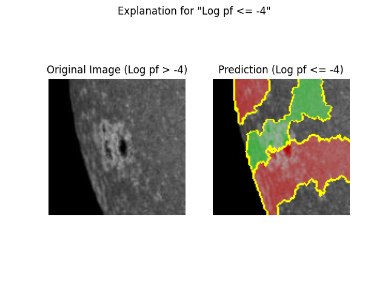
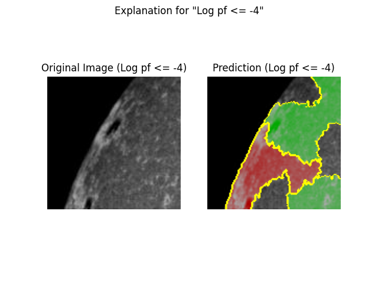
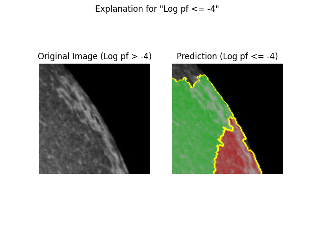

# Prediction explanation using LIME and SHAP

Techniques that help visualize the reasoning behind a model's predictions can be
helpful to both better understand how the model is operating, and to generate
trust in a user of a model that its predictions are reasonable.

`imbal` leverages both [LIME](https://arxiv.org/abs/1602.04938) and [SHAP](https://arxiv.org/abs/1705.07874)
to allow for prediction explanations. This tutorial wil how to use `imbal` to 
generate explanation plots, extending the code from the [Balanced Fit](balanced_fit.md) tutorial.

All the source code for this tutorial can be found at `imbal/tutorials/SDO/classification/explanation.py`.

## Mode prediction explanation using LIME

To explain predictions on image data, imbal contains the `imbal.classification.lime_explain_image_sample` function.

```python
rounded_predictions = np.round(test_predictions).astype(np.int32).reshape(-1)

true_positive_mask = (y_test == 1) & (rounded_predictions == 1)
false_positive_mask = (y_test == 0) & (rounded_predictions == 1)
false_negative_mask = (y_test == 1) & (rounded_predictions == 0)

true_positives = x_test[true_positive_mask]
false_positives = x_test[false_positive_mask]
false_negatives = x_test[false_negative_mask]

imbal.classification.plot_confusion_matrix(
    y_test,
    test_predictions,
    save_figure='classification-explanation-confusion-matrix.png'
)

if len(true_positives) > 0:
    imbal.classification.lime_explain_image_sample(
        true_positives[0],
        model,
        class_names=["Log pf <= -4", "Log pf > -4"],
        actual_label=1,
        save_figure='lime-classification-true-positive-explanation.png'
    )

if len(false_positives) > 0:
    imbal.classification.lime_explain_image_sample(
        false_positives[0],
        model,
        class_names=["Log pf <= -4", "Log pf > -4"],
        actual_label=0,
        save_figure='lime-classification-false-positive-explanation.png'
    )

if len(false_negatives) > 0:
    imbal.classification.lime_explain_image_sample(
        false_negatives[0],
        model,
        class_names=["Log pf <= -4", "Log pf > -4"],
        actual_label=1,
        save_figure='lime-classification-false-negative-explanation.png'
    )
```

The `imbal.classification.lime_explain_image_sample` function wraps the original LIME implementation,
which outputs a plot of the images with super-pixels that either positively (green) or negatively (red)
contribute to the model's prediction being highlighted.

Below is an example true positive plot:

<div style="display: flex; gap: 8px; max-width: 100%;">

</div>

Below is an example false positive plot:

<div style="display: flex; gap: 8px; max-width: 100%;">

</div>

Below is an example false negative plot:

<div style="display: flex; gap: 8px; max-width: 100%;">

</div>

