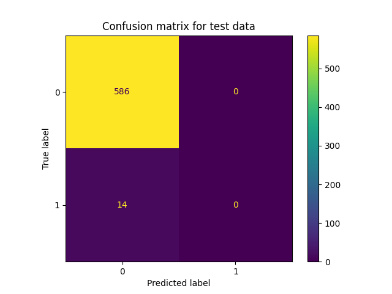
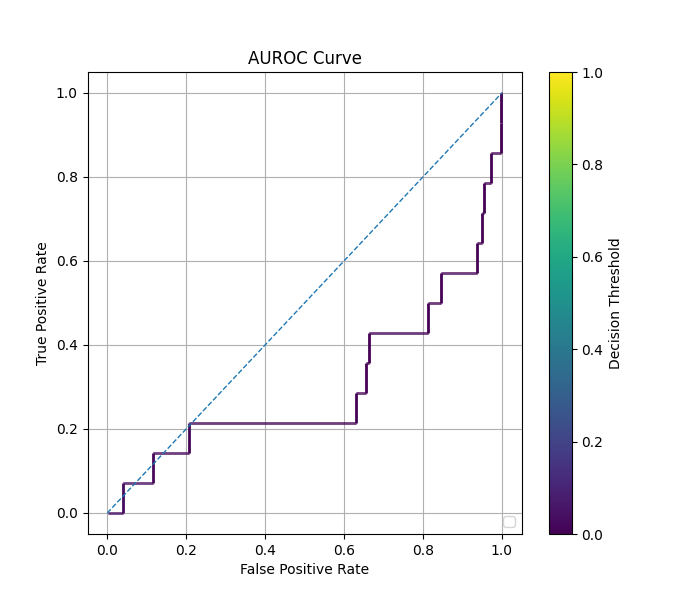

# Regular Classification on SDOBenchmark with Autoencoder

## Necessary Files

- All the source code in this tutorial can be found at `imbal/tutorials/SDO/classification/sdo_regular_fit_ae.py`
- The training data for this tutorial can be found at `imbal/tutorials/data/SDOBenchmark/training`
- The test data for this tutorial can be found at `imbal/tutorials/data/SDOBenchmark/test`

## 1. SDO Classification Setup

Before training a model on the SDOBenchmark dataset, the data must first be loaded, and
a model be initialized. The steps for doing so can be found [here](setup.md).

## 2. Model Compilation and Training

The code below compiles the model is a manner identical to the `keras.Model`
object, then performs a model fit on the training data. Notably, the
`imbal.classification.Model` object can take an extra parameter in its `Model.fit`
function, called `stratify_batches`. This parameter ensures that rarer
samples are present in each batch during training.

```python
"""
Compile and train model
"""
LEARNING_RATE = 5e-5
EPOCHS = 20
BATCH_SIZE = 256

model.compile(
    optimizer=optimizers.Adam(learning_rate=LEARNING_RATE),
    loss='binary_crossentropy',
    metrics=['accuracy', metrics.F1Score(threshold=0.5)],
    generate_decoder_branch=True
)

model.fit(
    x_train,
    y_train.reshape(-1, 1),
    epochs=EPOCHS,
    batch_size=BATCH_SIZE,
    stratify_batches=True # Ensure all batches have a similar data distribution
)

model.evaluate(x_test, y_test.reshape(-1, 1))
```

The above code should produce the standard TensorFlow output for model
training and evaluation.

## 3. Metrics and Results Visualization

The following code outputs the overall accuracy, as well as the
accuracy for the frequent and rare data in both the training and
test sets, along with plotting confusion matrices for the
training and test set.

```python
"""
Data and results visualization
"""
KDE_BIN_COUNT=32

test_rare_mask = y_test == 1
test_frequent_mask = ~test_rare_mask
print('Number of test samples with log10 flux < -4:', np.sum(test_frequent_mask))
print('Number of test samples with log10 flux >= -4:', np.sum(test_rare_mask))

# Predict on test data
test_predictions = model.predict(x_test)
test_predictions = test_predictions.reshape(-1, 1)
y_test = y_test.reshape(-1, 1)

# Calculate metrics
hss = imbal.metrics.HeikdeSkillScore(threshold=0.5)
hss.update_state(y_test, test_predictions)

f1 = metrics.F1Score(threshold=0.5)
f1.update_state(y_test, test_predictions)

print(
    f'Heikde Skill Score: {hss.result()[0]:.4f}\n'
    f'F1 Score: {f1.result()[0]:.4f}\n'
)

imbal.classification.plot_confusion_matrix(
    y_test,
    test_predictions,
    save_figure='sample-sdo-regular-fit-ae-confusion-matrix.png'
)

imbal.classification.plot_roc(
    y_test,
    test_predictions,
    save_figure='sample-sdo-regular-fit-ae-roc.png'
)
```

Below are examples of what the generated output and plots should look 
like for the above code.

```text
Best decision threshold based on metric "f1_score": 0.1
19/19 ━━━━━━━━━━━━━━━━━━━━ 0s 9ms/step - accuracy: 0.9767 - f1_score: 0.0000e+00 - loss: 0.1381
Number of test samples with log10 flux < -4: 586
Number of test samples with log10 flux >= -4: 14
19/19 ━━━━━━━━━━━━━━━━━━━━ 0s 9ms/step
Heikde Skill Score: 0.0000
F1 Score: 0.0000

Best threshold: 0.1
Heikde Skill Score using Best Threshold: 0.0000
F1 Score using Best Threshold: 0.0000
```

<div style="display: flex; gap: 8px; max-width: 100%;">


</div>
