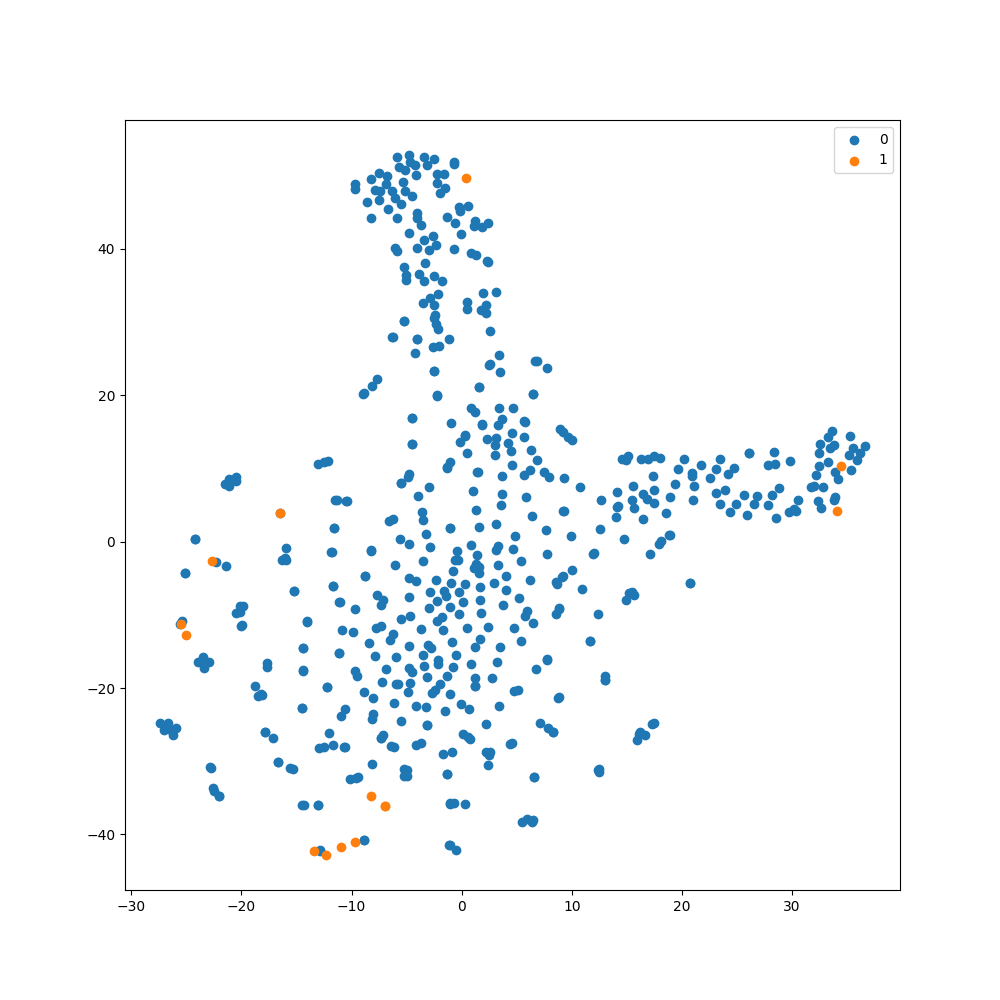

# Model representation visualization using t-SNE

Sometimes, it is useful to be able to visualize the representation
space of a machine learning model to better understand how data
is being represented by the model. Techniques such as [t-SNE](https://www.jmlr.org/papers/volume9/vandermaaten08a/vandermaaten08a.pdf)
allow for the representation space of a model to be visualized in an easy-to-understand
2D plot. This tutorial will explain how to use t-SNE within `imbal`, extending
the code from the [Balanced Fit](balanced_fit.md) tutorial.

All the source code for this tutorial can be found at `imbal/tutorials/SDO/classificaiton/visualization.py`.

## Visualizing with t-SNE

First, we will use the code provided in the [Balanced Fit](balanced_fit.md) tutorial
to train a model on the SDOBenchmark dataset. Then, we can use
[imbal.classification.tsne_visualization](../../../classification/tsne_visualization.md)
function built into `imbal` to easily generate a t-SNE plot for our model.

By default, `imbal` will use the second to last layer of a neural network as
the layer to visualize using t-SNE. This means that the predictions made by
the model are the result of a linear combination of relations shown in the
t-SNE plot. Therefore, ideally, separate classes are clearly separated in the
t-SNE plot.

We add the following code at the end of the original tutorial code:

```python
imbal.classification.tsne_visualization(
    model,
    x_test,
    y_test,
    save_figure='tsne-classification-visualization.png'
)
```
which results in the following plot:

<div style="display: flex; gap: 8px; max-width: 100%;">

</div>

As you can see, there is not a clear separation between the negative ($0$) class and the positive ($1$)
class in the resulting t-SNE plot. This could be due to a number of factors, but a likely cause is that
the subset of the SDOBenchmark dataset used in the tutorials is highly reduced, meaning the model is
being trained on significantly less data than is provided by SDOBenchmark.