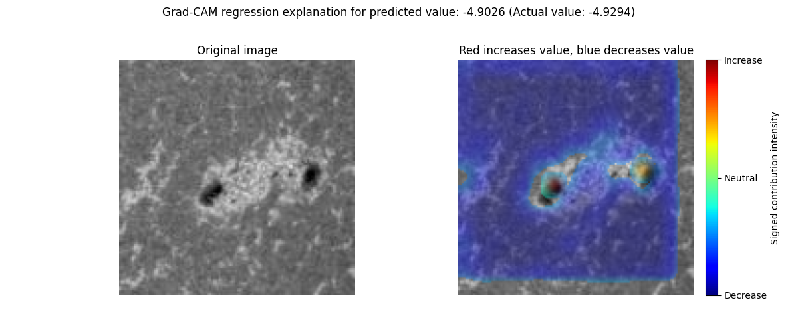
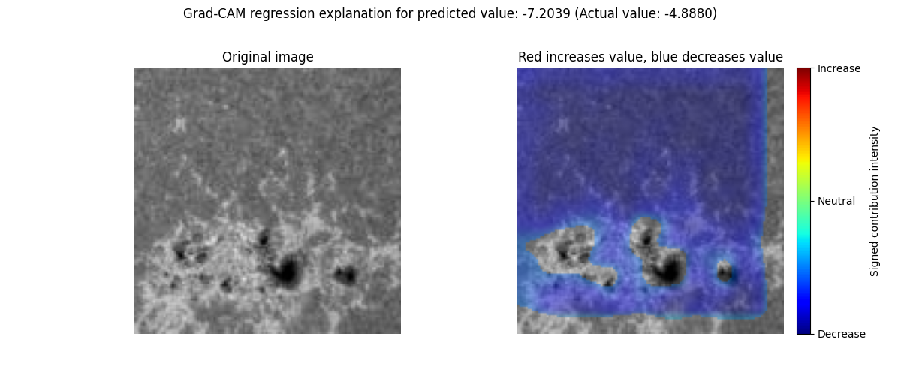

# Grad-CAM Regression Explanations

This tutorial demonstrates how to generate Grad-CAM explanations for a regression model trained on the SDO benchmark dataset.

## Import Packages

```python
import imbal
import os
import numpy as np
from PIL import Image
import tensorflow as tf
import keras
from keras import layers, optimizers

seed = 42
tf.keras.utils.set_random_seed(seed)
```

## Load Data

```python
SDO_DATA_PATH = '../../../../tutorials/data/SDOBenchmark' # Ensure data is located at this path

MODEL_SAVE_PATH = 'sdo_regression_model.keras'
LOAD_SAVED_MODEL = True
KDE_BIN_COUNT = 32
```

```python
def load_sdo_data(data_path):
    # Load labels (log peak flux)
    with open(os.path.join(data_path, 'log_peak_flux.txt'), 'r') as file:
        contents = file.read().strip()
        loaded_data_fluxes = np.array([float(x) for x in contents.split('\n')])

    # Load images (10 images per sample, 256x256 per image)
    loaded_images = np.zeros((len(loaded_data_fluxes), 128, 128, 1), dtype=np.float32)
    for i in range(len(loaded_data_fluxes)):
        print(f'Loading SDO samples [{i+1}/{len(loaded_data_fluxes)}]', end='\r')
        image_list = Image.open(os.path.join(data_path, f'sdo_subset_sample_{i}.jpg')).convert('L')
        stacked_images = np.array(image_list).reshape(128, 128, 1) # Images stacked along channels
        loaded_images[i] = stacked_images / 255.0 # Normalize black and white pixel values from 0 to 1

    print(f'\n{len(loaded_data_fluxes)} data samples loaded successfully')

    return loaded_images, loaded_data_fluxes
```

```python
# Load train and test data via function defined above
x_train, y_train = load_sdo_data(os.path.join(SDO_DATA_PATH, 'training'))
x_test, y_test = load_sdo_data(os.path.join(SDO_DATA_PATH, 'test'))
```

## Build Model

```python
def build_simple_cnn():
    input_layer = layers.Input((128, 128, 1))
    x = layers.Conv2D(8, 3, activation='relu', padding='same')(input_layer)
    x = layers.Conv2D(8, 3, activation='relu', padding='same', strides=(2, 2))(x)
    x = layers.Conv2D(16, 3, activation='relu', padding='same')(x)
    x = layers.Conv2D(16, 3, activation='relu', padding='same', strides=(2, 2))(x)
    x = layers.Conv2D(32, 3, activation='relu', padding='same')(x)
    x = layers.Conv2D(32, 3, activation='relu', padding='same', strides=(2, 2))(x)
    x = layers.Dense(32, activation='relu')(x)
    x = layers.Flatten()(x)
    output_layer = layers.Dense(1)(x)

    model = imbal.regression.Model(inputs=input_layer, outputs=output_layer)
    model.summary()
    return model
```

## Compile and Train or Load Model

```python
LEARNING_RATE = 5e-5
EPOCHS = 400
BATCH_SIZE = 256
```

```python
if LOAD_SAVED_MODEL and os.path.exists(MODEL_SAVE_PATH):
    print(f'Loading saved regression model from {MODEL_SAVE_PATH}')
    model = keras.models.load_model(
        MODEL_SAVE_PATH,
        custom_objects={'Model': imbal.regression.Model}
    )
else:
    model = build_simple_cnn()

    data_kde_bandwidth = imbal.regression.fit_kde(y_train, bin_count=KDE_BIN_COUNT)
    sample_densities = imbal.regression.get_sample_densities(y_train, data_kde_bandwidth)

    model.compile(
        optimizer=optimizers.Adam(learning_rate=LEARNING_RATE),
        loss='mse',
        metrics=['mae']
    )

    model.balanced_fit(
        x_train,
        y_train,
        sample_density=sample_densities,
        epochs=EPOCHS,
        batch_size=BATCH_SIZE,
        stratify_batches=True # Ensure all batches have a similar data distribution
    )

    model.save(MODEL_SAVE_PATH)
    print(f'Saved regression model to {MODEL_SAVE_PATH}')
```

```python
model.evaluate(x_test, y_test.reshape(-1))
```

## Data and Results Visualization

```python
test_rare_mask = y_test > -4
test_frequent_mask = ~test_rare_mask
print('Number of test samples with log10 flux < -4:', np.sum(test_frequent_mask.astype(np.int32)))
print('Number of test samples with log10 flux >= -4:', np.sum(test_rare_mask.astype(np.int32)))
```

```python
# Predict on test data
test_predictions = model.predict(x_test)

pred = test_predictions.reshape(-1)
true = y_test.reshape(-1)
error = np.abs(pred - true)
```

## Low Error Regression Example

```python
print()
print('Explaining good regression sample')
print('Selected index:', 95)
print('Actual value:', true[95])
print('Predicted value:', pred[95])
print('Absolute error:', error[95])

imbal.regression.gradcam_explain_image_sample(
    sample=x_test[95],
    model=model,
    actual_value=y_test[95],
    show=True,
    save_figure=True,
    figure_save_path='grad-cam-regression-good-example.png',
    positive_importance_threshold=0.05,
    negative_importance_threshold=0.5
)
```



## High Error Regression Example

```python
print()
print('Explaining bad regression sample')
print('Selected index:', 301)
print('Actual value:', true[301])
print('Predicted value:', pred[301])
print('Absolute error:', error[301])

imbal.regression.gradcam_explain_image_sample(
    sample=x_test[301],
    model=model,
    actual_value=y_test[301],
    show=True,
    save_figure=True,
    figure_save_path='grad-cam-regression-bad-example.png',
    positive_importance_threshold=0.05,
    negative_importance_threshold=0.5
)
```


