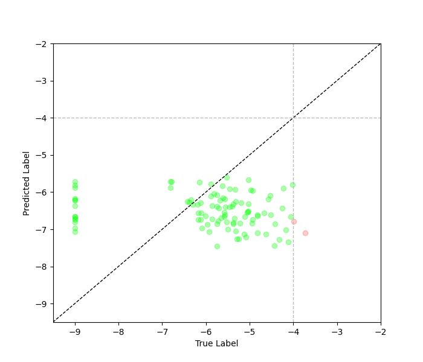

# Regular Regression on SDOBenchmark

## Necessary Files

- All the source code in this tutorial can be found at `imbal/tutorials/SDO/regression/sdo_regular_fit.py`
- The training data for this tutorial can be found at `imbal/tutorials/data/SDOBenchmark/training`
- The test data for this tutorial can be found at `imbal/tutorials/data/SDOBenchmark/test`

## 1. SDO Setup

Before training a model on the SDOBenchmark dataset, the data must first be loaded, and
a model be initialized. The steps for doing so can be found [here](setup.md).

## 2. Model Compilation and Training

The code below compiles the model is a manner identical to the `keras.Model`
object, then performs a model fit on the training data. Notably, the
`imbal.regression.Model` object can take an extra parameter in its `Model.fit`
function, called `stratify_batches`. This parameter ensures that rarer
samples are present in each batch during training.

```python
"""
Compile and train model
"""
LEARNING_RATE = 5e-5
EPOCHS = 20
BATCH_SIZE = 64

model.compile(
    optimizer=optimizers.Adam(learning_rate=LEARNING_RATE),
    loss='mse',
    metrics=['mae']
)

model.fit(
    x_train,
    y_train,
    epochs=EPOCHS,
    batch_size=BATCH_SIZE,
    stratify_batches=True # Ensure all batches have a similar data distribution
)

model.evaluate(x_test, y_test)
```

The above code should produce the standard TensorFlow output for model
training and evaluation.

## 3. Probability Density Distribution and Results Visualization

The following code plots a fitted KDE distribution for the training
data over a histogram of the training data, along with a plot
comparing the true and predicted values for individual test samples.

```python
"""
Probability Density Distribution and Results Visualization
"""
KDE_BIN_COUNT=32

test_rare_mask = y_test > -4
test_frequent_mask = ~test_rare_mask
print('Number of test samples with log10 flux < -4:', np.sum(test_frequent_mask.astype(np.int32)))
print('Number of test samples with log10 flux >= -4:', np.sum(test_rare_mask.astype(np.int32)))

# Predict on test data
test_predictions = []
for i in range(0, len(x_test), BATCH_SIZE):
    batch = x_test[i:i+BATCH_SIZE]
    test_predictions.append(model.predict(batch))
test_predictions = np.concatenate(test_predictions, axis=0)

test_predictions_rare = test_predictions[test_rare_mask] # Mask rare test data
test_labels_rare = y_test[test_rare_mask] # Mask predictions on rare test data
test_predictions_frequent = test_predictions[test_frequent_mask] # Mask frequent test data
test_labels_frequent = y_test[test_frequent_mask] # Mask predictions on frequent test data

# Calculate metrics
overall_test_mae = np.mean(np.abs(test_predictions - y_test))
frequent_test_mae = np.mean(np.abs(test_predictions_frequent - test_labels_frequent))
rare_test_mae = np.mean(np.abs(test_predictions_rare - test_labels_rare))

print(
    f'MAE for log10 flux < -4: {frequent_test_mae:.3f}\n'
    f'MAE for log10 flux >= -4: {rare_test_mae:.3f}'
)

data_kde_bandwidth = imbal.regression.fit_kde(y_train, bin_count=KDE_BIN_COUNT)
imbal.regression.plot_kde_1d(
    y_train,
    data_kde_bandwidth,
    bin_count=KDE_BIN_COUNT,
    show_bin_count=False,
    save_figure='sample-sdo-regular-fit-data-distribution.png'
)

plot_true_vs_predictions(
    y_test,
    test_predictions,
    save_figure='sample-sdo-regular-fit-label-vs-prediction-plot.png'
)
```

Below are examples of what the generated output and plots should look 
like for the above code.

```
Number of test samples with log10 flux < -4: 98
Number of test samples with log10 flux >= -4: 2

MAE for log10 flux < -4: 1.340
MAE for log10 flux >= -4: 3.083
```

<div style="display: flex; gap: 8px; max-width: 100%;">


</div>
