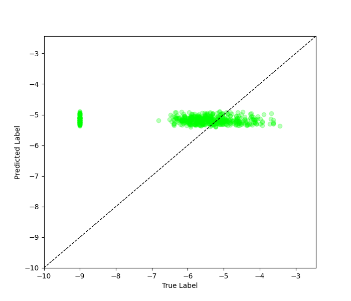
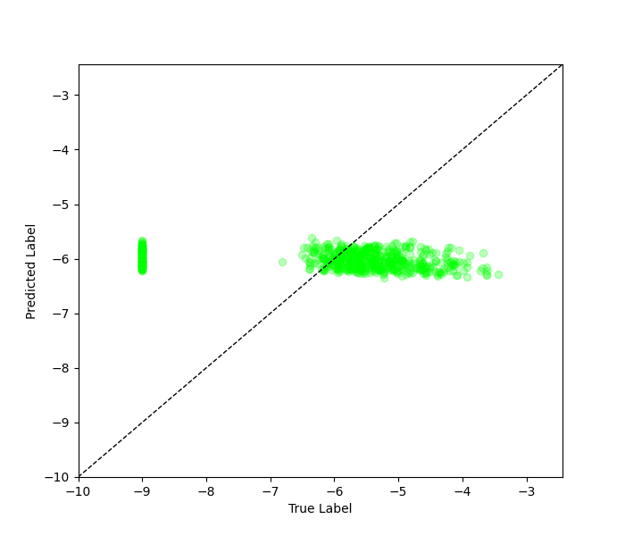

# rRT Regression on SDOBenchmark

## Necessary Files

- All the source code in this tutorial can be found at `imbal/tutorials/SDO/regression/sdo_rrt_fit.py`
- The training data for this tutorial can be found at `imbal/tutorials/data/SDOBenchmark/training`
- The test data for this tutorial can be found at `imbal/tutorials/data/SDOBenchmark/test`

## 1. SDO Setup

Before training a model on the SDOBenchmark dataset, the data must first be loaded, and
a model be initialized. The steps for doing so can be found [here](setup.md).

## 2. Calculate Sample Densities

The following code creates a KDE curve fitted to the labels of the training set, then
uses the KDE to generate per-sample density values. When passed to `imbal.rRT_fit`,
the reciprocal of these densities is used to weight the training samples, putting a larger
emphasis on those samples appear infrequently in the training set.


```python
"""
Calculate data density distribution, and extract sample densities
"""
KDE_BIN_COUNT=32

# Determine KDE fit for data, then extract sample densities
data_kde_bandwidth = imbal.regression.fit_kde(y_train, bin_count=KDE_BIN_COUNT)
sample_densities = imbal.regression.get_sample_densities(y_train, data_kde_bandwidth)
```

## 3. Optional: Testing Multiple Hand-Picked Alpha Values For Sample Weights

In the case where you would like to be able to customize the alpha value used
in the reciprocal importance function $RI(d, \alpha) = \frac{1}{d^\alpha}$, you
can use the `imbal.regression.reciprocal_importance` function to apply one, or multiple,
hand-picked alpha values to your density values, which can then be passed to your
model during training.

```python
# The below line can be uncommented to test multiple alpha values for reciprocal importance
# If this is uncommented, be sure to also uncomment 'sample_weight=weight_candidates' in the following section
# sample_weight_candidates = imbal.regression.reciprocal_importance(sample_densities, alpha=[0.2, 0.5, 1.0])
```

## 4. Model Compilation and Training

The code below compiles the model is a manner identical to the `keras.Model`
object, then performs a model fit on the training data. Notably, the
`imbal.regression.Model` object can take an extra parameter in its `Model.fit`
function, called `stratify_batches`. This parameter ensures that rarer
samples are present in each batch during training.

```python
"""
Compile and train model
"""
LEARNING_RATE = 5e-5
EPOCHS = 20
BATCH_SIZE = 256

model.compile(
    optimizer=optimizers.Adam(learning_rate=LEARNING_RATE),
    loss='mse',
    metrics=['mae']
)

model.rRT_fit(
    x_train,
    y_train,
    sample_density=sample_densities,
    # sample_weight=sample_weight_candidates, # Uncomment to use varying alphas for reciprocal importance (see above section)
    # candidate_evaluation_sample_weight=sample_weight_candidates[2], # Uncomment to use varying alphas 
    epochs=EPOCHS,
    batch_size=BATCH_SIZE,
    stratify_batches=True # Ensure all batches have a similar data distribution
)

model.evaluate(x_test, y_test)
```

The above code should produce the standard TensorFlow output for model
training and evaluation.

## 5. Probability Density Distribution and Results Visualization

The following code plots a fitted KDE distribution for the training
data over a histogram of the training data, along with a plot
comparing the true and predicted values for individual test samples.

```python
"""
Probability Density Distribution and Results Visualization
"""
test_rare_mask = y_test > -4
test_frequent_mask = ~test_rare_mask
print('Number of test samples with log10 flux < -4:', np.sum(test_frequent_mask.astype(np.int32)))
print('Number of test samples with log10 flux >= -4:', np.sum(test_rare_mask.astype(np.int32)))

# Predict on test data
test_predictions = model.predict(x_test)

test_predictions_rare = test_predictions[test_rare_mask] # Mask rare test data
test_labels_rare = y_test[test_rare_mask] # Mask predictions on rare test data
test_predictions_frequent = test_predictions[test_frequent_mask] # Mask frequent test data
test_labels_frequent = y_test[test_frequent_mask] # Mask predictions on frequent test data

# Calculate metrics
overall_test_mae = np.mean(np.abs(test_predictions - y_test))
frequent_test_mae = np.mean(np.abs(test_predictions_frequent - test_labels_frequent))
rare_test_mae = np.mean(np.abs(test_predictions_rare - test_labels_rare))

print(
    f'MAE for log10 flux < -4: {frequent_test_mae:.3f}\n'
    f'MAE for log10 flux >= -4: {rare_test_mae:.3f}'
)

data_kde_bandwidth = imbal.regression.fit_kde(y_train, bin_count=KDE_BIN_COUNT)
imbal.regression.plot_kde_1d(
    y_train,
    data_kde_bandwidth,
    bin_count=KDE_BIN_COUNT,
    show_bin_count=False,
    save_figure='sample-sdo-rrt-fit-data-distribution.png'
)

imbal.regression.plot_true_vs_predictions(
    y_test,
    test_predictions,
    save_figure='sample-sdo-rrt-fit-label-vs-prediction-plot.png'
)
```

Below are examples of what the generated output and plots should look 
like for the above code.

```text
Number of test samples with log10 flux < -4: 586
Number of test samples with log10 flux >= -4: 14
19/19 ━━━━━━━━━━━━━━━━━━━━ 0s 11ms/step
MAE for log10 flux < -4: 1.127
MAE for log10 flux >= -4: 1.451
```

<div style="display: flex; gap: 8px; max-width: 100%;">


</div>

### Optional: Exploring sample weight candidates

By enabling the optional alpha variation in section 3:

```python
# The below line can be uncommented to test multiple alpha values for reciprocal importance
# If this is uncommented, be sure to also uncomment 'sample_weight=weight_candidates' in the following section
weight_candidates = imbal.regression.reciprocal_importance(sample_densities, alpha=[0.2, 0.5, 1.0])

# ...then during fit...

model.rRT_fit(
    x_train,
    y_train,
    sample_density=sample_densities,
    sample_weight=weight_candidates, # Uncomment to use varying alphas for reciprocal importance (see above section)
    candidate_evaluation_sample_weight=sample_weight_candidates[2], # Uncomment to use varying alphas 
    epochs=EPOCHS,
    batch_size=BATCH_SIZE,
    stratify_batches=True # Ensure all batches have a similar data distribution
)
```

we get the following results:

```text
(after training output)
Restoring model weights from fit on sample weight candidate at index 2

Number of test samples with log10 flux < -4: 586
Number of test samples with log10 flux >= -4: 14
19/19 ━━━━━━━━━━━━━━━━━━━━ 0s 9ms/step
MAE for log10 flux < -4: 1.107
MAE for log10 flux >= -4: 2.402
```

<div style="display: flex; gap: 8px; max-width: 100%;">


</div>