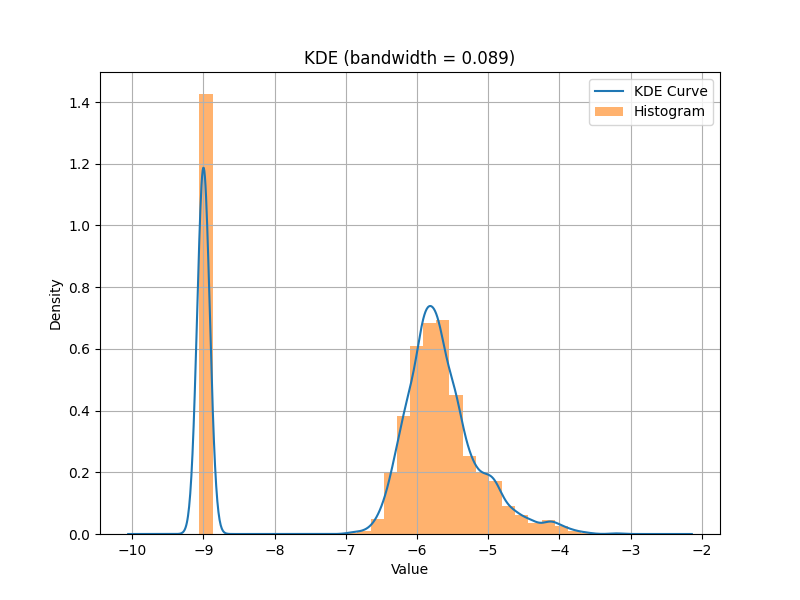
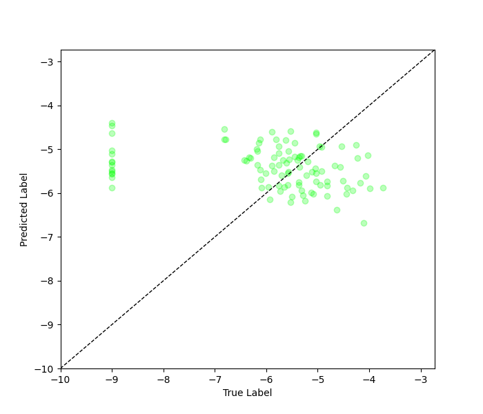
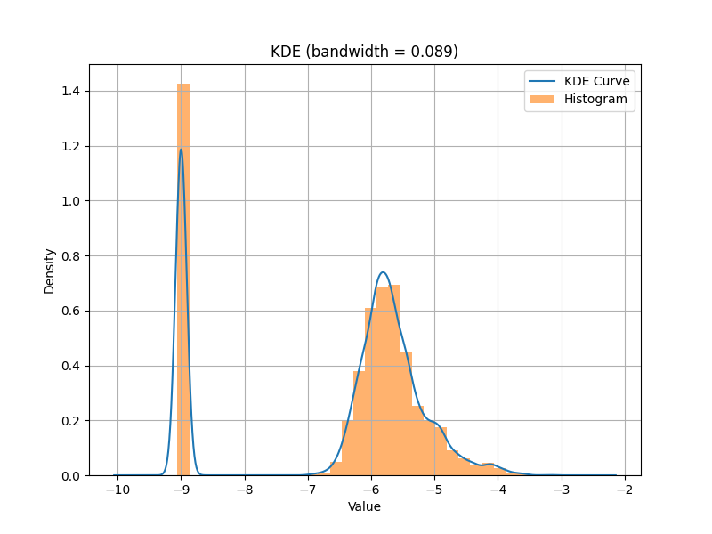
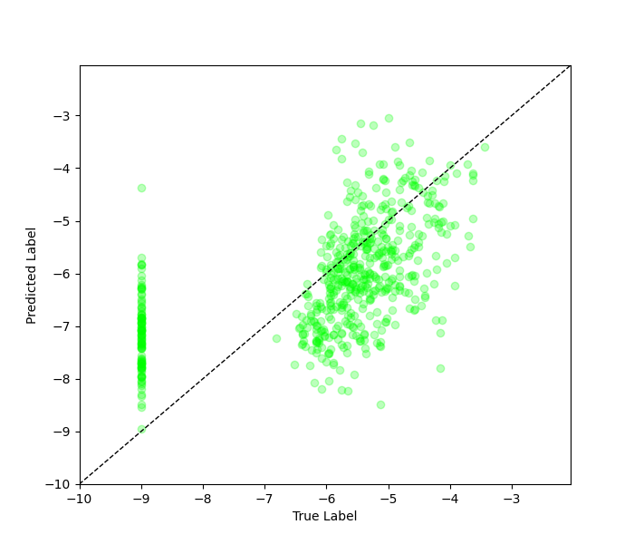
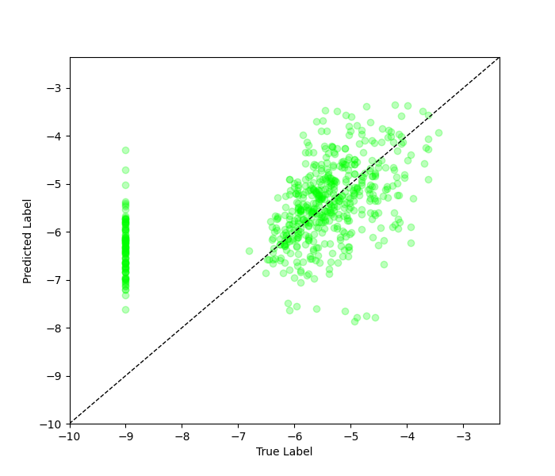

# rRT Regression on SDOBenchmark with Validation Data

## Necessary Files

- All the source code in this tutorial can be found at `imbal/tutorials/SDO/regression/sdo_rrt_fit_val.py`
- The training data for this tutorial can be found at `imbal/tutorials/data/SDOBenchmark/training`
- The test data for this tutorial can be found at `imbal/tutorials/data/SDOBenchmark/test`

## 1. SDO Setup

Before training a model on the SDOBenchmark dataset, the data must first be loaded, and
a model be initialized. The steps for doing so can be found [here](setup.md).

## 2. Calculate Sample Densities

The following code creates a KDE curve fitted to the labels of the training set, then
uses the KDE to generate per-sample density values. When passed to `imbal.rrt_fit`,
the reciprocal of these densities is used to weight the training samples, putting a larger
emphasis on those samples appear infrequently in the training set.


```python
"""
Calculate data density distribution, and extract sample densities
"""
KDE_BIN_COUNT=32

# Determine KDE fit for data, then extract sample densities
data_kde_bandwidth = imbal.regression.fit_kde(y_train, bin_count=KDE_BIN_COUNT)
sample_densities = imbal.regression.get_sample_densities(y_train, data_kde_bandwidth)
```

## 3. Optional: Testing Multiple Hand-Picked Alpha Values For Sample Weights

In the case where you would like to be able to customize the alpha value used
in the reciprocal importance function $RI(d, \alpha) = \frac{1}{d^\alpha}$, you
can use the `imbal.regression.reciprocal_importance` function to apply one, or multiple,
hand-picked alpha values to your density values, which can then be passed to your
model during training.

```python
# The below line can be uncommented to test multiple alpha values for reciprocal importance
# If this is uncommented, be sure to also uncomment 'sample_weight=sample_weight_candidates' in the following section
# sample_weight_candidates = imbal.regression.reciprocal_importance(sample_densities, alpha=[0.2, 0.5, 1.0])
```

## 4. Create Validation Split

The code below splits the training data into a training subset and validation set, with
$90\%$ of the original training data ending up in the new training subset, and $10\%$ of the
original training data ending up in the validation set. Notably, `imbal.regression.split`
performs a stratified split, aiming to maintain a similar data distribution between both
the training and validation set.

```python
"""
Create validation split
"""
(x_train, y_train, sample_densities), (x_val, y_val, val_densities) =  imbal.regression.split(x_train, y_train, sample_densities, test_size=0.1)
w_val = None
# Uncomment below and comment out above to use varying alphas for reciprocal importance (see above section)
# (x_train, y_train, sample_weight_candidates), (x_val, y_val, w_val) =  imbal.regression.split(x_train, y_train, sample_weight_candidates, test_size=0.1)
```

## 5. Model Compilation and Training

The code below compiles the model is a manner identical to the `keras.Model`
object, then performs a model fit on the training data. We monitor when
the validation loss begins to diverge to determine when to end training,
restoring the state of the model right before the divergence began.

Notably, the
`imbal.regression.Model` object can take an extra parameter in its `Model.fit`
function, called `stratify_batches`. This parameter ensures that rarer
samples are present in each batch during training.

```python
"""
Compile and train model
"""
LEARNING_RATE = 2e-4
BATCH_SIZE = 256
PATIENCE = 10

model.compile(
    optimizer=optimizers.Adam(learning_rate=LEARNING_RATE),
    loss='mse',
    metrics=['mae']
)

history = model.rRT_fit(
    x_train,
    y_train,
    sample_density=sample_densities,
    # sample_weight=sample_weight_candidates, # Uncomment to use varying alphas for reciprocal importance (see above section)
    # candidate_evaluation_sample_weight=w_val[2], # Uncomment to use varying alphas
    validation_data=(x_val, y_val, w_val),
    # validation_densities=val_densities,
    validation_split=0.1,
    epochs=500,
    batch_size=BATCH_SIZE,
    stratify_batches=True, # Ensure all batches have a similar data distribution,
    callbacks=[callbacks.EarlyStopping(monitor='val_loss', patience=PATIENCE, restore_best_weights=True)]
)

print(f'Fit stopped after {len(history[0].history["loss"])}, {len(history[1].history["loss"])} epochs')
print(f'Restored weights from epoch {len(history[0].history["loss"]) - PATIENCE} during stage 1')

model.evaluate(x_test, y_test)
```

The above code should produce the standard TensorFlow output for model
training and evaluation, followed by something similar to:

```text
Fit stopped after 19, 19 epochs
Restored weights from epoch 9 during stage 1
```

## 6. Probability Density Distribution and Results Visualization

The following code plots a fitted KDE distribution for the training
data over a histogram of the training data, along with a plot
comparing the true and predicted values for individual test samples.

```python
"""
Probability Density Distribution and Results Visualization
"""
KDE_BIN_COUNT=32

test_rare_mask = y_test > -4
test_frequent_mask = ~test_rare_mask
print('Number of test samples with log10 flux < -4:', np.sum(test_frequent_mask.astype(np.int32)))
print('Number of test samples with log10 flux >= -4:', np.sum(test_rare_mask.astype(np.int32)))

# Predict on test data
test_predictions = model.predict(x_test)

test_predictions_rare = test_predictions[test_rare_mask] # Mask rare test data
test_labels_rare = y_test[test_rare_mask] # Mask predictions on rare test data
test_predictions_frequent = test_predictions[test_frequent_mask] # Mask frequent test data
test_labels_frequent = y_test[test_frequent_mask] # Mask predictions on frequent test data

# Calculate metrics
overall_test_mae = np.mean(np.abs(test_predictions - y_test))
frequent_test_mae = np.mean(np.abs(test_predictions_frequent - test_labels_frequent))
rare_test_mae = np.mean(np.abs(test_predictions_rare - test_labels_rare))

print(
    f'MAE for log10 flux < -4: {frequent_test_mae:.3f}\n'
    f'MAE for log10 flux >= -4: {rare_test_mae:.3f}'
)

data_kde_bandwidth = imbal.regression.fit_kde(y_train, bin_count=KDE_BIN_COUNT)

imbal.regression.plot_kde_1d(
    y_train,
    data_kde_bandwidth,
    bin_count=KDE_BIN_COUNT,
    show_bin_count=False,
    save_figure='sample-sdo-balanced-fit-val-data-distribution.png'
)

imbal.regression.plot_true_vs_predictions(
    y_test,
    test_predictions,
    save_figure='sample-sdo-balanced-fit-val-label-vs-prediction-plot.png'
)
```

Below are examples of what the generated output and plots should look 
like for the above code.

```text
Number of test samples with log10 flux < -4: 586
Number of test samples with log10 flux >= -4: 14
19/19 ━━━━━━━━━━━━━━━━━━━━ 0s 14ms/step
MAE for log10 flux < -4: 1.324
MAE for log10 flux >= -4: 0.722
```

<div style="display: flex; gap: 8px; max-width: 100%;">


</div>

### Optional: Exploring sample weight candidates

By enabling the optional alpha variation in section 3:

```python
# The below line can be uncommented to test multiple alpha values for reciprocal importance
# If this is uncommented, be sure to also uncomment 'sample_weight=weight_candidates' in the following section
weight_candidates = imbal.regression.reciprocal_importance(sample_densities, alpha=[0.2, 0.5, 1.0])

# ...then during fit...

history = model.rRT_fit(
    x_train,
    y_train,
    sample_density=sample_densities,
    sample_weight=weight_candidates, # Uncomment to use varying alphas for reciprocal importance (see above section)
    candidate_evaluation_sample_weight=w_val[2], # Uncomment to use varying alphas
    validation_data=(x_val, y_val, w_val),
    # validation_densities=val_densities,
    validation_split=0.1,
    epochs=500,
    batch_size=BATCH_SIZE,
    stratify_batches=True, # Ensure all batches have a similar data distribution,
    callbacks=[callbacks.EarlyStopping(monitor='val_loss', patience=PATIENCE, restore_best_weights=True)]
)
```

we get the following results:

```text
(after training output)
Restoring model weights from fit on sample weight candidate at index 2
...
Number of test samples with log10 flux < -4: 586
Number of test samples with log10 flux >= -4: 14
19/19 ━━━━━━━━━━━━━━━━━━━━ 0s 14ms/step
MAE for log10 flux < -4: 1.287
MAE for log10 flux >= -4: 0.753
```

<div style="display: flex; gap: 8px; max-width: 100%;">


</div>

### Optional: Validation via `validation_split`

By commenting out the code from section 2, and modifying the commented lines in section 3:

```python
# In section 2...

# (x_train, y_train, sample_densities), (x_val, y_val, val_densities) = imbal.regression.split(x_train, y_train, sample_densities, test_size=0.1)
# w_val = None
# Uncomment below and comment out above to use varying alphas for reciprocal importance (see above section)
# (x_train, y_train, sample_weight), (x_val, y_val, w_val) =  imbal.regression.split(x_train, y_train, weight_candidates, test_size=0.1)

# ...then during fit (section 3) ...

history = model.rRT_fit(
    x_train,
    y_train,
    sample_density=sample_densities,
    # sample_weight=weight_candidates, # Uncomment to use varying alphas for reciprocal importance (see above section)
    # candidate_evaluation_sample_weight=w_val[2], # Uncomment to use varying alphas
    validation_data=(x_val, y_val, w_val),
    # validation_densities=val_densities,
    validation_split=0.1,
    epochs=500,
    batch_size=BATCH_SIZE,
    stratify_batches=True, # Ensure all batches have a similar data distribution,
    callbacks=[callbacks.EarlyStopping(monitor='val_loss', patience=PATIENCE, restore_best_weights=True)]
)
```

we get the following results:

```text
(after training output)

Number of test samples with log10 flux < -4: 586
Number of test samples with log10 flux >= -4: 14
19/19 ━━━━━━━━━━━━━━━━━━━━ 0s 14ms/step
MAE for log10 flux < -4: 1.300
MAE for log10 flux >= -4: 0.844
```

<div style="display: flex; gap: 8px; max-width: 100%;">


</div>