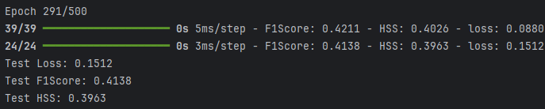
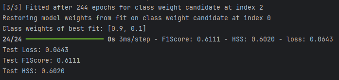

# Imbal Balanced Binary Classification Tutorial (With a Validation Set)

This tutorial demonstrates how to train a neural network for a classification task while addressing data imbalance using the `balanced_fit` function with a validation set.

### Files Needed

**Full Code:** [view source code](../../../../../../tutorials/SEP-C/classification/imbal_tutorial_balanced_fit_val_classification_clear_sep.py)

**Train/Test Files**: [training data](../../../../../../tutorials/data/SEP-C/sep_model_training_classification.csv), [testing data](../../../../../../tutorials/data/SEP-C/sep_model_testing_classification.csv)

---

> **Before you begin:** Use the [Tutorial Setup](imbal_tutorial_setup_classification.md) guide as your starting point, then continue with this tutorial.

## 1. Model Compilation and Training

### Compilation

```python
model.compile(
    loss="binary_crossentropy",
    optimizer="adam",
    metrics=[
        tf.keras.metrics.F1Score(threshold=0.5, name="F1Score"),
        imbal.metrics.HeikdeSkillScore(threshold=0.5, name="HSS"),
    ],
)
```

### Training with `balanced_fit`

```python
(x_train, y_train), (x_val, y_val) = imbal.classification.split(
    x_train,
    y_train,
    test_size=0.2,
)

PATIENCE = 30

model.balanced_fit(
    x_train,
    y_train,
    validation_data=(x_val, y_val.reshape(-1, 1)),
    batch_size=batch_size,
    epochs=max_epochs,
    callbacks=[
        keras.callbacks.EarlyStopping(
            monitor="val_loss",
            patience=PATIENCE,
            restore_best_weights=True,
        )
    ],
)
```

### Explanation

* **balanced_fit** automatically handles class imbalance internally.
* No need to manually compute sample weights.
* A validation set is used to monitor model performance on data not used for training.
* Validation data helps reduce overfitting by allowing early stopping to restore the best model weights when validation loss stops improving.
* Training configuration remains similar to standard fitting.

---

## 2. Results

### Model Evaluation

```python
results = model.evaluate(x_test, y_test)
loss, f1_score, hss = results

print(f"Test Loss: {loss:.4f}")
print(f"Test F1Score: {f1_score:.4f}")
print(f"Test HSS: {hss:.4f}")
```

### Example Output



---

## 3. Optional: Using Class Weights

Alternatively, you can explore different class weights during training. Replace the `model.balanced_fit` call with:

```python
class_weight_candidates = [[0.9, 0.1], [0.8, 0.2], [0.5, 0.5]]

model.balanced_fit(
    x_train,
    y_train,
    validation_data=(x_val, y_val.reshape(-1, 1)),
    class_weight=class_weight_candidates,
    batch_size=batch_size,
    epochs=max_epochs,
    callbacks=[
        keras.callbacks.EarlyStopping(
            monitor="val_loss",
            patience=PATIENCE,
            restore_best_weights=True,
        )
    ],
)
```

### Results



> **NOTE:** at the end of training, the index of the best class weight is printed. For convenience, the associated class weight is also printed out.

This optional approach allows the function to explore different class weights, helping find the best hyperparameter values for the model while still using validation data and early stopping.

---
