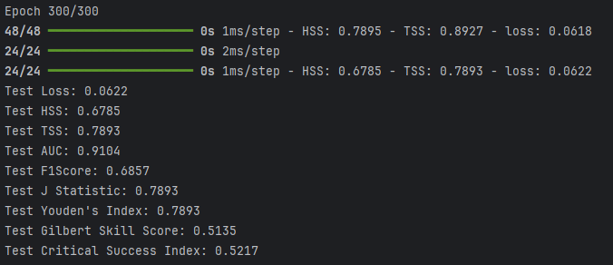
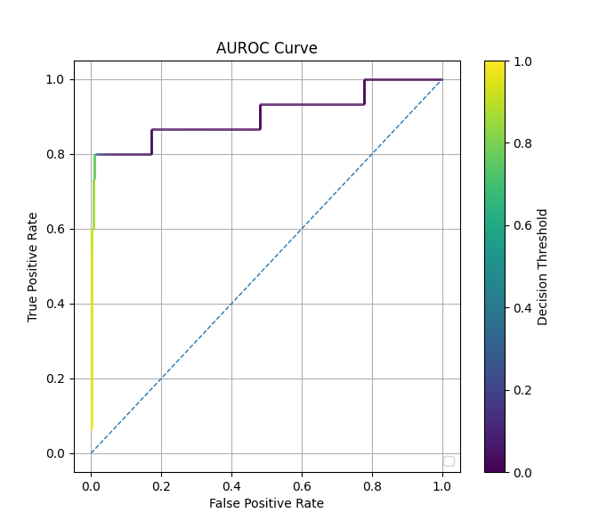

# Evaluation Metrics Tutorial (Classification)

**Full Code:** [view source code](../../../../../../tutorials/SEP-C/classification/imbal_tutorial_metrics_classification.py)

**Train/Test Files**: [training data](../../../../../../tutorials/data/SEP-C/sep_model_training_classification.csv), [testing data](../../../../../../tutorials/data/SEP-C/sep_model_testing_classification.csv)

---

> This tutorial is based on the `balanced_fit` classification tutorial found [here](imbal_tutorial_balanced_fit_classification_clear_sep.md)

## 1. Metrics Overview

Imbal supports various additional classification metrics alongside existing metrics in the `keras.metrics` library.

Additional metrics include:
1. True Skill Statistic
2. J Statistic
3. Youden's Index
4. Heikde Skill Score
5. Gilbert Skill Score
6. Critical Success Index
7. Bounded AUC

Metrics can be used in two main ways:
1. Tracking metric values at every epoch via the `metrics` parameter passed in at model compilation
2. Doing a single calculation of the metric using `model.predict(x_test)` and `metric.update_state(y_true, y_pred)`

This tutorial will explore both options.

It is recommended that only 0 or 1 metrics be passed in to the `compile` call to save training time.

Imbal also supports producing a confusion matrix for classification style problems.

---

## 2. Model Compilation Metrics

Lightweight metrics, such as F1Score, Heidke Skill Score (HSS), and True Skill Statistic (TSS), can be passed via the `metrics`
parameter in the model's `compile` call. These metrics can be tracked every epoch while adding minimal overhead to model training.

```python
model.compile(loss="binary_crossentropy",
              optimizer="adam",
              metrics=[imbal.metrics.HeikdeSkillScore(threshold=0.5, name="HSS")],
              )
```

---

## 3. Single Calculation Metrics

More computationally expensive metrics, such as Bounded AUC, should be calculated once after the model has been trained, unless it is desired to track it at every epoch.

Choosing to calculate these kinds of metrics once can save training time due to less computation being needed per epoch.

Additionally, keeping more metrics out of `compile` will speed up training time in general.
```python
y_pred = model.predict(x_test)

tss_metric = imbal.metrics.TrueSkillStatistic(threshold=0.5)
tss_metric.update_state(y_test, y_pred)

auc_metric = imbal.metrics.BoundedAUC(num_thresholds=50)
auc_metric.update_state(y_test, y_pred)

f1_metric = keras.metrics.F1Score(threshold=0.5)
f1_metric.update_state(y_test, y_pred)

j_stat_metric = imbal.metrics.JStatistic(threshold=0.5)
j_stat_metric.update_state(y_test, y_pred)

youdens_index_metric = imbal.metrics.YoudensIndex(threshold=0.5)
youdens_index_metric.update_state(y_test, y_pred)

gilbert_skill_score_metric = imbal.metrics.GilbertSkillScore(threshold=0.5)
gilbert_skill_score_metric.update_state(y_test, y_pred)

critical_success_index_metric = imbal.metrics.CriticalSuccessIndex(threshold=0.5)
critical_success_index_metric.update_state(y_test, y_pred)
```

---

## 4. Results

> Note: Some metrics return a tensor instead of an ndarray. In this case, to get the metric's value, add `.numpy().item()`
> to the `metric.result()` call as seen below.

```python
results = model.evaluate(x_test, y_test)
loss, hss, tss = results

print(f"Test Loss: {loss:.4f}")
print(f"Test HSS: {hss:.4f}")
print(f"Test TSS: {tss_metric.result().numpy().item():.4f}")
print(f"Test AUC: {auc_metric.result():.4f}")
print(f"Test F1Score: {f1_metric.result().numpy().item():.4f}")
print(f"Test J Statistic: {j_stat_metric.result().numpy().item():.4f}")
print(f"Test Youden's Index: {youdens_index_metric.result().numpy().item():.4f}")
print(f"Test Gilbert Skill Score: {gilbert_skill_score_metric.result().numpy().item():.4f}")
print(f"Test Critical Success Index: {critical_success_index_metric.result().numpy().item():.4f}")
```

### Example Output



---

## 5. Confusion Matrix and ROC Curve

Imbal supports plotting a basic confusion matrix and ROC curve for classification style problems.

```python
imbal.classification.plot_confusion_matrix(y_test, y_pred)

imbal.classification.plot_roc(y_test, y_pred)
```

### Results




---
