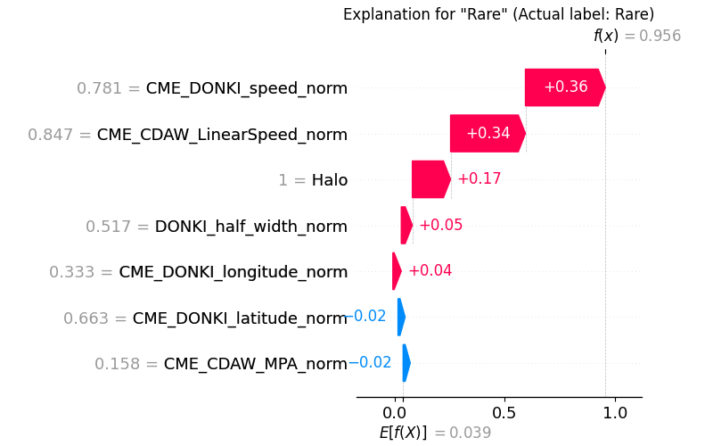
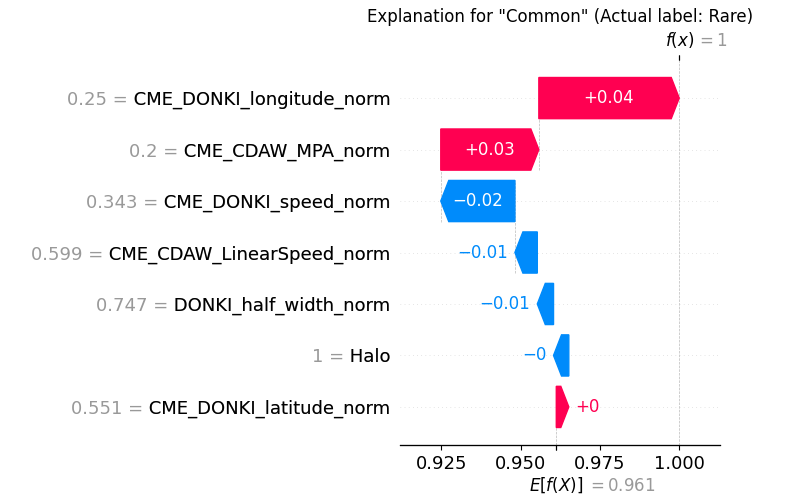

# SHAP Explanation Tutorial (Classification)

**Full Code:** [view source code](../../../../../../tutorials/SEP-C/classification/imbal_tutorial_shap_explanation_classification.py)

**Train/Test Files**: [training data](../../../../../../tutorials/data/SEP-C/sep_model_training_classification.csv), [testing data](../../../../../../tutorials/data/SEP-C/sep_model_testing_classification.csv)

---

## 1. Core Code

> This core code is a sample from the `balanced_fit` with Autoencoder tutorial code found [here](imbal_tutorial_balanced_fit_ae_classification_clear_sep.md)

```python
import numpy as np
import pandas as pd
import tensorflow as tf
import keras
from tensorflow.keras import layers

import imbal

seed = 42
tf.keras.utils.set_random_seed(
  seed
)

target_column = "ln_peak_intensity"

max_epochs = 300
batch_size = 32

train_data = pd.read_csv("../../../../../../tutorials/SEP-C/classification/sep_model_training_classification.csv")
test_data = pd.read_csv("../../../../../../tutorials/SEP-C/classification/sep_model_testing_classification.csv")

y_train = train_data[target_column].values.reshape(-1, 1).astype("float32")
y_test = test_data[target_column].values.reshape(-1, 1).astype("float32")

x_train = train_data.drop(columns=[target_column]).values.astype(np.float32)
x_test = test_data.drop(columns=[target_column]).values.astype(np.float32)


def build_model(input_shape: int) -> imbal.classification.Model:
  inputs = keras.Input(shape=(input_shape,), name="features")
  hidden1 = layers.Dense(18, activation="relu", name="hidden_layer1")(inputs)
  hidden2 = layers.Dense(12, activation="relu", name="hidden_layer2")(hidden1)
  hidden3 = layers.Dense(8, activation="relu", name="hidden_layer3")(hidden2)
  hidden4 = layers.Dense(6, activation="relu", name="hidden_layer4")(hidden3)
  flatten = layers.Flatten()(hidden4)
  outputs = layers.Dense(1, activation="sigmoid", name="output_layer")(flatten)
  built_model = imbal.classification.Model(inputs=inputs, outputs=outputs, name="sep_model")
  return built_model


model = build_model(x_train.shape[1])

model.compile(loss="binary_crossentropy",
              optimizer="adam",
              generate_decoder_branch=True,
              )

class_weights = {0: 0.9, 1: 0.1}

model.balanced_fit(x_train,
                   y_train,
                   class_weight=class_weights,
                   batch_size=batch_size,
                   epochs=max_epochs,
                   )
```

---

## 2. SHAP Explanations

### A. Correct Prediction Example

```python
labels = train_data.drop(columns=[target_column]).columns.tolist()

target_sample_index = -1  # Get a rare sample, which is at the end of the data

imbal.classification.shap_explain_tabular_sample(
    x_test[target_sample_index],
    model,
    x_train,
    actual_label=int(y_test.reshape(-1)[target_sample_index]),
    class_names=['Common', 'Rare'],
    feature_names=labels,
    figure_save_path="shap_classification.png",
    plot_type="waterfall",
)
```

### Explanation

This example explains a sample where the model prediction matches the actual class.

* `labels` stores the feature names so the explanation is readable.
* `target_sample_index = -1` selects a rare-class sample from the test set.
* `shap_explain_tabular_sample(...)` generates a local explanation for that one prediction.

---

### B. Incorrect Prediction Example

```python
labels = train_data.drop(columns=[target_column]).columns.tolist()

target_sample_index = -9  # Example index for a misclassified sample

imbal.classification.shap_explain_tabular_sample(
    x_test[target_sample_index],
    model,
    x_train,
    actual_label=int(y_test.reshape(-1)[target_sample_index]),
    class_names=['Common', 'Rare'],
    feature_names=labels,
    figure_save_path="shap_classification_wrong_prediction.png",
    plot_type="waterfall",
)
```

### Explanation

This second example is structured the same way, but it focuses on a sample where the model prediction is incorrect.

* The code is identical except for the selected sample index.
* By choosing a misclassified test point, we can compare which local feature contributions aligned with the wrong class.
* This is useful for diagnosing borderline cases, conflicting signals, or places where the model learned the wrong local pattern.

---

## 3. Results

### Correct Prediction



### Incorrect Prediction



---

## 4. Understanding the SHAP Output

The SHAP visualization explains **why the model predicted the way it did** by attributing contributions to each feature relative to a baseline expectation.

### Layout Guide (how to read the figure)

* The plot starts from a **baseline value** (shown near the bottom as (E[f(X)])).
* Feature contributions are then added step-by-step to reach the final prediction (f(x)).
* Features on the **right side (red)** push the prediction **higher toward the prediction class being explained**.
* Features on the **left side (blue)** push the prediction **lower, away from that class**.
* The final prediction is shown at the top as (f(x)).

For example, when explaining **Rare**, right-side contributions push toward Rare, while left-side contributions push toward Common.

Note: The **feature values** shown (e.g., 0.78, 0.85) are normalized values between 0 and 1 or -1 and 1.

---

## 5. Interpreting the Difference Between the Two Explanations

### Correct Prediction: Why the model predicted **Rare** successfully

In the first explanation, the model predicts **Rare** with very high confidence (f(x) approx 0.956).

Here, the explanation is for **Rare**, so positive (red) contributions support the Rare prediction.

The most important aspect is the **magnitude of the contributions**:

* `CME_DONKI_speed_norm` contributes **+0.36**
* `CME_CDAW_LinearSpeed_norm` contributes **+0.34**
* `Halo` contributes **+0.17**

These are large, consistent positive contributions that strongly increase the prediction toward Rare.

There are a few opposing contributions (e.g., `CME_DONKI_latitude_norm`, `CME_CDAW_MPA_norm` at around −0.02), but they are small in magnitude compared to the dominant positive ones.

The key point is that **the strongest features all contribute positively and with large magnitude**, resulting in a clear and confident Rare prediction.

---

### Incorrect Prediction: Why the model predicted **Common** even though the actual label is **Rare**

In the second explanation, the model predicts **Common** with very high confidence (f(x) approx 1), even though the true label is **Rare**.

Here, the explanation is for **Common**, so positive (red) contributions support the Common prediction.

Compared to the correct example, the structure of contributions is very different:

* The positive contributions supporting Common are **small in magnitude**:

  * `CME_DONKI_longitude_norm` contributes **+0.04**
  * `CME_CDAW_MPA_norm` contributes **+0.03`

* Several features contribute negatively (opposing Common), including:

  * `CME_DONKI_speed_norm` (−0.02)
  * `CME_CDAW_LinearSpeed_norm` (−0.01)
  * `DONKI_half_width_norm` (−0.01)

The critical difference is that **none of the features provide strong positive evidence for the correct class (Rare)**, and the features that were strong indicators in the correct example are now weak or reversed.

This leads to a situation where the model assigns high confidence to Common, not because of strong supporting signals, but because the input lacks the strong Rare-driving feature values seen in the correct case.

---

### Why the prediction might have been wrong

The key issue is the **magnitude and sign of feature contributions relative to the explained class**.

In the incorrect example, the explanation is for **Common**, so red contributions indicate features supporting **Common**, while blue contributions oppose it.

Several important differences compared to the correct (Rare) explanation:

* The strongest positive contributions are now relatively small:

  * `CME_DONKI_longitude_norm` (+0.04)
  * `CME_CDAW_MPA_norm` (+0.03)

  These are much weaker than the dominant contributions in the correct example (e.g., +0.36 and +0.34).

* Key features that previously supported Rare strongly now either contribute weakly or oppose the current prediction:

  * `CME_DONKI_speed_norm` shifts from a strong positive contribution (+0.36 for Rare) to a negative contribution (−0.02 for Common explanation).
  * `CME_CDAW_LinearSpeed_norm` drops from +0.34 to −0.01.

* Additional features (e.g., `DONKI_half_width_norm`) also contribute negatively, reinforcing the opposing signal.

As a result, the model’s prediction is driven not by strong evidence for the correct class (Rare), but by the **absence of strong Rare-supporting contributions** and the presence of multiple small contributions that collectively favor Common.

This suggests the model does not see sufficiently strong feature values to justify a Rare prediction for this sample, even though its true label is Rare.
