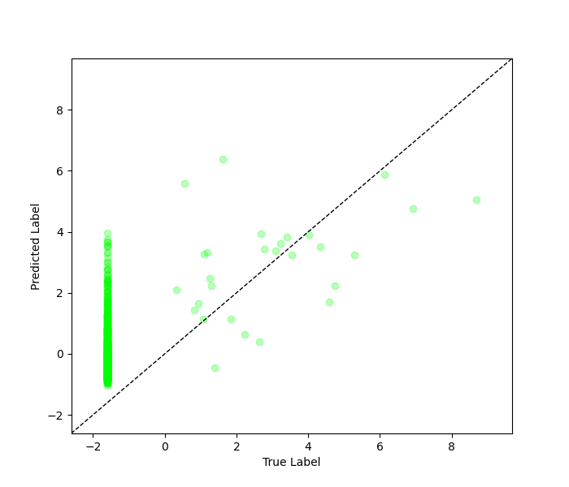
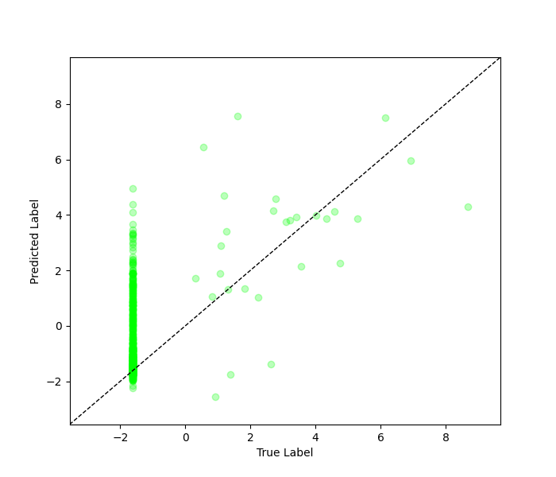

# Imbal Balanced Regression Tutorial (With a Validation Set)

This tutorial demonstrates how to train a neural network for a regression task while addressing data imbalance using density-based sample weighting and the `balanced_fit` function with a validation set.

### Files Needed

**Full Code:** [view source code](../../../../../../tutorials/SEP-C/regression/imbal_tutorial_balanced_fit_val_regression_clear_sep.py)

**Train/Test Files**: [training data](../../../../../../tutorials/data/SEP-C/sep_model_training_regression.csv), [testing data](../../../../../../tutorials/data/SEP-C/sep_model_testing_regression.csv)

---

> **Before you begin:** Use the [Tutorial Setup](imbal_tutorial_setup_regression.md) guide as your starting point, then continue with this tutorial.

## 1. Calculate Sample Densities

To address imbalance in continuous targets, we estimate label densities and convert them into sample weights.

```python
labels_kde = y_train.reshape(-1).copy()
kde = imbal.regression.fit_kde(labels_kde)
densities = imbal.regression.get_sample_densities(labels_kde, kde)
sample_weights = imbal.regression.generate_sample_weights(densities)

(x_train, y_train, sw), (x_val, y_val, sw_val) = imbal.regression.split(
    x_train,
    y_train,
    sample_weights=sample_weights,
    test_size=0.2,
)
```

### Explanation

* **KDE (Kernel Density Estimation)** models the distribution of target values.
* **Densities** measure how common each sample is.
* Sample weights are generated from the densities so rare samples can be emphasized during training.
* The validation split keeps the corresponding sample weights aligned with the training and validation data.

---

## 2. Model Compilation and Training

### Compilation

```python
model.compile(
    loss="mean_squared_error",
    optimizer="adam",
    metrics=["mae"],
)
```

### Training

```python
PATIENCE = 30

model.balanced_fit(
    x_train,
    y_train,
    validation_data=(x_val, y_val.reshape(-1, 1), sw_val),
    sample_weight=sw,
    batch_size=batch_size,
    epochs=max_epochs,
    callbacks=[
        keras.callbacks.EarlyStopping(
            monitor="val_loss",
            patience=PATIENCE,
            restore_best_weights=True,
        )
    ],
)
```

### Explanation

* **Loss**: Mean Squared Error (MSE) for regression tasks.
* **Metric**: Mean Absolute Error (MAE) for interpretability.
* **balanced_fit** uses density-based sample weights to better learn from imbalanced target distributions.
* A validation set is used to monitor model performance on data not used for training.
* Validation data helps reduce overfitting by enabling early stopping when validation loss stops improving.
* The best model weights are restored after training based on validation performance.

---

## 3. Results

### Model Evaluation

```python
results = model.evaluate(x_test, y_test)
loss, mae = results
predictions = model.predict(x_test)

print(f"Test Loss: {loss:.4f}")
print(f"Test MAE: {mae:.4f}")

threshold = np.log(10)

y_true = y_test.reshape(-1)
y_pred = predictions.reshape(-1)

common_mask = y_true < threshold
rare_mask = y_true >= threshold

common_mae = np.mean(np.abs(y_true[common_mask] - y_pred[common_mask]))
rare_mae = np.mean(np.abs(y_true[rare_mask] - y_pred[rare_mask]))

print(f"Common sample MAE (< ln(10)): {common_mae:.4f}")
print(f"Rare sample MAE (>= ln(10)): {rare_mae:.4f}")
```

### Example Output

```text
24/24 ━━━━━━━━━━━━━━━━━━━━ 0s 1ms/step - loss: 3.8182 - mae: 1.7316 
Test Loss: 3.8182
Test MAE: 1.7316
Common sample MAE (< ln(10)): 1.7396
Rare sample MAE (>= ln(10)): 1.3347
```

---

## 4. Visualization

The model’s predictions are visualized by plotting true values against predicted values to assess performance and highlight rare vs. frequent samples.

```python
imbal.regression.plot_true_vs_predictions(
    y_test,
    predictions,
)
```

### Example Output



---

## 5. Optional: Using Explicit Sample Weights

Alternatively, you can explore different alpha values when converting sample densities into training weights. This gives you more direct control over how strongly rare samples are emphasized during training.

Replace the sample weight and training calls with:

```python
from imbal.regression import reciprocal_importance

weight_candidates = reciprocal_importance(
    densities,
    alpha=[0.2, 0.5, 0.8, 1.0],
)

(x_train, y_train, sw_candidates), (x_val, y_val, sw_val) = imbal.regression.split(
    x_train,
    y_train,
    sample_weights=weight_candidates,
    test_size=0.2,
)

model.balanced_fit(
    x_train,
    y_train,
    validation_data=(x_val, y_val.reshape(-1, 1), sw_val),
    sample_weight=sw_candidates,
    batch_size=batch_size,
    epochs=max_epochs,
    callbacks=[
        keras.callbacks.EarlyStopping(
            monitor="val_loss",
            patience=PATIENCE,
            restore_best_weights=True,
        )
    ],
)
```

### Explanation

* `reciprocal_importance` transforms the density values into sample weights.
* Lower-density (rarer) samples receive larger weights.
* The `alpha` parameter controls how aggressively rare samples are upweighted.
* Different alpha values can be explored by the function to help find the best hyperparameter values for the model.

### Results

```text
24/24 ━━━━━━━━━━━━━━━━━━━━ 0s 1ms/step - loss: 2.1256 - mae: 0.8327 
Test Loss: 2.1256
Test MAE: 0.8327
Common sample MAE (< ln(10)): 0.8199
Rare sample MAE (>= ln(10)): 1.4727
```
> **NOTE:** at the end of training, the index of the best class weight is printed. For future testing, ensure you take note of the index
> that was printed out, as this is the index of the "ideal" hyperparameter setting given the search space. When running more tests, 
> use the "ideal" hyperparameter to generate your sample weights for the best performance.



This optional approach gives you manual control over the weighting strategy, while still using validation data and early stopping.

---
