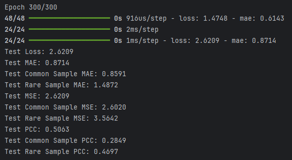

# Evaluation Metrics Tutorial (Regression)

**Full Code:** [view source code](../../../../../../tutorials/SEP-C/regression/imbal_tutorial_metrics_regression.py)

**Train/Test Files**: [training data](../../../../../../tutorials/data/SEP-C/sep_model_training_regression.csv), [testing data](../../../../../../tutorials/data/SEP-C/sep_model_testing_regression.csv)

---

> This tutorial is based on the `balanced_fit` regression tutorial found [here](imbal_tutorial_balanced_fit_regression_clear_sep.md)

## 1. Metrics Overview

Metrics can be used in two main ways:

1. Tracking metric values at every epoch via the `metrics` parameter passed in at model compilation
2. Doing a single calculation of the metric using `model.predict(x_test)` and `metric.update_state(y_true, y_pred)`

This tutorial will explore both options.

It is recommended that only 0 or 1 metrics be passed in to the `compile` call to save training time.

Imbal also supports producing a true vs. predicted plot for regression style problems.

---

## 2. Model Compilation Metrics

Lightweight metrics, such as Mean Absolute Error (MAE) and Mean Squared Error (MSE), can be passed via the `metrics`
parameter in the model's `compile` call. These metrics can be tracked every epoch while adding minimal overhead to model training.

```python
model.compile(loss="mean_squared_error",
              optimizer="adam",
              metrics=[keras.metrics.MeanAbsoluteError(name="mae")],
              )
```

---

## 3. Single Calculation Metrics

Metrics can be calculated once after the model has been trained, unless it is desired to track it at every epoch.

Choosing to calculate these kinds of metrics once can save training time due to less computation being needed per epoch.

> **Notes on using Pearson Correlation (PCC) in Keras**
>
> * **Axis matters (`axis` parameter):** For single-output regression where tensors have shape `(batch, 1)`, you should use `axis=0`. This computes correlation *across samples*. Using the default `axis=-1` would compute along the last dimension (size 1), which makes the variance zero and results in `NaN`.
>
> * **NaNs from zero variance:** Pearson correlation is undefined if either `y_true` or `y_pred` has **zero variance** in the dimension being computed. This can happen if:
>
>  * a batch has only **one sample**
>  * predictions collapse to a constant value within a batch
>  * targets in a batch are (nearly) constant
>  * **example:** in highly imbalanced datasets, non-events may be preprocessed or rounded to an identical small value (e.g., all non-events ≈ `1e-6`). If an entire batch consists of these non-events, then all values are identical → variance = 0 → PCC becomes `NaN`.
>
> * **Batching issues during evaluation:** `model.evaluate()` computes metrics **batch-by-batch**. If even a single batch has zero variance, the PCC can become `NaN` for the entire evaluation. This is especially common if the last batch is small or unstratified.
>
> * **Recommended approach:** Compute PCC on the **full test set at once** using the Keras metric object (instead of relying on `model.evaluate()`)
>
> * **Alternative:** If you must use `model.evaluate()`, consider setting `batch_size=len(x_test)` to avoid small or degenerate batches.

```python
mse_metric = keras.metrics.MeanSquaredError(name="mse")
mse_metric.update_state(y_test, y_pred)
mse = mse_metric.result()

pcc_metric = keras.metrics.PearsonCorrelation(name="pcc", axis=0)
pcc_metric.update_state(y_test, y_pred)
pcc = pcc_metric.result().numpy()
```

---

## 4. Results

```python
results = model.evaluate(x_test, y_test)
loss, mae = results

print(f"Test Loss: {loss:.4f}")
print(f"Test MAE: {mae:.4f}")
print(f"Test MSE: {mse:.4f}")
print(f"Test PCC: {pcc:.4f}")
```

### Example Output



---

## 5. True vs. Predicted Plot

Imbal supports plotting a basic true vs. predicted values plot for regression style problems.

```python
imbal.regression.plot_true_vs_predictions(y_test, y_pred)
```

### Results


---