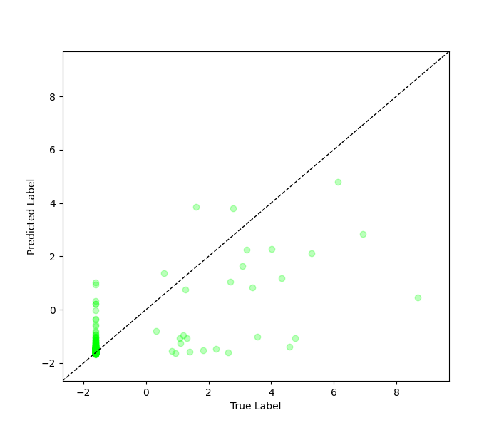

# Imbal Regression Tutorial (With a Validation Set)

This tutorial demonstrates how to train a neural network for a regression task using the standard `fit` function with a validation set.

### Files Needed

**Full Code:** [view source code](../../../../../../tutorials/SEP-C/regression/imbal_tutorial_regular_fit_val_regression_clear_sep.py)

**Train/Test Files**: [training data](../../../../../../tutorials/data/SEP-C/sep_model_training_regression.csv), [testing data](../../../../../../tutorials/data/SEP-C/sep_model_testing_regression.csv)

---

> **Before you begin:** Use the [Tutorial Setup](imbal_tutorial_setup_regression.md) guide as your starting point, then continue with this tutorial.

## 1. Calculate Sample Densities

For this approach, no density-based weighting is applied. The model is trained using the raw target values.

```python
(x_train, y_train), (x_val, y_val) = imbal.regression.split(
    x_train,
    y_train,
    test_size=0.2,
)
```

### Explanation

* The dataset is split into training and validation sets.
* No sample weighting is used in this workflow.
* The validation set is used to monitor generalization performance during training.

---

## 2. Model Compilation and Training

### Compilation

```python
model.compile(
    loss="mean_squared_error",
    optimizer="adam",
    metrics=["mae"],
)
```

### Training

```python
PATIENCE = 30

model.fit(
    x_train,
    y_train,
    validation_data=(x_val, y_val.reshape(-1, 1)),
    batch_size=batch_size,
    epochs=max_epochs,
    callbacks=[
        keras.callbacks.EarlyStopping(
            monitor="val_loss",
            patience=PATIENCE,
            restore_best_weights=True,
        )
    ],
)
```

### Explanation

* **Loss**: Mean Squared Error (MSE) for regression tasks.
* **Metric**: Mean Absolute Error (MAE) for interpretability.
* **fit** is the standard training method and does not handle imbalance automatically.
* A validation set is used to monitor model performance on data not used for training.
* Validation data helps reduce overfitting by enabling early stopping when validation loss stops improving.
* The best model weights are restored after training based on validation performance.

---

## 3. Results

### Model Evaluation

```python
results = model.evaluate(x_test, y_test)
loss, mae = results
predictions = model.predict(x_test)

print(f"Test Loss: {loss:.4f}")
print(f"Test MAE: {mae:.4f}")

threshold = np.log(10)

y_true = y_test.reshape(-1)
y_pred = predictions.reshape(-1)

common_mask = y_true < threshold
rare_mask = y_true >= threshold

common_mae = np.mean(np.abs(y_true[common_mask] - y_pred[common_mask]))
rare_mae = np.mean(np.abs(y_true[rare_mask] - y_pred[rare_mask]))

print(f"Common sample MAE (< ln(10)): {common_mae:.4f}")
print(f"Rare sample MAE (>= ln(10)): {rare_mae:.4f}")
```

### Example Output

```text
24/24 ━━━━━━━━━━━━━━━━━━━━ 0s 2ms/step 
Test Loss: 0.4519
Test MAE: 0.1902
Common sample MAE (< ln(10)): 0.1274
Rare sample MAE (>= ln(10)): 3.3355
```

---

## 4. Visualization

The model’s predictions are visualized by plotting true values against predicted values to assess performance and highlight rare vs. frequent samples.

```python
imbal.regression.plot_true_vs_predictions(
    y_test,
    predictions,
)
```

### Example Output



---
