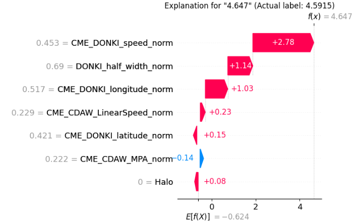
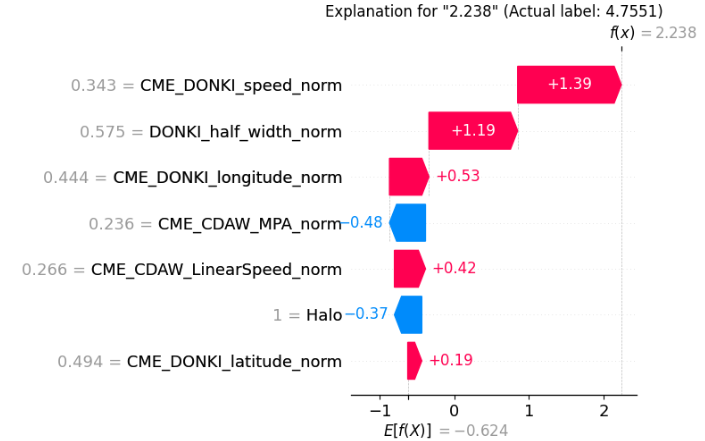

# SHAP Explanation Tutorial (Regression)

**Full Code:** [view source code](../../../../../../tutorials/SEP-C/regression/imbal_tutorial_shap_explanation_regression.py)

**Train/Test Files**: [training data](../../../../../../tutorials/data/SEP-C/sep_model_training_regression.csv), [testing data](../../../../../../tutorials/data/SEP-C/sep_model_testing_regression.csv)

---

## 1. Core Code

> This core code is a sample from the `balanced_fit` regression tutorial code.

```python
import numpy as np
import pandas as pd
import tensorflow as tf
import keras
from tensorflow.keras import layers

import imbal

seed = 42
tf.keras.utils.set_random_seed(seed)

target_column = "ln_peak_intensity"

max_epochs = 300
batch_size = 32

train_data = pd.read_csv("../../../../../../tutorials/SEP-C/regression/sep_model_training_regression.csv")
test_data = pd.read_csv("../../../../../../tutorials/SEP-C/regression/sep_model_testing_regression.csv")

y_train = train_data[target_column].values.reshape(-1, 1).astype("float32")
y_test = test_data[target_column].values.reshape(-1, 1).astype("float32")

x_train = train_data.drop(columns=[target_column]).values.astype(np.float32)
x_test = test_data.drop(columns=[target_column]).values.astype(np.float32)


def build_model(input_shape: int) -> imbal.regression.Model:
    inputs = keras.Input(shape=(input_shape,), name="features")
    hidden1 = layers.Dense(18, activation="relu", name="hidden_layer1")(inputs)
    hidden2 = layers.Dense(12, activation="relu", name="hidden_layer2")(hidden1)
    hidden3 = layers.Dense(8, activation="relu", name="hidden_layer3")(hidden2)
    hidden4 = layers.Dense(6, activation="relu", name="hidden_layer4")(hidden3)
    outputs = layers.Dense(1, name="output_layer")(hidden4)
    built_model = imbal.regression.Model(
        inputs=inputs,
        outputs=outputs,
        name="sep_model",
    )
    return built_model


model = build_model(x_train.shape[1])

labels_kde = y_train.reshape(-1).copy()
kde = imbal.regression.fit_kde(labels_kde)
densities = imbal.regression.get_sample_densities(labels_kde, kde)

model.compile(
    loss="mean_squared_error",
    optimizer="adam",
    metrics=["mae"],
)

from imbal.regression import reciprocal_importance

weights = reciprocal_importance(densities, alpha=0.8)

model.balanced_fit(
    x_train,
    y_train,
    sample_weight=weights,
    batch_size=batch_size,
    epochs=max_epochs,
)
```

---

## 2. SHAP Explanations

### A. Small Error Prediction Example

```python
labels = train_data.drop(columns=[target_column]).columns.tolist()

target_sample_index = -6  # choose a rare sample to explain

imbal.regression.shap_explain_tabular_sample(
    x_test[target_sample_index],
    model,
    x_train,
    actual_label=np.round(float(y_test.reshape(-1)[target_sample_index]), 4),
    feature_names=labels,
    figure_save_path="shap-explanation.png",
    plot_type="waterfall",
)
```

### Explanation

This example explains a sample where the model prediction is close to the actual regression label.

* `labels` stores the feature names so the explanation is readable.
* `target_sample_index = -6` selects a rare regression sample from the test set.
* `shap_explain_tabular_sample(...)` generates a local explanation for that one prediction.

---

### B. Large Error Prediction Example

```python
labels = train_data.drop(columns=[target_column]).columns.tolist()

target_sample_index = -5  # choose a large error prediction of a rare sample to explain

imbal.regression.shap_explain_tabular_sample(
    x_test[target_sample_index],
    model,
    x_train,
    actual_label=np.round(float(y_test.reshape(-1)[target_sample_index]), 4),
    feature_names=labels,
    figure_save_path="shap-explanation-wrong.png",
    plot_type="waterfall",
)
```

### Explanation

This second example is structured the same way, but it focuses on a sample where the model prediction is far from the actual regression label.

* The code is identical except for the selected sample index.
* By choosing a poorly predicted test point, we can compare which local feature contributions pushed the prediction away from the true value.

---

## 3. Results

### Small Error Prediction



### Large Error Prediction



---

## 4. Understanding the SHAP Output

The SHAP visualization explains **why the model predicted the regression value that it did** by attributing contributions to each feature relative to a baseline expectation.

### Layout Guide (how to read the figure)

* The plot starts from a **baseline value** (shown near the bottom as (E[f(X)])).
* Feature contributions are then added step-by-step to reach the final prediction (f(x)).
* Features on the **right side (red)** push the predicted value **higher**.
* Features on the **left side (blue)** push the predicted value **lower**.
* The final regression prediction is shown at the top as (f(x)).

---

## 5. Interpreting the Difference Between the Two Explanations

### Small Error Prediction: Why the model predicted a value close to the true label

Prediction: **4.647** vs actual **4.5915**

The prediction is driven primarily by three dominant features:

* `CME_DONKI_speed_norm` → **+2.78**
* `DONKI_half_width_norm` → **+1.14**
* `CME_DONKI_longitude_norm` → **+1.03**

These three features alone account for the majority of the upward movement from the baseline.

Key takeaway:

* The model gets this prediction right because the **top 3 contributors are all large and aligned in the same direction (positive)**.
* Smaller features (both positive and negative) have minimal impact relative to these dominant drivers.

---

### Large Error Prediction: Why the model predicted too low compared to the true label

Prediction: **2.238** vs actual **4.7551**

Again, the prediction is mostly determined by the same top features—but their contributions change:

* `CME_DONKI_speed_norm` → **+1.39** (significantly weaker)
* `DONKI_half_width_norm` → **+1.19** (still strong)
* `CME_DONKI_longitude_norm` → **+0.53** (reduced impact)

Key differences compared to the small error case:

* The **strongest driver (`speed`) is cut roughly in half**.
* The third contributor (`longitude`) is also **much weaker**.

At the same time, negative contributors become more influential:

* `CME_CDAW_MPA_norm` → **−0.48**
* `Halo` → **−0.37**

The model underestimates this sample because the **top 3 positive drivers are not strong enough**, and this leaves room for negative features to significantly lower the prediction.

--- 
